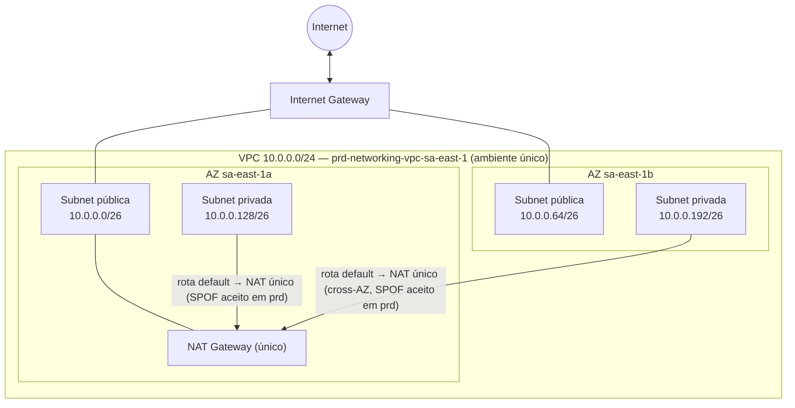

# ADR-0001: Stack de Rede Fundacional (VPC 10.0.0.0/24) em Terraform

- **Status:** Approved
- **Data:** 2026-07-18
- **Autor:** Planner Agent
- **Supersedes:** N/A
- **Ambiente:** `prd` (ambiente único — dev/hml removidos nesta revisão; ver Seção 1 e Premissa 1)
- **Região AWS:** sa-east-1 (São Paulo) — assumida, ver Seção 3
- **Histórico de revisões:**
  - `2026-07-18` — Versão inicial: decisão de provisionar a VPC via módulo comunitário Terraform (`terraform-aws-modules/vpc/aws`).
  - `2026-07-18` — Revisão 1: decisão alterada para uso exclusivo de recursos nativos do provider `hashicorp/aws`, sem módulos de terceiros/comunidade (exigência explícita do solicitante).
  - `2026-07-18` — Revisão 2: Seção 4 (Opções Consideradas) reestruturada — o módulo comunitário deixou de ser apresentado como alternativa no documento; as opções remanescentes comparam apenas formas de organizar os recursos nativos definidos na Revisão 1.
  - `2026-07-19` — Revisão 3 (aditiva/documentação): adicionado o diagrama editável `.drawio` equivalente ao diagrama Mermaid da Seção 6.1, com as arestas de fluxo de tráfego/dados ativo animadas (`flowAnimation=1`), em `docs/diagramas/ADR-0001-networking-stack-vpc.drawio` — requisito de artefato introduzido posteriormente ao registro original deste ADR. Nenhuma decisão arquitetural, recurso, CIDR ou valor deste documento foi alterado.
  - `2026-07-25` — Revisão 4 (refactor de endereçamento IP): CIDR da VPC alterado de `192.168.1.0/24` para `10.0.0.0/24`. Plano de sub-redes recalculado de 4× `/27` (usando apenas metade do `/24`, com a outra metade reservada) para 4× `/26` (2 públicas + 2 privadas), ocupando 100% do CIDR da VPC, sem espaço reservado. Estratégia de NAT Gateway único (compartilhado, `single_nat_gateway = true`) confirmada, sem alteração — já era o default `dev`/`hml` desde a versão original. Corrigido, junto com o solicitante, um typo de digitação (`/36` → `/26`) na segunda sub-rede privada, mantendo consistência com as demais 3 sub-redes.
  - `2026-07-25` — **Revisão 5 (redução de escopo — ambiente único `prd`):** a stack deixa de suportar múltiplos ambientes (`dev`/`hml`/`prd`) e passa a ter **um único ambiente-alvo: `prd`**. Os arquivos `envs/dev.tfvars` e `envs/hml.tfvars` são removidos; o único arquivo de valores remanescente é promovido de `envs/prd.tfvars` para `terraform.tfvars` na raiz da stack (o diretório `envs/` deixa de existir). A variável `environment` é removida (deixa de ser um input Terraform livre) e passa a ser um `local` fixo (`"prd"`) — um objeto `variable` que só aceita um único valor válido não agrega parametrização real (ver Seção 4, decisão D2). **Decisão de negócio explícita e consciente do solicitante, confirmada em duas rodadas de pergunta nesta sessão:** a estratégia de NAT Gateway de `prd` muda de HA completa (1 NAT Gateway por AZ, 2 no total — recomendação original deste ADR, mantida da Revisão 1 até a Revisão 4) para **NAT Gateway único** — a mesma configuração antes reservada a `dev`/`hml`. Isso é uma reversão consciente da recomendação de confiabilidade que este ADR fazia para produção, priorizando custo; o trade-off (ponto único de falha em produção) é tratado explicitamente na Seção 11, não removido ou suavizado do documento. Ver Seção 1 para a análise in-place vs. ADR sucessor, e Seção 13 para o diff de implementação completo.

---

## 1. Contexto e Problema

> **Nota de revisão (2026-07-18):** a stack `01-networking-stack-ai` deve usar **exclusivamente recursos nativos do provider oficial `hashicorp/aws`**, sem dependência de módulos Terraform de terceiros/comunidade — restrição explícita do solicitante. Esta versão do documento não apresenta mais nenhum módulo comunitário como alternativa viável na Seção 4; a comparação de opções trata apenas de como organizar o código nativo. Todo o restante do contexto e do problema abaixo permanece válido.

A conta AWS ainda não possui uma camada de rede provisionada via código. É necessário criar a primeira stack de infraestrutura como código (`01-networking-stack-ai`), que servirá de fundação para stacks futuras (compute, containers, dados, etc.). O prefixo numérico `01-` sugere uma convenção de organização sequencial de stacks (ex.: `00-bootstrap`, `01-networking-stack-ai`, `02-compute-stack`), o que reforça que esta stack deve ser autocontida, reutilizável entre ambientes e não deve assumir dependências implícitas de stacks ainda não definidas.

O requisito de negócio explícito é provisionar uma VPC com bloco CIDR **192.168.1.0/24** (posteriormente atualizado para `10.0.0.0/24` — Revisão 4). Esse bloco fornece apenas 256 endereços IP (251 utilizáveis, descontando os 5 endereços reservados pela AWS por sub-rede), o que é significativamente menor que o tamanho recomendado pelo AWS Well-Architected Framework (prática REL02-BP03, validada via `aws-mcp`) para VPCs que precisam acomodar crescimento futuro. Como o CIDR foi definido como requisito fixo pelo solicitante, este ADR trata esse valor como restrição de entrada (não é negociável neste ciclo) e propõe um plano de sub-redes que maximiza o aproveitamento desse espaço reduzido.

Embora o pedido original mencione apenas "uma VPC", uma VPC isolada sem sub-redes, gateway de saída e tabelas de rotas não é utilizável por nenhuma carga de trabalho real. Este ADR, portanto, amplia o escopo mínimo necessário para entregar uma fundação de rede funcional: sub-redes públicas e privadas distribuídas em múltiplas Availability Zones (AZs), Internet Gateway, NAT Gateway(s), tabelas de rotas e tags padronizadas — mantendo o CIDR da VPC exatamente como solicitado.

> **Nota de revisão (2026-07-25) — Refactor do esquema de endereçamento IP:** o solicitante corrigiu o requisito de negócio original: o CIDR da VPC passa a ser **`10.0.0.0/24`** (não mais `192.168.1.0/24`), com um plano de 4 sub-redes explícito (2 públicas `10.0.0.0/26`/`10.0.0.64/26`, 2 privadas `10.0.0.128/26`/`10.0.0.192/26`) que **ocupa integralmente** o `/24`, sem sobra reservada para expansão futura. A estratégia de NAT Gateway único compartilhado foi confirmada como inalterada nessa revisão específica.
>
> **Decisão (Revisão 4): revisão in-place deste ADR-0001, não um novo `ADR-0002` sucessor.** Justificativa resumida (detalhamento original preservado no histórico do repositório): nenhum `apply` real havia ocorrido até então (apenas `terraform plan` validado, backend local temporário descartado), nenhuma dependência downstream documentada, e a decisão arquitetural de fundo (recursos nativos, organização por arquivo, tags, drivers da Seção 2) permaneceu inalterada — a mudança foi estritamente de valor de CIDR/particionamento dentro da mesma decisão já aprovada.

> **Nota de revisão (2026-07-25) — Redução de escopo para ambiente único (`prd`):** o solicitante, em duas rodadas de pergunta nesta sessão, confirmou que (a) a stack passa a ter **um único ambiente-alvo: `prd`** — os ambientes `dev`/`hml` deixam de ser suportados; e (b), diante do conflito identificado entre essa mudança e a recomendação original deste ADR de HA completa (2 NAT Gateways) para `prd`, optou **explicitamente por NAT Gateway único também em `prd`**, revertendo conscientemente a recomendação de confiabilidade que este documento fazia desde a versão inicial. Ver Premissas 1 e 14 para o registro literal dessas duas decisões.
>
> **Decisão: revisão in-place deste ADR-0001 (Revisão 5), não um novo `ADR-0002` sucessor.** Esta reavaliação foi feita de forma independente da conclusão da Revisão 4, considerando que a natureza da mudança (redução de escopo de ambientes + reversão de uma recomendação de Reliability) é mais substancial que um simples ajuste de valor de CIDR. Argumentos considerados:
>
> **A favor de revisão in-place (decisão adotada):**
> - **Continua não havendo `apply` real e nenhuma dependência downstream** (mesmas duas condições centrais usadas na Revisão 4 — reconfirmadas: o `README.md` da stack, antes desta revisão, ainda registra apenas `terraform plan` validado para os três ambientes, sem nenhum `apply` efetivo; e a Seção 14 (Non-goals) continua sem nenhuma stack consumidora dos outputs desta stack). Isso elimina o risco de migração de infraestrutura real, que seria o gatilho mais forte para um ADR sucessor.
> - **A arquitetura de recursos não muda.** Nenhum tipo de recurso novo é introduzido, nenhum é removido, e nenhuma lógica condicional em `locals.tf`/`vpc.nat-gateway.tf`/`vpc.route-tables.tf` precisa ser reescrita — o código já foi desenhado, desde a versão original, para tornar a estratégia de NAT (único vs. HA) e o valor de `environment` **valores de configuração**, não decisões de arquitetura. A "reversão" da recomendação de HA para produção é a troca do *valor* de duas flags booleanas já existentes (`single_nat_gateway`, `one_nat_gateway_per_az`), exatamente da mesma natureza de mudança que a troca de CIDR na Revisão 4 (troca de *valor* de um input, não de *arquitetura*).
> - **O trade-off entre as opções da Seção 4 (recursos nativos organizados por arquivo vs. arquivo único monolítico) não muda.** Esse é o trade-off arquitetural central deste ADR e permanece inteiramente preservado.
> - **A redução de escopo em si (multi-ambiente → ambiente único) é um requisito de negócio explícito do solicitante**, tratado de forma análoga ao CIDR fixo e à restrição de módulos de terceiros (Seção 1/Premissa 11) — uma restrição de entrada, não uma escolha arquitetural deste ADR a ser comparada com alternativas.
>
> **Contra-argumentos considerados (razão pela qual esta decisão não foi trivial) e por que não prevaleceram:**
> - A redução de escopo remove um driver estratégico inteiro da Seção 2 ("deixar a stack pronta para promoção entre `dev`, `hml` e `prd`") e reverte uma recomendação explícita de Reliability para produção que este próprio ADR defendia desde a Revisão 1 — isso é, em volume, uma mudança maior do que a troca de um valor de CIDR. Se esta stack já tivesse `apply` real em produção, ou se a Revisão 5 alterasse a arquitetura de recursos (por exemplo, introduzindo Transit Gateway para simular HA de outra forma), a balança penderia para um `ADR-0002` sucessor, dado o peso da mudança de postura de confiabilidade em produção.
> - Como nenhuma dessas condições agravantes se aplica (sem `apply` real, sem mudança de arquitetura de recursos), o overhead de abrir um novo ADR não se justifica — o histórico de revisões no cabeçalho já preserva a recomendação original (HA para prd) e o racional completo da reversão, garantindo rastreabilidade equivalente à de um sucessor.
>
> Um novo ADR sucessor **seria** a escolha correta caso, no futuro, (i) esta stack seja de fato aplicada em produção sob a configuração de NAT único e, posteriormente, precise evoluir para HA (ou vice-versa) — nesse caso, tratar como migração de infraestrutura com plano próprio; ou (ii) um segundo ambiente seja reintroduzido — nesse caso, o redesenho da parametrização de `environment` (Seção 4, decisão D2) provavelmente justificaria um documento novo, dado que a Revisão 5 elimina deliberadamente essa parametrização.

## 2. Drivers de Decisão

**Requisitos funcionais**
- Provisionar uma VPC com CIDR **exatamente** `10.0.0.0/24` (Revisão 4).
- Plano de sub-redes fixo: 2 sub-redes públicas (`10.0.0.0/26`, `10.0.0.64/26`) e 2 sub-redes privadas (`10.0.0.128/26`, `10.0.0.192/26`), totalizando 4 sub-redes que ocupam 100% do CIDR da VPC.
- Estrutura de código Terraform organizada em múltiplos arquivos `.tf`, seguindo convenções de mercado, para ser mantida e estendida por outras equipes/agentes.
- Sub-redes públicas e privadas em pelo menos 2 AZs, com saída à internet controlada para as sub-redes privadas (NAT).
- **(Revisado na Revisão 5)** NAT Gateway único, compartilhado entre as 2 sub-redes privadas — a partir desta revisão, esta é a estratégia **única e definitiva** para o (único) ambiente restante, `prd`, substituindo a recomendação anterior de HA completa em produção. Decisão de negócio explícita do solicitante (Premissa 14), não um "default" sujeito a promoção futura para HA sem revisão consciente.
- **(Removido na Revisão 5)** ~~Suportar promoção entre `dev`, `hml` e `prd` via variáveis parametrizadas~~ — a stack passa a ter escopo de **ambiente único (`prd`)**.

**Requisitos não funcionais**
- Alta disponibilidade de rede: sub-redes e Internet Gateway distribuídos em múltiplas AZs.
- **(Atenção — Revisão 5)** NAT Gateway passa a ser uma **exceção explícita** a esse princípio: em `prd`, o egress das sub-redes privadas depende de um único NAT Gateway, sem failover automático entre AZs — risco aceito conscientemente (ver Seção 11).
- Nenhum SLA/RTO/RPO formal foi informado (ver Premissas). **(Revisado na Revisão 5)** com a remoção de `dev`/`hml`, o único ambiente remanescente passa a se chamar `prd` — a ausência de SLA/RTO formal não deve ser lida como sinal de que este é um ambiente não crítico; é tratada aqui como uma lacuna de informação a ser preenchida pelo solicitante antes de qualquer operação real, não como justificativa adicional para o risco assumido na Premissa 14.

**Restrições**
- CIDR fixo e pequeno (`/24`), o que limita o número de sub-redes/IPs disponíveis para crescimento futuro. O plano de 4× `/26` ocupa a totalidade do bloco — não resta espaço livre dentro deste CIDR primário para novas sub-redes (ver Seção 11).
- Nenhuma informação de budget explícita — assume-se sensibilidade a custo, **confirmada explicitamente pelo solicitante nesta revisão também para o único ambiente `prd`** (Premissa 14), priorizando custo sobre a HA de NAT Gateway anteriormente recomendada para produção.
- Nenhum requisito de compliance (LGPD/PCI/HIPAA/SOC2) foi informado explicitamente.
- A stack não deve depender de módulos Terraform de terceiros/comunidade. Apenas recursos nativos do provider oficial `hashicorp/aws` são permitidos.
- **(Nova — Revisão 5)** A stack não deve mais expor uma variável `environment` com múltiplos valores válidos possíveis — apenas `prd` é suportado nesta revisão. Reintrodução de outros ambientes exige nova revisão/ADR (ver Seção 14).

**Objetivos estratégicos**
- Estabelecer um padrão de estrutura de diretório/arquivo Terraform reutilizável para as próximas stacks numeradas.
- Minimizar dependência de terceiros e maximizar o controle e a auditabilidade sobre cada recurso de rede provisionado, utilizando exclusivamente recursos nativos do provider oficial `hashicorp/aws`.
- **(Removido na Revisão 5)** ~~Deixar a stack pronta para promoção entre `dev`, `hml` e `prd` via variáveis, sem duplicação de código~~ — objetivo descontinuado junto com a redução de escopo.
- **(Novo — Revisão 5)** Simplificar a stack para seu escopo real de uso (ambiente único, `prd`), eliminando parametrização, arquivos de valores e superfície de código para ambientes que não serão utilizados — reduzindo o risco de omissão/divergência entre arquivos que a existência de `dev`/`hml` inevitavelmente carregava (ver Seção 11, risco de boilerplate).

## 3. Premissas (Assumptions)

Como nem todo o checklist de discovery foi respondido explicitamente pelo solicitante, as premissas abaixo foram adotadas. Devem ser validadas antes da implementação — qualquer divergência exige ajuste neste ADR.

1. **Ambiente alvo (Revisado na Revisão 5):** a stack passa a ser desenhada e aplicada para **um único ambiente: `prd`**. Os ambientes `dev` e `hml`, previstos desde a versão original como caminho de promoção, são **removidos** do escopo desta stack a partir desta revisão — confirmado explicitamente pelo solicitante nesta sessão. Reintrodução futura de múltiplos ambientes é tratada como Non-goal (Seção 14) e exigiria nova revisão/ADR.
2. **Região primária:** `sa-east-1` (São Paulo), por ser a região padrão para cargas de trabalho brasileiras. Validada como região ativa via `aws-mcp` (`list_regions`). Não há requisito de multi-região/DR informado; DR está fora de escopo.
3. **AZs utilizadas:** `sa-east-1` possui 3 AZs. Nesta versão, a stack usa **2 AZs** (`sa-east-1a`, `sa-east-1b`). O plano de sub-redes (4× `/26`) não reserva espaço de CIDR para uma 3ª AZ dentro do `/24` primário — uma 3ª AZ exigiria um CIDR IPv4 secundário associado à VPC (ver Seção 11). Inalterado nesta revisão.
4. **SLA/RTO/RPO (Revisado na Revisão 5):** não informados formalmente pelo solicitante. Até a Revisão 4, a ausência de SLA era usada para justificar NAT único como default apenas em ambientes não críticos (`dev`/`hml`), com HA recomendada para `prd`. **A partir desta revisão, essa distinção deixa de existir**: o único ambiente é `prd`, e a escolha por NAT único foi feita conscientemente pelo solicitante (Premissa 14) mesmo sabendo que se trata do ambiente de produção — não é mais uma inferência deste ADR a partir da ausência de SLA, e sim uma decisão explícita registrada.
5. **Compliance:** nenhum framework (LGPD/PCI-DSS/HIPAA/SOC2/ISO27001) foi indicado. Controles de segurança de rede básicos (VPC Flow Logs, least privilege, sem exposição desnecessária) são aplicados por padrão. Inalterado.
6. **Budget:** não informado com valor numérico. Assume-se sensibilidade a custo — e, a partir desta revisão, essa sensibilidade foi **confirmada explicitamente pelo solicitante como prioritária sobre a HA de NAT Gateway em produção** (Premissa 14), não mais apenas para `dev`/`hml`.
7. **Estado atual:** greenfield **de fato**, não apenas por ausência de informação em contrário. Conforme `01-networking-stack-ai/README.md` (estado anterior a esta revisão), nenhum `terraform apply` real foi executado contra uma conta AWS até o momento — apenas `terraform plan` foi validado, com backend local temporário descartado após o teste, para os três ambientes então existentes (`dev`/`hml`/`prd`). Isso elimina o risco de conflito de state/infraestrutura real ao remover `dev`/`hml` e alterar a estratégia de NAT de `prd`, e é o fundamento central da decisão de revisão in-place (Seção 1). Deve ser revalidado antes do `apply` desta revisão (Seção 13.1, passo 0).
8. **Backend remoto de state:** assume-se que o bucket S3 (e eventual mecanismo de locking) para o Terraform state já existe ou será provisionado em uma stack de bootstrap separada (ex.: `00-bootstrap`), fora do escopo deste ADR. **(Revisado na Revisão 5)** Com a remoção de `dev`/`hml`, não é mais necessário um arquivo `backend-<env>.hcl` por ambiente — um único `backend.hcl` (sem sufixo) passa a ser suficiente (ver Seção 13.1).
9. **Ferramenta de IaC:** Terraform é o padrão definido pelo solicitante. Inalterado.
10. **Nome lógico do projeto:** assume-se `networking` como valor default de `project_name`. Inalterado.
11. **Restrição a recursos nativos:** o solicitante confirmou explicitamente que módulos Terraform de terceiros/comunidade não devem ser usados nesta stack. Inalterado.
12. **Correção de typo (Revisão 4):** confirmado que o valor correto da segunda sub-rede privada é `10.0.0.192/26` (não `/36`). Histórico, inalterado nesta revisão.
13. **Estratégia de NAT — histórico (Revisão 4):** até a Revisão 4, a confirmação de NAT único não representava mudança de comportamento — já era o valor default de `nat_gateway.single_nat_gateway` para `dev`/`hml`, com `prd` mantendo HA. **Esta premissa é histórica**; a Premissa 14 abaixo registra a mudança efetiva desta revisão.
14. **(Nova — Revisão 5) Decisão consciente de NAT Gateway único também em `prd`:** diante da redução para ambiente único, foi perguntado explicitamente ao solicitante se `prd` deveria manter a HA completa (2 NAT Gateways, 1 por AZ — recomendação original deste ADR desde a Revisão 1) ou passar a usar NAT Gateway único (a configuração antes reservada a `dev`/`hml`). **O solicitante escolheu explicitamente NAT Gateway único**, priorizando custo sobre a recomendação de confiabilidade que este ADR fazia para produção. Esta premissa registra que se trata de uma **decisão de negócio explícita do solicitante**, não de uma correção de erro ou de uma inferência deste ADR — o trade-off de confiabilidade reduzida (ponto único de falha em produção) é mantido visível e não removido do documento, ver Seção 11 (Riscos).
15. **(Nova — Revisão 5) Remoção da variável `environment`:** como esta stack passa a suportar apenas um valor (`prd`), a variável Terraform `environment` deixa de existir como input livre e passa a ser um valor fixo (`local.environment = "prd"`), decisão comparada com a alternativa de mantê-la como variável com validação restrita — ver Seção 4 (decisão D2) e Seção 5. A tag `Environment` e o segmento `{env}` da naming convention (Seção 9) continuam existindo — apenas resolvem sempre para `"prd"`.
16. **(Nova — Revisão 5) Ausência de ambiente inferior para pré-validação:** com a remoção de `dev`/`hml`, esta stack deixa de ter um ambiente de teste próprio onde uma mudança de infraestrutura de rede possa ser aplicada e observada antes de impactar `prd`. Mudanças passam a ser validadas exclusivamente via `terraform plan` + revisão por pares obrigatória contra o único ambiente existente. Tratado como risco operacional explícito na Seção 11.

## 4. Opções Consideradas

> Esta stack utiliza exclusivamente recursos nativos do provider `hashicorp/aws`, sem módulos Terraform de terceiros/comunidade — restrição explícita do solicitante (Seção 2 / Premissa 11), não sujeita a comparação de alternativas. As opções abaixo comparam apenas **formas de organizar o código nativo** dentro da stack. Esta decisão **não é afetada** pela Revisão 4 nem pela Revisão 5 — mantida sem alteração.

### Opção A — Recursos nativos organizados em múltiplos arquivos por responsabilidade *(ESCOLHIDA — ver Seção 5)*
- **Descrição:** Implementar os recursos nativos (`aws_vpc`, `aws_subnet`, `aws_internet_gateway`, `aws_nat_gateway`, `aws_route_table`, `aws_flow_log`, etc.) distribuídos em arquivos `.tf` separados por responsabilidade (além dos arquivos de suporte `versions.tf`, `backend.tf`, `providers.tf`, `variables.tf`, `data.tf`, `locals.tf`, `outputs.tf`).
- **Prós:**
  - Legibilidade e navegação mais fáceis — cada arquivo tem um propósito único e previsível.
  - Facilita revisão de PR (diffs menores e mais localizados por tipo de mudança) — relevante inclusive para a Revisão 5, cujo diff fica concentrado em `variables.tf`, `locals.tf` e nos arquivos de valores (`.tfvars`), sem tocar nos arquivos de recurso.
  - Escala melhor conforme a stack cresce.
- **Contras:**
  - Mais arquivos para navegar em uma stack pequena; exige disciplina de nomenclatura consistente entre arquivos.
- **Custo estimado:** idêntico à Opção B — trata-se apenas de organização de código, sem impacto em infraestrutura provisionada.

### Opção B — Recursos nativos consolidados em arquivo único (`main.tf` monolítico)
- **Descrição:** Implementar todos os recursos nativos em um único arquivo `main.tf`, sem separação por responsabilidade.
- **Prós:**
  - Simplicidade inicial; menos arquivos para uma stack de escopo reduzido.
- **Contras:**
  - Arquivo tende a crescer descontroladamente à medida que a stack evolui, prejudicando legibilidade.
  - Dificulta revisão de PR (diffs grandes e pouco granulares).
  - Menor clareza sobre "onde" cada tipo de recurso está declarado, aumentando o risco de duplicação ou omissão.
- **Custo estimado:** idêntico à Opção A.

### Opções Consideradas para a Revisão 5

> A redução de múltiplos ambientes (`dev`/`hml`/`prd`) para um único ambiente (`prd`) é, ela própria, um requisito de negócio explícito do solicitante — confirmado em duas rodadas de pergunta nesta sessão — e tratada como restrição de entrada não sujeita a comparação de alternativas arquiteturais, de forma análoga ao CIDR fixo (Seção 1) e à restrição de módulos de terceiros (Premissa 11). As duas decisões técnicas derivadas dessa redução de escopo — estratégia de NAT Gateway para o único ambiente restante e forma de representar `environment` no código — têm alternativas reais e são comparadas abaixo.

#### D1 — Estratégia de NAT Gateway para `prd` (único ambiente restante)

##### Opção A — NAT Gateway único (compartilhado) *(ESCOLHIDA — decisão explícita do solicitante, ver Seção 5 e Premissa 14)*
- **Descrição:** manter `nat_gateway.single_nat_gateway = true` / `one_nat_gateway_per_az = false` — a mesma configuração antes usada apenas em `dev`/`hml`, agora também em `prd`.
- **Prós:** redução de ~50% de custo frente à HA (Seção 10); nenhuma mudança de código Terraform necessária — as flags e a lógica condicional em `locals.tf`/`vpc.nat-gateway.tf`/`vpc.route-tables.tf` já suportam esse valor sem alteração.
- **Contras:** ponto único de falha em produção — indisponibilidade do NAT Gateway (manutenção da AZ, falha do recurso) interrompe o egress de **todas** as sub-redes privadas de `prd`, sem failover automático.
- **Custo estimado:** ~USD 55–80/mês (Seção 10).

##### Opção B — NAT Gateway HA (1 por AZ, 2 no total) — recomendação original deste ADR para `prd` (Revisões 1–4)
- **Descrição:** manter `nat_gateway.single_nat_gateway = false` / `one_nat_gateway_per_az = true`.
- **Prós:** elimina o ponto único de falha; alinhado à prática de Reliability que este próprio ADR recomendava para produção até a Revisão 4.
- **Contras:** ~2× o custo do NAT Gateway.
- **Custo estimado:** ~USD 120–200+/mês (Seção 10, valor anteriormente vigente para `prd`).

**Decisão:** Opção A, por escolha explícita e consciente do solicitante (Premissa 14), priorizando custo sobre a recomendação de confiabilidade que este ADR fazia até a Revisão 4. O risco resultante é tratado como **aceito e não mitigado por redundância** — apenas por monitoramento — na Seção 11.

#### D2 — Representação de `environment` no código Terraform

##### Opção A — Remover a variável; fixar como `local.environment = "prd"` *(ESCOLHIDA — ver Seção 5)*
- **Descrição:** eliminar `variable "environment"` (e sua validação `contains(["dev","hml","prd"], ...)`) de `variables.tf`; declarar `environment = "prd"` como `local` em `locals.tf`, usado em `local.name` e em `common_tags.Environment`.
- **Prós:** elimina uma variável que, com um único valor válido possível, não fornece parametrização real; reduz superfície de erro (não é mais possível passar um valor inválido via `.tfvars`, pois o valor deixa de ser um input); simplifica a tabela de variáveis de input (Seção 13.2).
- **Contras:** reintroduzir um segundo ambiente no futuro exige uma mudança de código (reintroduzir a `variable`), não apenas um novo arquivo `.tfvars` — considerado aceitável, pois esse cenário já exigiria uma nova revisão/ADR de qualquer forma (Seção 14).
- **Custo estimado:** nenhum impacto de custo de infraestrutura.

##### Opção B — Manter a variável, restringindo a validação a um único valor (`contains(["prd"], var.environment)`)
- **Descrição:** manter `variable "environment"` como input obrigatório, apenas estreitando a validação para aceitar somente `"prd"`.
- **Prós:** preserva a "forma" do código, minimizando o diff necessário caso um segundo ambiente seja reintroduzido futuramente.
- **Contras:** mantém uma variável cujo único propósito nesta revisão é aceitar exatamente um valor fixo — comportamento indistinguível de uma constante, mas com indireção adicional (um leitor do código pode presumir, incorretamente, que outros valores são suportados e apenas não estão documentados); contraria o princípio de não manter parametrização morta.
- **Custo estimado:** nenhum impacto de custo de infraestrutura.

**Decisão:** Opção A. A stack passa a ter exatamente um ambiente suportado; manter uma `variable` para um valor fixo único adiciona indireção sem benefício real neste momento. Reintrodução futura de multi-ambiente é tratada como Non-goal desta revisão (Seção 14) e exigiria, de qualquer forma, uma nova revisão/ADR para redesenhar a parametrização.

## 5. Decisão

**Opção A — Recursos nativos do provider `hashicorp/aws` (`~> 6.0`, testado com `6.55.0`/`6.56.0`, validado via `terraform-mcp get_latest_provider_version`), organizados em múltiplos arquivos por responsabilidade, sem uso de módulos de terceiros/comunidade** foi escolhida e permanece inalterada nesta revisão.

Justificativa, referenciando os drivers da Seção 2: por exigência explícita do solicitante (Premissa 11), a stack não utiliza módulos Terraform de terceiros/comunidade — toda a rede é declarada como recursos nativos, explícitos e auditáveis linha a linha. Entre as formas de organizar esse código nativo (Seção 4), a divisão em múltiplos arquivos por responsabilidade foi escolhida por atender ao driver funcional de "estrutura de código Terraform organizada... seguindo convenções de mercado" (Seção 2). Não há impacto de custo de infraestrutura entre as opções.

**Decisão da Revisão 4 (CIDR e sub-redes):** adotado `10.0.0.0/24` para a VPC, com 4 sub-redes `/26` fixas calculadas para ocupar integralmente o CIDR, mantendo o NAT Gateway único compartilhado como estratégia padrão vigente naquele momento. Detalhamento preservado no histórico deste documento.

**Decisão da Revisão 5 (ambiente único e NAT Gateway em `prd`):**
1. **Ambiente único `prd`:** adotada por ser requisito de negócio explícito do solicitante (Premissa 1), tratado como restrição de entrada análoga ao CIDR fixo — não sujeita a comparação de alternativas arquiteturais.
2. **NAT Gateway único também em `prd` (Opção A da decisão D1, Seção 4):** adotada por escolha explícita e consciente do solicitante, revertendo a recomendação de HA que este ADR fazia para produção desde a Revisão 1. O trade-off de confiabilidade é registrado de forma explícita e visível na Seção 11 — esta decisão **não** é apresentada como uma correção ou melhoria técnica, e sim como uma priorização de custo sobre disponibilidade, feita conscientemente pelo solicitante.
3. **Remoção da variável `environment` (Opção A da decisão D2, Seção 4):** adotada por eliminar parametrização sem utilidade real dado que a stack passa a ter exatamente um valor de ambiente possível.

Justificativa consolidada: as três decisões acima são derivações diretas e coerentes de um único requisito de negócio (redução da stack para um único ambiente de produção), confirmado explicitamente pelo solicitante nesta sessão, e não alteram a arquitetura de recursos nem o trade-off central da Seção 4 (organização de arquivos) — fundamento da decisão de revisão in-place (Seção 1).

## 6. Arquitetura Proposta

### 6.1 Diagrama

> Diagrama editável equivalente, com fluxo "vivo" (setas animadas), gerado em `docs/diagramas/ADR-0001-networking-stack-vpc.drawio` — ver seção **DIAGRAMA DRAW.IO** destas instruções. **Atualizado na Revisão 5:** os placeholders `{env}` foram substituídos pelo valor literal `prd` em todos os nomes lógicos (agora fixo, ver Seção 5/9), já que a stack passa a ter um único ambiente. As anotações de "NAT único (default dev/hml)" foram atualizadas para "NAT único (SPOF aceito em prd)", refletindo que esta topologia deixou de ser apenas o "caminho default de menor custo" e passou a ser a configuração definitiva e única do ambiente de produção — decisão consciente do solicitante (Premissa 14), não mais uma variante entre outras representada apenas parcialmente no diagrama.

> Nota: o diagrama descreve a topologia lógica de rede. Ver Seção 6.2 para o mapeamento resource-a-resource, com todos os recursos declarados como nativos do provider `hashicorp/aws`.

### 6.2 Recursos AWS

> Todos os recursos abaixo são recursos nativos do provider `hashicorp/aws`, declarados diretamente nos arquivos `.tf` da stack — nenhum é criado via bloco `module`. **Tabela atualizada na Revisão 5:** nomes lógicos passam de `{env}-...` para `prd-...` (valor fixo, Seção 5/9); as linhas de EIP/NAT Gateway/tabela de rotas privada deixam de descrever "1 (dev/hml) ou 2 (prd)" e passam a descrever a configuração única e definitiva do ambiente `prd` (NAT único).

| Recurso | Tipo (Terraform) | Nome lógico | Região | Observações |
|---|---|---|---|---|
| VPC | `aws_vpc` | `prd-networking-vpc-sa-east-1` | sa-east-1 | CIDR `10.0.0.0/24` fixo (requisito de negócio). `enable_dns_support`/`enable_dns_hostnames` = `true`. |
| Sub-rede pública AZ1 | `aws_subnet` | `prd-networking-public-sa-east-1a` | sa-east-1a | `10.0.0.0/26` (64 IPs), calculado via `cidrsubnet(var.vpc.cidr, 2, 0)`. `map_public_ip_on_launch = true`. |
| Sub-rede pública AZ2 | `aws_subnet` | `prd-networking-public-sa-east-1b` | sa-east-1b | `10.0.0.64/26` (64 IPs), calculado via `cidrsubnet(var.vpc.cidr, 2, 1)`. |
| Sub-rede privada AZ1 | `aws_subnet` | `prd-networking-private-sa-east-1a` | sa-east-1a | `10.0.0.128/26` (64 IPs), calculado via `cidrsubnet(var.vpc.cidr, 2, 2)`. Sem IP público. |
| Sub-rede privada AZ2 | `aws_subnet` | `prd-networking-private-sa-east-1b` | sa-east-1b | `10.0.0.192/26` (64 IPs), calculado via `cidrsubnet(var.vpc.cidr, 2, 3)`. |
| Internet Gateway | `aws_internet_gateway` | `prd-networking-igw-sa-east-1` | sa-east-1 | Anexado à VPC (`vpc_id`); referenciado pela rota default da tabela pública. Inalterado. |
| Elastic IP do NAT | `aws_eip` | `prd-networking-nat-eip-sa-east-1a` | sa-east-1 | `domain = "vpc"`. **1 EIP (NAT Gateway único — Revisão 5: configuração única e definitiva de `prd`, não mais um "default dev/hml")**. |
| NAT Gateway | `aws_nat_gateway` | `prd-networking-nat-sa-east-1a` | sa-east-1 | **1 NAT Gateway compartilhado**, associado à sub-rede pública AZ1 (`10.0.0.0/26`) — configuração única do ambiente `prd` a partir desta revisão (Premissa 14). |
| Tabela de rotas pública | `aws_route_table` | `prd-networking-rt-public-sa-east-1` | sa-east-1 | 1 tabela, compartilhada pelas 2 sub-redes públicas. Inalterado. |
| Tabela de rotas privada | `aws_route_table` | `prd-networking-rt-private-sa-east-1` | sa-east-1 | **1 tabela compartilhada** (NAT único) — total de **2** `aws_route_table` na stack (antes podiam ser 2 ou 3, dependendo do ambiente). |
| Rotas default | `aws_route` | `prd-networking-rt-public-default` / `prd-networking-rt-private-default` | sa-east-1 | 1 rota pública `0.0.0.0/0` → Internet Gateway + 1 rota privada `0.0.0.0/0` → NAT Gateway único. |
| Associações de rota | `aws_route_table_association` | — | sa-east-1 | 4 associações — uma por sub-rede (2 públicas + 2 privadas). Inalterado. |
| Default Security Group | `aws_default_security_group` | `prd-networking-default-sg` | sa-east-1 | Sem regras de entrada/saída (`ingress`/`egress` vazios) — least privilege por padrão. Inalterado. |
| Default Network ACL | `aws_default_network_acl` | `prd-networking-default-nacl` | sa-east-1 | Mantida no padrão allow-all nesta fase. Inalterado. |
| VPC Flow Logs | `aws_flow_log` | `prd-networking-flow-log` | sa-east-1 | Associado à VPC (`vpc_id`). Inalterado. |
| Log Group de Flow Logs | `aws_cloudwatch_log_group` | `/aws/vpc-flow-log/prd-networking` | sa-east-1 | Retenção parametrizável (default 30 dias). Inalterado. |
| IAM Role de Flow Logs | `aws_iam_role` + `aws_iam_role_policy` | `prd-networking-flow-logs-role` | sa-east-1 | Escopo mínimo, restrito ao ARN do log group específico. Inalterado. |
| Data source de AZs | `aws_availability_zones` | — | sa-east-1 | Resolve dinamicamente as AZs disponíveis. Inalterado. |

### 6.3 Módulos Terraform Recomendados

> Nenhum módulo Terraform de terceiros/comunidade é utilizado nesta stack — todos os recursos são nativos do provider `hashicorp/aws` (Seção 5). Inalterado nesta revisão.

| Módulo/Provider | Versão (pinned) | Finalidade |
|---|---|---|
| `hashicorp/aws` (provider) | `~> 6.0` (testado com `6.55.0`; `6.56.0` validada via `terraform-mcp get_latest_provider_version` na Revisão 4, compatível com a mesma constraint, sem necessidade de bump nesta revisão) | Provider AWS oficial para todos os recursos nativos da stack. |
| Terraform CLI (`required_version`) | `>= 1.10.0` | Necessário para habilitar **locking nativo do backend S3** (`use_lockfile = true`), eliminando a necessidade de tabela DynamoDB para locking. |

## 7. Avaliação Well-Architected

| Pilar | Como a decisão endereça |
|---|---|
| **Operational Excellence** | **(Revisado na Revisão 5)** A eliminação de `dev`/`hml` reduz a superfície de código e de arquivos de valores a manter (de 3 `.tfvars` para 1, de até 3 `backend-<env>.hcl` para 1), reduzindo o risco de divergência entre ambientes (ver Seção 11). **Contraponto explícito:** essa mesma simplificação remove o ambiente de pré-validação que existia antes de `prd` — mudanças passam a depender inteiramente de `terraform plan` + revisão por pares como única rede de segurança pré-`apply` (Premissa 16, Risco na Seção 11). |
| **Security** | Sub-redes privadas sem IP público; Security Group e NACL default sem regras abertas; NAT Gateway como único ponto de saída controlado; VPC Flow Logs habilitados por padrão. Nenhum controle de segurança foi alterado por esta revisão. |
| **Reliability** | **(Revisado materialmente na Revisão 5)** Sub-redes e Internet Gateway permanecem distribuídos em 2 AZs. **O NAT Gateway, porém, deixa de ter caminho de HA ativo em qualquer ambiente da stack** — a única configuração suportada a partir desta revisão é NAT único, inclusive em `prd`. Isso é uma **regressão deliberada** deste pilar frente às Revisões 1–4 (que recomendavam e, em `prd`, adotavam HA completa), aceita conscientemente pelo solicitante em troca de custo (Premissa 14). O código mantém a flag `one_nat_gateway_per_az` funcional (não removida) como caminho de reversão futura de baixo esforço, caso a postura de risco mude — ver Seção 11. |
| **Performance Efficiency** | NAT Gateway gerenciado pela AWS escala automaticamente até 45 Gbps por gateway. Sub-redes `/26` (64 IPs cada, 59 utilizáveis) inalterado desde a Revisão 4. |
| **Cost Optimization** | **(Melhorado na Revisão 5)** Com a eliminação da HA de NAT Gateway em `prd`, a estimativa de custo do (único) ambiente da stack cai de ~USD 120–200+/mês para ~USD 55–80/mês (Seção 10) — redução de ~50%. Este é o resultado direto e esperado da decisão de negócio registrada na Premissa 14. |
| **Sustainability** | O plano de sub-redes utiliza 100% do CIDR alocado (inalterado desde a Revisão 4). A remoção de `dev`/`hml` e de um segundo NAT Gateway em `prd` reduz o número total de recursos provisionados e o consumo de recursos computacionais/de rede associado, alinhado a um princípio de minimizar recursos não estritamente necessários — ainda que o driver desta mudança tenha sido custo, não sustentabilidade. |

## 8. Segurança

- **IAM:** a role de IAM criada para VPC Flow Logs segue o princípio do menor privilégio, restrita às ações `logs:CreateLogGroup`, `logs:CreateLogStream`, `logs:PutLogEvents`, `logs:DescribeLogGroups`, `logs:DescribeLogStreams`, escopada ao ARN do log group específico da stack. Inalterado.
- **Criptografia em repouso:** o CloudWatch Log Group de Flow Logs usa criptografia (KMS gerenciada pela AWS por padrão). Inalterado.
- **Criptografia em trânsito:** não aplicável diretamente nesta camada. Inalterado.
- **Isolamento de rede:** separação clara entre sub-redes públicas e privadas; Security Group default sem regras de entrada/saída (`0.0.0.0/0` **não** é usado em nenhum Security Group desta stack). Inalterado.
- **Gestão de segredos:** esta stack não manipula segredos. Inalterado.
- **Logging e auditoria:** VPC Flow Logs habilitados por padrão, destino CloudWatch Logs, retenção configurável. Inalterado.
- **Backup e retenção:** esta stack não cria recursos com estado persistente (dados). Inalterado.
- **(Nota — Revisão 5)** A tag `Environment`, antes variável (`dev`/`hml`/`prd`), passa a ser sempre `"prd"` — qualquer automação de segurança (ex.: Security Hub, GuardDuty, políticas de SCP) que filtre por essa tag para aplicar controles diferenciados por ambiente deve ser revisada, já que não há mais segregação de tag entre ambientes dentro desta stack.

## 9. Naming Convention & Tagging

- **Padrão de nomes:** `{env}-{project_name}-{service}-{region}` (ex.: `prd-networking-vpc-sa-east-1`). **(Revisado na Revisão 5)** O padrão em si **não muda** — o segmento `{env}` continua existindo na naming convention por valor semântico (identifica o ambiente ao consultar recursos no console/CloudTrail/Resource Groups, mesmo havendo apenas um). O que muda é a **origem** do valor: `{env}` deixa de vir de uma `variable` livre e passa a resolver sempre para o valor fixo `"prd"`, definido como `local.environment` (Seção 4/5/13). Nenhum nome lógico de recurso muda de formato — apenas o valor do segmento, de `{env}` (placeholder) para `prd` (literal).
- **Tags obrigatórias:**
  - `Environment` = `"prd"` (fixo — Revisão 5; antes um de `dev`/`hml`/`prd`)
  - `Owner` (time responsável — a definir pelo solicitante)
  - `CostCenter` (a definir pelo solicitante)
  - `Project` (`project_name`)
  - `ManagedBy` = `terraform`
  - `DataClassification` = `internal`
  - `StackName` = `01-networking-stack-ai`

## 10. Custo Estimado

Estimativas em ordem de grandeza para região `sa-east-1`. **Tabela recalculada na Revisão 5:** com a remoção de `dev`/`hml` e a adoção de NAT único também em `prd` (Premissa 14), a stack passa a ter uma única estimativa de custo mensal — a mesma ordem de grandeza que antes era exclusiva de `dev`/`hml`.

| Item | Modelo de pricing | Estimativa mensal (USD) — `prd` (único ambiente, 1 NAT) |
|---|---|---|
| VPC, sub-redes, IGW, tabelas de rota | Sem custo | 0 |
| NAT Gateway (hora) | On-demand | ~43 (1 × 730h × 0,059) |
| NAT Gateway (Elastic IP associado) | Sem custo enquanto em uso | 0 |
| Processamento de dados via NAT | On-demand por GB | ~10–30 (estimado; volume real de produção deve ser validado — diferente de `dev`/`hml`, este é agora tráfego de `prd`) |
| VPC Flow Logs (CloudWatch Logs — ingestão + armazenamento) | On-demand por GB | ~1–5 |
| **Total estimado** | | **~ USD 55–80** |

> **Redução de ~50% frente à estimativa anterior de `prd` com HA** (~USD 120–200+/mês, Revisões 1–4) — consequência direta da decisão registrada na Premissa 14. Estimativa em ordem de grandeza; validar com Cost Explorer ou AWS Pricing Calculator antes do go-live, especialmente o item de "Processamento de dados via NAT", cujo volume real em produção pode ser maior do que o assumido para um ambiente de dev/hml.

## 11. Riscos e Mitigações

| Risco | Probabilidade | Impacto | Mitigação |
|---|---|---|---|
| Sobreposição de CIDR: `10.0.0.0/24` está dentro da faixa `10.0.0.0/8`, extremamente comum em redes corporativas on-premises, VPNs e outras VPCs AWS | Alta | Alto (bloqueia peering/VPN/Transit Gateway futuros) — **agravado na Revisão 5**, pois o único ambiente afetado é agora `prd` | Validar, antes do `apply`, que não há e não haverá VPN Site-to-Site, VPC Peering ou Transit Gateway conectando esta VPC a redes que usem a faixa `10.0.0.0/8`. Documentar essa restrição no README da stack. |
| Esgotamento total do espaço de endereçamento do `/24`: os 4 blocos `/26` ocupam 100% do CIDR da VPC — nenhuma sub-rede adicional (dados, VPC Interface Endpoints, 3ª AZ) cabe dentro deste `/24` primário | Alta (ao longo do tempo) | Médio | Documentar como Non-goal explícito (Seção 14). Avaliar associação de CIDR IPv4 secundário à VPC via `aws_vpc_ipv4_cidr_block_association` quando necessário. |
| `cidr_block` em `aws_vpc` é imutável no provider `hashicorp/aws` — qualquer alteração de valor força a substituição completa do recurso (destroy + create) | Baixa nesta revisão específica (Premissa 7 confirma que nenhum `apply` real ocorreu até o momento) | Crítico, **se** a premissa acima estiver incorreta | Antes de aplicar esta revisão, confirmar via `terraform state list`/`aws ec2 describe-vpcs` que não existe uma VPC real já criada por esta stack, para nenhum dos ambientes anteriores (Seção 13.1, passo 0). |
| **(Reescrito — Revisão 5) Ponto único de falha com NAT Gateway único agora em produção (`prd`):** indisponibilidade do NAT Gateway (manutenção, falha da AZ onde reside, throttling) interrompe o egress de **todas** as sub-redes privadas do único ambiente da stack, sem failover automático — decisão consciente do solicitante (Premissa 14), não um default de ambiente não-crítico como nas Revisões 1–4 | Média (falhas de AZ/NAT Gateway são raras, mas não nulas) | **Alto** (afeta diretamente produção, sem fallback automático) | Risco **aceito conscientemente e por escrito** pelo solicitante (Premissa 14) — não mitigado por redundância nesta revisão. Mitigações parciais recomendadas: (1) alarme CloudWatch de saúde/`ErrorPortAllocation`/`PacketsDropCount` do NAT Gateway com notificação imediata; (2) runbook documentado de recriação manual do NAT Gateway em caso de falha de AZ; (3) caminho de reversão para HA já existe no código sem mudança de arquitetura — basta `nat_gateway.one_nat_gateway_per_az = true` em `terraform.tfvars` seguido de `apply` (ver Seção 12), a ser acionado caso a postura de risco mude. |
| **(Nova — Revisão 5) Ausência de ambiente inferior para pré-validação de mudanças:** com a remoção de `dev`/`hml`, não existe mais, dentro desta stack, um ambiente onde uma mudança de rede possa ser aplicada e observada antes de impactar `prd` (Premissa 16) | Média | Médio-Alto (aumenta o custo de um erro de configuração não detectado antes do `apply`) | `terraform plan` revisado obrigatoriamente por pares antes de todo `apply` (não opcional, dado que não há mais ambiente de teste); considerar, como evolução futura fora do escopo desta revisão, uma conta/ambiente sandbox separado para validação de mudanças estruturais de rede antes de `prd`. |
| Maior superfície de código boilerplate para escrever e manter, com risco de omissão | **(Reduzido na Revisão 5)** Média → Baixa-Média, já que o número de arquivos de valores cai de 3 (`envs/dev.tfvars`, `envs/hml.tfvars`, `envs/prd.tfvars`) para 1 (`terraform.tfvars` na raiz) | Médio | Checklist de revisão de PR baseado na Seção 13.1 desta revisão, que lista explicitamente cada arquivo a remover/editar; `terraform plan` revisado por par antes de todo `apply`. |
| Ausência de backend remoto configurado (bootstrap não implementado) impede `terraform init` desta stack | Média | Alto (bloqueia toda a implementação) | Tratado como pré-requisito explícito na Seção 13.1; se não existir, deve ser resolvido antes por uma stack `00-bootstrap` (fora do escopo deste ADR). Inalterado. |

## 12. Estratégia de Rollback

Esta stack não gerencia dados stateful (bancos de dados, storage de aplicação); portanto, o rollback é primariamente de **configuração de rede**, não de dados.

- **Cenário desta revisão (mais provável, por não haver `apply` real ainda — Premissa 7):** como nenhuma VPC real existe hoje sob esta stack, o "rollback" da Revisão 5, se necessário, é trivial: `git revert` do commit que removeu `dev`/`hml`, a variável `environment` e alterou a estratégia de NAT de `prd`, seguido de novo `terraform plan`. Nenhuma infraestrutura é afetada.
- **Se, após esta revisão, `prd` já tiver sido aplicado com NAT único e for necessário reverter para HA (ou vice-versa):** diferente da imutabilidade do `cidr_block` (que força destroy+create de toda a VPC), a mudança entre NAT único e HA **não** força recriação da VPC nem das sub-redes — apenas cria/destrói o segundo `aws_eip`/`aws_nat_gateway`/`aws_route_table` privado e ajusta a rota correspondente. É um `apply` incremental de baixo risco: bastam as flags `nat_gateway.single_nat_gateway`/`one_nat_gateway_per_az` em `terraform.tfvars` seguidas de `terraform plan`/`apply`. Recomenda-se, ainda assim, executar em janela de baixo tráfego, pois a sub-rede privada cuja tabela de rotas for recriada perde conectividade de egress por alguns segundos durante a transição.
- **Se `cidr_block` precisar reverter (cenário herdado da Revisão 4, ainda válido):** como `cidr_block` é imutável em `aws_vpc`, esse rollback específico **não é trivial** — força destruição e recriação completas da VPC. Tratar como decisão de migração, não como reversão de configuração.
- **Após existirem stacks dependentes (compute, dados, etc. usando os outputs desta stack) — cenário futuro, fora do escopo desta revisão:** `terraform destroy` completo **não é seguro**. Qualquer reversão deve ser feita via plano incremental, nunca destruição total.
- **State:** manter `versioning` habilitado no bucket S3 do backend (fora do escopo, mas pré-requisito) permite recuperar uma versão anterior do `.tfstate`.
- **Validação pré-rollback:** sempre rodar `terraform plan` antes de qualquer `apply`/`destroy` de correção, prestando atenção especial se o plano indica `# forces replacement` no `aws_vpc` (recriação de toda a rede) versus apenas criação/destruição de `aws_nat_gateway`/`aws_eip`/`aws_route_table` (mudança incremental de baixo risco).

## 13. Handoff para DevOps Engineer Agent

> **Esta stack já está implementada** em `01-networking-stack-ai/` (não é uma implementação greenfield de código — ver Premissa 7, greenfield apenas de infraestrutura real). Abaixo está o **diff de implementação da Revisão 5**, aplicável sobre o código já existente (que já incorpora o diff da Revisão 4), seguido de uma reconfirmação dos critérios de aceitação e testes relevantes para esta mudança específica.

### 13.1 Ordem de Implementação (respeitando dependências)

> Nenhum bloco `module` deve existir nesta stack (Seção 5) — inalterado.

0. **Pré-checagem obrigatória (Seção 11, risco de imutabilidade do `cidr_block` e de infraestrutura real pré-existente):** rodar `terraform state list` (contra qualquer backend que já tenha sido configurado para `dev`, `hml` ou `prd`) e/ou `aws ec2 describe-vpcs --filters Name=tag:StackName,Values=01-networking-stack-ai` e confirmar que **nenhuma VPC real existe** ainda para esta stack, em nenhum dos três nomes de ambiente anteriores. Se alguma existir, parar e tratar como migração planejada (não prosseguir sem aprovação explícita de uma janela de manutenção).
1. **Remover** os arquivos `01-networking-stack-ai/envs/dev.tfvars` e `01-networking-stack-ai/envs/hml.tfvars` (não versionados, conforme `.gitignore`, mas devem ser apagados do ambiente local de cada engenheiro/pipeline que os possua). Nenhuma infraestrutura associada existe (Premissa 7).
2. **Mover/renomear** `01-networking-stack-ai/envs/prd.tfvars` (se existir localmente) para `01-networking-stack-ai/terraform.tfvars`, na raiz da stack — mesmo padrão de arquivo único já descrito em `.claude/rules/terraform-naming-conventions.md` (Seção 4.2) para stacks single-environment. Remover o diretório `envs/` por completo (fica vazio). Nenhuma mudança em `.gitignore` é necessária — os padrões `*.tfvars`/`!*.tfvars.example` e `*.hcl`/`!*.hcl.example` já cobrem arquivos na raiz da stack independentemente de subdiretório.
3. **Editar `01-networking-stack-ai/variables.tf`:** remover integralmente o bloco `variable "environment" { ... }`, incluindo a `validation` com `contains(["dev", "hml", "prd"], var.environment)`.
4. **Editar `01-networking-stack-ai/locals.tf`:**
   - adicionar um novo `local` `environment = "prd"`, posicionado antes de `name` (que passa a depender dele).
   - trocar `name = "${var.environment}-${var.project_name}"` por `name = "${local.environment}-${var.project_name}"`.
   - trocar `Environment = var.environment` por `Environment = local.environment` dentro de `common_tags`.
   - atualizar o comentário de cabeçalho do arquivo, removendo referências a múltiplos ambientes e registrando a mudança da Revisão 5.
5. **Editar `01-networking-stack-ai/vpc.nat-gateway.tf`:** atualizar **somente comentários** (nenhuma mudança de recurso/lógica — `for_each = toset(local.nat_gateway_azs)` já suporta o novo valor sem alteração). Remover a redação "1 (single NAT, default dev/hml) ou 1 por AZ (recomendado prd)"; substituir por texto que deixe explícito que NAT único é, a partir desta revisão, a configuração fixa e definitiva do único ambiente (`prd`), com a flag `one_nat_gateway_per_az` permanecendo no código como caminho de reversão futura (ver Seção 11/12 do ADR).
6. **Editar `01-networking-stack-ai/vpc.route-tables.tf`:** mesma natureza de ajuste — atualizar apenas os comentários que mencionam "dev/hml"/"prd" na estratégia de rota privada (linhas de cabeçalho e do bloco `aws_route_table.private`); nenhuma mudança de recurso.
7. **Editar `01-networking-stack-ai/terraform.tfvars.example`:**
   - remover a linha `environment = "dev"` (a variável não existe mais).
   - manter apenas o bloco `nat_gateway = { enabled = true, single_nat_gateway = true, one_nat_gateway_per_az = false }` como bloco ativo único; o bloco alternativo de HA pode ser mantido **comentado**, rotulado explicitamente como "não utilizado nesta revisão — reversão para HA exige decisão consciente, ver Seção 11 do ADR-0001", em vez de removido, para preservar o caminho de reversão documentado na Seção 12.
   - atualizar o comentário de cabeçalho: "Copie para `terraform.tfvars`" (em vez de "dev.tfvars / hml.tfvars / prd.tfvars").
8. **Editar `01-networking-stack-ai/backend.tf`:** atualizar apenas o comentário, trocando as referências a `backend-dev.hcl`, `backend-hml.hcl`, `backend-prd.hcl` por um único `backend.hcl` (sem sufixo de ambiente).
9. **Editar `01-networking-stack-ai/backend.hcl.example`:** atualizar `key = "01-networking-stack-ai/dev/terraform.tfstate"` para `key = "01-networking-stack-ai/prd/terraform.tfstate"`; atualizar o comentário "Copie para `backend-<env>.hcl`" para "Copie para `backend.hcl`".
10. **Editar `01-networking-stack-ai/README.md`:** reescrever as seções afetadas — tabela de `envs/*.tfvars` substituída por referência única a `terraform.tfvars`; "Pré-requisitos" sem menção a múltiplos ambientes; "Uso por ambiente" renomeada para "Uso" (ou equivalente), removendo o fluxo de promoção `dev` → `hml` → `prd` e os comandos `-backend-config=backend-dev.hcl`/`-var-file=envs/dev.tfvars`, substituídos por `backend.hcl`/`terraform.tfvars` (sem sufixo — com `terraform.tfvars` na raiz da stack, `-var-file` deixa de ser necessário, pois o Terraform o carrega automaticamente); estatística "dev/hml planejam 22 recursos, prd planeja 26" atualizada para refletir que o único plano de `prd` agora também totaliza ~22 recursos (1 NAT Gateway); bullet de "Pontos de atenção" sobre NAT Gateway único atualizado para descrever a configuração definitiva de `prd` (não mais um "default dev/hml"); adicionar bullet sobre ausência de ambiente inferior de teste (Premissa 16).
11. Rodar `terraform fmt -check` e `terraform validate` em `01-networking-stack-ai/`.
12. Rodar `terraform plan` (sem `-var-file`, já que `terraform.tfvars` na raiz é carregado automaticamente pelo Terraform) e conferir, na saída, que:
    - nenhum atributo de `variable "environment"` é solicitado interativamente (confirma que a remoção da variável foi bem-sucedida);
    - as tags `Environment = "prd"` aparecem corretamente nos recursos planejados;
    - o plano contém **exatamente 1** `aws_eip`, **1** `aws_nat_gateway` e **1** `aws_route_table` do tipo privado (confirma que a mudança de HA→único foi aplicada corretamente para o único ambiente).
13. Submeter o `plan` à revisão por pares — **crítico nesta revisão**, dado que não há mais `dev`/`hml` para absorver um eventual erro de configuração antes de impactar `prd` diretamente (Premissa 16). O revisor deve confirmar explicitamente a contagem de recursos do passo 12.
14. Aplicar somente após a revisão do passo 13, validando em seguida os critérios de aceitação (13.3) e os testes pós-deploy (13.4).

### 13.2 Variáveis de Input Esperadas

> Tabela ajustada nesta revisão: a linha `environment` é **removida** (deixa de ser uma variável de input — Seção 4/5, decisão D2). Nenhuma outra variável muda de forma.

| Variável | Tipo | Descrição |
|---|---|---|
| `aws_region` | `string` | Região AWS onde a stack é aplicada (`"sa-east-1"`). |
| `project_name` | `string` | Nome lógico do projeto (`"networking"`). |
| `vpc` | `object({ cidr = string, availability_zones = list(string) })` | `vpc.cidr = "10.0.0.0/24"` (Revisão 4). `vpc.availability_zones`: lista vazia resolve dinamicamente as 2 primeiras AZs disponíveis — inalterado. |
| `nat_gateway` | `object({ enabled = bool, single_nat_gateway = bool, one_nat_gateway_per_az = bool })` | **(Revisão 5)** Único valor suportado em `terraform.tfvars`: `single_nat_gateway = true`, `one_nat_gateway_per_az = false` — configuração definitiva de `prd` (Premissa 14). |
| `flow_logs` | `object({ enabled = bool, retention_days = number })` | Configuração de VPC Flow Logs — inalterado. |
| `tags` | `map(string)` | Tags adicionais além das obrigatórias — inalterado. |

> **Removida nesta revisão:** `environment` (`string`) — passa a ser `local.environment = "prd"`, fixo em `locals.tf` (Seção 4, decisão D2).

### 13.3 Critérios de Aceitação (Definition of Done)

- [ ] Pré-checagem do passo 0 da Seção 13.1 executada e documentada (nenhuma VPC real pré-existente para esta stack em nenhum dos três nomes de ambiente anteriores).
- [ ] `01-networking-stack-ai/envs/dev.tfvars` e `01-networking-stack-ai/envs/hml.tfvars` removidos; diretório `envs/` não existe mais.
- [ ] `01-networking-stack-ai/terraform.tfvars` existe na raiz da stack (não versionado), com `nat_gateway = { enabled = true, single_nat_gateway = true, one_nat_gateway_per_az = false }`.
- [ ] `variables.tf` **não** contém mais `variable "environment"`.
- [ ] `locals.tf` contém `local.environment = "prd"` e `local.name`/`common_tags.Environment` referenciam `local.environment` (não mais `var.environment`).
- [ ] Comentários em `vpc.nat-gateway.tf`, `vpc.route-tables.tf`, `backend.tf`, `terraform.tfvars.example` e `backend.hcl.example` sem nenhuma referência remanescente a `dev`/`hml`.
- [ ] `README.md` da stack sem nenhuma referência remanescente a `envs/`, `dev`, `hml`, `backend-dev.hcl`/`backend-hml.hcl`/`backend-prd.hcl` ou fluxo de promoção entre ambientes.
- [ ] `terraform validate` e `terraform fmt -check` passam sem erros.
- [ ] `terraform plan` executa **sem** solicitar valor para `environment` (variável não existe mais) e mostra as tags `Environment = "prd"` corretamente aplicadas.
- [ ] `terraform plan` mostra exatamente **1** `aws_eip`, **1** `aws_nat_gateway` e **1** `aws_route_table` privada (confirma NAT único, não HA) — revisado explicitamente por um par (Seção 13.1, passo 13).
- [ ] Nenhum Security Group ou NACL desta stack permite entrada irrestrita (`0.0.0.0/0`) não justificada — inalterado, revalidar por precaução.
- [ ] VPC Flow Logs ativos e entregando logs ao CloudWatch Logs — inalterado, revalidar por precaução.
- [ ] Tags obrigatórias (Seção 9) aplicadas em 100% dos recursos, com `Environment = "prd"`.
- [ ] `terraform plan` subsequente ao `apply` retorna "No changes" (sem drift).
- [ ] Outputs (`vpc_cidr_block`, `public_subnets_ids`, `private_subnets_ids`, `nat_gateway_ids`, etc.) refletem a topologia de NAT único.
- [ ] Risco de ponto único de falha em `prd` (Seção 11) formalmente comunicado e aceito pelo solicitante/stakeholders antes do `apply` — não apenas registrado neste ADR.

### 13.4 Testes de Validação Pós-Deploy

- Confirmar via `aws ec2 describe-vpcs --filters Name=cidr,Values=10.0.0.0/24` que a VPC foi criada com o CIDR correto e está em estado `available`.
- Confirmar via `aws ec2 describe-subnets` que as 4 sub-redes existem, com os CIDRs `/26` exatos e nas AZs corretas.
- Confirmar via `aws ec2 describe-nat-gateways --filter Name=vpc-id,Values=<vpc_id>` que existe **exatamente 1** NAT Gateway, em estado `available`, associado à sub-rede pública `10.0.0.0/26` — **não 2**.
- Confirmar via `aws ec2 describe-route-tables` que a rota default da sub-rede privada de AZ2 (`10.0.0.192/26`) também aponta para o NAT Gateway único da AZ1 (rota cross-AZ), não para um segundo NAT Gateway inexistente.
- Confirmar via `aws logs describe-log-groups`/`describe-log-streams` que os VPC Flow Logs continuam sendo entregues ativamente ao CloudWatch Logs.
- Confirmar via `aws resourcegroupstaggingapi get-resources` (ou equivalente) que 100% dos recursos da stack têm a tag `Environment = prd`.
- Rodar `terraform plan` após o `apply` e confirmar saída "No changes" (sem drift).
- Validar (fora do Terraform, operacional) que o alarme CloudWatch de saúde do NAT Gateway recomendado na Seção 11 foi de fato configurado antes de considerar o risco de SPOF como "mitigado por monitoramento".

## 14. Non-goals / Fora do Escopo

- Provisionamento do **backend remoto de state** — deve ser tratado em uma stack de bootstrap (ex.: `00-bootstrap`) e/ou ADR próprio. Inalterado.
- Provisionamento de recursos de **compute/containers/aplicação** que consumirão as sub-redes desta stack — objeto de uma futura stack (ex.: `02-compute-stack`). Inalterado.
- **VPC Peering, Transit Gateway ou VPN Site-to-Site** — deve ser avaliado em ADR específico, considerando o risco de sobreposição de CIDR (`10.0.0.0/8`, Seção 11).
- **DNS privado** (Route 53 Private Hosted Zone) e **VPC Interface/Gateway Endpoints** — recomendado para uma iteração futura; exigirão CIDR IPv4 secundário associado à VPC. Inalterado.
- **AWS Network Firewall / AWS WAF** — não incluídos nesta fundação de rede. Inalterado.
- **Multi-região e Disaster Recovery** — não solicitados; esta stack cobre apenas `sa-east-1`. Inalterado.
- Definição de controles específicos de **compliance regulatório** — nenhum framework foi indicado. Inalterado.
- Configuração de **NACLs dedicadas** por sub-rede — mantém-se a Default Network ACL. Inalterado.
- Uso de qualquer módulo Terraform de terceiros/comunidade nesta stack. Inalterado.
- **(Nova — Revisão 5) Reintrodução de múltiplos ambientes (`dev`/`hml` ou quaisquer outros):** fora do escopo desta revisão, que remove deliberadamente essa capacidade (Seção 4, decisão D2). Se voltar a ser necessária, deve ser tratada em nova revisão/ADR, redesenhando a parametrização de `environment` desde o início.
- **(Nova — Revisão 5) Reversão para HA de NAT Gateway em `prd`:** o caminho de código para reabilitar HA (`one_nat_gateway_per_az = true`) é preservado (Seção 11/12), mas ativá-lo está fora do escopo desta revisão — exigiria nova decisão consciente do solicitante e, dependendo do estado da infraestrutura real no momento, poderia ser tratado como Non-goal a resolver em revisão futura dedicada.
- **(Novo — Revisão 4, mantido) Ambiente de sandbox/pré-produção dedicado para validação de mudanças de rede** — mencionado como mitigação recomendada do risco da Premissa 16 (Seção 11), mas seu provisionamento está fora do escopo desta revisão.

## 15. Referências

- [AWS Well-Architected Framework](https://aws.amazon.com/architecture/well-architected/)
- [REL02-BP03 — Ensure IP subnet allocation accounts for expansion and availability](https://docs.aws.amazon.com/wellarchitected/latest/reliability-pillar/rel_planning_network_topology_ip_subnet_allocation.html)
- [Amazon VPC — NAT Gateway High Availability (whitepaper)](https://docs.aws.amazon.com/whitepapers/latest/building-scalable-secure-multi-vpc-network-infrastructure/using-nat-gateway-for-centralized-egress.html) — referência que fundamenta o risco de ponto único de falha registrado na Seção 11 desta revisão.
- [One to Many: Evolving VPC Design | AWS Architecture Blog](https://aws.amazon.com/blogs/architecture/one-to-many-evolving-vpc-design/)
- [Terraform AWS Provider — Backend best practices (S3 native locking)](https://docs.aws.amazon.com/prescriptive-guidance/latest/terraform-aws-provider-best-practices/backend.html)
- [Provider `hashicorp/aws` (registry, v6.56.0)](https://registry.terraform.io/providers/hashicorp/aws/6.56.0)
- [Recurso `aws_vpc` (registry)](https://registry.terraform.io/providers/hashicorp/aws/latest/docs/resources/vpc)
- [Recurso `aws_vpc_ipv4_cidr_block_association` (registry) — caminho de expansão futura](https://registry.terraform.io/providers/hashicorp/aws/latest/docs/resources/vpc_ipv4_cidr_block_association)
- [Recurso `aws_nat_gateway` (registry)](https://registry.terraform.io/providers/hashicorp/aws/latest/docs/resources/nat_gateway)
- [Recurso `aws_flow_log` (registry)](https://registry.terraform.io/providers/hashicorp/aws/latest/docs/resources/flow_log)
- [`.claude/rules/terraform-naming-conventions.md`](../../.claude/rules/terraform-naming-conventions.md) — Seção 4.2, referência ao padrão de `terraform.tfvars` único na raiz para stacks single-environment, adotado na Revisão 5.
