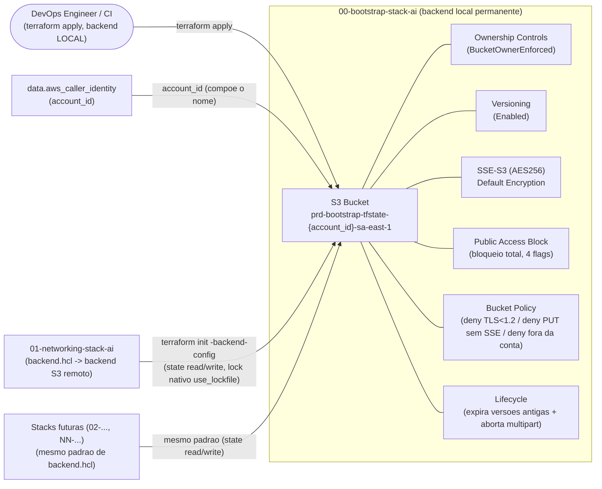

# ADR-0002: Stack de Bootstrap — Bucket S3 para Backend Remoto do Terraform

- **Status:** Aceito
- **Data:** 2026-08-01
- **Autor:** Planner Agent
- **Supersedes:** N/A
- **Ambiente:** `prd` (ambiente único do projeto — herdado do ADR-0001 Revisão 5; não há `dev`/`hml` em nenhuma stack deste repositório)
- **Região AWS:** `sa-east-1` (São Paulo) — mesma conta/região do ADR-0001

---

## 1. Contexto e Problema

O `backend.tf` de `01-networking-stack-ai` já está escrito, esperando um backend remoto S3:

```hcl
terraform {
  backend "s3" {
    use_lockfile = true
  }
}
```

`bucket`/`key`/`region` não são hardcoded — são injetados via `-backend-config=backend.hcl` (gitignored, com `backend.hcl.example` versionado como referência). `use_lockfile = true` habilita o locking nativo do backend S3 (Terraform CLI ≥ 1.10.0; floor efetivo do repositório é `>= 1.15.8`), decisão já tomada e implementada — **não é reaberta por este ADR**: nenhuma tabela DynamoDB de lock é criada aqui.

O bucket S3 referenciado por esse backend, porém, **não existe**. O próprio ADR-0001 já registra essa lacuna explicitamente:

- **Premissa 8:** "assume-se que o bucket S3 (e eventual mecanismo de locking) para o Terraform state já existe ou será provisionado em uma stack de bootstrap separada (ex.: `00-bootstrap`), fora do escopo deste ADR."
- **Seção 14 (Non-goals):** "Provisionamento do backend remoto de state — deve ser tratado em uma stack de bootstrap (ex.: `00-bootstrap`) e/ou ADR próprio."
- **Seção 11 (Riscos):** lista "ausência de backend remoto configurado (bootstrap não implementado)" como risco de impacto Alto ("bloqueia toda a implementação"), com mitigação "tratado como pré-requisito explícito na Seção 13.1; se não existir, deve ser resolvido antes por uma stack `00-bootstrap`".

Este ADR fecha exatamente essa lacuna: define a arquitetura de uma nova stack, `00-bootstrap-stack-ai`, cujo único propósito é provisionar o bucket S3 (versionado, criptografado, sem acesso público) que servirá de backend remoto para `01-networking-stack-ai` e para todas as stacks numeradas futuras deste repositório. Por definição de dependência (`00-` roda antes de `01-`), esta stack **não pode** ela mesma depender do backend S3 que está criando — teria uma dependência circular. Ela usa backend local (mesmo padrão `override.tf` já em uso em `01-networking-stack-ai`), permanentemente.

## 2. Drivers de Decisão

**Requisitos funcionais**
- Provisionar um bucket S3 com nome globalmente único, apto a ser referenciado por `-backend-config=backend.hcl` em `01-networking-stack-ai` (e stacks futuras) sem alterações no `backend.tf` já existente.
- Versionamento habilitado (pré-requisito explícito, citado no comentário do `backend.tf` do `01-`).
- Criptografia em repouso (SSE) habilitada por padrão para todos os objetos (pré-requisito explícito).
- Bloqueio total de acesso público e política de bucket restringindo acesso — o bucket guarda `.tfstate`, que pode conter valores sensíveis de infraestrutura (IDs de recursos, e ocasionalmente atributos não marcados como `sensitive` por engano em stacks futuras).
- Lifecycle policy para controlar custo de versões antigas do state, sem comprometer a capacidade de rollback (ADR-0001 Seção 12 depende de `versioning` do bucket para recuperar uma versão anterior do `.tfstate`).
- Nenhuma tabela DynamoDB de lock (decisão herdada, já implementada em `01-networking-stack-ai/backend.tf`).

**Requisitos não funcionais**
- Durabilidade/disponibilidade: herdadas do SLA nativo do S3 (11 noves de durabilidade, standard); nenhum requisito adicional de RTO/RPO foi informado.
- Sem requisito de multi-região/DR para o backend (alinhado à Premissa 2 do ADR-0001 — esta stack cobre apenas `sa-east-1`, mesma conta/região da stack de rede).

**Restrições**
- Não pode introduzir dependência circular: esta stack usa backend **local** (`override.tf`), permanentemente — nunca migra o próprio state para o bucket que ela cria (ver Seção 4, decisão D3).
- Sem informação de budget explícita; assume-se sensibilidade a custo, na mesma linha do ADR-0001 (que trocou HA de NAT Gateway por custo). O custo desta stack, porém, é marginal frente ao de `01-` (Seção 10).
- Nenhum requisito de compliance (LGPD/PCI/HIPAA/SOC2) foi informado.
- Segue a mesma convenção de nomenclatura de arquivos/identificadores (`.claude/rules/terraform-naming-conventions.md`) e a mesma restrição de recursos nativos do provider `hashicorp/aws` já adotada em `01-networking-stack-ai` — não há indicação de exceção para esta stack.

**Objetivos estratégicos**
- Desbloquear o `terraform init -backend-config=backend.hcl` de `01-networking-stack-ai`, hoje impedido pela ausência do bucket.
- Estabelecer, para as stacks numeradas futuras (`02-...`, `NN-...`), um único bucket/convenção de `key` compartilhado (`{stack_dir}/{env}/terraform.tfstate`, já usado em `01-networking-stack-ai/backend.hcl.example`), sem exigir uma nova stack de bootstrap por stack consumidora.

## 3. Premissas (Assumptions)

1. **Ambiente:** `prd`, único ambiente do projeto (não apenas de `01-`) — não há `dev`/`hml` em nenhuma stack deste repositório desde o ADR-0001 Revisão 5. Esta stack de bootstrap adota o mesmo padrão: sem `variable "environment"`, `local.environment = "prd"` fixo.
2. **Região:** `sa-east-1`, mesma conta e região do ADR-0001. Sem requisito de bucket compartilhado entre múltiplas contas/regiões (Premissa 6).
3. **Compliance:** nenhum framework informado — herdado da Premissa 5 do ADR-0001.
4. **Budget:** sensibilidade a custo assumida (herdado); o custo desta stack é, na prática, marginal (Seção 10).
5. **Estado atual:** greenfield — o bucket ainda não existe (confirmado pelo comentário em `01-networking-stack-ai/backend.tf`, "Pre-requisito (bloqueante): o bucket S3 do backend... precisa existir previamente").
6. **Uma única conta AWS:** assume-se que todas as stacks deste repositório rodam na mesma conta AWS. Um bucket compartilhado entre contas está fora de escopo (Seção 14).
7. **Estratégia de criptografia:** escolhido SSE-S3 (`AES256`, chave gerenciada pela AWS) em vez de SSE-KMS com CMK dedicada, por não haver requisito de compliance que exija auditoria/rotação de chave via KMS nesta fase — decisão revisável se um framework de compliance for introduzido futuramente (ver Seção 4, decisão D1).
8. **Estratégia de nome do bucket:** nome derivado deterministicamente via `data.aws_caller_identity` (account ID) + região + convenção de naming do projeto, em vez de sufixo aleatório (evita depender do provider `hashicorp/random`, mantendo a stack apenas com recursos nativos `hashicorp/aws` — ver Seção 4, decisão D2).
9. **Sem DynamoDB de lock:** decisão já tomada e implementada em `01-networking-stack-ai/backend.tf` (`use_lockfile = true`); este ADR herda e não reabre essa decisão.
10. **Backend desta própria stack:** permanece local (`override.tf`) permanentemente, nunca migrado para o bucket que ela mesma cria — evita autorreferência/circularidade (ver Seção 4, decisão D3, e Seção 11).
11. **IAM de acesso ao bucket:** nenhuma role/policy de execução Terraform dedicada (para engenheiros ou pipelines de CI) é criada por esta stack — assume-se, por ora, o uso das mesmas credenciais/role administrativa já usadas para aplicar `01-networking-stack-ai`. Tratado como Non-goal (Seção 14).
12. **Sem DR/replicação cross-region** para o bucket de state, alinhado à ausência de requisito de multi-região do ADR-0001.
13. **Tags `Owner`/`CostCenter`:** ainda não definidas pelo solicitante; usam os mesmos placeholders `"AJUSTAR-..."` já em uso em `01-networking-stack-ai/terraform.tfvars.example`.
14. **Migração do backend de `01-networking-stack-ai` para o bucket criado aqui é uma ação subsequente, fora do escopo desta ADR** (Seção 14) — este documento cobre apenas a criação do bucket, não a remoção do `override.tf` de `01-` nem o `terraform init -migrate-state` correspondente.

## 4. Opções Consideradas

### Estrutura de código — Opção A: recursos nativos organizados por arquivo (domínio `state-bucket`) *(ESCOLHIDA)*

- **Descrição:** mesma abordagem já adotada em `01-networking-stack-ai` — recursos nativos do provider `hashicorp/aws`, sem módulos de terceiros/comunidade, distribuídos em arquivos `.tf` por sub-domínio (`state-bucket.tf`, `state-bucket.versioning.tf`, `state-bucket.encryption.tf`, etc.).
- **Prós:** consistência com o padrão já estabelecido no repositório (`.claude/rules/terraform-naming-conventions.md`); PRs com diffs pequenos e localizados; facilita revisão por pares — especialmente relevante aqui, dado que um erro nesta stack (ex.: política de bucket errada) pode expor o state de **todas** as stacks futuras.
- **Contras:** mais arquivos para uma stack pequena (7-8 recursos).
- **Custo estimado:** idêntico à Opção B — organização de código não afeta infraestrutura.

### Estrutura de código — Opção B: arquivo único `main.tf` monolítico

- **Descrição:** todos os recursos em um único arquivo.
- **Prós:** simplicidade inicial para uma stack pequena.
- **Contras:** diverge do padrão já estabelecido em `01-`; dificulta revisão de PR; menos escalável se a stack crescer (ex.: adicionar IAM de acesso ao bucket no futuro).
- **Custo estimado:** idêntico à Opção A.

**Decisão:** Opção A, por consistência direta com `01-networking-stack-ai` e por facilitar a revisão por pares de um recurso security-sensitive.

---

### D1 — Estratégia de criptografia em repouso do bucket

#### Opção A — SSE-S3 (`AES256`, chave gerenciada pela AWS) *(ESCOLHIDA)*

- **Descrição:** `aws_s3_bucket_server_side_encryption_configuration` com `sse_algorithm = "AES256"`, sem CMK.
- **Prós:** sem custo adicional de KMS (chamadas de API + armazenamento de chave); sem necessidade de gerenciar `kms:Decrypt`/`kms:GenerateDataKey` nas permissões IAM das stacks consumidoras (reduz superfície de erro de permissão bloqueando `terraform init`/`plan`/`apply`); atende ao requisito explícito do `backend.tf` do `01-` ("SSE habilitado") sem introduzir complexidade adicional.
- **Contras:** sem trilha de auditoria de uso de chave via CloudTrail (KMS `Decrypt`/`GenerateDataKey` events); sem rotação de chave gerenciada por política própria da organização; se um requisito de compliance (ex.: PCI-DSS) exigir CMK auditável, precisará de migração futura.
- **Custo estimado:** USD 0 adicional (incluso no custo do S3).

#### Opção B — SSE-KMS com CMK dedicada

- **Descrição:** `aws_kms_key` dedicada + `aws_s3_bucket_server_side_encryption_configuration` com `sse_algorithm = "aws:kms"` e `kms_master_key_id` apontando para a CMK.
- **Prós:** trilha de auditoria detalhada via CloudTrail (quem descriptografou o quê e quando); rotação de chave gerenciada; política de chave (`key policy`) como camada adicional de controle de acesso independente da bucket policy; caminho natural se compliance regulatório for introduzido.
- **Contras:** custo mensal da CMK (~USD 1/mês) + custo por chamada de API KMS (`GenerateDataKey`/`Decrypt`, uma por leitura/escrita de objeto — baixo volume aqui, mas não nulo); toda stack consumidora (`01-`, futuras) precisaria de permissões IAM adicionais (`kms:Decrypt`, `kms:GenerateDataKey`) além das permissões S3, aumentando a superfície de configuração de acesso a manter; nenhum requisito de compliance foi informado que justifique esse custo/complexidade agora (Premissa 3).
- **Custo estimado:** ~USD 1-2/mês adicional.

**Decisão:** Opção A. Nenhum driver de compliance foi informado (Premissa 3) e o ADR-0001 já demonstrou preferência explícita por custo/simplicidade sobre hardening adicional quando não exigido (troca de NAT HA por NAT único). SSE-S3 atende ao requisito literal do `backend.tf` ("SSE habilitado"). Reavaliar para SSE-KMS caso um requisito de compliance surja — mudança não-destrutiva (`aws_s3_bucket_server_side_encryption_configuration` é atualizável in-place, sem forçar recriação do bucket).

---

### D2 — Estratégia de unicidade global do nome do bucket

#### Opção A — Nome derivado do Account ID via `data.aws_caller_identity` *(ESCOLHIDA)*

- **Descrição:** `bucket = "${local.name}-tfstate-${data.aws_caller_identity.current.account_id}-${var.aws_region}"`, ex.: `prd-bootstrap-tfstate-123456789012-sa-east-1`.
- **Prós:** determinístico e idempotente — o mesmo `terraform plan`, rodado por qualquer engenheiro na mesma conta, resolve para o mesmo nome, sem estado externo adicional a rastrear; usa apenas recursos/data sources nativos do provider `hashicorp/aws` (nenhum provider adicional); Account ID já é, por construção, globalmente único por conta AWS — elimina colisão de nome sem necessidade de aleatoriedade.
- **Contras:** expõe o Account ID no nome do bucket (baixo risco — Account IDs não são segredos, mas alguns times preferem não expô-los em nomes de recursos publicamente referenciáveis, ainda que o bucket em si não seja público).
- **Custo estimado:** USD 0 adicional.

#### Opção B — Sufixo aleatório via `random_id`/`random_string` (provider `hashicorp/random`)

- **Descrição:** `resource "random_id" "bucket_suffix" { byte_length = 4 }`, concatenado ao nome do bucket.
- **Prós:** não expõe o Account ID no nome do bucket.
- **Contras:** introduz uma dependência de provider adicional (`hashicorp/random`) — o repositório optou por manter `01-networking-stack-ai` restrita a recursos nativos `hashicorp/aws` (Premissa 11 do ADR-0001); embora `random` não seja um "módulo de terceiros" no sentido literal da restrição, adiciona uma segunda declaração de provider e um recurso cujo valor gerado precisa ser persistido/gerenciado no state — se o state local desta stack (Premissa 10) for perdido antes de uma cópia de segurança, o sufixo não é recriável de forma determinística, dificultando disaster recovery do próprio bootstrap; o nome final também fica menos legível/auditável no console.
- **Custo estimado:** USD 0 adicional.

**Decisão:** Opção A. A ausência de estado externo necessário para recriar o nome (em caso de perda do state local desta stack, Seção 11) e a manutenção de zero providers adicionais pesam mais do que o benefício marginal de não expor um Account ID (que não é, por si, um segredo).

---

### D3 — Backend desta própria stack de bootstrap (auto-referência)

#### Opção A — Backend local permanente (`override.tf`) *(ESCOLHIDA)*

- **Descrição:** esta stack nunca migra seu próprio `.tfstate` para o bucket que ela cria; usa `override.tf` (mesmo padrão de `01-networking-stack-ai` hoje) indefinidamente, sem um `backend.tf` com bloco `backend "s3"` — diferente de `01-`, que tem um `backend.tf` parcial aguardando migração futura.
- **Prós:** elimina completamente o risco de autorreferência (um bug ou exclusão acidental no bucket não pode corromper/destruir o state necessário para recriá-lo); padrão amplamente recomendado pela comunidade Terraform para stacks de bootstrap de backend; simplicidade operacional (sem passo de migração a executar/documentar).
- **Contras:** o `.tfstate` desta stack fica fora da proteção de versionamento/durabilidade do S3 — reside apenas no disco de quem/o que rodou o `apply` (engenheiro local ou runner de CI), exigindo um processo operacional próprio de backup (tratado como recomendação na Seção 11/14, não implementado via Terraform).
- **Custo estimado:** USD 0.

#### Opção B — Local inicialmente, com migração manual única para o bucket após a primeira criação

- **Descrição:** aplicar com backend local na primeira vez; em seguida, adicionar um `backend.tf` com bloco `backend "s3"` apontando para o próprio bucket recém-criado e rodar `terraform init -migrate-state`.
- **Prós:** centraliza todo o state do repositório (incluindo o da própria stack de bootstrap) em um único local durável e versionado, com backup/histórico via `versioning` do S3.
- **Contras:** autorreferência real — o bucket passa a hospedar o state necessário para gerenciar a si mesmo; uma operação destrutiva futura (ex.: `force_destroy`, exclusão acidental de uma versão específica do objeto de state via lifecycle mal configurado) poderia deixar a stack sem state utilizável e sem um caminho trivial de recriação, já que o próprio Terraform que recriaria o bucket depende do state armazenado nele; exige um passo de migração adicional a documentar e revisar.
- **Custo estimado:** USD 0 adicional de infraestrutura, mas custo operacional/de risco maior.

**Decisão:** Opção A. O objetivo explícito desta stack é justamente evitar dependência circular (Seção 2/Restrições) — usar o próprio bucket para o próprio state reintroduziria, de forma mais sutil, o mesmo problema estrutural. Documentado como risco operacional residual na Seção 11, com recomendação de backup externo do state local (Seção 14, fora do escopo de implementação Terraform).

## 5. Decisão

**Opção A (estrutura de código nativo por arquivo) + Decisão D1 Opção A (SSE-S3/AES256) + Decisão D2 Opção A (nome derivado do Account ID) + Decisão D3 Opção A (backend local permanente para esta stack)** — combinação que resolve a Premissa 8 e o Non-goal correspondente do ADR-0001 sem introduzir dependência circular, sem exigir um segundo provider Terraform, e sem custo/complexidade desproporcional a um requisito de compliance que não foi informado.

Justificativa consolidada, referenciando os drivers da Seção 2: o bucket resultante satisfaz literalmente os pré-requisitos já documentados no `backend.tf` de `01-networking-stack-ai` (versionamento + SSE), sem acesso público, com política restritiva e lifecycle de custo — habilitando o `terraform init -backend-config=backend.hcl` de `01-` (e de stacks futuras) a funcionar sem qualquer alteração no `backend.tf` já escrito.

## 6. Arquitetura Proposta

### 6.1 Diagrama



> Diagrama editável equivalente, com fluxo "vivo" (setas animadas), gerado em `docs/diagramas/ADR-0002-bootstrap-stack-remote-backend.drawio` — ver seção **DIAGRAMA DRAW.IO**.

> Nota: `01-networking-stack-ai` e "Stacks futuras" representam **consumo** do backend criado aqui, não recursos AWS provisionados por esta ADR — incluídos no diagrama para deixar explícito o fluxo de dependência que motiva a existência desta stack (Seção 1).

### 6.2 Recursos AWS

| Recurso | Tipo (Terraform) | Nome lógico | Região | Observações |
|---|---|---|---|---|
| Account ID atual | `data.aws_caller_identity` | `current` | sa-east-1 | Resolve `account_id`, usado para compor o nome globalmente único do bucket (Seção 4, D2). |
| Bucket S3 de state | `aws_s3_bucket` | `this` | sa-east-1 | `bucket = "prd-bootstrap-tfstate-{account_id}-sa-east-1"`. `force_destroy = false` (Seção 11). |
| Ownership Controls | `aws_s3_bucket_ownership_controls` | `this` | sa-east-1 | `object_ownership = "BucketOwnerEnforced"` — desabilita ACLs por completo (endurece o controle de acesso além do Public Access Block). |
| Versionamento | `aws_s3_bucket_versioning` | `this` | sa-east-1 | `status = "Enabled"` — pré-requisito explícito do `backend.tf` de `01-`; base da estratégia de rollback de state (ADR-0001 Seção 12). |
| Criptografia padrão | `aws_s3_bucket_server_side_encryption_configuration` | `this` | sa-east-1 | `sse_algorithm = "AES256"` (SSE-S3) — Decisão D1. |
| Bloqueio de acesso público | `aws_s3_bucket_public_access_block` | `this` | sa-east-1 | `block_public_acls`, `block_public_policy`, `ignore_public_acls`, `restrict_public_buckets` = `true` (todos). |
| Política do bucket | `aws_s3_bucket_policy` | `this` | sa-east-1 | Via `data.aws_iam_policy_document`: nega tráfego sem TLS (`aws:SecureTransport = false`), nega `PutObject` sem `AES256` no header de SSE, nega ação a principals fora da conta AWS atual (`aws:PrincipalAccount`). |
| Lifecycle | `aws_s3_bucket_lifecycle_configuration` | `this` | sa-east-1 | `noncurrent_version_expiration` (expira versões não-atuais após N dias, retendo um mínimo de versões recentes) + `abort_incomplete_multipart_upload` (limpa uploads incompletos). Ver Seção 6.3/13.2 para os valores parametrizados. |

### 6.3 Módulos Terraform Recomendados

| Módulo/Provider | Versão (pinned) | Finalidade |
|---|---|---|
| `hashicorp/aws` (provider) | `~> 6.0` (validado via `terraform-mcp get_latest_provider_version`: última versão estável é `6.57.1`, compatível com a mesma constraint já usada em `01-networking-stack-ai`, sem necessidade de constraint diferente) | Provider AWS oficial para todos os recursos nativos da stack. |
| Terraform CLI (`required_version`) | `>= 1.15.8` | Mesmo floor já adotado em `01-networking-stack-ai/versions.tf`, para consistência de ferramental entre stacks do repositório (nenhum recurso desta stack exige especificamente `use_lockfile`, já que o backend é local — Seção 4, D3). |

> Nenhum módulo Terraform de terceiros/comunidade é utilizado — apenas recursos/data sources nativos do provider `hashicorp/aws`, mesma restrição já aplicada em `01-networking-stack-ai` (Premissa 11 do ADR-0001, herdada por consistência, sem indicação de exceção para esta stack).

## 7. Avaliação Well-Architected

| Pilar | Como a decisão endereça |
|---|---|
| **Operational Excellence** | Ordem de implementação explícita (Seção 13.1) desbloqueando `01-networking-stack-ai`; convenção de `key` (`{stack_dir}/{env}/terraform.tfstate`) documentada para reuso por stacks futuras sem exigir uma nova stack de bootstrap cada vez. Risco operacional do state local desta própria stack (D3) documentado explicitamente, não escondido. |
| **Security** | Bloqueio total de acesso público (`aws_s3_bucket_public_access_block`, 4 flags); `BucketOwnerEnforced` desabilita ACLs; bucket policy nega tráfego sem TLS e uploads sem SSE; SSE-S3 habilitado por padrão em todos os objetos; nenhum princípio de menor privilégio violado (política apenas nega, não concede acesso amplo). |
| **Reliability** | Versionamento habilitado protege contra sobrescrita/corrupção acidental de qualquer `.tfstate` armazenado no bucket (recuperável via versão anterior do objeto); `force_destroy = false` previne destruição acidental do bucket e de todo o histórico de state nele contido. Trade-off aceito e documentado: o state **desta própria stack** de bootstrap não tem essa proteção, por design (D3, Seção 11). |
| **Performance Efficiency** | S3 oferece latência de leitura/escrita adequada para objetos pequenos como `.tfstate` (tipicamente KB a poucos MB); nenhum ajuste de performance é necessário para este caso de uso. |
| **Cost Optimization** | SSE-S3 em vez de SSE-KMS evita custo de CMK/chamadas KMS sem requisito de compliance que o justifique (D1); lifecycle expira versões antigas de state após um período configurável, controlando o crescimento de custo de armazenamento ao longo do tempo sem comprometer a janela de rollback recente. Custo total estimado é marginal (Seção 10). |
| **Sustainability** | Footprint mínimo de recursos (um bucket S3 e suas configurações, sem compute, sem NAT, sem serviços gerenciados adicionais); lifecycle de expiração de versões antigas reduz o volume de dados armazenados indefinidamente. |

## 8. Segurança

- **IAM:** esta stack não cria roles/policies de execução Terraform para engenheiros ou pipelines de CI (Premissa 11, Non-goal — Seção 14). O acesso de leitura/escrita ao bucket, quando uma role dedicada for definida em trabalho futuro, deve seguir o menor privilégio: `s3:ListBucket` no ARN do bucket, `s3:GetObject`/`s3:PutObject`/`s3:DeleteObject` escopados ao prefixo de `key` de cada stack consumidora (`{stack_dir}/{env}/*`) — nunca `s3:*` nem `Resource = "*"`.
- **Criptografia em repouso:** SSE-S3 (`AES256`), aplicada por padrão a todo objeto gravado no bucket, reforçada por uma cláusula de negação na bucket policy para uploads que não especifiquem SSE (Seção 4, D1; Seção 6.2).
- **Criptografia em trânsito:** cláusula de negação explícita na bucket policy para qualquer requisição sem TLS (`aws:SecureTransport = false`), seguindo a orientação de "How do I enforce TLS 1.2 or later for my S3 buckets?" (AWS re:Post, validado via `aws-mcp`).
- **Isolamento de rede:** não aplicável — S3 é um serviço regional fora de VPC por padrão. Um VPC Gateway Endpoint para S3 (acesso privado sem sair para a internet a partir de runners de CI dentro de VPC) é uma melhoria possível, tratada como Non-goal (Seção 14).
- **Gestão de segredos:** esta stack não manipula segredos diretamente, mas o bucket **armazena** `.tfstate` de outras stacks, que pode conter valores sensíveis como efeito colateral de atributos não marcados `sensitive` em código futuro. O controle primário contra esse risco é a combinação de bloqueio de acesso público + política restritiva + criptografia (não há mitigação adicional específica de "segredo" nesta stack — reforço do princípio geral de nunca depender apenas da confidencialidade do backend para proteger dados sensíveis).
- **Logging e auditoria:** **não implementado nesta revisão.** S3 Server Access Logging e/ou CloudTrail data events para o bucket seriam a extensão natural (rastrear quem leu/escreveu cada `.tfstate`), mas não foram solicitados no escopo desta ADR — registrados como recomendação futura (Seção 14).
- **Backup e retenção:** o próprio `versioning` do bucket é o mecanismo de backup/recuperação do state das stacks consumidoras (ADR-0001 Seção 12). Lifecycle configurado para expirar versões não-atuais após um período parametrizável, mantendo um número mínimo de versões recentes retidas independentemente da idade (Seção 6.2/13.2). O state **local** desta própria stack de bootstrap **não** tem essa proteção — ver Seção 11 (risco aceito) e Seção 14 (recomendação operacional de backup externo, fora do escopo Terraform).

## 9. Naming Convention & Tagging

- **Padrão de nomes (identificadores lógicos):** mesmo padrão do ADR-0001, `{env}-{project_name}-{service}-{region}` (ex.: `prd-bootstrap-tfstate-sa-east-1` seria o nome "base"). **Extensão específica para o nome do bucket S3:** como nomes de bucket precisam ser globalmente únicos (não apenas únicos dentro da conta/região, ao contrário dos demais recursos cobertos pela convenção-base), o padrão é estendido com o segmento `{account_id}`: `{env}-{project_name}-{service}-{account_id}-{region}` → `prd-bootstrap-tfstate-{account_id}-sa-east-1` (Seção 4, D2). Os demais recursos desta stack (que não exigem unicidade global) seguem a convenção-base sem esse segmento.
- `project_name` desta stack: `"bootstrap"`.
- **Tags obrigatórias:**
  - `Environment` = `"prd"` (fixo, mesmo padrão do ADR-0001 Revisão 5 — ver Premissa 1)
  - `Owner` (time responsável — a definir pelo solicitante; placeholder `"AJUSTAR-time-responsavel"` até lá, Premissa 13)
  - `CostCenter` (a definir pelo solicitante; placeholder `"AJUSTAR-centro-de-custo"`)
  - `Project` = `"bootstrap"` (`project_name`)
  - `ManagedBy` = `"terraform"`
  - `DataClassification` = `"confidential"` — **diferente** do `"internal"` usado em `01-networking-stack-ai`: este bucket armazena `.tfstate`, que pode conter dados sensíveis de infraestrutura de todas as stacks do repositório, justificando uma classificação mais restritiva.
  - `StackName` = `"00-bootstrap-stack-ai"`

## 10. Custo Estimado

Estimativa em ordem de grandeza para `sa-east-1`. Volume de dados extremamente baixo — arquivos `.tfstate` tipicamente variam de poucos KB a poucos MB, mesmo somando o histórico de versões de todas as stacks do repositório.

| Item | Modelo de pricing | Estimativa mensal (USD) |
|---|---|---|
| Armazenamento S3 Standard (state atual + versões não-expiradas, estimado < 1 GB total mesmo com múltiplas stacks) | On-demand por GB | ~0,05–0,50 |
| Requisições PUT/GET/LIST (`terraform init`/`plan`/`apply` de todas as stacks, baixo volume) | On-demand por 1.000 requisições | ~0,50–1,50 |
| Public Access Block, Bucket Policy, Ownership Controls, Lifecycle | Sem custo adicional | 0 |
| Versionamento (custo embutido no armazenamento acima) | — | 0 (incluído) |
| **Total estimado** | | **~ USD 1–3** |

> Estimativa em ordem de grandeza; validar com Cost Explorer ou AWS Pricing Calculator antes do go-live. Custo marginal frente aos ~USD 55–80/mês de `01-networking-stack-ai` — não é um driver de decisão relevante para esta stack.

## 11. Riscos e Mitigações

| Risco | Probabilidade | Impacto | Mitigação |
|---|---|---|---|
| **State desta própria stack de bootstrap reside apenas localmente** (D3, decisão consciente para evitar autorreferência) — perda do disco/runner onde o `apply` foi executado, sem cópia, torna o bucket "órfão" de Terraform (existe na AWS, mas sem state que o gerencie) | Baixa-Média (depende de disciplina operacional) | Médio (recuperável via `terraform import` de cada recurso, mas trabalhoso) | Tratar o `.tfstate` local desta stack como artefato crítico: recomenda-se cópia de segurança periódica em local seguro fora do repositório Git (ex.: cofre de segredos da organização), fora do escopo de implementação Terraform desta ADR (Seção 14). Documentar esse procedimento no README da stack. |
| Exclusão acidental do bucket (ex.: `terraform destroy` sem querer) destruiria o histórico de state de **todas** as stacks consumidoras | Baixa | Crítico | `force_destroy = false` (impede destruição do bucket enquanto contiver objetos); nenhuma automação desta stack executa `destroy`; qualquer `destroy` real exige confirmação explícita em sessão, por guardrail do `devops-engineer` (ver `.claude/agents/devops-engineer.md`). |
| Colisão de nome de bucket globalmente | Extremamente baixa | Alto (bloqueia `apply`) | Nome inclui `account_id` (globalmente único por conta AWS) + região — colisão praticamente eliminada pela Decisão D2. |
| Bucket policy mal configurada expõe o state publicamente ou bloqueia acesso legítimo | Baixa (revisão por pares obrigatória, Seção 13.1) | Crítico se exposição pública; Alto se bloqueio de acesso legítimo | `terraform plan` revisado por pares antes de qualquer `apply` (mesmo processo já obrigatório em `01-`, dado que não há ambiente inferior no repositório); testes de validação pós-deploy (Seção 13.4) confirmam ausência de acesso público via `aws s3api get-public-access-block`/`get-bucket-policy-status`. |
| Ausência de logging/auditoria de acesso ao bucket (Seção 8) | Média | Baixo-Médio (reduz capacidade forense em caso de incidente) | Aceito como gap desta revisão (fora do escopo solicitado); registrado como Non-goal/recomendação futura (Seção 14). |
| Lifecycle mal calibrado expira versões de state ainda necessárias para rollback | Baixa (parâmetros conservadores propostos — Seção 13.2) | Médio | `noncurrent_version_expiration` combinado com `newer_noncurrent_versions` (retém um número mínimo de versões recentes independentemente da idade) — não expira agressivamente; validar com `terraform plan` antes do `apply` que os parâmetros calibrados fazem sentido para o volume real de mudanças de cada stack consumidora. |
| Migração futura de `01-networking-stack-ai` para este backend feita sem cuidado (ex.: sem remover `override.tf` corretamente, ou sem `terraform init -migrate-state`) | Média (ação humana subsequente, fora desta ADR) | Alto (pode gerar state duplicado/divergente) | Explicitamente fora do escopo desta ADR (Seção 14) — deve ser tratada como tarefa separada, autorizada e documentada, seguindo o guia oficial de migração de backend do Terraform. |

## 12. Estratégia de Rollback

- **Cenário mais provável (nenhum `apply` real ainda):** `git revert` da criação da stack `00-bootstrap-stack-ai` e/ou simplesmente não aplicar. Nenhuma infraestrutura é afetada.
- **Se o bucket já foi criado, mas nenhuma stack consumidora migrou seu backend para ele ainda:** seguro remover via `terraform destroy` **desta stack** (backend local, Seção 4/D3) — não há dependência downstream real até que `01-networking-stack-ai` (ou outra) tenha efetivamente migrado seu backend (Seção 14, Non-goal).
- **Se uma ou mais stacks já tiverem migrado seu backend para este bucket:** `terraform destroy` **não é seguro** — destruiria o state necessário para gerenciar essas stacks. Qualquer mudança de configuração do bucket (política, lifecycle, criptografia) deve ser aplicada de forma incremental (nenhum desses atributos força recriação do bucket em si — apenas `bucket`/`bucket_prefix` são "Forces new resource" no `aws_s3_bucket`, e o nome, uma vez em uso por backends reais, **não deve ser alterado**).
- **Recuperação de uma versão corrompida/sobrescrita de um `.tfstate` específico:** ação manual via console/CLI S3 (`aws s3api list-object-versions` + `aws s3api get-object --version-id`), restaurando a versão anterior do objeto — não é uma operação Terraform.
- **Validação pré-rollback:** sempre rodar `terraform plan` antes de qualquer `apply`/`destroy` de correção nesta stack, prestando atenção especial a qualquer indicação de `# forces replacement` em `aws_s3_bucket.this` (recriação implicaria um nome de bucket novo, quebrando todas as `key`s de backend já configuradas nas stacks consumidoras).

## 13. Handoff para DevOps Engineer Agent

> **Escopo estrito desta implementação:** apenas os recursos da Seção 6.2, na stack `00-bootstrap-stack-ai/`. **Não** inclui alterar `01-networking-stack-ai/` (remover `override.tf`, rodar `-migrate-state`) — essa é uma tarefa subsequente e separada, fora do escopo desta ADR (Seção 14), que exige autorização explícita própria antes de ser executada.

### 13.1 Ordem de Implementação (respeitando dependências)

0. **Pré-checagem:** confirmar, via `aws s3api list-buckets` (ou `head-bucket` no nome esperado), que nenhum bucket com o nome-alvo já existe. Confirmar também que `01-networking-stack-ai` ainda está com `override.tf` presente (backend local) — se já tiver sido removido e um `init -backend-config` já tiver sido executado contra um bucket diferente, parar e investigar antes de prosseguir.
1. Criar o diretório `00-bootstrap-stack-ai/` na raiz do repositório, seguindo a mesma estrutura de arquivos de `01-networking-stack-ai/` (`.claude/rules/terraform-naming-conventions.md`):
   - `main.tf` (ponto de entrada/índice, mesmo com os recursos distribuídos nos arquivos de domínio abaixo)
   - `versions.tf` (`required_version = ">= 1.15.8"`; `hashicorp/aws` `~> 6.0`)
   - `providers.tf` (`provider "aws"` com `default_tags` usando `local.common_tags`)
   - `variables.tf` (variáveis agrupadas por domínio, sem `default` — Seção 13.2)
   - `data.tf` (`data "aws_caller_identity" "current"`)
   - `locals.tf` (`local.environment = "prd"`; `local.name`; `local.bucket_name`; `local.common_tags`)
   - `state-bucket.tf` (`aws_s3_bucket.this`, `aws_s3_bucket_ownership_controls.this`)
   - `state-bucket.versioning.tf` (`aws_s3_bucket_versioning.this`)
   - `state-bucket.encryption.tf` (`aws_s3_bucket_server_side_encryption_configuration.this`)
   - `state-bucket.public-access-block.tf` (`aws_s3_bucket_public_access_block.this`)
   - `state-bucket.policy.tf` (`data "aws_iam_policy_document" "state_bucket"` + `aws_s3_bucket_policy.this`)
   - `state-bucket.lifecycle.tf` (`aws_s3_bucket_lifecycle_configuration.this`)
   - `outputs.tf` (`state_bucket_id`, `state_bucket_arn`)
   - `override.tf` (gitignored — força backend local; **nenhum `backend.tf` com bloco `backend "s3"` deve ser criado nesta stack**, Seção 4/D3)
   - `terraform.tfvars.example` (versionado) e `terraform.tfvars` (gitignored, gerado a partir do example)
   - `.gitignore` (mesmo padrão de `01-networking-stack-ai/.gitignore`)
   - `README.md` (mesmo espírito do de `01-`: pré-requisitos, uso, validação pós-deploy, rollback, pontos de atenção — incluindo a nota explícita de que o backend desta stack é local permanente e o motivo)
2. Implementar os recursos da Seção 6.2, incluindo a bucket policy com as três cláusulas de negação descritas (TLS, SSE, principal fora da conta).
3. Rodar `terraform fmt -check` e `terraform validate` em `00-bootstrap-stack-ai/`.
4. Rodar `terraform plan -out=tfplan` e conferir que: (a) exatamente 1 `aws_s3_bucket`, 1 `aws_s3_bucket_ownership_controls`, 1 `aws_s3_bucket_versioning`, 1 `aws_s3_bucket_server_side_encryption_configuration`, 1 `aws_s3_bucket_public_access_block`, 1 `aws_s3_bucket_policy` e 1 `aws_s3_bucket_lifecycle_configuration` são planejados; (b) as tags obrigatórias (Seção 9) aparecem corretamente; (c) nenhum atributo de `variable "environment"` é solicitado interativamente.
5. Submeter o `plan` à revisão por pares — obrigatório, mesmo racional de `01-networking-stack-ai` (não há ambiente inferior no repositório para absorver um erro antes de impactar o backend de state de tudo).
6. Aplicar somente após a revisão do passo 5.
7. Registrar, no `README.md` da stack, o nome final do bucket (output `state_bucket_id`) e a convenção de `key` a ser usada por stacks consumidoras (`{stack_dir}/{env}/terraform.tfstate`, já refletida em `01-networking-stack-ai/backend.hcl.example`).
8. **Parar aqui.** Não prosseguir para editar `01-networking-stack-ai/` (remoção de `override.tf`, `-migrate-state`) sem uma autorização explícita e separada — fora do escopo desta ADR (Seção 14).

### 13.2 Variáveis de Input Esperadas

| Variável | Tipo | Descrição |
|---|---|---|
| `aws_region` | `string` | Região AWS onde a stack é aplicada (`"sa-east-1"`). |
| `project_name` | `string` | Nome lógico do projeto (`"bootstrap"`). |
| `state_bucket` | `object({ force_destroy = bool, noncurrent_version_expiration_days = number, noncurrent_version_retain_count = number, abort_incomplete_multipart_upload_days = number })` | `force_destroy = false` (Seção 11). Valores sugeridos em `terraform.tfvars.example`: `noncurrent_version_expiration_days = 90`, `noncurrent_version_retain_count = 30` (mantém no mínimo as 30 versões não-atuais mais recentes, independentemente da idade, expirando as demais após 90 dias), `abort_incomplete_multipart_upload_days = 7`. |
| `tags` | `map(string)` | Tags adicionais além das obrigatórias (`Owner`/`CostCenter` — placeholders `"AJUSTAR-..."` até definição pelo solicitante). |

> **Sem `variable "environment"`** — mesmo padrão do ADR-0001 Revisão 5: `local.environment = "prd"` fixo em `locals.tf`.

### 13.3 Critérios de Aceitação (Definition of Done)

- [ ] Pré-checagem do passo 0 (Seção 13.1) executada e documentada (bucket-alvo não existe previamente; `01-networking-stack-ai/override.tf` intocado).
- [ ] Todos os recursos da Seção 6.2 provisionados via Terraform (sem cliques no console).
- [ ] `00-bootstrap-stack-ai/` segue a estrutura de arquivos da Seção 13.1, sem `backend.tf` com bloco `backend "s3"` (apenas `override.tf`).
- [ ] Tags obrigatórias (Seção 9) aplicadas em 100% dos recursos, incluindo `DataClassification = "confidential"`.
- [ ] `terraform validate` e `terraform fmt -check` passam sem erros.
- [ ] `terraform plan` mostra exatamente os recursos listados no passo 4 da Seção 13.1 — revisado explicitamente por um par.
- [ ] Bucket criado com `versioning.status = "Enabled"`, SSE-S3 (`AES256`) como padrão, Public Access Block com os 4 flags `true`, `Ownership Controls = BucketOwnerEnforced`.
- [ ] Bucket policy nega explicitamente tráfego sem TLS, uploads sem SSE e principals fora da conta AWS atual — validado por leitura do `plan`/policy renderizada, não apenas assumido.
- [ ] Nenhum acesso público habilitado (`aws s3api get-public-access-block` confirma os 4 flags bloqueados; `aws s3api get-bucket-policy-status` confirma `IsPublic: false`).
- [ ] Lifecycle configurado conforme Seção 13.2, validado no `plan`.
- [ ] Output `state_bucket_id` documentado no `README.md` da stack, junto com a convenção de `key` para stacks consumidoras.
- [ ] `terraform plan` subsequente ao `apply` retorna "No changes" (sem drift).
- [ ] Nenhuma alteração feita em `01-networking-stack-ai/` como parte desta entrega (fora do escopo, Seção 14).

### 13.4 Testes de Validação Pós-Deploy

- `aws s3api get-bucket-versioning --bucket <nome>` — confirmar `Status: Enabled`.
- `aws s3api get-bucket-encryption --bucket <nome>` — confirmar `SSEAlgorithm: AES256`.
- `aws s3api get-public-access-block --bucket <nome>` — confirmar os 4 flags `true`.
- `aws s3api get-bucket-policy-status --bucket <nome>` — confirmar `IsPublic: false`.
- `aws s3api get-bucket-policy --bucket <nome>` — inspecionar visualmente as 3 cláusulas de negação (TLS, SSE, conta).
- `aws s3api get-bucket-lifecycle-configuration --bucket <nome>` — confirmar as regras de expiração de versões não-atuais e de abort de multipart upload.
- `aws s3api get-bucket-ownership-controls --bucket <nome>` — confirmar `ObjectOwnership: BucketOwnerEnforced`.
- `aws resourcegroupstaggingapi get-resources --tag-filters Key=StackName,Values=00-bootstrap-stack-ai` — confirmar que o bucket está tageado corretamente.
- Rodar `terraform plan` após o `apply` e confirmar saída "No changes" (sem drift).
- **Não** rodar `terraform init -backend-config` em `01-networking-stack-ai` como parte desta validação — fora do escopo (Seção 14).

## 14. Non-goals / Fora do Escopo

- **Migração do backend de `01-networking-stack-ai`** (remoção do `override.tf`, `terraform init -backend-config=backend.hcl` com migração de state) — ação subsequente separada, explicitamente fora do escopo desta ADR (Premissa 14, Seção 13). Deve ser autorizada e executada como uma tarefa própria, seguindo o guia oficial de migração de backend do Terraform.
- **Tabela DynamoDB de lock** — decisão já tomada e implementada (locking nativo via `use_lockfile = true`, herdado de `01-networking-stack-ai/backend.tf`); não reaberta aqui.
- **IAM roles/policies de execução Terraform** para engenheiros ou pipelines de CI que consumirão este bucket — a ser tratado por uma stack/ADR de gestão de acesso dedicada.
- **S3 Server Access Logging / CloudTrail data events** para auditoria de acesso ao bucket de state — recomendado como melhoria futura (Seção 8/11), não implementado nesta ADR.
- **Multi-conta AWS** (bucket compartilhado entre contas diferentes) — fora de escopo; assume-se uma única conta AWS (Premissa 6).
- **Réplica cross-region / DR do bucket de state** — fora de escopo, alinhado à ausência de requisito de DR do ADR-0001.
- **MFA Delete** no bucket — possível hardening futuro; não habilitado nesta ADR por exigir configuração fora do Terraform (usuário raiz da conta + dispositivo MFA).
- **VPC Gateway Endpoint para S3** (acesso privado ao bucket sem sair para a internet pública, a partir de runners de CI dentro de VPC) — não solicitado; possível melhoria futura.
- **Backup/cópia secundária, fora da AWS, do state local desta própria stack de bootstrap** (mitigação do risco de autorreferência, Seção 11) — recomendação operacional registrada, não implementada via Terraform nesta ADR.
- **SSE-KMS com CMK dedicada** — avaliada e descartada nesta revisão (Seção 4, D1); reavaliar se um requisito de compliance for introduzido.
- Uso de qualquer módulo Terraform de terceiros/comunidade — mesma restrição herdada de `01-networking-stack-ai`.

## 15. Referências

- [ADR-0001 — Stack de Rede Fundacional (VPC 10.0.0.0/24) em Terraform](./ADR-0001-networking-stack-vpc.md) — Premissa 8, Seção 11 (risco de backend ausente) e Seção 14 (Non-goal "Provisionamento do backend remoto de state"), origem direta desta ADR.
- [`.claude/rules/terraform-naming-conventions.md`](../../.claude/rules/terraform-naming-conventions.md) — padrão de arquivos, variáveis agregadas por domínio e ausência de `default` em `variables.tf`, seguido pela estrutura proposta na Seção 13.1.
- [AWS Well-Architected Framework](https://aws.amazon.com/architecture/well-architected/)
- [Terraform AWS Provider — Backend best practices (S3 native locking)](https://docs.aws.amazon.com/prescriptive-guidance/latest/terraform-aws-provider-best-practices/backend.html) — confirma o padrão `use_lockfile = true` já adotado e a recomendação de habilitar versionamento/criptografia no bucket de backend.
- [Best practices for managing Terraform State files in AWS CI/CD Pipeline (AWS DevOps Blog)](https://aws.amazon.com/blogs/devops/best-practices-for-managing-terraform-state-files-in-aws-ci-cd-pipeline/) — versionamento, criptografia e política de acesso restritiva ao bucket de state.
- [Remediating exposures for Amazon S3 buckets — versioning](https://docs.aws.amazon.com/securityhub/latest/userguide/exposure-s3-bucket.html) — recomendação de versionamento + lifecycle para buckets críticos, base da Seção 6.2/13.2.
- [How do I enforce TLS 1.2 or later for my S3 buckets? (AWS re:Post)](https://repost.aws/knowledge-center/s3-enforce-modern-tls) — base da cláusula de negação de tráfego sem TLS na bucket policy (Seção 8).
- [Provider `hashicorp/aws` (registry, v6.57.1 — validado via `terraform-mcp get_latest_provider_version`)](https://registry.terraform.io/providers/hashicorp/aws/6.57.1)
- [Recurso `aws_s3_bucket` (registry)](https://registry.terraform.io/providers/hashicorp/aws/latest/docs/resources/s3_bucket)
- [Recurso `aws_s3_bucket_versioning` (registry)](https://registry.terraform.io/providers/hashicorp/aws/latest/docs/resources/s3_bucket_versioning)
- [Recurso `aws_s3_bucket_server_side_encryption_configuration` (registry)](https://registry.terraform.io/providers/hashicorp/aws/latest/docs/resources/s3_bucket_server_side_encryption_configuration)
- [Recurso `aws_s3_bucket_public_access_block` (registry)](https://registry.terraform.io/providers/hashicorp/aws/latest/docs/resources/s3_bucket_public_access_block)
- [Recurso `aws_s3_bucket_policy` (registry)](https://registry.terraform.io/providers/hashicorp/aws/latest/docs/resources/s3_bucket_policy)
- [Recurso `aws_s3_bucket_lifecycle_configuration` (registry)](https://registry.terraform.io/providers/hashicorp/aws/latest/docs/resources/s3_bucket_lifecycle_configuration)
- [Recurso `aws_s3_bucket_ownership_controls` (registry)](https://registry.terraform.io/providers/hashicorp/aws/latest/docs/resources/s3_bucket_ownership_controls)
