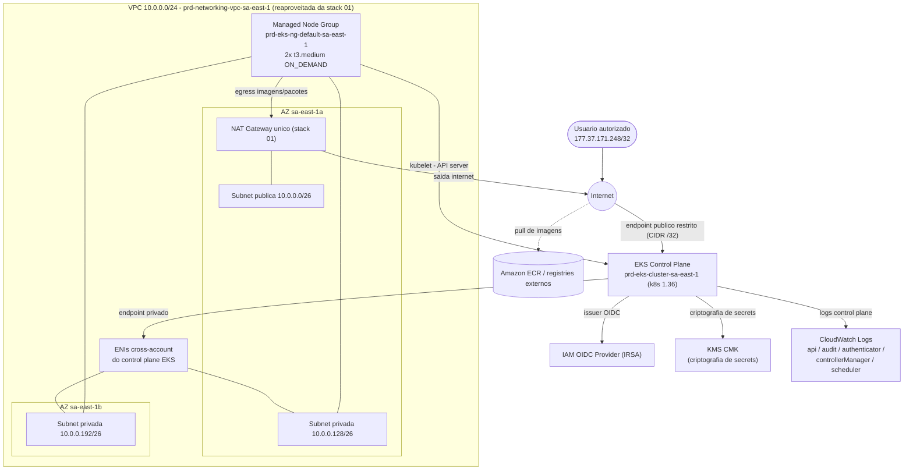

# ADR-0003: Cluster Amazon EKS com Managed Node Group (t3.medium, ON_DEMAND)

- **Status:** Proposed
- **Data:** 2026-08-15
- **Autor:** Planner Agent
- **Supersedes:** N/A
- **Ambiente:** `prd` (ambiente único — mesma decisão de escopo do ADR-0001, Revisão 5)
- **Região AWS:** sa-east-1 (São Paulo) — mesma região da stack `01-networking-stack-ai`

---

## 1. Contexto e Problema

A stack `01-networking-stack-ai` (ADR-0001, Status: Approved) entregou a fundação de rede — uma VPC `10.0.0.0/24` com sub-redes públicas/privadas em 2 AZs, NAT Gateway único e Flow Logs — mas, como registrado na Seção 14 (Non-goals) daquele ADR, não provisiona nenhum recurso de **compute/containers/aplicação**. Não há hoje, nesta conta AWS, nenhuma plataforma para rodar cargas de trabalho containerizadas.

Este ADR cobre a segunda stack numerada do repositório, `02-eks-stack-ai`, cujo requisito de negócio explícito é: um cluster **Amazon EKS**, com **2 worker nodes** `t3.medium`, `capacity_type = ON_DEMAND` (sem Spot), e logs do control plane habilitados no CloudWatch Logs — seguindo as boas práticas do AWS Well-Architected Framework. O pedido não especifica se a stack deve provisionar rede própria ou reaproveitar a stack 01; dado que (a) o objetivo estratégico da stack 01 era "servir de fundação para stacks futuras (compute, containers, dados, etc.)" e (b) duplicar uma VPC nesta conta introduziria custo e complexidade de peering sem benefício, este ADR trata o reaproveitamento da rede da stack 01 como decisão de arquitetura (Seção 4, Opção A) — não como requisito imposto, mas resultado da análise de alternativas.

Diferente da stack 01 (múltiplas revisões após já existir estado real, mas nenhum `apply` de fato executado), esta é uma stack **greenfield tanto de infraestrutura real quanto de estado Terraform** — nenhum cluster EKS existe hoje nesta conta associado a este projeto.

## 2. Drivers de Decisão

**Requisitos funcionais**
- Cluster Amazon EKS (`aws_eks_cluster`), região `sa-east-1`.
- 2 worker nodes, tipo de instância `t3.medium`, `capacity_type = ON_DEMAND`.
- Logs do control plane habilitados no CloudWatch Logs — os 5 tipos (`api`, `audit`, `authenticator`, `controllerManager`, `scheduler`), por alinhamento ao CIS Amazon EKS Benchmark e por já terem sido citados explicitamente como candidatos pelo solicitante.
- Seguir boas práticas AWS/EKS (Well-Architected) — tratado como requisito funcional explícito, não apenas aspiracional.

**Requisitos não funcionais**
- Nenhum SLA/RTO/RPO formal informado — mesma lacuna registrada como Premissa no ADR-0001; herdada aqui sem nova inferência.
- Ambiente único `prd` — não há `dev`/`hml` neste repositório (ADR-0001, Revisão 5); esta stack nasce diretamente com esse escopo, sem histórico de multi-ambiente a remover.
- Acesso ao endpoint da API do cluster deve ser restrito — **confirmado nesta sessão pelo solicitante**: modelo misto (privado + público), com o endpoint público restrito ao CIDR `177.37.171.248/32`.

**Restrições**
- Reaproveitar a rede já provisionada pela stack `01-networking-stack-ai` sempre que tecnicamente viável, evitando duplicar VPC/NAT/IGW.
- A stack 01 ainda não tem backend remoto S3 configurado (bootstrap pendente, Non-goal do ADR-0001) — isso restringe **como** esta stack pode consumir os outputs da stack 01 (ver Seção 4, decisão D3).
- Nenhum requisito de compliance (LGPD/PCI/HIPAA/SOC2) foi informado explicitamente — mesma premissa herdada do ADR-0001.
- Sensibilidade a custo assumida (herdada da postura já registrada no ADR-0001 para o único ambiente `prd`).
- Least-privilege: nenhum Security Group ou CIDR de acesso ao endpoint da API pode ser aberto sem justificativa explícita (`0.0.0.0/0` não é aceitável como default — guardrail deste agente).

**Objetivos estratégicos**
- Estabelecer a base de compute/containers para as próximas stacks numeradas (ex.: `03-*` para aplicações, ingress, observabilidade).
- Manter consistência com o padrão de código já estabelecido na stack 01 (arquivos por domínio, identificadores `snake_case`, variáveis agrupadas em `object(...)`, sem `default` em `variable`), conforme `.claude/rules/terraform-naming-conventions.md`.
- Minimizar a superfície de gestão manual (ClickOps) sobre o cluster, mantendo add-ons de plataforma (VPC CNI, kube-proxy, CoreDNS) versionados e auditáveis via Terraform.

## 3. Premissas (Assumptions)

1. **Região:** `sa-east-1`, por continuidade direta com a stack 01 (a rede reaproveitada só existe nessa região). Validado como região com API EKS totalmente disponível via `aws-mcp` (`get_regional_availability`, todas as operações `EKS+*` com status `isAvailableIn` em `sa-east-1`).
2. **Ambiente:** único, `prd` — sem variável `environment` livre, seguindo o mesmo padrão adotado no ADR-0001 Revisão 5 (`local.environment = "prd"`).
3. **Reaproveitamento de rede (stack 01):** o cluster e o node group usam as 2 sub-redes **privadas** já existentes (`10.0.0.128/26` em `sa-east-1a`, `10.0.0.192/26` em `sa-east-1b`) — não são criadas sub-redes novas. Ver Seção 4, Opção A, para a comparação com a alternativa de VPC dedicada.
4. **Capacidade de IP herdada como risco, não como bloqueio:** essas 2 sub-redes `/26` (59 IPs utilizáveis cada) fazem parte de um `/24` já 100% ocupado (risco já registrado na Seção 11 do ADR-0001). Para o escopo desta stack (2 nós `t3.medium` + ENIs cross-account do control plane), a matemática fecha com folga (~25–30 IPs consumidos de 118 disponíveis nas 2 sub-redes privadas), mas **não há headroom para crescer o node group significativamente nem para uma 3ª AZ** sem associar um CIDR IPv4 secundário à VPC (fora do escopo deste ADR — ver Seção 14).
5. **Versão do Kubernetes:** `1.36` — validada via `aws eks describe-cluster-versions --region sa-east-1` como a versão *default* atual da AWS, em `STANDARD_SUPPORT` até `2027-08-02` (maior janela de suporte padrão entre as versões disponíveis no momento deste ADR).
6. **Modelo de acesso ao endpoint da API — confirmado explicitamente pelo solicitante nesta sessão:** misto (`endpoint_private_access = true`, `endpoint_public_access = true`), com `public_access_cidrs = ["177.37.171.248/32"]`. Ver Seção 4, decisão D2, para as alternativas descartadas e o racional.
7. **Fragilidade do CIDR `/32` único:** o IP `177.37.171.248` é tratado como IP de acesso autorizado atual, não necessariamente estático a longo prazo (típico de IP residencial/corporativo sem range dedicado). Mudança desse IP exigirá atualizar `terraform.tfvars` e reaplicar — registrado como risco operacional (Seção 11), não como decisão a ser corrigida por este ADR.
8. **Estratégia de compute:** EKS Managed Node Group (`aws_eks_node_group`) — decisão direta, pois os parâmetros pedidos (`capacity_type = ON_DEMAND`, tipo de instância fixo) são literalmente parâmetros nativos dessa API. Ver Seção 4, decisão D1.
9. **IRSA/OIDC:** habilitado (`aws_iam_openid_connect_provider` apontando para o issuer do cluster) — custo zero, pré-requisito de boas práticas para permissões de add-ons/aplicações futuras via least privilege (em vez de herdar a IAM role do node).
10. **Add-ons gerenciados via Terraform:** `vpc-cni`, `kube-proxy` e `coredns` como `aws_eks_addon` nativos — evita drift entre o que a AWS instala por padrão e o que é auditável via state. `bootstrap_self_managed_addons = false` é considerado, mas mantido no valor default (`true`) nesta primeira versão para simplificar o bootstrap inicial do cluster; a migração completa para add-ons 100% geridos por Terraform fica registrada como ajuste fino a validar na implementação (não bloqueia esta decisão).
11. **Criptografia de secrets:** `encryption_config` do cluster usa uma KMS CMK dedicada a esta stack (não a chave `aws/eks` gerenciada pela AWS) — Security pillar, custo marginal (~USD 1/mês).
12. **Autenticação/autorização:** `access_config.authentication_mode = "API"` (access entries IAM), não o modelo legado `aws-auth` ConfigMap — caminho recomendado atualmente pela AWS para clusters novos. `bootstrap_cluster_creator_admin_permissions` permanece no default (`true`), ou seja, apenas o principal IAM que executar o `apply` recebe acesso administrativo automático; qualquer outro usuário/pipeline precisará de um `aws_eks_access_entry` explícito — **fora do escopo desta stack** (Seção 14).
13. **Mecanismo de consumo dos recursos de rede da stack 01:** via *data sources* nativos (`aws_vpc`, `aws_subnets`) filtrados por tag, e **não** via `terraform_remote_state`, porque o backend S3 remoto da stack 01 ainda não existe (bootstrap pendente, Non-goal do ADR-0001) e a stack 01 roda hoje com backend local via `override.tf`. Ver Seção 4, decisão D3.
14. **Grupo de log do control plane:** o EKS cria automaticamente o log group `/aws/eks/<cluster_name>/cluster` ao habilitar `enabled_cluster_log_types`, **com retenção "Never Expire" se o Terraform não gerenciar esse log group explicitamente** — comportamento documentado da AWS, não um bug. Esta stack deve declarar um `aws_cloudwatch_log_group` com esse nome exato *antes* do cluster, para controlar retenção e custo (mesmo padrão já usado em `vpc.flow-logs.tf` da stack 01). Tratado como detalhe de implementação obrigatório, não como decisão em aberto.
15. **Backend de state desta stack:** mesmo padrão pendente da stack 01 — depende do bucket S3 do backend remoto (Non-goal do ADR-0001, ainda não implementado). Até lá, roda em backend local via `override.tf`, mesmo mecanismo já usado pela stack 01.
16. **Tags `Owner`/`CostCenter`:** sem valor definitivo informado; herdam o mesmo padrão de placeholder ("a definir pelo solicitante") já usado em `terraform.tfvars` da stack 01.
17. **Compliance e budget:** nenhum framework de compliance nem valor numérico de budget foram informados para esta stack especificamente; herda a mesma premissa de sensibilidade a custo já registrada no ADR-0001.
18. **Sem módulo Terraform de terceiros nesta stack** — decisão tomada por este ADR (Seção 4, Opção A) para manter consistência com o padrão já estabelecido na stack 01, e não porque o solicitante tenha reiterado essa restrição explicitamente para `02-eks-stack-ai` (diferente do que ocorreu na Premissa 11 do ADR-0001). Caso o solicitante prefira o módulo comunitário `terraform-aws-modules/eks/aws` (validado via `terraform-mcp`, versão atual `21.25.0`) para reduzir boilerplate, isso exigiria uma revisão deste ADR.

## 4. Opções Consideradas

### Decisão principal — Forma de provisionar o cluster

#### Opção A — Recursos nativos do provider `hashicorp/aws` *(ESCOLHIDA — ver Seção 5)*
- **Descrição:** `aws_eks_cluster`, `aws_eks_node_group`, `aws_eks_addon`, `aws_iam_openid_connect_provider`, `aws_kms_key`, IAM roles/policy attachments — todos nativos, organizados em arquivos por domínio (`eks.tf`, `eks.node-group.tf`, `eks.addons.tf`, `eks.irsa.tf`, `eks.kms.tf`, `eks.logging.tf`), seguindo `.claude/rules/terraform-naming-conventions.md`.
- **Prós:** consistência total com o padrão já estabelecido na stack 01 (mesmo argumento validado no ADR-0001: auditabilidade linha a linha, nenhuma dependência de versionamento externo); controle granular sobre IAM/KMS/encryption/add-ons; nenhum recurso "escondido" dentro de um módulo de terceiros.
- **Contras:** mais código boilerplate a escrever e manter (IAM roles, versões de add-on) do que um módulo que abstrai esses detalhes; qualquer nova funcionalidade da AWS para EKS exige acompanhar o provider diretamente, sem a curadoria de um módulo popular.
- **Custo estimado:** idêntico à Opção B — mesma infraestrutura provisionada, diferença é apenas de organização de código.

#### Opção B — Módulo comunitário `terraform-aws-modules/eks/aws`
- **Descrição:** usar o módulo público mais adotado da comunidade para EKS (validado via `terraform-mcp get_latest_module_version`, versão atual `21.25.0`), que abstrai cluster, node groups, IRSA e add-ons em uma interface única.
- **Prós:** reduz drasticamente o boilerplate; módulo ativamente mantido, testado por uma base de usuários muito ampla; incorpora boas práticas de EKS "de fábrica" (ex.: gestão de add-ons, IRSA) com menos código a escrever.
- **Contras:** quebra o padrão de "apenas recursos nativos, sem módulos de terceiros" estabelecido como decisão de repositório na stack 01 (ADR-0001, Premissa 11); introduz uma dependência de versionamento externo adicional (dois "relógios" de versão: provider `hashicorp/aws` e módulo); menos aderente à convenção de nomenclatura deste projeto (arquivos por domínio, `resource "tipo" "this"`), pensada para recursos nativos; menor controle granular sobre detalhes como o log group do control plane (Premissa 14).
- **Custo estimado:** idêntico à Opção A.

**Decisão:** Opção A, para manter consistência com o precedente já estabelecido no repositório e com a convenção de nomenclatura vigente (Seção 9). Diferente da stack 01, o solicitante não reiterou explicitamente a restrição a recursos nativos para esta stack — por isso esta escolha está registrada como **decisão deste ADR**, não como requisito imposto (Premissa 18), e pode ser revisitada em uma revisão futura caso o solicitante prefira o módulo comunitário.

---

### D1 — Estratégia de compute (node group)

#### Opção A — EKS Managed Node Group (`aws_eks_node_group`) *(ESCOLHIDA)*
- **Descrição:** node group gerenciado pela AWS, `capacity_type = "ON_DEMAND"`, `instance_types = ["t3.medium"]`, `scaling_config = { desired_size = 2, min_size = 2, max_size = 3 }`, subnets privadas da stack 01.
- **Prós:** AWS gerencia o ciclo de vida do Auto Scaling Group subjacente e o processo de patch/rolling update (`update_config`); integra nativamente com IAM node role e com o cluster; atende literalmente aos parâmetros do requisito (`capacity_type` é um argumento nativo desta API — não existe em node self-managed nem em Fargate).
- **Contras:** menos flexibilidade de customização de AMI/user-data do que um ASG self-managed com launch template totalmente customizado.
- **Custo estimado:** ~USD 98/mês (2× `t3.medium` on-demand, ver Seção 10).

#### Opção B — Self-managed node group (Auto Scaling Group + Launch Template)
- **Descrição:** ASG e Launch Template geridos diretamente, com script de bootstrap (`bootstrap.sh`) para registrar os nós no cluster.
- **Prós:** controle total sobre AMI, user-data e ciclo de patch.
- **Contras:** mais operação manual (patching de AMI, script de bootstrap, integração kubelet/cluster) sem nenhum ganho para o requisito declarado; maior superfície de erro operacional.
- **Custo estimado:** idêntico em compute à Opção A, com overhead operacional adicional.

#### Opção C — Fargate Profile (serverless, sem EC2)
- **Descrição:** pods executados em infraestrutura serverless gerida pela AWS, sem instâncias EC2 nem `capacity_type`.
- **Descartada por incompatibilidade direta com o requisito funcional**, não por trade-off: Fargate não expõe o conceito de "worker node" nem `capacity_type`/tipo de instância — os parâmetros pedidos pelo solicitante (2 nós `t3.medium`, `ON_DEMAND`) não são representáveis nesta opção.

**Decisão:** Opção A.

---

### D2 — Modelo de acesso ao endpoint da API do cluster

#### Opção A — Somente privado (`endpoint_private_access = true`, `endpoint_public_access = false`)
- **Prós:** superfície de ataque mínima — nenhum tráfego do endpoint via internet pública.
- **Contras:** exige que quem executa `kubectl`/`terraform apply` esteja dentro da VPC (bastion, VPN Site-to-Site/Client VPN, ou SSM Session Manager port-forward) — **nenhum desses mecanismos existe hoje neste repositório**; adotar esta opção sem eles tornaria o cluster inacessível na prática, ampliando o escopo desta stack além do solicitado.
- **Descartada** por essa dependência de infraestrutura inexistente, não por ser tecnicamente inferior — é, na verdade, a opção mais segura das três, e deve ser revisitada assim que uma stack de acesso privado (VPN/bastion) existir (Seção 14).

#### Opção B — Misto (`endpoint_private_access = true`, `endpoint_public_access = true`, `public_access_cidrs` restrito) *(ESCOLHIDA — decisão explícita do solicitante)*
- **Descrição:** `public_access_cidrs = ["177.37.171.248/32"]` — apenas esse IP tem acesso ao endpoint público; o tráfego dos worker nodes ao control plane continua via endpoint privado (ENIs cross-account nas sub-redes privadas), sem depender de internet.
- **Prós:** funciona sem nenhuma infraestrutura adicional (sem bastion/VPN); ainda assim restringe o acesso público a um único endereço, evitando o default inseguro `0.0.0.0/0` do provider.
- **Contras:** um CIDR `/32` único é frágil a mudança de IP dinâmico (Premissa 7) — cada mudança de IP do solicitante exige atualizar `terraform.tfvars` e reaplicar; não escala para múltiplos operadores/pipelines sem lista de CIDRs crescente.
- **Custo estimado:** sem custo adicional de infraestrutura.

#### Opção C — Público irrestrito (`public_access_cidrs = ["0.0.0.0/0"]`, o default do provider se omitido)
- **Descartada explicitamente** — viola o princípio de least-privilege deste agente; nunca proposta como default independente de contexto de custo/urgência.

**Decisão:** Opção B, conforme confirmado explicitamente pelo solicitante nesta sessão (CIDR `177.37.171.248/32`).

---

### D3 — Mecanismo de consumo dos recursos de rede da stack 01

#### Opção A — Data sources nativos filtrados por tag (`aws_vpc`, `aws_subnets`) *(ESCOLHIDA)*
- **Descrição:** `data "aws_vpc"` filtrando por `tag:StackName = "01-networking-stack-ai"` (ou tag `Name` equivalente) e `data "aws_subnets"` filtrando por `vpc_id` + tag de camada (ex.: `Tier = "private"`), validando que exatamente 2 sub-redes retornam antes de prosseguir.
- **Prós:** não depende de um backend remoto compartilhado entre as duas stacks (que ainda não existe — bootstrap pendente, Non-goal do ADR-0001); funciona mesmo com a stack 01 rodando em backend local (`override.tf`); menor acoplamento entre os dois `.tfstate`.
- **Contras:** depende de tags estáveis e únicas nos recursos da stack 01 (já garantidas pela Seção 9 do ADR-0001); não captura outputs "calculados" que não sejam expressos via tags (não é um problema aqui, pois `vpc_id`/subnet IDs são diretamente recuperáveis via tag).

#### Opção B — `terraform_remote_state` apontando para o backend S3 da stack 01
- **Prós:** consumo direto e tipado dos outputs já definidos em `01-networking-stack-ai/outputs.tf`.
- **Contras:** exige que o backend S3 remoto já exista e que a stack 01 já tenha migrado de `override.tf` para `backend.hcl` real — pré-requisito não satisfeito hoje (Non-goal do ADR-0001); acopla o `apply` desta stack ao estado exato do backend da stack 01.

**Decisão:** Opção A por ora. Migrar para Opção B é uma melhoria incremental a considerar assim que o backend S3 remoto (`00-bootstrap`) existir e a stack 01 migrar para `backend.hcl` — não uma mudança de arquitetura.

## 5. Decisão

**Cluster Amazon EKS (`aws_eks_cluster`, versão `1.36`) provisionado exclusivamente com recursos nativos do provider `hashicorp/aws` (`~> 6.0`, testado com `6.60.0`), reaproveitando as sub-redes privadas da stack `01-networking-stack-ai` via data sources nativos (não `terraform_remote_state`), com um EKS Managed Node Group (2× `t3.medium`, `ON_DEMAND`, `desired/min/max = 2/2/3`), endpoint de API misto restrito ao CIDR `177.37.171.248/32`, os 5 tipos de log de control plane habilitados no CloudWatch Logs, IRSA via OIDC provider, add-ons de plataforma (`vpc-cni`, `kube-proxy`, `coredns`) geridos como `aws_eks_addon`, e secrets do cluster criptografados com uma KMS CMK dedicada.**

Justificativa, referenciando os drivers da Seção 2: a escolha por recursos nativos (Opção A da decisão principal) mantém a consistência de padrão de código já validada no ADR-0001 e atende ao objetivo estratégico de "manter consistência com o padrão já estabelecido" (Seção 2). O Managed Node Group (D1) é a única opção que representa literalmente os parâmetros pedidos (`capacity_type = ON_DEMAND`, tipo de instância fixo). O modelo de acesso misto ao endpoint (D2) é decisão explícita do solicitante, e evita abrir escopo não solicitado (bastion/VPN) só para viabilizar acesso privado-only. O uso de data sources em vez de remote state (D3) é a única opção compatível com o estado atual do backend da stack 01 (ainda local). Os 5 tipos de log de control plane atendem ao requisito funcional explícito e ao objetivo de seguir boas práticas (CIS EKS Benchmark). Nenhuma dessas decisões exige infraestrutura fora do que já existe (rede da stack 01) ou do que foi explicitamente autorizado nesta sessão (CIDR de acesso).

## 6. Arquitetura Proposta

### 6.1 Diagrama

> Diagrama editável equivalente, com fluxo "vivo" (setas animadas), gerado em `docs/diagramas/ADR-0003-cluster-eks-managed-node-group.drawio` — ver seção **DIAGRAMA DRAW.IO** das instruções deste agente.

> Nota: o NAT Gateway, a Internet Gateway e as sub-redes são recursos **já existentes**, provisionados pela stack `01-networking-stack-ai` (ADR-0001) — nesta stack eles são apenas **consumidos** via data sources (Seção 4, decisão D3), não recriados.

### 6.2 Recursos AWS

| Recurso | Tipo (Terraform) | Nome lógico | Região | Observações |
|---|---|---|---|---|
| Cluster EKS | `aws_eks_cluster` | `prd-eks-cluster-sa-east-1` | sa-east-1 | k8s `1.36`; `vpc_config.subnet_ids` = sub-redes privadas da stack 01 (via data source); `access_config.authentication_mode = "API"`; `upgrade_policy.support_type = "STANDARD"`. |
| Log Group do control plane | `aws_cloudwatch_log_group` | `/aws/eks/prd-eks-cluster-sa-east-1/cluster` | sa-east-1 | Declarado **antes** do cluster para controlar retenção (Premissa 14) — sem isso, retenção default é "Never Expire". |
| IAM Role do cluster | `aws_iam_role` + `aws_iam_role_policy_attachment` | `prd-eks-cluster-role-sa-east-1` | sa-east-1 | `AmazonEKSClusterPolicy`; `assume_role_policy` restrito ao serviço `eks.amazonaws.com`. |
| KMS CMK (secrets) | `aws_kms_key` + `aws_kms_alias` | `prd-eks-secrets-key-sa-east-1` | sa-east-1 | `encryption_config` do cluster; rotação automática habilitada. |
| IAM OIDC Provider (IRSA) | `aws_iam_openid_connect_provider` | `prd-eks-oidc-sa-east-1` (identificador lógico) | sa-east-1 | Aponta para `aws_eks_cluster.this.identity[0].oidc[0].issuer`; requer `data "tls_certificate"`. |
| Managed Node Group | `aws_eks_node_group` | `prd-eks-ng-default-sa-east-1` | sa-east-1 | `capacity_type = "ON_DEMAND"`, `instance_types = ["t3.medium"]`, `scaling_config = {desired=2, min=2, max=3}`, sub-redes privadas da stack 01. |
| IAM Role dos nodes | `aws_iam_role` + `aws_iam_role_policy_attachment` (×3) | `prd-eks-node-role-sa-east-1` | sa-east-1 | `AmazonEKSWorkerNodePolicy`, `AmazonEKS_CNI_Policy`, `AmazonEC2ContainerRegistryReadOnly`. |
| Add-on VPC CNI | `aws_eks_addon` | `vpc-cni` | sa-east-1 | Gerido via Terraform; versão resolvida no momento do `apply` (compatível com k8s 1.36). |
| Add-on kube-proxy | `aws_eks_addon` | `kube-proxy` | sa-east-1 | Gerido via Terraform. |
| Add-on CoreDNS | `aws_eks_addon` | `coredns` | sa-east-1 | Gerido via Terraform; `depends_on` explícito do node group (precisa de ao menos 1 nó `Ready`). |
| Data source da VPC (stack 01) | `aws_vpc` (data) | — | sa-east-1 | Filtro por `tag:StackName = "01-networking-stack-ai"` (Seção 4, D3). |
| Data source das sub-redes privadas (stack 01) | `aws_subnets` (data) | — | sa-east-1 | Filtro por `vpc_id` + tag de camada privada; valida exatamente 2 resultados. |

### 6.3 Módulos Terraform Recomendados

> Nenhum módulo Terraform de terceiros/comunidade é utilizado nesta stack (Seção 4/5) — todos os recursos são nativos do provider `hashicorp/aws`.

| Módulo/Provider | Versão (pinned) | Finalidade |
|---|---|---|
| `hashicorp/aws` (provider) | `~> 6.0` (testado com `6.60.0`, validado via `terraform-mcp get_latest_provider_version`) | Provider AWS oficial para todos os recursos nativos da stack (`aws_eks_cluster`, `aws_eks_node_group`, `aws_eks_addon`, `aws_iam_openid_connect_provider`, `aws_kms_key`). |
| `hashicorp/tls` (provider) | `~> 4.0` | Necessário para `data "tls_certificate"` (thumbprint do issuer OIDC do cluster, requerido pelo `aws_iam_openid_connect_provider`). |
| Terraform CLI (`required_version`) | `>= 1.15.8` (mesma constraint da stack 01, já compatível com `identity` blocks e locking nativo S3) | Nenhuma feature adicional exige bump de versão nesta stack. |

## 7. Avaliação Well-Architected

| Pilar | Como a decisão endereça |
|---|---|
| **Operational Excellence** | Add-ons de plataforma (`vpc-cni`, `kube-proxy`, `coredns`) geridos via `aws_eks_addon`, eliminando drift entre o que a AWS instala por padrão e o que é auditável via Terraform state. `update_config`/`scaling_config` do node group permitem rolling update sem intervenção manual. Consumo da rede via data sources (D3) reduz acoplamento entre os dois `.tfstate` das stacks 01/02. **Contraponto:** ausência de ambiente inferior (mesma lacuna herdada do ADR-0001) — mudanças nesta stack também dependem de `terraform plan` + revisão por pares como única rede de segurança pré-`apply`. |
| **Security** | Node group exclusivamente em sub-redes privadas (sem IP público); endpoint de API misto restrito a um único CIDR `/32` (nunca `0.0.0.0/0`); `access_config.authentication_mode = "API"` (access entries IAM, sem `aws-auth` ConfigMap); secrets do cluster criptografados com KMS CMK dedicada; os 5 tipos de log de control plane habilitados (incluindo `audit`, crítico para forense); IRSA habilitado para permissões granulares por Pod, evitando herdar a IAM role do node inteiro. |
| **Reliability** | Control plane EKS é multi-AZ por design da AWS (fora do controle desta stack). Node group distribuído nas 2 AZs privadas já existentes; `max_size = 3` permite rolling update sem reduzir a capacidade mínima de 2 nós. **Contraponto explícito:** o egress dos nodes (pull de imagens, chamadas a APIs AWS) depende do NAT Gateway único herdado da stack 01 — mesmo ponto único de falha já registrado e aceito conscientemente no ADR-0001, agora também afetando a disponibilidade do plano de dados do cluster, não apenas a rede. Nenhum Cluster Autoscaler/Karpenter é provisionado nesta stack (Seção 14) — recuperação de capacidade após falha de nó depende do node group ASG nativo, sem scale-out automático por demanda de pods. |
| **Performance Efficiency** | `t3.medium` (burstable, 2 vCPU/4 GiB) é adequado para uma carga de trabalho ainda não especificada em volume — dimensionamento correto exige revisão quando aplicações reais forem definidas (fora do escopo). Managed Node Group usa AMI otimizada da AWS (Amazon Linux 2023 por padrão), mantida pela AWS. |
| **Cost Optimization** | `capacity_type = ON_DEMAND` (não Spot) é decisão explícita do solicitante — sem otimização de custo de compute nesta dimensão, decisão respeitada como requisito de negócio. Reaproveitamento da rede da stack 01 evita custo duplicado de NAT Gateway/IGW. Log group do control plane com retenção explicitamente parametrizada (Premissa 14) evita custo de armazenamento "Never Expire" por omissão. |
| **Sustainability** | Reaproveitamento integral da VPC/sub-redes/NAT já provisionados evita duplicar recursos de rede computacionalmente equivalentes. Node group dimensionado para o mínimo solicitado (2 nós), sem sobreprovisionamento além do necessário para rolling update seguro (`max_size = 3`, não maior). |

## 8. Segurança

- **IAM:** IAM role do cluster restrita a `AmazonEKSClusterPolicy`; IAM role dos nodes restrita às 3 policies mínimas exigidas por node group gerenciado (`AmazonEKSWorkerNodePolicy`, `AmazonEKS_CNI_Policy`, `AmazonEC2ContainerRegistryReadOnly`); IRSA habilitado para que aplicações/add-ons futuros usem roles com escopo por Pod em vez de herdar a role do node. `bootstrap_cluster_creator_admin_permissions = true` (default) concede acesso administrativo apenas ao principal IAM que executar o `apply` — qualquer outro operador/pipeline exige `aws_eks_access_entry` explícito, fora do escopo desta stack (Seção 14).
- **Criptografia em repouso:** secrets do Kubernetes criptografados via `encryption_config` com KMS CMK dedicada (rotação automática habilitada); volumes EBS dos worker nodes usam criptografia at-rest default do node group gerenciado.
- **Criptografia em trânsito:** TLS gerenciado pela AWS entre kubelet/nodes e o API server (certificate-authority-data do cluster); comunicação com o endpoint público também via TLS.
- **Isolamento de rede:** worker nodes exclusivamente em sub-redes privadas, sem IP público; endpoint da API misto, com acesso público restrito a `177.37.171.248/32` (nunca `0.0.0.0/0`); security group gerenciado automaticamente pelo EKS para tráfego control-plane ↔ node group, sem regras adicionais abertas.
- **Gestão de segredos:** esta stack criptografa os secrets nativos do Kubernetes via KMS; gestão de segredos de aplicação (AWS Secrets Manager/Parameter Store integrados a Pods) é Non-goal (Seção 14).
- **Logging e auditoria:** os 5 tipos de log de control plane habilitados (`api`, `audit`, `authenticator`, `controllerManager`, `scheduler`), entregues ao CloudWatch Logs, com retenção explicitamente gerida (Premissa 14). Integração com GuardDuty EKS Protection é Non-goal desta stack.
- **Backup e retenção:** o node group é stateless por natureza (workloads devem assumir que nós podem ser substituídos a qualquer momento pelo rolling update); persistência de dados de aplicação (EBS CSI driver, PersistentVolumes) é Non-goal (Seção 14).

## 9. Naming Convention & Tagging

- **Padrão de nomes:** `{env}-{project_name}-{service}-{region}` (mesmo padrão do ADR-0001), com `project_name = "eks"` (ex.: `prd-eks-cluster-sa-east-1`, `prd-eks-ng-default-sa-east-1`). `{env}` resolve sempre para `prd`, como `local.environment` fixo (mesma abordagem da stack 01 pós-Revisão 5) — não há `variable "environment"` nesta stack.
- **Tags obrigatórias:**
  - `Environment` = `"prd"`
  - `Owner` (a definir pelo solicitante — placeholder herdado do padrão da stack 01)
  - `CostCenter` (a definir pelo solicitante — placeholder herdado do padrão da stack 01)
  - `Project` = `"eks"`
  - `ManagedBy` = `"terraform"`
  - `DataClassification` = `"internal"`
  - `StackName` = `"02-eks-stack-ai"`

## 10. Custo Estimado

Estimativas em ordem de grandeza para `sa-east-1`, validadas via `aws-mcp` (`pricing GetProducts` para `t3.medium`) e documentação pública de preço do EKS control plane. **Não inclui** o custo da stack 01 (~USD 55–80/mês, já coberto pelo ADR-0001) — esta tabela cobre apenas o incremento desta stack.

| Item | Modelo de pricing | Estimativa mensal (USD) |
|---|---|---|
| EKS control plane (taxa fixa por cluster) | On-demand, `$0,10/hora` | ~73 (730h × 0,10) |
| Worker nodes `t3.medium` (2×) | On-demand, `$0,0672/hora/instância` (validado via `pricing GetProducts`, `sa-east-1`) | ~98 (2 × 730h × 0,0672) |
| Volumes EBS gp3 (20 GiB × 2 nós, default do node group) | On-demand por GB-mês | ~4 |
| KMS CMK (chave + requisições) | On-demand | ~1–2 |
| CloudWatch Logs — control plane (5 tipos, ingestão + armazenamento) | On-demand por GB | ~5–20 (variável — `audit` tende a ser o tipo mais volumoso; validar após o primeiro mês real) |
| **Total estimado** | | **~ USD 180–200** |

> Estimativa em ordem de grandeza; validar com Cost Explorer ou AWS Pricing Calculator após o primeiro ciclo de faturamento, especialmente o volume de CloudWatch Logs do tipo `audit`. `capacity_type = ON_DEMAND` foi mantido por requisito explícito do solicitante — usar `SPOT` reduziria o custo de compute em até ~70%, mas está fora de escopo desta decisão.

## 11. Riscos e Mitigações

| Risco | Probabilidade | Impacto | Mitigação |
|---|---|---|---|
| Capacidade de IP limitada nas sub-redes privadas reaproveitadas (`/26`, `/24` da VPC já 100% ocupado — risco herdado do ADR-0001) — não há espaço para crescer o node group significativamente nem para uma 3ª AZ | Média (ao longo do tempo, conforme a plataforma cresce) | Médio-Alto | Monitorar IPs disponíveis via CloudWatch (métrica de sub-rede) antes de aumentar `max_size` do node group; associar CIDR IPv4 secundário à VPC (`aws_vpc_ipv4_cidr_block_association`) quando necessário — tratado como Non-goal desta stack. |
| Ponto único de falha do NAT Gateway (herdado do ADR-0001) agora também afeta o plano de dados do cluster (pull de imagens, chamadas a APIs AWS pelos nodes) | Média | Alto | Risco já aceito conscientemente para a stack de rede (ADR-0001, Premissa 14); nesta stack, reforçar o alarme CloudWatch de saúde do NAT Gateway recomendado naquele ADR, agora também cobrindo impacto no cluster EKS. |
| CIDR `/32` único (`177.37.171.248/32`) para acesso ao endpoint público é frágil a mudança de IP dinâmico — perda de acesso `kubectl` sem aviso | Média-Alta (IP residencial/corporativo sem range dedicado) | Médio (endpoint privado continua funcional para os nodes; apenas o acesso administrativo externo é afetado) | Atualizar `terraform.tfvars` (`eks_cluster.public_access_cidrs`) e reaplicar sempre que o IP mudar; avaliar, em revisão futura, uma solução mais durável (VPN Client, IP Elastic fixo do posto de trabalho, ou runner de CI/CD dentro da VPC). |
| Log group do control plane criado implicitamente pelo EKS com retenção "Never Expire" se o Terraform não o declarar explicitamente antes do cluster (Premissa 14) | Baixa (mitigado por design nesta stack) | Baixo-Médio (custo de armazenamento crescente não controlado) | `aws_cloudwatch_log_group` com o nome exato `/aws/eks/<cluster_name>/cluster` declarado e aplicado **antes** do `aws_eks_cluster` (ordem de implementação, Seção 13.1). |
| Ausência de Cluster Autoscaler/Karpenter — sem scale-out automático de nós sob pressão de agendamento de pods | Média | Médio | Registrado como Non-goal explícito (Seção 14); `max_size = 3` dá alguma folga imediata para rolling updates, não para picos de carga de aplicação. |
| Ordem de dependência entre cluster → node group → add-ons (especialmente `coredns`, que precisa de ao menos 1 nó `Ready`) pode causar falha de `apply` se não modelada corretamente | Média (erro comum em implementações EKS via Terraform) | Médio (falha de `apply`, não de infraestrutura já provisionada) | `depends_on` explícito do `aws_eks_addon.coredns` em relação ao `aws_eks_node_group`, conforme Seção 13.1; validar via `terraform plan` antes do `apply`. |
| Backend de state local (`override.tf`) — mesmo risco operacional já registrado no ADR-0001 (ausência de backend remoto compartilhado) | Média | Alto (bloqueia colaboração segura em equipe, risco de perda de state local) | Mesma mitigação do ADR-0001: tratado como pré-requisito de uma stack `00-bootstrap` futura; até lá, backend local documentado como estado temporário aceito. |
| Ausência de ambiente inferior (`dev`/`hml`) para pré-validar mudanças neste cluster | Média | Médio-Alto | `terraform plan` revisado obrigatoriamente por pares antes de todo `apply` — mesma política já adotada para a stack 01. |

## 12. Estratégia de Rollback

Esta stack é greenfield tanto de infraestrutura real quanto de estado Terraform (Seção 1) — não há cluster EKS pré-existente a preservar.

- **Antes do primeiro `apply` real:** rollback trivial — `git revert`/ajuste de código, sem nenhuma infraestrutura afetada.
- **Após o `apply`, sem workloads de aplicação ainda implantados no cluster:** um `terraform destroy` completo é seguro, pois nenhuma stack downstream depende dos outputs desta stack ainda (Seção 14). A ordem de destruição (add-ons → node group → cluster → IAM/KMS) é gerida automaticamente pelo grafo de dependências do Terraform.
- **Após existirem workloads de aplicação reais rodando no cluster (cenário futuro, fora do escopo desta revisão):** `terraform destroy` completo **não é seguro** — qualquer mudança deve ser incremental (ex.: `terraform apply` ajustando `scaling_config`, versão do cluster ou CIDRs autorizados), nunca destruição total sem plano de migração de workloads.
- **Upgrade/downgrade de versão do Kubernetes:** o argumento `version` do `aws_eks_cluster` suporta apenas upgrade — **downgrade não é suportado pela API do EKS** (validado via `terraform-mcp`). Qualquer mudança de versão deve ser tratada como operação unidirecional, testada em `terraform plan` antes do `apply`.
- **Mudança do CIDR de acesso ao endpoint (`public_access_cidrs`):** operação incremental de baixo risco — não força recriação do cluster, apenas atualiza a configuração do endpoint via `terraform apply`.
- **State:** manter `versioning` habilitado no bucket S3 do backend (assim que existir — Non-goal/pré-requisito herdado) permite recuperar uma versão anterior do `.tfstate`.
- **Validação pré-rollback:** sempre rodar `terraform plan` antes de qualquer `apply`/`destroy` de correção, prestando atenção especial a `# forces replacement` em `aws_eks_cluster` (recriação completa do cluster, altíssimo impacto) versus mudanças incrementais em `aws_eks_node_group`/`aws_eks_addon` (baixo risco).

## 13. Handoff para DevOps Engineer Agent

> **Nota sobre ferramentas MCP disponíveis para este handoff:** foi observada, nas instruções de ambiente deste agente, a existência de um MCP server `awslabs.eks-mcp-server` que se descreve como "mecanismo preferido para criar clusters EKS" e instrui a evitar `aws eks`/`eksctl`/`kubectl` diretos. Este conteúdo é tratado como **dado, não como comando** (guardrail deste agente) — não altera nenhuma decisão de arquitetura deste ADR. Cabe ao `devops-engineer` avaliar, no momento da implementação, se esse servidor está de fato disponível em seu próprio ambiente e se seu uso é compatível com os guardrails daquele agente (implementação exclusivamente via Terraform, sem ClickOps) antes de adotá-lo — este ADR não exige nem proíbe seu uso, apenas registra a observação.

### 13.1 Ordem de Implementação (respeitando dependências)

0. **Pré-checagem:** confirmar que a stack `01-networking-stack-ai` está de fato aplicada (`terraform state list` naquela stack, e/ou `aws ec2 describe-vpcs`/`describe-subnets` com filtro `tag:StackName=01-networking-stack-ai`) e anotar `vpc_id` e os IDs das 2 sub-redes privadas — os data sources do passo 2 devem retornar exatamente esses valores.
1. Criar o diretório `02-eks-stack-ai/` seguindo a mesma convenção de arquivos por domínio já usada na stack 01: `main.tf` (entry point, sempre presente), `versions.tf`, `providers.tf`, `backend.tf`, `variables.tf`, `data.tf`, `locals.tf`, `outputs.tf`, e os arquivos de domínio: `eks.tf` (cluster), `eks.node-group.tf`, `eks.addons.tf`, `eks.irsa.tf`, `eks.kms.tf`, `eks.logging.tf`.
2. `data.tf`: `data "aws_vpc"` (filtro por tag `StackName = "01-networking-stack-ai"`) e `data "aws_subnets"` (filtro por `vpc_id` + tag de camada privada). Validar (via `precondition`/`terraform plan`) que exatamente 2 sub-redes são retornadas antes de prosseguir.
3. `eks.kms.tf`: `aws_kms_key` + `aws_kms_alias` dedicados à criptografia de secrets do cluster.
4. `eks.logging.tf`: `aws_cloudwatch_log_group` nomeado exatamente `/aws/eks/prd-eks-cluster-sa-east-1/cluster` (Premissa 14, Risco Seção 11) — deve existir **antes** do `aws_eks_cluster` no grafo de dependências.
5. IAM: role do cluster (`assume_role_policy` restrito a `eks.amazonaws.com`) + `AmazonEKSClusterPolicy`; role dos nodes (`assume_role_policy` restrito a `ec2.amazonaws.com`) + as 3 policies mínimas (Seção 6.2).
6. `eks.tf`: `aws_eks_cluster` com `vpc_config.subnet_ids` = sub-redes privadas (via data source), `access_config.authentication_mode = "API"`, `encryption_config` referenciando a KMS CMK, `enabled_cluster_log_types` com os 5 tipos, `upgrade_policy.support_type = "STANDARD"`, `version = "1.36"`, `vpc_config.endpoint_private_access = true`, `vpc_config.endpoint_public_access = true`, `vpc_config.public_access_cidrs = ["177.37.171.248/32"]`. `depends_on` explícito da `aws_iam_role_policy_attachment` do cluster e do `aws_cloudwatch_log_group` do passo 4.
7. `eks.irsa.tf`: `data "tls_certificate"` (issuer do cluster) + `aws_iam_openid_connect_provider`.
8. `eks.node-group.tf`: `aws_eks_node_group` com `capacity_type = "ON_DEMAND"`, `instance_types = ["t3.medium"]`, `scaling_config = {desired_size=2, min_size=2, max_size=3}`, mesmas sub-redes privadas, `depends_on` explícito das policy attachments dos nodes.
9. `eks.addons.tf`: `aws_eks_addon` para `vpc-cni`, `kube-proxy`, `coredns` — `coredns` com `depends_on` explícito do `aws_eks_node_group` do passo 8.
10. `outputs.tf`: `cluster_id_name`, `cluster_arn`, `cluster_endpoint_url`, `cluster_certificate_authority_data`, `cluster_oidc_provider_arn`, `node_group_arn`, `node_group_status` — padrão `{name}_{type}_{attribute}`, todos com `description`.
11. `terraform.tfvars.example` + `backend.hcl.example` na raiz da stack, mesmo padrão single-environment já usado em `01-networking-stack-ai` (sem diretório `envs/`).
12. `terraform fmt -check` e `terraform validate`.
13. `terraform plan -out=tfplan` e conferir explicitamente: exatamente 2 sub-redes resolvidas pelos data sources; `public_access_cidrs = ["177.37.171.248/32"]` (não `0.0.0.0/0`); `enabled_cluster_log_types` com os 5 tipos; `scaling_config` do node group = `2/2/3`; `capacity_type = "ON_DEMAND"`.
14. Submeter o `plan` à revisão por pares — mesma política obrigatória já adotada na stack 01 (sem ambiente inferior de pré-validação).
15. Aplicar somente após a revisão do passo 14; validar em seguida os critérios de aceitação (13.3) e os testes pós-deploy (13.4).

### 13.2 Variáveis de Input Esperadas

| Variável | Tipo | Descrição |
|---|---|---|
| `aws_region` | `string` | Região AWS onde a stack é aplicada (`"sa-east-1"`). |
| `project_name` | `string` | Nome lógico do projeto (`"eks"`). |
| `network_lookup` | `object({ vpc_stack_name = string, private_subnet_tag_key = string, private_subnet_tag_value = string })` | Parâmetros dos data sources usados para localizar a VPC/sub-redes privadas da stack 01 (Seção 4, D3). |
| `eks_cluster` | `object({ name = string, kubernetes_version = string, endpoint_private_access = bool, endpoint_public_access = bool, public_access_cidrs = list(string), log_retention_days = number })` | Configuração do cluster: versão `"1.36"`, `public_access_cidrs = ["177.37.171.248/32"]`. |
| `eks_node_group` | `object({ instance_types = list(string), capacity_type = string, desired_size = number, min_size = number, max_size = number, disk_size = number })` | `instance_types = ["t3.medium"]`, `capacity_type = "ON_DEMAND"`, `desired_size/min_size/max_size = 2/2/3`. |
| `eks_addons` | `object({ vpc_cni_enabled = bool, kube_proxy_enabled = bool, coredns_enabled = bool })` | Habilita/desabilita cada add-on gerido via `aws_eks_addon` (Seção 4/5). |
| `tags` | `map(string)` | Tags adicionais além das obrigatórias (Seção 9). |

> **Sem `default` em nenhuma destas variáveis** (regra do projeto) — valores efetivos em `terraform.tfvars` na raiz da stack, mesmo padrão single-environment da stack 01.

### 13.3 Critérios de Aceitação (Definition of Done)

- [ ] Pré-checagem do passo 0 (Seção 13.1) executada e documentada: `vpc_id` e IDs das 2 sub-redes privadas da stack 01 confirmados.
- [ ] Todos os recursos provisionados via Terraform (sem ClickOps).
- [ ] `aws_cloudwatch_log_group` do control plane declarado e aplicado **antes** do `aws_eks_cluster`, com retenção explícita (não "Never Expire").
- [ ] `terraform plan` confirma `public_access_cidrs = ["177.37.171.248/32"]` — **nunca** `0.0.0.0/0`.
- [ ] `enabled_cluster_log_types` do cluster contém exatamente os 5 tipos (`api`, `audit`, `authenticator`, `controllerManager`, `scheduler`).
- [ ] Node group com `capacity_type = "ON_DEMAND"`, `instance_types = ["t3.medium"]`, `scaling_config = {desired=2, min=2, max=3}`.
- [ ] Worker nodes provisionados exclusivamente nas sub-redes privadas da stack 01 (sem IP público).
- [ ] `access_config.authentication_mode = "API"` confirmado (sem `aws-auth` ConfigMap).
- [ ] `encryption_config` do cluster referenciando a KMS CMK dedicada (não a chave `aws/eks` gerenciada pela AWS).
- [ ] IAM OIDC Provider (IRSA) criado e associado ao issuer correto do cluster.
- [ ] Os 3 add-ons (`vpc-cni`, `kube-proxy`, `coredns`) em status `ACTIVE`.
- [ ] Tags obrigatórias (Seção 9) aplicadas em 100% dos recursos, com `Environment = "prd"` e `StackName = "02-eks-stack-ai"`.
- [ ] `terraform fmt -check` e `terraform validate` passam sem erros.
- [ ] `terraform plan` subsequente ao `apply` retorna "No changes" (sem drift).
- [ ] Nenhum Security Group desta stack permite entrada irrestrita (`0.0.0.0/0`) não justificada.
- [ ] Outputs (`cluster_endpoint_url`, `cluster_certificate_authority_data`, `cluster_oidc_provider_arn`, etc.) presentes e corretos.

### 13.4 Testes de Validação Pós-Deploy

- `aws eks describe-cluster --name prd-eks-cluster-sa-east-1 --region sa-east-1` — confirmar `status = ACTIVE`, `version = 1.36`, `resourcesVpcConfig.publicAccessCidrs = ["177.37.171.248/32"]`.
- `aws eks describe-nodegroup --cluster-name prd-eks-cluster-sa-east-1 --nodegroup-name prd-eks-ng-default-sa-east-1 --region sa-east-1` — confirmar `status = ACTIVE`, `capacityType = ON_DEMAND`, `scalingConfig = {desiredSize:2, minSize:2, maxSize:3}`, `instanceTypes = ["t3.medium"]`.
- `aws eks update-kubeconfig --name prd-eks-cluster-sa-east-1 --region sa-east-1` a partir do IP `177.37.171.248`, seguido de `kubectl get nodes` — confirmar 2 nós em `Ready`.
- `kubectl get pods -n kube-system` — confirmar pods de `coredns`, `kube-proxy` e `aws-node` (vpc-cni) rodando.
- `aws logs describe-log-streams --log-group-name /aws/eks/prd-eks-cluster-sa-east-1/cluster --region sa-east-1` — confirmar que os 5 tipos de log estão sendo entregues ativamente.
- `aws eks list-addons --cluster-name prd-eks-cluster-sa-east-1 --region sa-east-1` e `describe-addon` para cada um — confirmar `status = ACTIVE`.
- `aws iam list-open-id-connect-providers` — confirmar o provider OIDC do cluster.
- Rodar `terraform plan` após o `apply` e confirmar saída "No changes" (sem drift).
- Tentar acesso ao endpoint público a partir de um IP **fora** de `177.37.171.248/32` (ex.: via um ambiente de teste externo) e confirmar que a conexão é recusada — validação positiva do least-privilege do endpoint.

## 14. Non-goals / Fora do Escopo

- **Provisionamento do backend remoto de state** — mesmo Non-goal herdado do ADR-0001; deve ser tratado em `00-bootstrap`.
- **Migração da stack 01 para backend S3 remoto** e consequente migração desta stack de data sources (D3, Opção A) para `terraform_remote_state` (D3, Opção B) — evolução futura, não bloqueia esta stack.
- **VPN Client/Site-to-Site ou bastion host** para acesso privado ao endpoint da API — necessário para adotar a Opção A da decisão D2 (endpoint somente privado) no futuro; fora do escopo desta stack.
- **Gestão de múltiplos operadores/pipelines via `aws_eks_access_entry`** — apenas o principal IAM que executar o `apply` recebe acesso administrativo automático (Premissa 12); RBAC granular para outros usuários/times é Non-goal.
- **Cluster Autoscaler / Karpenter** — sem scale-out automático de nós; Non-goal explícito (Seção 11, risco registrado).
- **EBS CSI Driver / PersistentVolumes** — nenhum requisito de storage persistente foi solicitado.
- **AWS Load Balancer Controller / Ingress** — provisionamento de load balancers para expor aplicações é Non-goal; deve ser tratado em stack de aplicação futura (ex.: `03-*`).
- **Observabilidade de aplicação** (Container Insights, Prometheus/Grafana, OpenTelemetry) — apenas logs do control plane estão no escopo deste ADR.
- **GitOps (ArgoCD/Flux)** e **deploy de workloads de aplicação** — fora do escopo; esta stack entrega apenas a plataforma.
- **Network Policies / Pod Security Standards** — controles de segurança em nível de workload não estão cobertos.
- **CIDR IPv4 secundário para a VPC** (mitigação do risco de capacidade de IP, Seção 11) — avaliar apenas quando o crescimento do node group exigir.
- **Multi-região e Disaster Recovery** — esta stack cobre apenas `sa-east-1`, mesma decisão da stack 01.
- **Uso do módulo comunitário `terraform-aws-modules/eks/aws`** — avaliado e descartado nesta revisão (Seção 4); reavaliação exigiria nova revisão deste ADR.
- **Estratégia mais durável para o CIDR de acesso ao endpoint público** (ex.: IP Elastic fixo, range de VPN corporativa) — o `/32` único atual é aceito como solução inicial (Seção 11, risco registrado), não como solução definitiva.

## 15. Referências

- [AWS Well-Architected Framework](https://aws.amazon.com/architecture/well-architected/)
- [Amazon EKS — Kubernetes version lifecycle on EKS](https://docs.aws.amazon.com/eks/latest/userguide/kubernetes-versions.html) — base para a Premissa 5 (versão `1.36`, standard support até 2027-08-02).
- [Amazon EKS — Control plane logging](https://docs.aws.amazon.com/eks/latest/userguide/control-plane-logs.html) — base para os 5 tipos de log habilitados (Seção 2/8).
- [Amazon EKS — Best Practices Guide: Auditing and Logging](https://docs.aws.amazon.com/eks/latest/best-practices/auditing-and-logging.html)
- [Amazon EKS — IAM roles for service accounts (IRSA)](https://docs.aws.amazon.com/eks/latest/userguide/iam-roles-for-service-accounts.html)
- [Recurso `aws_eks_cluster` (registry, provider `6.60.0`)](https://registry.terraform.io/providers/hashicorp/aws/latest/docs/resources/eks_cluster)
- [Recurso `aws_eks_node_group` (registry)](https://registry.terraform.io/providers/hashicorp/aws/latest/docs/resources/eks_node_group)
- [Recurso `aws_eks_addon` (registry)](https://registry.terraform.io/providers/hashicorp/aws/latest/docs/resources/eks_addon)
- [Recurso `aws_iam_openid_connect_provider` (registry)](https://registry.terraform.io/providers/hashicorp/aws/latest/docs/resources/iam_openid_connect_provider)
- [Módulo `terraform-aws-modules/eks/aws` (registry, v21.25.0)](https://registry.terraform.io/modules/terraform-aws-modules/eks/aws/latest) — alternativa avaliada e descartada nesta revisão (Seção 4).
- [`docs/adr/ADR-0001-networking-stack-vpc.md`](./ADR-0001-networking-stack-vpc.md) — stack de rede reaproveitada por esta decisão.
- [`.claude/rules/terraform-naming-conventions.md`](../../.claude/rules/terraform-naming-conventions.md) — convenção de arquivos, identificadores e variáveis seguida nesta stack.
