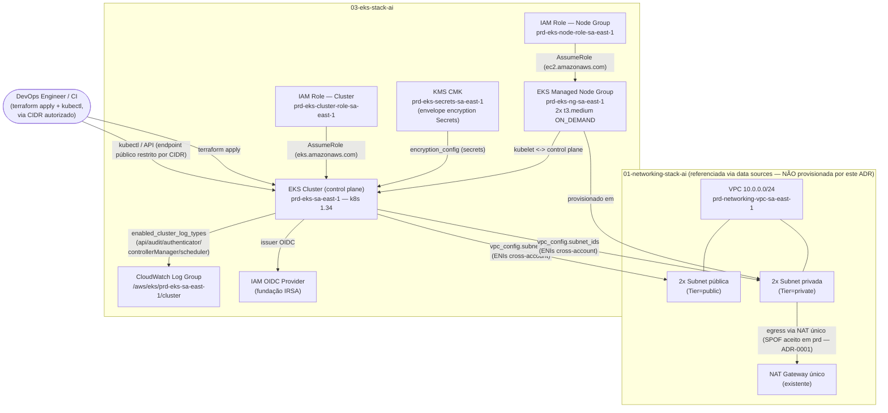

# ADR-0003: Stack de Cluster EKS (`03-eks-stack-ai`)

- **Status:** Approved
- **Data:** 2026-08-28
- **Autor:** Planner Agent
- **Supersedes:** N/A
- **Ambiente:** `prd` (ambiente único do projeto — herdado do ADR-0001 Revisão 5 e do ADR-0002; não há `dev`/`hml` em nenhuma stack deste repositório)
- **Região AWS:** `sa-east-1` (São Paulo) — mesma conta/região das stacks `00-` e `01-`

---

## 1. Contexto e Problema

O repositório já possui uma stack de bootstrap de backend remoto (`00-bootstrap-stack-ai`, ADR-0002) e uma stack de rede fundacional (`01-networking-stack-ai`, ADR-0001 — VPC `10.0.0.0/24`, 2 sub-redes públicas e 2 privadas em `sa-east-1a`/`sa-east-1b`, NAT Gateway único). Nenhuma stack de compute/containers existe ainda — a Seção 14 (Non-goals) do ADR-0001 já registrava explicitamente "Provisionamento de recursos de compute/containers/aplicação... objeto de uma futura stack (ex.: `02-compute-stack`)".

O requisito de negócio explícito desta ADR é provisionar um cluster **Amazon EKS** via Terraform, em uma nova stack `03-eks-stack-ai`, com:

- Boas práticas de EKS (o pedido não lista quais especificamente — este ADR interpreta e declara essa lacuna nas Premissas e nas Seções 4/8).
- 2 worker nodes.
- Instâncias `t3.medium`.
- `capacity_type = "ON_DEMAND"` (explicitamente, não Spot).
- Logs do control plane habilitados (CloudWatch Logs).

Diferente de `01-`/`00-`, esta stack introduz um problema novo para o repositório: **dependência entre stacks**. O cluster EKS precisa da VPC e das sub-redes já provisionadas por `01-networking-stack-ai`, mas essa stack (a) ainda está com backend **local** (`override.tf` presente, confirmado nesta sessão — nenhuma migração para o bucket S3 do ADR-0002 ocorreu) e (b) o próprio bucket do ADR-0002 está com `Status: Proposed` no cabeçalho do documento, mesmo havendo commit de implementação (`00-bootstrap-stack-ai` existe em código). Este ADR trata essa incerteza de forma explícita na Seção 4 (decisão D4) em vez de assumir silenciosamente que um mecanismo de `terraform_remote_state` está disponível.

Este ADR cobre exclusivamente o provisionamento do cluster, seu node group gerenciado e a fundação de IAM/observabilidade associada — não cobre deploy de aplicações, add-ons de terceiros (ALB Controller, Karpenter, ArgoCD etc.) nem IRSA por workload (Seção 14).

## 2. Drivers de Decisão

**Requisitos funcionais (explícitos do solicitante)**
- Cluster EKS via Terraform, seguindo boas práticas.
- Managed Node Group com exatamente 2 worker nodes.
- Instâncias `t3.medium`.
- `capacity_type = "ON_DEMAND"`.
- Control plane logging habilitado, com destino CloudWatch Logs.

**Requisitos funcionais adicionais (derivados de "boas práticas", decisão do arquiteto — ver Premissas)**
- Cluster deve consumir a VPC/sub-redes já existentes de `01-networking-stack-ai`, sem duplicar rede.
- Worker nodes em sub-redes **privadas** (sem IP público), alinhado ao padrão de rede já estabelecido.
- Criptografia de Secrets do Kubernetes via envelope encryption (KMS).
- Fundação de IRSA (IAM Roles for Service Accounts) via OIDC provider, sem criar roles específicas de workload ainda.
- Least privilege em todas as IAM roles (cluster e node group), usando apenas as policies gerenciadas mínimas exigidas pela AWS.

**Requisitos não funcionais**
- Nenhum SLA/RTO/RPO formal informado (mesma lacuna já registrada no ADR-0001/0002 — tratada como Premissa, não como sinal de baixa criticidade).
- Alta disponibilidade do control plane: nativa do serviço gerenciado EKS (multi-AZ por padrão, fora do controle desta stack).
- Alta disponibilidade dos worker nodes: 2 nodes distribuídos nas 2 AZs disponíveis (`sa-east-1a`/`sa-east-1b`), via sub-redes privadas já existentes.

**Restrições**
- Ambiente único `prd` (herdado do ADR-0001 Revisão 5) — sem `dev`/`hml` para pré-validar mudanças de cluster antes de produção.
- Mesma convenção de nomenclatura de arquivos/identificadores (`.claude/rules/terraform-naming-conventions.md`) das stacks `00-`/`01-`.
- Sem orçamento numérico informado; assume-se sensibilidade a custo, na mesma linha das duas ADRs anteriores.
- Sem framework de compliance informado (LGPD/PCI/HIPAA/SOC2).
- `01-networking-stack-ai` está com backend local (não migrado para S3) — impacta diretamente o mecanismo de consumo de outputs (Seção 4, decisão D4).

**Objetivos estratégicos**
- Estabelecer a primeira stack de compute/containers do repositório, servindo de base para futuras stacks de workload (`04-...`).
- Manter o padrão de recursos nativos `hashicorp/aws` já usado em `00-`/`01-`, avaliando explicitamente (não ignorando) a alternativa de módulo comunitário consagrado, dado que EKS é mais complexo que VPC/S3.
- Preparar o cluster para IRSA sem acoplar esta ADR a workloads/add-ons específicos ainda não definidos.

## 3. Premissas (Assumptions)

Como nem todo o checklist de discovery foi respondido explicitamente pelo solicitante, as premissas abaixo foram adotadas conscientemente pelo arquiteto, priorizando não travar o trabalho. Devem ser validadas/contestadas antes da implementação.

1. **Ambiente:** `prd`, único ambiente do projeto — mesmo padrão de `00-`/`01-`. Sem `variable "environment"`; `local.environment = "prd"` fixo.
2. **Região:** `sa-east-1`, mesma conta/região de `00-`/`01-`. `t3.medium` confirmado disponível em `sa-east-1` via `aws-mcp` (`ec2:DescribeInstanceTypeOfferings`, validado nesta sessão).
3. **"Boas práticas de EKS" não foi detalhado pelo solicitante.** O arquiteto interpretou esse requisito, à luz do [AWS EKS Best Practices Guide](https://docs.aws.amazon.com/eks/latest/best-practices/introduction.html) (validado via `aws-mcp`), como: control plane logging completo (5 tipos), envelope encryption de Secrets via KMS, IAM least-privilege com policies gerenciadas oficiais, worker nodes em sub-redes privadas, node auto repair habilitado, e fundação de IRSA (OIDC provider) — sem, no entanto, expandir o escopo para add-ons de terceiros (ALB Controller, Cluster Autoscaler/Karpenter, CSI drivers) ou observabilidade além do control plane logging solicitado. Ver Seção 14.
4. **Versão do Kubernetes:** nenhuma foi solicitada explicitamente. Validado via `aws-mcp` (doc "Understand the Kubernetes version lifecycle on EKS", consultada em 2026-08-28): em standard support hoje estão `1.36`, `1.35`, `1.34`; em extended support `1.33`, `1.32`, `1.31`. **Decisão do arquiteto:** `1.34` (released outubro/2025, fim do standard support em dezembro/2026) — versão com maturidade de produção (não é a mais recente, `1.36`, lançada há poucos meses) e com runway de suporte padrão superior a um ano a partir desta data, evitando tanto o risco de uma versão recém-lançada quanto uma migração de suporte estendido precoce. Ver Seção 4, decisão D1.
5. **Módulo Terraform vs. recursos nativos:** validado via `terraform-mcp` que `terraform-aws-modules/eks/aws` (v`21.25.0`, >173M downloads) é o módulo comunitário de referência para EKS. **Decisão do arquiteto:** manter o padrão já estabelecido em `00-`/`01-` (recursos nativos `hashicorp/aws`, sem módulos de terceiros), por consistência de convenção do repositório — mesmo reconhecendo que EKS é sensivelmente mais complexo que VPC/S3 e que o módulo automatizaria parte dessa complexidade. Ver Seção 4 para o trade-off explícito.
6. **Mecanismo de consumo dos outputs de `01-networking-stack-ai`:** como `01-` está confirmadamente com backend **local** (`override.tf` presente, sem migração para o bucket do ADR-0002) nesta data, **não** é seguro nem portável usar `terraform_remote_state` apontando para um arquivo de state local de outra stack (caminho de arquivo frágil, não funciona em CI/outra máquina, e quebra silenciosamente quando `01-` migrar de backend). **Decisão do arquiteto:** esta stack consome a VPC/sub-redes de `01-` via **data sources nativos filtrados por tag** (`data.aws_vpc`, `data.aws_subnets`, filtrando por `tag:StackName = "01-networking-stack-ai"` e `tag:Tier`), não via `terraform_remote_state`. Ver Seção 4, decisão D4, para as alternativas descartadas e o trade-off.
7. **Acesso ao endpoint da API do cluster:** nenhum CIDR de escritório/VPN/CI foi informado. **Decisão do arquiteto:** endpoint público + privado (`endpoint_public_access = true`, `endpoint_private_access = true`), com `public_access_cidrs` como variável **obrigatória, sem default e com validação que rejeita `0.0.0.0/0`** — o solicitante/operador deve fornecer o(s) CIDR(s) reais antes do primeiro `apply`. Ver Seção 4, decisão D2, e Seção 8.
8. **Envelope encryption de Secrets via KMS:** decisão do arquiteto de incluir uma CMK dedicada (`aws_kms_key`) para `encryption_config` do cluster, mesmo sem requisito de compliance explícito — diferente da decisão equivalente do ADR-0002 (que descartou SSE-KMS para o bucket de state por falta de driver de compliance), aqui o dado protegido são Secrets do Kubernetes que hospedarão credenciais de aplicação futuras, um risco de exposição mais direto e específico do que o `.tfstate`. Ver Seção 4, decisão D3.
9. **IRSA (IAM Roles for Service Accounts):** decisão do arquiteto de criar a fundação (`aws_iam_openid_connect_provider`) nesta ADR — é um recurso de baixo custo/risco, idempotente, e evita uma atualização futura do cluster só para habilitar OIDC. **Não** cria nenhuma IAM Role específica de workload/service account — isso depende de workloads ainda não definidos e é tratado como Non-goal (Seção 14). Confirmado via `terraform-mcp` (`aws_iam_openid_connect_provider`, provider `6.62.0`) que `thumbprint_list` é **opcional** — a IAM resolve automaticamente o thumbprint para o issuer do EKS, eliminando a necessidade de um provider adicional (`hashicorp/tls`) só para calculá-lo. Isso mantém a stack restrita ao provider `hashicorp/aws`, consistente com `00-`/`01-`.
10. **Tags de descoberta de sub-rede para AWS Load Balancer Controller** (`kubernetes.io/role/elb` / `kubernetes.io/role/internal-elb`) **não existem** nas sub-redes de `01-networking-stack-ai` hoje (confirmado por leitura de `vpc.public-subnets.tf`/`vpc.private-subnets.tf`) e **não são adicionadas por esta ADR** — adicioná-las exigiria uma revisão da stack `01-` (fora do escopo desta ADR, que não deve alterar `01-networking-stack-ai`). Tratado como risco/Non-goal explícito (Seções 11/14): provisionar um Load Balancer a partir deste cluster (ex.: via AWS Load Balancer Controller) exigirá essa tag mais tarde.
11. **Nome lógico do projeto:** `project_name = "eks"` para esta stack (paralelo a `"networking"`/`"bootstrap"` das stacks anteriores).
12. **Tags `Owner`/`CostCenter`:** ainda não definidas pelo solicitante; usam os mesmos placeholders `"AJUSTAR-..."` já em uso em `00-`/`01-`.
13. **Add-ons do cluster (VPC CNI, CoreDNS, kube-proxy, EBS CSI):** esta ADR mantém o comportamento padrão do EKS (`bootstrap_self_managed_addons = true`, valor default do provider), sem gerenciar add-ons via `aws_eks_addon` nesta revisão — tratado como Non-goal (Seção 14), dado que o pedido original não solicitou gestão de add-ons.
14. **Fargate Profiles / EKS Auto Mode:** fora de escopo — o pedido explícito é por Managed Node Group EC2 (`ON_DEMAND`, `t3.medium`), não por EKS Auto Mode ou Fargate.
15. **Acesso administrativo inicial ao cluster:** assume-se `access_config.authentication_mode = "API"` com `bootstrap_cluster_creator_admin_permissions = true` (quem aplica o Terraform recebe acesso administrativo via IAM, modelo de Access Entries — API nativa do EKS, validado via `terraform-mcp`), em vez do `aws-auth` ConfigMap legado (`CONFIG_MAP`), por ser o modelo mais atual e recomendado pela AWS. Concessão de acesso a outros usuários/times via `aws_eks_access_entry` é tratada como Non-goal (Seção 14) — depende de quais times/usuários precisarão de acesso, informação não fornecida.
16. **Estado atual:** greenfield — nenhum cluster EKS real foi criado ainda nesta conta para esta stack (não verificável exaustivamente via `aws-mcp` nesta sessão de planejamento sem uma varredura completa da conta; a pré-checagem formal fica no passo 0 da Seção 13.1, a cargo do `devops-engineer`).

## 4. Opções Consideradas

### Estrutura de código — Opção A: recursos nativos `hashicorp/aws` organizados por domínio *(ESCOLHIDA)*

- **Descrição:** mesma abordagem de `00-`/`01-` — `aws_eks_cluster`, `aws_eks_node_group`, `aws_iam_role`, `aws_iam_openid_connect_provider`, `aws_kms_key`, `aws_cloudwatch_log_group`, distribuídos em arquivos `.tf` por sub-domínio (`eks.tf`, `eks.cluster-iam.tf`, `eks.node-iam.tf`, `eks.node-group.tf`, `eks.oidc.tf`, `eks.encryption.tf`, `eks.logging.tf`).
- **Prós:** consistência total com o padrão já estabelecido no repositório; cada recurso IAM/rede é auditável linha a linha (relevante para um recurso que concede acesso a toda a conta via `AmazonEKSClusterPolicy`/`AmazonEKSWorkerNodePolicy`); nenhuma dependência de versão de módulo externo a rastrear/atualizar.
- **Contras:** mais código boilerplate do que usar o módulo (IAM roles, políticas, thumbprint de OIDC, cálculo de nomes de log group — tudo escrito manualmente); maior superfície de erro de configuração em um recurso mais complexo que VPC/S3 (ex.: esquecer um `depends_on` entre a policy attachment e o cluster, causando falha de destruição).
- **Custo estimado:** idêntico à Opção B — infraestrutura provisionada é a mesma; a diferença é só de código.

### Estrutura de código — Opção B: módulo comunitário `terraform-aws-modules/eks/aws`

- **Descrição:** usar o módulo `terraform-aws-modules/eks/aws` (v`21.25.0`, validado via `terraform-mcp`) para provisionar cluster, node group, IAM roles e OIDC provider.
- **Prós:** reduz drasticamente o código a escrever; o módulo já encapsula best practices (incluindo cálculo correto de thumbprint/OIDC, tags de descoberta de sub-rede, IRSA helpers) testadas por uma base de usuários muito maior (>173M downloads); atualizações de segurança do módulo chegam via bump de versão.
- **Contras:** quebra a restrição de "apenas recursos nativos" mantida em `00-`/`01-` (Premissa 11 do ADR-0001, herdada nas duas ADRs seguintes) — não há indicação do solicitante de que essa restrição deveria mudar para esta stack; introduz uma dependência de versão de terceiro a fixar/atualizar; reduz a granularidade de revisão por pares (um `module` block esconde a criação de dezenas de recursos atrás de uma única declaração, dificultando revisar exatamente qual IAM policy é anexada a qual role sem ler o código-fonte do módulo).
- **Custo estimado:** idêntico à Opção A.

**Decisão:** Opção A, por consistência com a convenção já estabelecida nas duas ADRs anteriores deste repositório e por manter auditabilidade linha a linha de um recurso que concede permissões amplas de IAM. Reavaliar para Opção B se o repositório decidir, em uma revisão de convenção própria (fora do escopo desta ADR), abrir mão da restrição a recursos nativos para stacks de maior complexidade.

---

### D1 — Versão do Kubernetes

#### Opção A — `1.34` *(ESCOLHIDA)*
- **Descrição:** `version = "1.34"` no `aws_eks_cluster`. Standard support até dezembro/2026 (validado via `aws-mcp`).
- **Prós:** versão madura (release outubro/2025, ~10 meses de produção real na comunidade até a data desta ADR); runway de standard support superior a um ano a partir de hoje; compatível com `ami_type = "AL2023_x86_64_STANDARD"`.
- **Contras:** não é a versão mais recente (`1.36`); upgrade para versões futuras será necessário antes de dezembro/2026.
- **Custo estimado:** idêntico às demais opções (preço do control plane EKS não varia por versão).

#### Opção B — `1.36` (mais recente em standard support)
- **Descrição:** `version = "1.36"`.
- **Prós:** maior janela de suporte antes do fim do standard support (agosto/2027); acesso a features mais recentes do Kubernetes.
- **Contras:** lançada há menos de 3 meses da data desta ADR — menor maturidade em produção na comunidade; maior probabilidade de bugs de platform version ainda sendo corrigidos (ver histórico de platform versions descartadas internamente, documentado pela AWS).
- **Custo estimado:** idêntico.

#### Opção C — `1.33` (extended support)
- **Descrição:** `version = "1.33"`.
- **Prós:** ainda mais madura que `1.34`.
- **Contras:** já em extended support (fim do standard support em julho/2026, já vencido nesta data) — usar uma versão já fora do standard support para um cluster novo não é boa prática, mesmo sendo tecnicamente permitido.
- **Custo estimado:** extended support tem custo adicional por hora de cluster (não quantificado nesta ADR, pois a opção não foi escolhida).

**Decisão:** Opção A (`1.34`). Equilíbrio entre maturidade e runway de suporte, evitando tanto uma versão recém-lançada quanto uma já em extended support para um cluster novo.

---

### D2 — Acesso ao endpoint da API do cluster

#### Opção A — Público + Privado, com `public_access_cidrs` restrito *(ESCOLHIDA)*
- **Descrição:** `endpoint_private_access = true`, `endpoint_public_access = true`, `public_access_cidrs` como variável obrigatória (sem default), com `validation` rejeitando `0.0.0.0/0`.
- **Prós:** alinhado à recomendação do [EKS Best Practices Guide — Identity and Access Management](https://docs.aws.amazon.com/eks/latest/best-practices/identity-and-access-management.html) (validado via `aws-mcp`: "we recommend configuring cluster endpoint in public and private mode... strongly recommend limiting the CIDR blocks"); tráfego nó-a-control-plane permanece na VPC (via acesso privado); não exige infraestrutura adicional (bastion/VPN) para o `devops-engineer` operar `kubectl` a partir de fora da VPC.
- **Contras:** superfície de ataque tecnicamente maior que privado-apenas (mesmo restrita por CIDR); depende de o operador fornecer o CIDR correto antes do `apply` — se não fornecido, o `terraform plan`/`apply` falha por design (guardrail intencional, não um bug).
- **Custo estimado:** USD 0 adicional.

#### Opção B — Somente privado (`endpoint_public_access = false`)
- **Descrição:** `endpoint_private_access = true`, `endpoint_public_access = false`.
- **Prós:** maior isolamento — elimina completamente a exposição do endpoint à internet; alinhado à recomendação do guia para cenários que "precisam de segurança e isolamento de rede".
- **Contras:** exige que qualquer `kubectl`/`terraform apply` subsequente (para o próprio `aws_eks_cluster`/`aws_eks_node_group`, que não dependem do endpoint K8s, mas para validação pós-deploy via `kubectl`/manifests futuros, sim) rode de dentro da VPC — o repositório não possui hoje nenhum bastion host, Cloud9, VPN ou SSM Session Manager provisionado para viabilizar isso; provisionar esse acesso está fora do escopo desta ADR.
- **Custo estimado:** USD 0 adicional de infraestrutura EKS, mas custo de oportunidade real (exigiria uma ADR/stack adicional de acesso administrativo antes de o cluster ser operável).

#### Opção C — Somente público, sem restrição de CIDR (`public_access_cidrs = ["0.0.0.0/0"]`, default do EKS)
- **Descrição:** manter o comportamento default do EKS se `public_access_cidrs` não for informado.
- **Prós:** nenhuma configuração adicional necessária; acesso simples de qualquer lugar.
- **Contras:** viola diretamente o guardrail de segurança deste projeto (nunca expor sem restrição de origem); contraria a recomendação explícita da AWS. **Descartada sem ambiguidade.**
- **Custo estimado:** USD 0.

**Decisão:** Opção A. Resolve o requisito operacional (o `devops-engineer` provavelmente não roda de dentro da VPC) sem violar least-privilege, transferindo a decisão de "qual CIDR" para um input explícito e obrigatório em vez de um default perigoso.

---

### D3 — Envelope encryption de Secrets do Kubernetes via KMS

#### Opção A — CMK dedicada via `encryption_config` *(ESCOLHIDA)*
- **Descrição:** `aws_kms_key` (rotação anual habilitada) + `aws_kms_alias`, referenciada em `aws_eks_cluster.encryption_config { resources = ["secrets"] }`.
- **Prós:** Secrets do Kubernetes (que hospedarão credenciais de aplicações futuras) ganham uma segunda camada de criptografia além da criptografia de disco do etcd gerenciado pela AWS; trilha de auditoria via CloudTrail (`kms:Decrypt`/`GenerateDataKey`) de quem acessou Secrets; alinhado à recomendação de segurança do EKS Best Practices Guide.
- **Contras:** custo adicional (~USD 1/mês pela CMK + chamadas de API); `encryption_config` só pode ser definido na criação do cluster — se decidido depois, exige recriação do cluster (não é aplicável in-place a um cluster já existente sem esse bloco).
- **Custo estimado:** ~USD 1-2/mês.

#### Opção B — Sem envelope encryption adicional (apenas criptografia de etcd gerenciada pela AWS)
- **Descrição:** omitir `encryption_config`.
- **Prós:** sem custo adicional; sem gestão de uma CMK extra.
- **Contras:** Secrets ficam protegidos apenas pela criptografia de disco padrão do control plane gerenciado (que a AWS já aplica de qualquer forma) — sem uma segunda camada nem trilha de auditoria de acesso via KMS; diverge da recomendação de segurança do EKS Best Practices Guide para clusters de produção.
- **Custo estimado:** USD 0.

**Decisão:** Opção A. Diferente da decisão equivalente do ADR-0002 (SSE-S3 sem CMK para o bucket de state), aqui o dado protegido (Secrets do Kubernetes) tem uma superfície de risco mais direta e específica de aplicação — o custo marginal (~USD 1-2/mês) é desprezível frente ao restante da stack (Seção 10) e frente ao benefício de segurança. Como `encryption_config` não pode ser adicionado depois sem recriar o cluster, é uma decisão que vale mais a pena acertar já na criação do que reverter/adicionar depois via ADR sucessor.

---

### D4 — Mecanismo de consumo dos outputs de `01-networking-stack-ai`

#### Opção A — Data sources nativos filtrados por tag (`aws_vpc`, `aws_subnets`) *(ESCOLHIDA)*
- **Descrição:** `data "aws_vpc" "networking" { filter { name = "tag:StackName" ... } filter { name = "tag:Environment" ... } }` + `data "aws_subnets" "private"`/`"public"` filtrando adicionalmente por `tag:Tier`.
- **Prós:** **totalmente desacoplado de onde/como o state de `01-` é armazenado** — funciona hoje (backend local de `01-`) e continua funcionando sem nenhuma mudança de código quando `01-` migrar para o backend S3 do ADR-0002 (migração essa que é Non-goal de ambas as ADRs anteriores, Seção 14); não exige acesso de leitura ao backend/state de outra stack (menor superfície de permissão IAM: só precisa de `ec2:DescribeVpcs`/`DescribeSubnets`, não de `s3:GetObject` no bucket de state alheio); resiliente a reorganizações futuras de como `01-` é aplicada (local, CI, engenheiro diferente).
- **Contras:** depende da estabilidade do esquema de tags de `01-` (`StackName`, `Environment`, `Tier`) — se essas tags forem renomeadas/removidas em uma revisão futura de `01-`, esta stack quebra silenciosamente até o próximo `plan` (mitigação: `01-` já trata essas tags como parte de `common_tags`, presente em 100% dos recursos, com baixa probabilidade de remoção); não obtém tipagem forte de outputs (ex.: não há um `nat_gateway_ids` equivalente via data source — mas esta stack não precisa desse output específico).
- **Custo estimado:** USD 0 adicional.

#### Opção B — `terraform_remote_state` apontando para o backend **local** de `01-` (caminho de arquivo relativo)
- **Descrição:** `data "terraform_remote_state" "networking" { backend = "local", config = { path = "../01-networking-stack-ai/terraform.tfstate" } }`.
- **Prós:** acesso tipado direto aos outputs já definidos em `01-networking-stack-ai/outputs.tf` (`vpc_id`, `private_subnets_ids` etc.), sem redigitar lógica de filtro.
- **Contras:** **frágil e não portátil** — só funciona se ambas as stacks estiverem checked out lado a lado no mesmo filesystem (quebra em CI com checkouts isolados, ou em uma máquina de engenheiro diferente sem `01-` clonado no mesmo nível); quebra silenciosamente (sem erro claro) no dia em que `01-` migrar seu backend para S3 (ação já prevista como tarefa futura em ambas as ADRs anteriores) — exigiria uma edição coordenada desta stack no mesmo momento da migração de `01-`, criando acoplamento de deploy entre stacks que hoje são independentes.
- **Custo estimado:** USD 0.

#### Opção C — `terraform_remote_state` apontando para o backend S3 (assumindo migração futura de `01-` já concluída)
- **Descrição:** `data "terraform_remote_state" "networking" { backend = "s3", config = { bucket = ..., key = "01-networking-stack-ai/prd/terraform.tfstate", region = "sa-east-1" } }`.
- **Prós:** seria a opção mais "correta" em um estado final onde todas as stacks já usam backend remoto — outputs tipados, sem dependência de tags.
- **Contras:** **não aplicável hoje** — `01-networking-stack-ai` está confirmadamente com `override.tf` (backend local) nesta sessão; codificar essa opção agora faria `terraform init`/`plan` desta stack falhar imediatamente (o objeto S3 referenciado não existe, pois `01-` nunca escreveu seu state lá).
- **Custo estimado:** USD 0.

**Decisão:** Opção A. É a única alternativa que funciona corretamente **tanto hoje quanto após uma futura migração de backend de `01-`**, sem exigir uma edição coordenada desta stack quando aquela migração (fora do escopo de ambas as ADRs anteriores) eventualmente acontecer. Reavaliar para Opção C **apenas** se, no futuro, o repositório adotar uma convenção deliberada de outputs tipados entre stacks via backend remoto compartilhado — uma decisão de convenção de repositório, não desta ADR isoladamente.

## 5. Decisão

**Combinação escolhida:** recursos nativos `hashicorp/aws` (`~> 6.0`, testado com `6.62.0`) organizados por domínio (Opção A da estrutura de código) + Kubernetes `1.34` (D1, Opção A) + endpoint público/privado com CIDR restrito obrigatório (D2, Opção A) + envelope encryption de Secrets via CMK dedicada (D3, Opção A) + consumo da VPC/sub-redes de `01-networking-stack-ai` via data sources filtrados por tag (D4, Opção A).

Justificativa consolidada, referenciando os drivers da Seção 2: a combinação atende integralmente aos 4 requisitos funcionais explícitos do solicitante (cluster EKS, 2 workers `t3.medium`, `ON_DEMAND`, control plane logging), interpreta "boas práticas" de forma explícita e documentada (Premissa 3) sem expandir para add-ons/observabilidade não solicitados, mantém a stack **desacoplada** do estado de migração de backend de `01-` (o risco mais concreto e específico deste ADR, dado que é a primeira stack do repositório a depender de outra), e resolve o único ponto realmente ambíguo deixado ao critério do arquiteto (acesso ao endpoint da API) com uma opção que não trava a operação nem viola least-privilege por default.

## 6. Arquitetura Proposta

### 6.1 Diagrama

> Diagrama editável equivalente, com fluxo "vivo" (setas animadas), gerado em `docs/diagramas/ADR-0003-eks-stack.drawio` — ver seção **DIAGRAMA DRAW.IO**.

> Nota: `VPC`, `PubSub`, `PrivSub` e `NAT` representam recursos **já existentes**, provisionados por `01-networking-stack-ai` (ADR-0001) e **consumidos** por esta stack via data sources (Seção 4, decisão D4) — não são criados/modificados por este ADR. Incluídos no diagrama apenas para deixar explícito o fluxo de dependência entre stacks.

### 6.2 Recursos AWS

| Recurso | Tipo (Terraform) | Nome lógico | Região | Observações |
|---|---|---|---|---|
| IAM Role — Cluster | `aws_iam_role` | `prd-eks-cluster-role-sa-east-1` | sa-east-1 | Trust policy `eks.amazonaws.com` (`sts:AssumeRole`, `sts:TagSession`). Policy gerenciada `AmazonEKSClusterPolicy` anexada via `aws_iam_role_policy_attachment`. |
| IAM Role — Node Group | `aws_iam_role` | `prd-eks-node-role-sa-east-1` | sa-east-1 | Trust policy `ec2.amazonaws.com`. Policies gerenciadas `AmazonEKSWorkerNodePolicy`, `AmazonEKS_CNI_Policy`, `AmazonEC2ContainerRegistryReadOnly` anexadas via `aws_iam_role_policy_attachment` (3 recursos). |
| KMS Key (Secrets) | `aws_kms_key` | `prd-eks-secrets-sa-east-1` | sa-east-1 | CMK simétrica, `enable_key_rotation = true`, `deletion_window_in_days` parametrizável (default sugerido 30). Usada em `encryption_config.provider.key_arn` do cluster (Seção 4, D3). |
| KMS Alias | `aws_kms_alias` | `alias/prd-eks-secrets-sa-east-1` | sa-east-1 | Alias legível para a CMK acima. |
| CloudWatch Log Group | `aws_cloudwatch_log_group` | `/aws/eks/prd-eks-sa-east-1/cluster` | sa-east-1 | Nome **fixo**, exigido pela integração nativa do EKS control plane logging (não é escolha livre). Retenção parametrizável (default sugerido 90 dias). Criado **antes** do cluster para controlar a retenção desde o primeiro log (evitar retenção "never expire" default da AWS). |
| EKS Cluster | `aws_eks_cluster` | `prd-eks-sa-east-1` | sa-east-1 | `version = "1.34"`; `vpc_config.subnet_ids` = 2 públicas + 2 privadas (via data source, Seção 4/D4); `endpoint_private_access = true`, `endpoint_public_access = true`, `public_access_cidrs = var.eks_cluster.endpoint_public_access_cidrs` (obrigatório); `enabled_cluster_log_types` = `["api","audit","authenticator","controllerManager","scheduler"]`; `encryption_config` apontando para a CMK; `access_config.authentication_mode = "API"`. |
| IAM OIDC Provider | `aws_iam_openid_connect_provider` | tag `Name = prd-eks-oidc-sa-east-1` | Global (IAM) | `url = aws_eks_cluster.this.identity[0].oidc[0].issuer`; `client_id_list = ["sts.amazonaws.com"]`; **sem** `thumbprint_list` — IAM resolve automaticamente (validado via `terraform-mcp`, provider `6.62.0`). Fundação para IRSA futura (Seção 3, Premissa 9); nenhuma role de workload é criada nesta ADR. |
| EKS Managed Node Group | `aws_eks_node_group` | `prd-eks-ng-sa-east-1` | sa-east-1 | `subnet_ids` = 2 sub-redes **privadas** (via data source); `capacity_type = "ON_DEMAND"`; `instance_types = ["t3.medium"]`; `ami_type = "AL2023_x86_64_STANDARD"`; `scaling_config = { desired_size = 2, min_size = 2, max_size = 3 }` (headroom de 1 nó acima do desejado para rolling update/rebalanceamento de AZ, sem alterar a contagem operacional de 2 workers solicitada); `update_config.max_unavailable = 1`; `node_repair_config.enabled = true`. |
| Data source — VPC | `data.aws_vpc` | — | sa-east-1 | Filtra por `tag:StackName = "01-networking-stack-ai"` + `tag:Environment = "prd"`. **Não provisionado por este ADR.** |
| Data source — Subnets privadas | `data.aws_subnets` | — | sa-east-1 | Filtra por `vpc_id` (acima) + `tag:Tier = "private"` + `tag:StackName = "01-networking-stack-ai"`. **Não provisionado por este ADR.** |
| Data source — Subnets públicas | `data.aws_subnets` | — | sa-east-1 | Filtra por `vpc_id` (acima) + `tag:Tier = "public"` + `tag:StackName = "01-networking-stack-ai"`. **Não provisionado por este ADR.** |
| Data source — Account ID | `data.aws_caller_identity` | `current` | sa-east-1 | Usado apenas se necessário para ARNs explícitos em políticas (ex.: condição `aws:PrincipalAccount`, se aplicável em hardening futuro); não estritamente necessário para o escopo mínimo desta ADR. |

### 6.3 Módulos Terraform Recomendados

> Nenhum módulo Terraform de terceiros/comunidade é utilizado — apenas recursos/data sources nativos do provider `hashicorp/aws`, mesma restrição de `00-`/`01-` (Seção 4, decisão de estrutura de código). O módulo comunitário `terraform-aws-modules/eks/aws` (`21.25.0`) foi avaliado e descartado — ver Seção 4.

| Módulo/Provider | Versão (pinned) | Finalidade |
|---|---|---|
| `hashicorp/aws` (provider) | `~> 6.0` (testado com `6.62.0`, validado via `terraform-mcp get_latest_provider_version` em 2026-08-28, mesma constraint já usada em `00-`/`01-`) | Provider AWS oficial para todos os recursos/data sources nativos da stack, incluindo `aws_eks_cluster`, `aws_eks_node_group` e `aws_iam_openid_connect_provider` (validados via `terraform-mcp get_provider_details`). |
| Terraform CLI (`required_version`) | `>= 1.15.8` | Mesmo floor já adotado em `00-`/`01-`, para consistência de ferramental entre stacks do repositório. |

## 7. Avaliação Well-Architected

| Pilar | Como a decisão endereça |
|---|---|
| **Operational Excellence** | `node_repair_config.enabled = true` automatiza a substituição de nós não saudáveis; `update_config.max_unavailable = 1` limita o blast radius de atualizações de node group; outputs padronizados (Seção 13.2) preparam o terreno para stacks de workload futuras consumirem este cluster da mesma forma desacoplada (Seção 4, D4) que esta stack consome `01-`. Ausência de ambiente inferior (`dev`/`hml`) para pré-validar mudanças de cluster é um risco herdado e explícito (Seção 11), não uma omissão. |
| **Security** | IAM least-privilege (apenas policies gerenciadas oficiais mínimas, nenhum `*`/`Resource: "*"` customizado); envelope encryption de Secrets via CMK dedicada (D3); endpoint da API restrito por CIDR obrigatório, nunca `0.0.0.0/0` (D2); worker nodes em sub-redes privadas, sem IP público; control plane logging completo (5 tipos) para auditoria; fundação IRSA (OIDC) disponível para eliminar, no futuro, a necessidade de credenciais de longa duração em pods. |
| **Reliability** | Control plane EKS é multi-AZ nativamente (gerenciado pela AWS); node group distribuído nas 2 AZs disponíveis via as 2 sub-redes privadas de `01-`; `max_size = 3` (acima do `desired_size = 2`) permite rolling update sem indisponibilidade completa. **Herdado de `01-` (fora do controle desta ADR):** o NAT Gateway único (SPOF aceito em produção, ADR-0001 Premissa 14) é o caminho de egress de todo o tráfego de saída dos nodes (pull de imagens de container, chamadas a APIs AWS) — uma falha do NAT afeta diretamente a capacidade dos nodes desta stack de funcionar corretamente, não apenas a rede genérica. |
| **Performance Efficiency** | `t3.medium` é adequado para uma carga inicial/baixa (2 vCPU burstable, 4 GiB RAM) — requisito explícito do solicitante, não uma escolha de performance desta ADR; `AL2023_x86_64_STANDARD` é a AMI otimizada mais atual recomendada pela AWS para novos node groups. |
| **Cost Optimization** | `capacity_type = "ON_DEMAND"` foi um requisito explícito do solicitante (não Spot) — sem otimização de custo via Spot nesta ADR, por decisão consciente e informada do solicitante, não uma omissão do arquiteto. `desired_size = 2` fixo (sem autoscaling horizontal de nodes/Cluster Autoscaler/Karpenter nesta ADR — Non-goal, Seção 14) evita custo variável não solicitado. |
| **Sustainability** | Reaproveita 100% a infraestrutura de rede já existente (`01-networking-stack-ai`) em vez de provisionar uma VPC dedicada para o cluster — reduz duplicação de recursos de rede (IGW, NAT, sub-redes) que seria necessária em uma arquitetura de VPC isolada por serviço. |

## 8. Segurança

- **IAM:** duas roles distintas com least-privilege — Cluster (`AmazonEKSClusterPolicy` apenas) e Node Group (`AmazonEKSWorkerNodePolicy`, `AmazonEKS_CNI_Policy`, `AmazonEC2ContainerRegistryReadOnly` apenas, todas policies gerenciadas oficiais da AWS, nenhuma policy customizada com `Resource: "*"`). Acesso administrativo inicial ao cluster via Access Entries nativos do EKS (`access_config.authentication_mode = "API"`), não via `aws-auth` ConfigMap legado. Concessão de acesso a outros usuários/times (`aws_eks_access_entry` adicionais) é Non-goal (Seção 14, Premissa 15).
- **Criptografia em repouso:** Secrets do Kubernetes protegidos por envelope encryption via CMK dedicada (`aws_kms_key`, rotação anual habilitada) — Seção 4, D3. Volumes EBS dos worker nodes usam a criptografia padrão gerenciada pela AWS para o `ami_type` escolhido (nenhuma configuração adicional de disco customizada nesta ADR).
- **Criptografia em trânsito:** comunicação nó↔control plane via TLS nativo do EKS (gerenciado pela AWS, fora do controle desta stack). Endpoint da API acessível apenas via TLS.
- **Isolamento de rede:** worker nodes exclusivamente em sub-redes privadas (sem IP público); endpoint da API do cluster restrito a CIDRs explicitamente autorizados via `public_access_cidrs` (variável obrigatória, sem default, com `validation` que rejeita `0.0.0.0/0` — Seção 4, D2); comunicação nó↔control plane dentro da VPC via `endpoint_private_access = true`. Nenhum Security Group customizado é criado nesta ADR — usa-se o Security Group gerenciado automaticamente pelo EKS para comunicação cluster↔node group (`cluster_security_group_id`, exposto como output), reduzindo superfície de erro de configuração manual de regras.
- **Gestão de segredos:** esta stack não manipula segredos de aplicação diretamente, mas fornece a infraestrutura (envelope encryption de Kubernetes Secrets) para que workloads futuros o façam com segurança adicional. Integração com AWS Secrets Manager/Parameter Store a partir de workloads é Non-goal desta ADR (depende de workloads ainda não definidos).
- **Logging e auditoria:** control plane logging habilitado para os 5 tipos disponíveis (`api`, `audit`, `authenticator`, `controllerManager`, `scheduler`, valores validados via `terraform-mcp`/AWS CloudFormation reference), destino CloudWatch Logs, retenção parametrizável (default sugerido 90 dias — superior aos 30 dias de VPC Flow Logs em `01-`, dado o maior valor forense de logs de audit/authentication de um cluster Kubernetes de produção).
- **Backup e retenção:** o control plane do EKS não requer backup gerenciado por esta stack (estado do cluster é gerenciado pela AWS). Backup de recursos Kubernetes (etcd snapshots geridos pela AWS; backup de workloads/PVs) está fora do escopo — Non-goal (Seção 14), depende de workloads ainda não definidos.

## 9. Naming Convention & Tagging

- **Padrão de nomes:** mesmo padrão de `00-`/`01-`, `{env}-{project_name}-{service}-{region}` (ex.: `prd-eks-cluster-role-sa-east-1`). Para o nome do próprio cluster e do node group, o segmento `{service}` é omitido quando redundante com `project_name` (`prd-eks-sa-east-1` para o cluster, não `prd-eks-cluster-sa-east-1`, seguindo a regra de não repetir o tipo do recurso no nome — `.claude/rules/terraform-naming-conventions.md`, Seção 3, aplicada aqui também ao nome de negócio do recurso, não só ao identificador Terraform).
- `project_name` desta stack: `"eks"`.
- **Tags obrigatórias** (aplicadas via `default_tags` do provider + reforçadas em cada recurso, mesmo padrão de `00-`/`01-`):
  - `Environment` = `"prd"` (fixo — mesmo padrão do ADR-0001 Revisão 5/ADR-0002)
  - `Owner` (time responsável — a definir pelo solicitante; placeholder `"AJUSTAR-time-responsavel"` até lá)
  - `CostCenter` (a definir pelo solicitante; placeholder `"AJUSTAR-centro-de-custo"`)
  - `Project` = `"eks"` (`project_name`)
  - `ManagedBy` = `"terraform"`
  - `DataClassification` = `"confidential"` — o cluster hospedará Secrets/credenciais de aplicações futuras (classificação mais restritiva que `"internal"` de `01-`, na mesma lógica de `"confidential"` já usada para o bucket de state em `00-`).
  - `StackName` = `"03-eks-stack-ai"`

## 10. Custo Estimado

Estimativas em ordem de grandeza para `sa-east-1`. Valores de EC2/EKS variam por tipo de cobrança e devem ser validados no AWS Pricing Calculator antes do go-live.

| Item | Modelo de pricing | Estimativa mensal (USD) |
|---|---|---|
| EKS control plane | On-demand, por cluster/hora (~USD 0,10/h) | ~73 |
| 2x `t3.medium` ON_DEMAND (worker nodes) | On-demand por hora, `sa-east-1` (~USD 0,08–0,10/h por instância nesta região) | ~117–146 |
| 2x EBS `gp3` (disco dos nodes, `disk_size` default 20 GiB cada) | On-demand por GB-mês | ~3–5 |
| KMS CMK dedicada (Secrets) | Por chave/mês + chamadas de API | ~1–2 |
| CloudWatch Logs (5 tipos de control plane log — ingestão + armazenamento) | On-demand por GB | ~10–30 (`audit` tende a ser o mais volumoso) |
| Processamento de dados adicional via NAT Gateway (pull de imagens de container pelos nodes) | On-demand por GB, incremental sobre o baseline já estimado em `01-` | ~5–20 |
| **Total estimado** | | **~ USD 210–275** |

> Estimativa em ordem de grandeza; validar com Cost Explorer/AWS Pricing Calculator antes do go-live, especialmente o custo de instância EC2 em `sa-east-1` (histori­camente mais caro que `us-east-1`) e o volume real de logs de `audit`, que pode variar significativamente com a atividade do cluster. Este é o maior custo mensal recorrente entre as 3 stacks do repositório até o momento (`00-`: ~USD 1-3; `01-`: ~USD 55-80; `03-`: ~USD 210-275) — validar orçamento com o solicitante antes do `apply` real (Seção 13.3).

## 11. Riscos e Mitigações

| Risco | Probabilidade | Impacto | Mitigação |
|---|---|---|---|
| **Acoplamento a tags de `01-networking-stack-ai`** (Seção 4, D4): se uma revisão futura de `01-` renomear/remover as tags `StackName`/`Environment`/`Tier`, os data sources desta stack deixam de encontrar VPC/sub-redes | Baixa (tags fazem parte de `common_tags`, aplicadas uniformemente há duas ADRs) | Alto (bloqueia `plan`/`apply` desta stack e de qualquer stack futura que dependa do mesmo padrão) | `terraform plan` falha de forma clara (data source vazio/`too many results`) antes de qualquer `apply` incorreto — não é uma falha silenciosa de infraestrutura. Documentar esse acoplamento no README de `01-` como convenção a preservar (fora do escopo desta ADR editar `01-`, mas recomendado como ação de acompanhamento). |
| **Sub-redes de `01-` sem tags de descoberta para AWS Load Balancer Controller** (`kubernetes.io/role/elb`/`internal-elb`) — Premissa 10 | Alta (confirmado — tags não existem hoje) | Médio (só se manifesta quando um Load Balancer Controller for instalado no cluster, fora do escopo desta ADR) | Registrado como Non-goal explícito (Seção 14); uma stack/ADR futura de workload que precise de Ingress/LoadBalancer deverá primeiro revisar `01-networking-stack-ai` para adicionar essas tags. |
| **Endpoint público sem CIDR informado no momento do `apply`** — a variável `public_access_cidrs` não tem `default` e a validação rejeita `0.0.0.0/0` | Média (depende de o operador ter o CIDR correto em mãos) | Médio (bloqueia o `apply`, não expõe o cluster incorretamente — falha segura) | Comportamento intencional (fail-safe): `terraform plan`/`apply` falha com mensagem clara de validação até que um CIDR real seja fornecido. Documentar no Handoff (Seção 13) como pré-requisito bloqueante. |
| **NAT Gateway único herdado de `01-` (SPOF em produção, ADR-0001 Premissa 14)** agora impacta diretamente a capacidade operacional dos worker nodes (pull de imagens, chamadas a APIs AWS via IAM roles), não apenas conectividade genérica | Média (mesma probabilidade já aceita em `01-`) | Alto (indisponibilidade do NAT interrompe a capacidade dos nodes de funcionar corretamente, incluindo scale-out/replace de nodes) | Risco herdado e já aceito conscientemente em `01-` (ADR-0001 Seção 11); esta ADR **não** o reabre, apenas registra que seu impacto agora se estende ao plano de compute. Nenhuma mitigação adicional nesta ADR — reversão para NAT HA, se decidida, deve ser tratada na stack `01-` (fora de escopo aqui). |
| **`encryption_config` não pode ser adicionado a um cluster já existente sem essa configuração** — se o `devops-engineer`, por qualquer motivo, aplicar o cluster sem esse bloco e tentar adicioná-lo depois, o Terraform indicará `# forces replacement` | Baixa (configuração já presente no código desde a primeira versão, Seção 6.2) | Alto (recriação completa do cluster, incluindo o node group associado) | `terraform plan` revisado obrigatoriamente antes do primeiro `apply` (Seção 13.1) deve confirmar a presença do bloco `encryption_config` já na primeira criação. |
| **Ausência de ambiente inferior (`dev`/`hml`) para pré-validar mudanças de cluster** — herdado do padrão de ambiente único do repositório (ADR-0001 Premissa 16) | Média | Alto (um erro de configuração de cluster/node group impacta produção diretamente) | `terraform plan` revisado obrigatoriamente por pares antes de todo `apply` (mesma política já em vigor em `00-`/`01-`); recomenda-se, como evolução futura fora do escopo desta ADR, testar mudanças de cluster em uma conta/projeto sandbox separado antes de aplicar em `prd`. |
| **Custo mensal significativamente maior que `00-`/`01-`** (~USD 210-275 vs. ~USD 56-83 combinado das duas stacks anteriores) sem confirmação explícita de orçamento pelo solicitante | Média | Médio (risco financeiro, não técnico) | Estimativa de custo (Seção 10) deve ser validada/aprovada explicitamente pelo solicitante antes do `apply` real — tratado como critério de aceitação (Seção 13.3), não assumido implicitamente. |
| **Deleção acidental do cluster** (`terraform destroy`/`aws eks delete-cluster` sem intenção) | Baixa | Crítico (perda do cluster e de todos os workloads não persistidos externamente) | `deletion_protection` **não** é suportado de forma nativa e retroativa em todas as versões do provider como um simples booleano imutável — usar `lifecycle { prevent_destroy = true }` no `aws_eks_cluster` (a ser avaliado pelo `devops-engineer` na implementação) e o guardrail já vigente do agente `devops-engineer` de nunca rodar `destroy`/`delete-*` sem confirmação explícita em sessão. |

## 12. Estratégia de Rollback

- **Cenário mais provável (nenhum `apply` real ainda):** `git revert` da criação da stack `03-eks-stack-ai` e/ou simplesmente não aplicar. Nenhuma infraestrutura é afetada.
- **Mudanças incrementais pós-criação** (ex.: ajustar `desired_size`/`max_size` do node group, atualizar `public_access_cidrs`, ajustar retenção de logs): não forçam recriação do cluster — são `apply` incrementais de baixo risco, cobertos pelo `update_config` do node group (`max_unavailable = 1`, evita indisponibilidade total durante rolling update).
- **Mudanças que forçam recriação completa do cluster** (`# forces replacement` no `plan`): `version` do Kubernetes só suporta upgrade in-place na direção "para frente" (downgrades não são suportados pelo EKS — validado via `terraform-mcp`, argumento `version` do `aws_eks_cluster`); `encryption_config`, `kubernetes_network_config.service_ipv4_cidr` e `vpc_config.subnet_ids` (dependendo da mudança) também podem forçar recriação. Qualquer `plan` que indique recriação do `aws_eks_cluster` deve ser tratado como uma migração planejada, com janela de manutenção e comunicação prévia — nunca aplicado sem revisão explícita por par.
- **Rollback de upgrade de versão do Kubernetes:** o EKS suporta rollback de um upgrade in-place para a versão minor anterior dentro de 7 dias após a conclusão do upgrade (validado via `aws-mcp`, doc "Understand the Kubernetes version lifecycle on EKS") — mecanismo nativo da AWS, não do Terraform; útil como plano de contingência caso um upgrade futuro (fora do escopo desta ADR inicial) cause regressão.
- **Node Group:** pode ser destruído e recriado independentemente do cluster (não força recriação do `aws_eks_cluster`); útil para reverter uma mudança problemática de `ami_type`/`instance_types`/`capacity_type` sem impactar o control plane.
- **State:** manter `versioning` habilitado no bucket S3 do backend (quando `01-`/esta stack migrarem para ele) permite recuperar uma versão anterior do `.tfstate`. Até lá (backend local, Seção 13.1), o `.tfstate` local desta stack deve ser tratado como artefato crítico, mesma recomendação já registrada para `00-bootstrap-stack-ai`.
- **Validação pré-rollback:** sempre rodar `terraform plan` antes de qualquer `apply`/`destroy` de correção, prestando atenção especial a qualquer `# forces replacement` no `aws_eks_cluster` (recriação completa, incluindo perda de todo o histórico de add-ons/OIDC provider dependente) versus mudanças incrementais no `aws_eks_node_group`.

## 13. Handoff para DevOps Engineer Agent

> **Escopo estrito desta implementação:** apenas os recursos da Seção 6.2, na nova stack `03-eks-stack-ai/`. **Não** inclui alterar `01-networking-stack-ai/` (adicionar tags de descoberta de Load Balancer, migrar backend) nem `00-bootstrap-stack-ai/` — ambas fora do escopo (Seção 14). **Não** inclui instalar add-ons, controllers, ou fazer qualquer deploy de aplicação/manifesto Kubernetes.

### 13.1 Ordem de Implementação (respeitando dependências)

0. **Pré-checagem obrigatória:** confirmar via `aws eks list-clusters --region sa-east-1` que nenhum cluster com o nome-alvo (`prd-eks-sa-east-1`) já existe. Confirmar via `aws ec2 describe-vpcs`/`describe-subnets` (filtrando pelas tags da Seção 6.2) que a VPC e as 4 sub-redes de `01-networking-stack-ai` existem e estão em estado `available` — se `01-` ainda não tiver sido de fato aplicada (`terraform apply` real, não apenas `plan`), **parar aqui**: esta stack não pode prosseguir sem a VPC real já provisionada. **Obter confirmação explícita do solicitante sobre a estimativa de custo da Seção 10** antes de prosseguir (critério de aceitação, Seção 13.3).
1. Criar o diretório `03-eks-stack-ai/` na raiz do repositório, seguindo a estrutura de arquivos por domínio (`.claude/rules/terraform-naming-conventions.md`):
   - `main.tf` (ponto de entrada/índice)
   - `versions.tf` (`required_version = ">= 1.15.8"`; `hashicorp/aws` `~> 6.0`)
   - `providers.tf` (`provider "aws"` com `default_tags`)
   - `backend.tf` (configuração parcial S3, `use_lockfile = true` — mesmo padrão de `01-`, aguardando o mesmo bucket do ADR-0002)
   - `override.tf` (gitignored — backend local temporário, mesmo padrão hoje vigente em `01-`/`00-`)
   - `variables.tf` (variáveis agrupadas por domínio: `networking`, `eks_cluster`, `eks_secrets_encryption`, `eks_node_group` + independentes `aws_region`, `project_name`, `tags`; nenhuma declara `default` — Seção 13.2)
   - `data.tf` (`data.aws_vpc.networking`, `data.aws_subnets.private`, `data.aws_subnets.public`, `data.aws_caller_identity.current`)
   - `locals.tf` (`local.environment = "prd"`; `local.name`; `local.common_tags`)
   - `eks.cluster-iam.tf` (`aws_iam_role.cluster` + `aws_iam_role_policy_attachment.cluster_eks_cluster_policy`)
   - `eks.node-iam.tf` (`aws_iam_role.node` + 3x `aws_iam_role_policy_attachment`)
   - `eks.encryption.tf` (`aws_kms_key.secrets`, `aws_kms_alias.secrets`)
   - `eks.logging.tf` (`aws_cloudwatch_log_group.cluster`)
   - `eks.tf` (`aws_eks_cluster.this`, com `depends_on` explícito nas policy attachments do cluster — mesmo padrão do exemplo oficial do resource, validado via `terraform-mcp`)
   - `eks.oidc.tf` (`aws_iam_openid_connect_provider.this`)
   - `eks.node-group.tf` (`aws_eks_node_group.this`, com `depends_on` explícito nas 3 policy attachments do node role)
   - `outputs.tf` (Seção 13.2)
   - `terraform.tfvars.example` (versionado) e `terraform.tfvars` (gitignored, gerado a partir do example)
   - `.gitignore` (mesmo padrão de `00-`/`01-`)
   - `README.md` (mesmo espírito de `01-`/`00-`: pré-requisitos, uso, validação pós-deploy, rollback, pontos de atenção — incluindo a nota explícita sobre o mecanismo de consumo de outputs de `01-` via data sources filtrados por tag, Seção 4/D4)
2. Implementar os recursos da Seção 6.2 na ordem de dependência: IAM roles → KMS → Log Group → EKS Cluster → OIDC Provider → EKS Node Group.
3. Rodar `terraform fmt -check` e `terraform validate` em `03-eks-stack-ai/`.
4. Rodar `terraform plan -out=tfplan` e conferir explicitamente que: (a) os 3 data sources resolvem para a VPC/sub-redes corretas de `01-networking-stack-ai` (não vazios, não múltiplos resultados); (b) exatamente 1 `aws_eks_cluster`, 1 `aws_eks_node_group`, 2 `aws_iam_role`, 4 `aws_iam_role_policy_attachment`, 1 `aws_kms_key`, 1 `aws_kms_alias`, 1 `aws_cloudwatch_log_group`, 1 `aws_iam_openid_connect_provider` são planejados; (c) `enabled_cluster_log_types` contém os 5 tipos; (d) `encryption_config` está presente; (e) `public_access_cidrs` **não** contém `0.0.0.0/0`; (f) as tags obrigatórias (Seção 9) aparecem corretamente.
5. Submeter o `plan` à revisão por pares — obrigatório, mesmo racional de `00-`/`01-` (não há ambiente inferior no repositório) e **especialmente crítico aqui**, dado o custo mensal mais alto (Seção 10/11) e a complexidade de IAM/rede envolvida.
6. Aplicar somente após a revisão do passo 5 **e** confirmação explícita do orçamento (passo 0).
7. Após o `apply`, validar os testes da Seção 13.4 antes de considerar a stack pronta para uso por stacks de workload futuras.
8. **Parar aqui.** Não prosseguir para instalar add-ons, controllers, ou aplicar manifestos Kubernetes — fora do escopo desta ADR (Seção 14).

### 13.2 Variáveis de Input Esperadas

| Variável | Tipo | Descrição |
|---|---|---|
| `aws_region` | `string` | Região AWS onde a stack é aplicada (`"sa-east-1"`). |
| `project_name` | `string` | Nome lógico do projeto (`"eks"`). |
| `networking` | `object({ stack_name = string, environment = string })` | Valores usados para filtrar os data sources de VPC/sub-redes de `01-networking-stack-ai` (Seção 4, D4). Sugerido: `{ stack_name = "01-networking-stack-ai", environment = "prd" }`. |
| `eks_cluster` | `object({ kubernetes_version = string, endpoint_public_access_cidrs = list(string), enabled_log_types = list(string), log_retention_days = number })` | `kubernetes_version = "1.34"` (Seção 4, D1). `endpoint_public_access_cidrs`: **obrigatório, sem default**, com `validation` que rejeita `"0.0.0.0/0"` (Seção 4, D2) — deve conter o(s) CIDR(s) reais de onde o `devops-engineer`/CI acessará a API. `enabled_log_types`: sugerido os 5 tipos completos. `log_retention_days`: sugerido `90`. |
| `eks_secrets_encryption` | `object({ kms_deletion_window_days = number })` | Sugerido `kms_deletion_window_days = 30`. |
| `eks_node_group` | `object({ instance_types = list(string), capacity_type = string, ami_type = string, disk_size = number, desired_size = number, min_size = number, max_size = number, max_unavailable = number })` | `instance_types = ["t3.medium"]`, `capacity_type = "ON_DEMAND"` (ambos requisitos explícitos do solicitante — Seção 2). `ami_type = "AL2023_x86_64_STANDARD"`. `desired_size = 2`, `min_size = 2`, `max_size = 3` (Seção 6.2). `max_unavailable = 1`. |
| `tags` | `map(string)` | Tags adicionais além das obrigatórias (`Owner`/`CostCenter` — placeholders `"AJUSTAR-..."` até definição pelo solicitante). |

> **Sem `variable "environment"`** — mesmo padrão de `00-`/`01-`: `local.environment = "prd"` fixo em `locals.tf`.

### 13.3 Critérios de Aceitação (Definition of Done)

- [ ] Pré-checagem do passo 0 (Seção 13.1) executada e documentada (cluster-alvo não existe; VPC/sub-redes de `01-` confirmadas `available`; orçamento da Seção 10 aprovado explicitamente pelo solicitante).
- [ ] Todos os recursos da Seção 6.2 provisionados via Terraform (sem cliques no console).
- [ ] `03-eks-stack-ai/` segue a estrutura de arquivos da Seção 13.1, com `override.tf` local temporário (mesmo padrão de `01-`) e `backend.tf` parcial S3 aguardando o mesmo bucket do ADR-0002.
- [ ] Tags obrigatórias (Seção 9) aplicadas em 100% dos recursos, incluindo `DataClassification = "confidential"`.
- [ ] `terraform validate` e `terraform fmt -check` passam sem erros.
- [ ] `terraform plan` mostra exatamente os recursos listados no passo 4 da Seção 13.1 — revisado explicitamente por um par.
- [ ] Cluster criado com `version = "1.34"`, `enabled_cluster_log_types` contendo os 5 tipos, `encryption_config` presente apontando para a CMK dedicada.
- [ ] Node Group criado com `capacity_type = "ON_DEMAND"`, `instance_types = ["t3.medium"]`, exatamente 2 nós em estado `ACTIVE`/`Ready` após o `apply`.
- [ ] `public_access_cidrs` do cluster **não** contém `0.0.0.0/0` — validado por leitura do `plan`/estado aplicado, não apenas assumido.
- [ ] Worker nodes provisionados exclusivamente nas sub-redes privadas de `01-networking-stack-ai` (sem IP público).
- [ ] Logs do control plane sendo entregues ativamente ao CloudWatch Logs (`/aws/eks/prd-eks-sa-east-1/cluster`), com a retenção configurada.
- [ ] IAM OIDC Provider criado e associado ao issuer correto do cluster.
- [ ] Nenhuma IAM policy customizada com `Resource: "*"` ou `Action: "*"` foi criada — apenas policies gerenciadas oficiais da AWS.
- [ ] `terraform plan` subsequente ao `apply` retorna "No changes" (sem drift).
- [ ] Outputs (Seção 13.2 do ADR / `outputs.tf`) documentados no `README.md` da stack.
- [ ] Nenhuma alteração feita em `01-networking-stack-ai/` ou `00-bootstrap-stack-ai/` como parte desta entrega (fora do escopo, Seção 14).
- [ ] Nenhum add-on, controller ou manifesto Kubernetes foi instalado/aplicado como parte desta entrega (fora do escopo, Seção 14).

### 13.4 Testes de Validação Pós-Deploy

- `aws eks describe-cluster --name prd-eks-sa-east-1 --region sa-east-1` — confirmar `status: ACTIVE`, `version: "1.34"`, `resourcesVpcConfig.endpointPublicAccess/endpointPrivateAccess` e `publicAccessCidrs` corretos, `encryptionConfig` presente.
- `aws eks list-nodegroups --cluster-name prd-eks-sa-east-1` + `aws eks describe-nodegroup` — confirmar exatamente 1 node group, `status: ACTIVE`, `capacityType: ON_DEMAND`, `instanceTypes: ["t3.medium"]`, `scalingConfig.desiredSize: 2`.
- `aws eks describe-cluster --query "cluster.logging"` — confirmar os 5 tipos de log habilitados.
- `aws logs describe-log-groups --log-group-name-prefix /aws/eks/prd-eks-sa-east-1/cluster` — confirmar existência e retenção configurada; `aws logs describe-log-streams` — confirmar entrega ativa de logs.
- `aws kms describe-key`/`aws kms get-key-rotation-status` — confirmar a CMK dedicada e rotação habilitada.
- `aws iam list-open-id-connect-providers` + `aws iam get-open-id-connect-provider` — confirmar o OIDC provider associado ao issuer correto do cluster.
- `aws ec2 describe-instances --filters Name=tag:aws:eks:cluster-name,Values=prd-eks-sa-east-1` — confirmar que as instâncias dos worker nodes **não** têm IP público associado.
- `aws resourcegroupstaggingapi get-resources --tag-filters Key=StackName,Values=03-eks-stack-ai` — confirmar que 100% dos recursos estão tageados corretamente.
- Rodar `terraform plan` após o `apply` e confirmar saída "No changes" (sem drift).
- **Não** instalar `kubectl`/aplicar manifestos como parte desta validação — fora do escopo (Seção 14). Validação de conectividade ao endpoint da API (`aws eks update-kubeconfig` + `kubectl get nodes`) é aceitável apenas para confirmar que os 2 nodes aparecem como `Ready`, sem ir além disso.

## 14. Non-goals / Fora do Escopo

- **Alteração de `01-networking-stack-ai`** (adicionar tags `kubernetes.io/role/elb`/`internal-elb`, migrar backend, adicionar CIDR secundário) — fora do escopo desta ADR (Premissa 10, Seção 11). Deve ser tratada em revisão própria de `01-` quando um Load Balancer Controller ou a migração de backend forem de fato necessários.
- **Migração de backend desta stack ou de `01-`/`00-` para o bucket S3 do ADR-0002** — tarefa subsequente e separada de todas as ADRs deste repositório, não reaberta aqui.
- **Add-ons do cluster geridos via `aws_eks_addon`** (VPC CNI, CoreDNS, kube-proxy, EBS/EFS CSI driver) — mantido no comportamento default (`bootstrap_self_managed_addons`); gestão explícita de versões de add-on é Non-goal (Premissa 13).
- **AWS Load Balancer Controller, Cluster Autoscaler, Karpenter, ArgoCD ou qualquer outro controller/operator** — nenhum é instalado por esta ADR; ficam para uma stack/ADR de workload futura.
- **IAM Roles específicas de IRSA por workload/service account** — apenas a fundação (`aws_iam_openid_connect_provider`) é criada; roles concretas dependem de workloads ainda não definidos (Premissa 9).
- **Access Entries para outros usuários/times além de quem aplica o Terraform** — apenas o `bootstrap_cluster_creator_admin_permissions` default é usado (Premissa 15); gestão de acesso multiusuário é Non-goal.
- **EKS Auto Mode e Fargate Profiles** — fora de escopo; o pedido explícito é por Managed Node Group EC2 (Premissa 14).
- **Autoscaling horizontal de nodes** (Cluster Autoscaler, Karpenter, ou mesmo scaling policies nativas do ASG subjacente) — `desired_size`/`min_size`/`max_size` são fixos nesta ADR, sem scaling automático baseado em carga.
- **Deploy de qualquer aplicação, manifesto Kubernetes, namespace customizado ou Helm chart** — esta ADR entrega apenas a infraestrutura do cluster, não workloads.
- **Observabilidade além do control plane logging solicitado** (Container Insights, Prometheus/Grafana, X-Ray, OpenTelemetry) — não solicitado explicitamente; possível melhoria futura.
- **AWS Network Firewall, AWS WAF, ou Security Groups customizados adicionais** ao gerenciado automaticamente pelo EKS — não incluídos nesta ADR.
- **Multi-região e Disaster Recovery do cluster** — não solicitados; esta stack cobre apenas `sa-east-1`, mesma região das stacks anteriores.
- **Definição de controles específicos de compliance regulatório** — nenhum framework foi indicado (Seção 2).
- Uso de qualquer módulo Terraform de terceiros/comunidade nesta stack (Seção 4).

## 15. Referências

- [ADR-0001 — Stack de Rede Fundacional (VPC 10.0.0.0/24) em Terraform](./ADR-0001-networking-stack-vpc.md) — origem da VPC/sub-redes consumidas por esta ADR (Seção 4, D4); Premissa 14 (NAT Gateway único, herdada como risco na Seção 11 desta ADR).
- [ADR-0002 — Stack de Bootstrap — Bucket S3 para Backend Remoto do Terraform](./ADR-0002-bootstrap-stack-remote-backend.md) — bucket de backend remoto ainda não consumido por nenhuma stack (incluindo esta), Seção 4/D4.
- [`.claude/rules/terraform-naming-conventions.md`](../../.claude/rules/terraform-naming-conventions.md) — padrão de arquivos, variáveis agregadas por domínio e ausência de `default` em `variables.tf`, seguido na Seção 13.1.
- [AWS Well-Architected Framework](https://aws.amazon.com/architecture/well-architected/)
- [Amazon EKS Best Practices Guide — Identity and Access Management](https://docs.aws.amazon.com/eks/latest/best-practices/identity-and-access-management.html) — base da decisão de endpoint público+privado com CIDR restrito (Seção 4, D2).
- [Amazon EKS Best Practices Guide — VPC and Subnet Considerations](https://docs.aws.amazon.com/eks/latest/best-practices/subnets.html) — base da recomendação de modo público+privado para o endpoint do cluster.
- [Understand the Kubernetes version lifecycle on EKS](https://docs.aws.amazon.com/eks/latest/userguide/kubernetes-versions.html) — base da escolha da versão `1.34` (Seção 4, D1) e da política de rollback de upgrade (Seção 12).
- [Amazon EKS control plane logging](https://docs.aws.amazon.com/eks/latest/userguide/control-plane-logs.html) — base dos 5 tipos de log habilitados (Seção 8).
- [How do I troubleshoot the "InvalidIdentityToken" error (thumbprint EKS OIDC)](https://repost.aws/knowledge-center/eks-error-invalid-identity-token) — contexto sobre thumbprint de OIDC provider, decisão de não fixá-lo manualmente (Premissa 9).
- [Provider `hashicorp/aws` (registry, v6.62.0 — validado via `terraform-mcp get_latest_provider_version`)](https://registry.terraform.io/providers/hashicorp/aws/6.62.0)
- [Recurso `aws_eks_cluster` (registry)](https://registry.terraform.io/providers/hashicorp/aws/latest/docs/resources/eks_cluster)
- [Recurso `aws_eks_node_group` (registry)](https://registry.terraform.io/providers/hashicorp/aws/latest/docs/resources/eks_node_group)
- [Recurso `aws_iam_openid_connect_provider` (registry)](https://registry.terraform.io/providers/hashicorp/aws/latest/docs/resources/iam_openid_connect_provider) — confirma `thumbprint_list` opcional (Premissa 9).
- [Módulo comunitário `terraform-aws-modules/eks/aws` (registry, v21.25.0 — validado via `terraform-mcp search_modules`, avaliado e descartado na Seção 4)](https://registry.terraform.io/modules/terraform-aws-modules/eks/aws/21.25.0)
