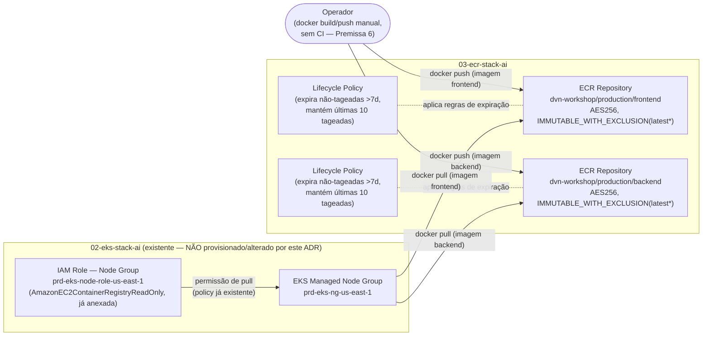

# ADR-0004: Stack de Repositórios ECR para Frontend/Backend (`03-ecr-stack-ai`)

- **Status:** Approved
- **Data:** 2026-09-05
- **Autor:** Planner Agent
- **Supersedes:** N/A
- **Ambiente:** `prd` (ambiente único do projeto — herdado do ADR-0001 Revisão 5, ADR-0002 e ADR-0003; não há `dev`/`hml` em nenhuma stack deste repositório)
- **Região AWS:** `us-east-1` (região padrão do projeto para novos ADRs desde 2026-08-30; nenhuma multi-região foi solicitada para este pedido)

---

## 1. Contexto e Problema

O repositório já possui três stacks aprovadas: `00-bootstrap-stack-ai` (backend remoto), `01-networking-stack-ai` (VPC) e `02-eks-stack-ai` (cluster EKS `prd-eks-us-east-1`, aplicado com sucesso em produção em 2026-09-05T18:36:23Z). Nenhuma delas provisiona Amazon ECR nem qualquer recurso de imagem de container — a Seção 14 (Non-goals) do ADR-0003 exclui explicitamente "deploy de qualquer aplicação, manifesto Kubernetes, namespace customizado ou Helm chart" do escopo da stack de EKS.

O solicitante pediu a criação de dois repositórios ECR — um para o frontend, um para o backend — no padrão de nome `dvn-workshop/production/{frontend|backend}`, além do deploy das duas aplicações no cluster `02-eks-stack-ai`. Este ADR cobre **apenas a primeira metade** do pedido: os dois repositórios ECR, sua configuração (mutabilidade de tag, scanning, encriptação, retenção) e o modo como o cluster já existente consome essas imagens. A segunda metade — Deployment/Service Kubernetes das duas aplicações e a estratégia de exposição externa — depende de uma decisão que toca um risco já registrado no ADR-0003 (Seção 11: sub-redes de `01-` sem tags de descoberta para AWS Load Balancer Controller) e é tratada separadamente, após confirmação do solicitante (ver comunicação em anexo a este ADR / próximo ADR `04-workloads-stack-ai`, ainda não emitido).

As duas aplicações já existem em código, com Dockerfile funcional testado nesta sessão:
- `dvn-workshop-apps/backend/YoutubeLiveApp/` — .NET 8, `EXPOSE 8080`, health check em `/backend/health`, imagem final ~112MB.
- `dvn-workshop-apps/frontend/youtube-live-app/` — Next.js 14 (`output: 'standalone'`), `EXPOSE 3000`, health check em `/api/health`, imagem final ~155MB.

Nenhuma delas ainda foi publicada em nenhum registro de imagens — os dois repositórios ECR desta ADR são pré-requisito bloqueante para qualquer deploy futuro no cluster.

## 2. Drivers de Decisão

**Requisitos funcionais explícitos do solicitante**
- Dois repositórios ECR: um para frontend, um para backend.
- Nome no padrão `dvn-workshop/production/{frontend|backend}` (path-style, estilo namespace de registry Docker).

**Requisitos funcionais adicionais (derivados de boas práticas, decisão do arquiteto)**
- Scanning de vulnerabilidade na imagem (`scan_on_push`).
- Lifecycle policy de retenção, para evitar acúmulo indefinido de imagens (NIST Application Container Security Guide, citado no EKS Best Practices Guide — "stale images in registries").
- Mutabilidade de tag compatível com o fluxo real de publicação (sem CI hoje — ver Premissas).
- Least-privilege de IAM: reaproveitar a policy de pull já anexada à IAM Role do node group em `02-eks-stack-ai` (`AmazonEC2ContainerRegistryReadOnly`), sem criar nenhuma permissão adicional de leitura.

**Requisitos não funcionais**
- Nenhum SLA/RTO/RPO formal informado — mesma lacuna já registrada nas 3 ADRs anteriores, tratada como Premissa.
- Custo deve permanecer marginal frente ao custo já aprovado do cluster EKS (~USD 145–190/mês, ADR-0003 Seção 10).

**Restrições**
- Ambiente único `prd` (herdado do ADR-0001 Revisão 5).
- Mesma convenção de nomenclatura de arquivos/identificadores Terraform (`.claude/rules/terraform-naming-conventions.md`) das stacks `00-`/`01-`/`02-` — **mas** o nome de negócio do repositório (o valor do argumento `name` do `aws_ecr_repository`, que vira parte da URI de pull/push) segue o padrão path-style pedido explicitamente pelo solicitante, divergente do padrão `{env}-{project_name}-{service}-{region}` usado nas 3 ADRs anteriores — reconciliação tratada explicitamente na Seção 9, não decidida silenciosamente.
- Sem framework de compliance informado (LGPD/PCI/HIPAA/SOC2) — mesma lacuna das 3 ADRs anteriores.
- **Sem pipeline de CI/CD real neste repositório** (confirmado por leitura de `CLAUDE.md`: "não há build/lint/test toolchain no sentido de aplicação" — o repositório é puramente IaC). Push de imagem é, portanto, assumido manual pelo operador nesta entrega — ver Premissa 6.

**Objetivos estratégicos**
- Desbloquear o pedido de deploy das duas aplicações, cujo bloqueio reportado pelo `devops-engineer` foi justamente a ausência de ECR e o Non-goal de deploy do ADR-0003.
- Manter a stack de ECR desacoplada de `02-eks-stack-ai` a nível de código Terraform (nenhuma alteração nessa stack), reaproveitando apenas a permissão de IAM já concedida.

## 3. Premissas (Assumptions)

1. **Ambiente:** `prd`, único ambiente do projeto — mesmo padrão de `00-`/`01-`/`02-`. Sem `variable "environment"`; `local.environment = "prd"` fixo.
2. **Região:** `us-east-1`, região padrão do projeto para todo novo ADR a partir de 2026-08-30 — nenhuma necessidade de multi-região/DR foi indicada para este pedido.
3. **Estado atual:** greenfield para ECR — nenhum repositório com esses nomes existe hoje nesta conta (não verificado exaustivamente nesta sessão de planejamento; a pré-checagem formal fica a cargo do `devops-engineer`, Seção 13.1 passo 0, mesmo padrão do ADR-0003).
4. **Nome do repositório segue literalmente o pedido do solicitante** (`dvn-workshop/production/frontend`, `dvn-workshop/production/backend`), validado via `terraform-mcp`/documentação AWS que nomes ECR aceitam `/` como separador de namespace (ex. oficial da AWS: `project-a/nginx-web-app`) — decisão de reconciliação com o padrão `{env}-{project_name}-{service}-{region}` das ADRs anteriores tratada explicitamente na Seção 9: o nome do repositório ECR é um contrato externo (consumido por `docker push`/`docker pull`/manifestos Kubernetes futuros), diferente de uma tag `Name` interna de recurso AWS — por isso não é forçado a seguir o padrão de negócio interno.
5. **`project_name` desta stack:** `"ecr"` (paralelo a `"networking"`/`"bootstrap"`/`"eks"` das stacks anteriores) — usado apenas para tags/identificadores Terraform, não para o nome do repositório em si (Premissa 4).
6. **Sem CI/CD real neste repositório hoje.** Push de imagem assumido manual pelo operador (`aws ecr get-login-password | docker login` + `docker push`), usando a mesma identidade IAM já usada para `terraform apply` nas stacks anteriores (ex.: usuário `atlantis`, observado em `docs/deployments/02-eks-stack-ai.md`). Criação de uma IAM Role/usuário de CI dedicado, com permissão de push restrita por repositório, é tratada como Non-goal (Seção 14) — reavaliar se um pipeline de CI real for introduzido no repositório.
7. **Pull de imagens pelos worker nodes do EKS já está coberto** pela policy gerenciada `AmazonEC2ContainerRegistryReadOnly`, anexada à IAM Role do node group em `02-eks-stack-ai` (ADR-0003, Seção 6.2/8) — essa policy é `Resource: "*"` do lado da AWS (é assim que a policy gerenciada oficial é definida, não uma escolha desta ADR) e já cobre pull de **qualquer** repositório ECR da conta, incluindo os dois criados aqui. Esta ADR **não** modifica `02-eks-stack-ai`.
8. **Sem VPC Endpoint de Interface para ECR** (`com.amazonaws.us-east-1.ecr.api`/`ecr.dkr`) nesta ADR — pulls dos worker nodes continuam saindo via o NAT Gateway único de `01-networking-stack-ai` (mesmo caminho de rede já custeado na estimativa do ADR-0003, item "processamento de dados adicional via NAT Gateway"). Reduzir essa dependência via VPC Endpoint é uma melhoria futura, não um Non-goal crítico — não solicitada explicitamente.
9. **Sem requisito de replicação cross-region/cross-account** — ambos os repositórios existem apenas em `us-east-1`, consumidos apenas pelo cluster da mesma conta/região.
10. **Tags `Owner`/`CostCenter`** ainda não definidas pelo solicitante — mesmos placeholders `"AJUSTAR-..."` já em uso em `00-`/`01-`/`02-`.
11. **Estrutura:** uma nova stack `03-ecr-stack-ai`, independente de `01-`/`02-` a nível de código Terraform — nenhum `data source` cross-stack é necessário (ao contrário de `02-eks-stack-ai`, que depende de `01-` para VPC/sub-redes), porque a criação de um repositório ECR não depende de rede nem do cluster; a única dependência real é operacional/IAM (a policy de pull já concedida em `02-`), não uma dependência de Terraform.
12. **Escopo desta ADR não inclui o deploy das aplicações no cluster** — apenas os dois repositórios ECR e sua configuração. O deploy (Deployment/Service Kubernetes, estratégia de exposição externa) depende de uma decisão de arquitetura ainda pendente de confirmação do solicitante (ver comunicação em anexo) e será tratado em uma ADR/stack subsequente (`04-workloads-stack-ai`, ainda não emitida nesta entrega).

## 4. Opções Consideradas

### Estrutura de stack — Opção A: uma única stack `03-ecr-stack-ai` com os dois repositórios *(ESCOLHIDA)*
- **Descrição:** ambos `aws_ecr_repository` (frontend/backend) e suas `aws_ecr_lifecycle_policy` associadas vivem na mesma stack/state, seguindo o mesmo espírito de `01-networking-stack-ai` (múltiplos recursos do mesmo domínio agrupados em uma stack coesa).
- **Prós:** os dois repositórios têm o mesmo ciclo de vida operacional (nascem e evoluem juntos, sob o mesmo `project_name = "ecr"`), reduz overhead de diretórios/state/backend a gerenciar; consistente com a granularidade de stack já usada no repositório (uma stack agrupa um domínio, não um recurso isolado).
- **Contras:** um erro de `plan`/`apply` em um repositório pode, em tese, bloquear a aplicação do outro no mesmo `apply` (mitigado: são recursos independentes dentro do mesmo state, sem dependência entre si — um `# forces replacement` em um não afeta o outro).
- **Custo estimado:** idêntico à Opção B.

### Estrutura de stack — Opção B: uma stack por aplicação (`03-ecr-frontend-stack-ai` + `03-ecr-backend-stack-ai`)
- **Descrição:** dois diretórios de stack completamente separados, cada um com seu próprio backend/state.
- **Prós:** isolamento total de state entre frontend e backend.
- **Contras:** duplica boilerplate (backend, providers, versions, README) para dois recursos que são, na prática, idênticos em tudo exceto o nome; nenhuma stack existente hoje no repositório segue esse padrão de "uma stack por recurso individual" — quebra a convenção de granularidade por domínio já estabelecida (`01-` agrupa toda a rede, `02-` agrupa cluster+node group+IAM+KMS+logs, todos multi-recurso).
- **Custo estimado:** idêntico à Opção A.

**Decisão:** Opção A, por consistência com a granularidade de stack (por domínio, não por recurso individual) já estabelecida nas 3 ADRs anteriores.

---

### D1 — Nome do repositório: padrão path-style pedido vs. padrão de negócio `{env}-{project}-{service}-{region}`

#### Opção A — Adotar literalmente o padrão pedido pelo solicitante *(ESCOLHIDA)*
- **Descrição:** `name = "dvn-workshop/production/frontend"` / `"dvn-workshop/production/backend"`.
- **Prós:** atende exatamente ao que foi pedido; nomes de repositório ECR funcionam como uma URI de registry consumida por ferramentas externas (Dockerfiles, `docker push`/`pull`, manifestos Kubernetes `image:` futuros) — um contrato técnico externo, não uma tag de recurso interna; validado via documentação AWS que `/` é um separador de namespace suportado e idiomático (`project-a/nginx-web-app`).
- **Contras:** diverge do padrão `{env}-{project_name}-{service}-{region}` usado para o nome de negócio de outros recursos AWS nas 3 ADRs anteriores — quem procura recursos por esse padrão não encontrará o repositório ECR pelo mesmo prefixo; o segmento `production` do path não é literalmente igual ao valor `prd` usado na tag `Environment` do restante do repositório (potencial confusão de leitura).
- **Custo estimado:** USD 0 adicional.

#### Opção B — Forçar reconciliação com o padrão de negócio existente
- **Descrição:** `name = "prd-ecr-frontend-us-east-1"` / `"prd-ecr-backend-us-east-1"`.
- **Prós:** 100% consistente com o padrão de nome de negócio já em uso.
- **Contras:** contraria um pedido explícito e literal do solicitante ("no seguinte padrão: dvn-workshop/production/frontend") sem um motivo técnico que o justifique — o padrão de negócio interno do repositório não é uma restrição técnica do ECR, é uma convenção deste projeto para nomes de recursos AWS, e o solicitante pediu explicitamente um padrão diferente para este caso específico.
- **Custo estimado:** USD 0.

**Decisão:** Opção A. O pedido do solicitante é explícito e literal quanto ao nome; nome de repositório ECR é consumido como contrato externo (imagens, manifestos), não como tag `Name` interna — a reconciliação adotada (Seção 9) é manter o padrão de negócio nas *tags* (`Project`, `StackName`, `Environment`) enquanto o *nome* do repositório segue o pedido do solicitante.

---

### D2 — Encriptação em repouso

#### Opção A — `AES256` (chave gerenciada pela AWS, default) *(ESCOLHIDA)*
- **Descrição:** `encryption_configuration { encryption_type = "AES256" }` (ou omitir o bloco — é o default do recurso).
- **Prós:** sem custo adicional; sem uma CMK extra para gerenciar/rotacionar; consistente com o precedente do ADR-0002 (bucket de state usa SSE-S3 sem CMK, por ausência de driver de compliance) — imagens de container, seguindo boas práticas (nenhum segredo embutido na imagem, já referenciado no ADR-0003 Seção 8), não carregam por si só um dado tão sensível quanto os Secrets do Kubernetes protegidos por CMK em `02-`.
- **Contras:** sem trilha de auditoria KMS granular (`kms:Decrypt` por chamador) equivalente à usada em `02-eks-stack-ai` para Secrets.
- **Custo estimado:** USD 0 adicional.

#### Opção B — CMK dedicada (`encryption_type = "KMS"`)
- **Descrição:** criar uma `aws_kms_key` dedicada para os repositórios, mesmo padrão usado em `02-eks-stack-ai` para Secrets (ADR-0003, D3).
- **Prós:** trilha de auditoria via CloudTrail de quem descriptografou/gerou chave de dados para pull/push; alinhado a um possível requisito futuro de compliance.
- **Contras:** custo adicional (~USD 1-2/mês por chave); overhead operacional (rotação, política de chave) para um dado (imagens de container, sem segredo embutido por boa prática) com superfície de risco menor do que os Secrets do Kubernetes que motivaram a CMK em `02-`; nenhum driver de compliance foi informado que exija isso.
- **Custo estimado:** ~USD 1-2/mês adicional.

**Decisão:** Opção A, mesmo racional do ADR-0002 (ausência de driver de compliance) — reavaliar para Opção B se um framework de compliance for indicado no futuro.

---

### D3 — Mutabilidade de tag de imagem

#### Opção A — `MUTABLE` (todas as tags podem ser sobrescritas)
- **Descrição:** comportamento default do recurso.
- **Prós:** compatível com o fluxo manual sem CI (Premissa 6) — o operador pode reenviar `latest` repetidamente durante iteração.
- **Contras:** nenhuma proteção contra sobrescrita acidental de uma tag versionada que já esteja em uso por um Deployment em produção (ex.: reenviar `v1.2.0` com conteúdo diferente silenciosamente).
- **Custo estimado:** USD 0.

#### Opção B — `IMMUTABLE` (nenhuma tag pode ser sobrescrita)
- **Descrição:** qualquer tentativa de `docker push` reusando uma tag já existente falha.
- **Prós:** máxima proteção contra sobrescrita acidental; alinhado à boa prática de imutabilidade de artefatos de build.
- **Contras:** quebra o fluxo manual esperado nesta entrega (Premissa 6) — sem CI gerando tags únicas por commit/build, o operador tenderá a reenviar a mesma tag (ex. `latest`) repetidamente durante testes manuais, e todo push subsequente falharia.
- **Custo estimado:** USD 0.

#### Opção C — `IMMUTABLE_WITH_EXCLUSION`, com exceção para o padrão `latest*` *(ESCOLHIDA)*
- **Descrição:** `image_tag_mutability = "IMMUTABLE_WITH_EXCLUSION"` + `image_tag_mutability_exclusion_filter { filter = "latest*", filter_type = "WILDCARD" }` — validado via `terraform-mcp` (`aws_ecr_repository`, provider `6.63.0`) como valor suportado do argumento.
- **Prós:** resolve a tensão real entre as Opções A e B — a tag `latest` (o fluxo manual esperado de iteração rápida, Premissa 6) permanece livremente sobrescrevível, enquanto qualquer outra tag (ex. uma tag de versão usada para um rollback específico no futuro) é protegida contra sobrescrita silenciosa.
- **Contras:** se o operador adotar, no futuro, uma convenção de tag mutável diferente de `latest*` (ex. `dev`, `staging`) sem atualizar o filtro de exclusão, o push a essa tag falhará ao tentar sobrescrevê-la — comportamento *fail-safe*, mas pode surpreender na primeira tentativa; precisa estar documentado no README da stack.
- **Custo estimado:** USD 0.

**Decisão:** Opção C. Melhor equilíbrio entre o fluxo operacional real desta entrega (push manual, sem CI, provavelmente reusando `latest`) e a proteção mínima contra sobrescrita acidental de qualquer tag que não seja explicitamente transitória.

---

### D4 — Retenção de imagens (lifecycle policy)

#### Opção A — Lifecycle policy com 2 regras: expirar não-tageadas >7 dias + manter as últimas 10 tageadas *(ESCOLHIDA)*
- **Descrição:** `aws_ecr_lifecycle_policy` por repositório, regra 1 (`tagStatus: untagged`, `countType: sinceImagePushed`, `countNumber: 7`, `action: expire`) + regra 2 (`tagStatus: any` ou `tagged`, `countType: imageCountMoreThan`, `countNumber: 10`, `action: expire`) — sintaxe validada via `terraform-mcp` (exemplos oficiais do recurso `aws_ecr_lifecycle_policy`).
- **Prós:** evita acúmulo indefinido de imagens (custo de storage crescente sem limite, e o risco de "stale images" citado no EKS Best Practices Guide — "Image security"); 10 versões tageadas é uma folga generosa para o ritmo esperado de um workshop/demo.
- **Contras:** se o ritmo de push aumentar muito (múltiplos pushes por dia ao longo de semanas) e um rollback for necessário para uma versão além da 10ª mais recente, a imagem já terá expirado — mitigação: contagem ajustável via variável, sem `default` (Seção 13.2).
- **Custo estimado:** USD 0 adicional (lifecycle policies não têm custo próprio).

#### Opção B — Sem lifecycle policy (limpeza manual)
- **Descrição:** nenhum `aws_ecr_lifecycle_policy` — imagens acumulam indefinidamente até remoção manual.
- **Prós:** nenhuma imagem é removida "por engano" por uma regra automática mal calibrada.
- **Contras:** contraria diretamente a recomendação do EKS Best Practices Guide citada acima; custo de storage cresce sem limite; exige disciplina manual de limpeza que tende a não acontecer na prática.
- **Custo estimado:** custo de storage cresce ao longo do tempo, não quantificável a priori.

**Decisão:** Opção A, seguindo a recomendação explícita do EKS Best Practices Guide (validado via `aws-mcp`) e mantendo os dois repositórios com custo de storage previsível.

## 5. Decisão

**Combinação escolhida:** uma única stack `03-ecr-stack-ai` (estrutura, Opção A) com dois `aws_ecr_repository` nomeados literalmente conforme o pedido do solicitante (D1, Opção A: `dvn-workshop/production/frontend`, `dvn-workshop/production/backend`), encriptação `AES256` (D2, Opção A), `image_tag_mutability = "IMMUTABLE_WITH_EXCLUSION"` com exceção para `latest*` (D3, Opção C), e lifecycle policy de retenção (D4, Opção A).

Justificativa consolidada, referenciando os drivers da Seção 2: a combinação atende ao requisito funcional explícito (dois repositórios, no nome pedido), resolve a tensão real entre "sem CI ainda" e "proteção contra sobrescrita acidental" (D3), mantém o custo marginal (Seção 10) e reaproveita, sem modificação, a permissão de pull já concedida em `02-eks-stack-ai` — sem introduzir nenhum acoplamento de código Terraform entre as stacks (Premissa 11).

## 6. Arquitetura Proposta

### 6.1 Diagrama

> Diagrama editável equivalente, com fluxo "vivo" (setas animadas), gerado em `docs/diagramas/ADR-0004-ecr-stack.drawio` — ver seção **DIAGRAMA DRAW.IO**.

> Nota: `NodeRole` e `NodeGroup` representam recursos **já existentes**, provisionados por `02-eks-stack-ai` (ADR-0003) e aplicados em produção em 2026-09-05 — incluídos apenas para deixar explícito o consumo das imagens pelo cluster. Nenhum recurso de `02-eks-stack-ai` é criado, modificado ou lido via `data source` por esta ADR (Premissa 11) — a policy de pull já é ampla o suficiente (`Resource: "*"` da policy gerenciada oficial `AmazonEC2ContainerRegistryReadOnly`) para cobrir os dois novos repositórios sem nenhuma alteração.

### 6.2 Recursos AWS

| Recurso | Tipo (Terraform) | Nome lógico | Região | Observações |
|---|---|---|---|---|
| ECR Repository (frontend) | `aws_ecr_repository` | `dvn-workshop/production/frontend` | us-east-1 | `image_tag_mutability = "IMMUTABLE_WITH_EXCLUSION"` com exceção `latest*`; `image_scanning_configuration.scan_on_push = true`; `encryption_configuration.encryption_type = "AES256"` (default). |
| ECR Repository (backend) | `aws_ecr_repository` | `dvn-workshop/production/backend` | us-east-1 | Mesma configuração do frontend. |
| ECR Lifecycle Policy (frontend) | `aws_ecr_lifecycle_policy` | associada ao repositório frontend | us-east-1 | 2 regras: expira imagens não-tageadas com mais de 7 dias; mantém as últimas 10 imagens tageadas, expira o excedente. |
| ECR Lifecycle Policy (backend) | `aws_ecr_lifecycle_policy` | associada ao repositório backend | us-east-1 | Mesmas 2 regras do frontend. |
| IAM Role — Node Group *(existente, referenciado apenas no diagrama)* | `aws_iam_role` | `prd-eks-node-role-us-east-1` | us-east-1 | Provisionado por `02-eks-stack-ai` (ADR-0003) — **não criado/alterado por esta ADR**. Já possui `AmazonEC2ContainerRegistryReadOnly` anexada, cobrindo pull dos dois repositórios novos sem mudança. |

### 6.3 Módulos Terraform Recomendados

> Nenhum módulo Terraform de terceiros/comunidade é utilizado — apenas recursos nativos do provider `hashicorp/aws`, mesma restrição de `00-`/`01-`/`02-`. Um módulo comunitário de ECR (ex. `terraform-aws-modules/ecr/aws`) não foi avaliado em detalhe: dado que apenas 2 recursos simples (`aws_ecr_repository` + `aws_ecr_lifecycle_policy`, sem replicação/scanning avançado/pull-through-cache) são necessários, o overhead de uma dependência de módulo externo não se justifica para este escopo mínimo — mesma lógica de custo/benefício já aplicada a `00-`/`01-` (mas, diferente de `02-`, aqui a "Opção B nativa vs. módulo" nem chega a ser um trade-off relevante, dado o tamanho do escopo).

| Módulo/Provider | Versão (pinned) | Finalidade |
|---|---|---|
| `hashicorp/aws` (provider) | `~> 6.0` (testado com `6.63.0`, validado via `terraform-mcp get_provider_details` em 2026-09-05, mesma constraint já usada em `00-`/`01-`/`02-`) | Provider AWS oficial para `aws_ecr_repository`/`aws_ecr_lifecycle_policy`. |
| Terraform CLI (`required_version`) | `>= 1.15.8` | Mesmo floor já adotado em `00-`/`01-`/`02-`. |

## 7. Avaliação Well-Architected

| Pilar | Como a decisão endereça |
|---|---|
| **Operational Excellence** | Lifecycle policy automatiza a limpeza de imagens obsoletas, sem intervenção manual recorrente; nomes de repositório previsíveis e documentados (Seção 9) facilitam a integração de `docker build`/`push` em uma futura pipeline de CI. |
| **Security** | `scan_on_push = true` detecta vulnerabilidades conhecidas a cada push; `IMMUTABLE_WITH_EXCLUSION` protege contra sobrescrita silenciosa de tags versionadas; nenhuma IAM policy customizada é criada (reaproveita a policy gerenciada já existente); repositórios são privados por padrão (nenhuma política de repositório pública é criada). |
| **Reliability** | Repositório privado gerenciado pela AWS, multi-AZ nativamente (fora do controle desta stack); lifecycle policy calibrada (10 versões tageadas) para não expirar agressivamente imagens ainda em uso. |
| **Performance Efficiency** | Pulls a partir do EKS ocorrem na mesma região (`us-east-1`) do cluster — sem latência de transferência cross-region; imagens multi-stage já otimizadas (~112MB/~155MB) reduzem tempo de pull. |
| **Cost Optimization** | Sem CMK dedicada (D2) nem replicação cross-region (Premissa 9) — evita custo não solicitado; lifecycle policy (D4) evita crescimento indefinido de storage; dados intra-região (push/pull dentro da mesma conta/região) não geram custo de transferência, conforme documentação de precificação da AWS. |
| **Sustainability** | Reaproveita 100% a infraestrutura de IAM/rede já existente (`02-eks-stack-ai`, `01-networking-stack-ai`) — nenhum recurso duplicado; lifecycle policy reduz o volume de dados armazenados indefinidamente. |

## 8. Segurança

- **IAM:** nenhuma IAM Role/policy nova é criada por esta ADR. Pull pelos worker nodes reaproveita a policy gerenciada `AmazonEC2ContainerRegistryReadOnly` já anexada à IAM Role do node group em `02-eks-stack-ai` (ADR-0003) — least-privilege já garantido por aquela ADR, não reavaliado aqui. Push é feito manualmente pelo operador (Premissa 6), usando a mesma identidade IAM já usada para `terraform apply` nas stacks anteriores — **risco registrado na Seção 11** (ausência de uma role de push dedicada e escopada por repositório).
- **Criptografia em repouso:** `AES256` (chave gerenciada pela AWS, default do recurso) — Seção 4, D2.
- **Criptografia em trânsito:** toda comunicação com a API/registry do ECR ocorre via HTTPS/TLS nativo (protocolo Docker Registry v2 sobre TLS) — não configurável, garantido pela AWS.
- **Isolamento de rede:** repositórios ECR são privados por padrão (nenhuma política de repositório pública é criada nesta ADR); nenhum VPC Endpoint de Interface é criado (Premissa 8) — pulls saem via o NAT Gateway único de `01-networking-stack-ai` (mesmo caminho de rede já em uso, sem mudança de superfície de exposição).
- **Gestão de segredos:** as imagens de container **não devem** embutir credenciais/segredos (boa prática já referenciada no ADR-0003 Seção 8) — esta ADR não introduz nenhum mecanismo de gestão de segredos adicional; validação de que as imagens seguem essa prática é responsabilidade de quem constrói/publica a imagem, fora do escopo desta ADR.
- **Logging e auditoria:** todas as chamadas à API do ECR (`PutImage`, `BatchGetImage`, `CreateRepository` etc.) já são registradas pelo CloudTrail da conta (mesmo trail account-wide já em uso, sem configuração adicional necessária); resultados de scan de vulnerabilidade ficam disponíveis via API/console do ECR (integração com EventBridge/SNS para notificação automática é Non-goal, Seção 14).
- **Backup e retenção:** retenção de imagens é controlada pela lifecycle policy (Seção 4, D4) — imagens são consideradas reconstruíveis a partir do código-fonte (`dvn-workshop-apps/`), não há backup adicional fora do ECR.

## 9. Naming Convention & Tagging

- **Padrão de nome do repositório (decisão explícita de reconciliação — Seção 4, D1):** o argumento `name` do `aws_ecr_repository` segue **literalmente** o pedido do solicitante — `dvn-workshop/production/frontend` e `dvn-workshop/production/backend` — um padrão path-style de namespace Docker/registry, **não** o padrão de negócio `{env}-{project_name}-{service}-{region}` usado para o nome de outros recursos AWS nas 3 ADRs anteriores. Essa divergência é intencional: o nome do repositório ECR é um contrato externo consumido por `docker push`/`pull` e, futuramente, por manifestos Kubernetes (`image:`) — diferente de uma tag `Name` interna de recurso AWS. O segmento `production` do path **não** é forçado a ser literalmente igual ao valor `prd` usado na tag `Environment` do restante do repositório — são namespaces conceitualmente distintos (um é parte de uma URI de imagem; o outro é uma tag AWS).
- **Identificadores Terraform (locals, resources):** seguem `.claude/rules/terraform-naming-conventions.md` normalmente — `resource "aws_ecr_repository" "frontend"` / `"backend"` (singular, sem repetir o tipo), `project_name = "ecr"` para fins de tagging.
- **Tags obrigatórias** (aplicadas via `default_tags` do provider + reforçadas em cada recurso, mesmo padrão de `00-`/`01-`/`02-`):
  - `Environment` = `"prd"` (fixo — valor da tag, distinto do segmento `production` do nome do repositório, ver acima)
  - `Owner` (a definir pelo solicitante; placeholder `"AJUSTAR-time-responsavel"` até lá)
  - `CostCenter` (a definir pelo solicitante; placeholder `"AJUSTAR-centro-de-custo"`)
  - `Project` = `"ecr"` (`project_name`)
  - `ManagedBy` = `"terraform"`
  - `DataClassification` = `"internal"` — imagens de container não devem conter segredos (boa prática referenciada na Seção 8); classificação menos restritiva que `"confidential"` usada em `02-` para Secrets do Kubernetes, mas mais restritiva que `"public"` (repositórios são privados).
  - `StackName` = `"03-ecr-stack-ai"`

## 10. Custo Estimado

| Item | Modelo de pricing | Estimativa mensal (USD) |
|---|---|---|
| Storage ECR (frontend, ~155MB por versão, até 10 versões tageadas retidas pela lifecycle policy) | On-demand, ~USD 0,10/GB-mês (pricing público ECR) | ~0,10–0,20 |
| Storage ECR (backend, ~112MB por versão, até 10 versões tageadas retidas) | idem | ~0,10–0,15 |
| Transferência de dados push/pull intra-região (mesma conta, mesma região `us-east-1`) | Gratuita — "in-region data transfer incurs no cost" (validado via `aws-mcp`, EKS Best Practices Guide — Cost Optimization/Networking) | 0 |
| Transferência de dados cross-region/internet | N/A — sem replicação nem consumidores fora de `us-east-1` (Premissa 9) | 0 |
| Scanning básico (`scan_on_push`) | Incluído sem custo adicional (scanning básico do ECR) | 0 |
| **Total estimado** | | **~ USD 1–2** |

> Estimativa em ordem de grandeza; validar com Cost Explorer/AWS Pricing Calculator antes do go-live. Custo desprezível frente ao custo já aprovado de `02-eks-stack-ai` (~USD 145–190/mês) — não é esperado que este item precise de uma aprovação de orçamento separada, mas deve ser mencionado ao solicitante por transparência (Seção 13.3).

## 11. Riscos e Mitigações

| Risco | Probabilidade | Impacto | Mitigação |
|---|---|---|---|
| **Nome de repositório diverge do padrão de negócio `{env}-{project}-{service}-{region}`** usado no restante do repositório (Seção 9) | Alta (é uma escolha deliberada, não um acidente) | Baixo (afeta apenas descoberta/legibilidade, não funcionalidade) | Documentado explicitamente na Seção 9; tags (`Project`, `StackName`, `Environment`) continuam seguindo o padrão interno — a divergência fica isolada ao campo `name`. |
| **Push manual sem CI, usando a mesma identidade ampla de `terraform apply`** (Premissa 6) — sem role de push dedicada e escopada por repositório | Média (é o fluxo assumido para esta entrega) | Médio (qualquer identidade com permissão de `terraform apply` também pode publicar imagens; sem trilha de "quem publicou para produção" além do CloudTrail genérico da conta) | CloudTrail já registra `ecr:PutImage`/`BatchGetImage`/etc. por identidade chamadora; criação de uma role de CI/push dedicada e escopada é melhoria futura (Non-goal, Seção 14), a reavaliar se um pipeline de CI real for introduzido. |
| **`IMMUTABLE_WITH_EXCLUSION` só protege exceção para tags que casem com `latest*`** — se o operador adotar outra convenção de tag mutável (ex. `dev`, `staging`) sem atualizar o filtro, o push a essa tag falhará ao tentar sobrescrevê-la | Média (depende do fluxo real de trabalho do operador) | Baixo (falha segura — bloqueia o push, não corrompe/sobrescreve silenciosamente) | Documentar claramente no README da stack que apenas tags casando com `latest*` são mutáveis; ajustar o filtro de exclusão via `.tf` (revisão própria) se uma segunda convenção de tag mutável for adotada. |
| **Lifecycle policy pode expirar uma imagem tageada ainda necessária** se o ritmo de push exceder as 10 versões retidas antes de um rollback tardio | Baixa (10 versões é generoso para o ritmo esperado de um workshop/demo) | Médio (perda de uma versão específica para rollback, exigindo rebuild a partir do código-fonte) | `imageCountMoreThan` (10) é uma variável de input, ajustável sem recriar o repositório (Seção 13.2); revisar se o ritmo de push aumentar. |
| **Ausência de VPC Endpoint para ECR** — pulls dependem do NAT Gateway único de `01-` (SPOF já aceito em produção, ADR-0001 Premissa 14/ADR-0003 Seção 11), agora também para pull de imagem além do já registrado uso de API AWS | Média (mesma probabilidade já aceita em `01-`/`02-`) | Médio (uma falha do NAT bloqueia também o pull de novas imagens, além do impacto já registrado em `02-`) | Risco herdado e já aceito conscientemente em `01-`/`02-`; esta ADR não o reabre, apenas registra que seu impacto se estende ao ECR. Nenhuma mitigação adicional nesta ADR — um VPC Endpoint de Interface para ECR é uma melhoria futura fora de escopo (Premissa 8). |
| **Repositório criado com nome incorreto exige recriação** (`name` força `# forces replacement` se alterado) — imagens já publicadas ficam órfãs no repositório antigo | Baixa (nome já validado e revisado nesta ADR antes da implementação) | Médio (perda de histórico de imagens do repositório antigo, exige nova sequência de push) | `terraform plan` revisado obrigatoriamente antes do primeiro `apply` (Seção 13.1) deve confirmar os dois nomes exatos da Seção 6.2/9. |

## 12. Estratégia de Rollback

- **Cenário mais provável (nenhum `apply` real ainda):** `git revert` da criação da stack `03-ecr-stack-ai` e/ou simplesmente não aplicar. Nenhuma infraestrutura é afetada.
- **Remover/ajustar a lifecycle policy:** reversível a qualquer momento, sem impacto em imagens já armazenadas — apenas altera o comportamento futuro de expiração.
- **Remover um repositório (`terraform destroy`/remoção do bloco):** `aws_ecr_repository` bloqueia a exclusão por padrão se o repositório contiver imagens (`force_delete = false`, default do recurso) — proteção adicional contra remoção acidental com perda de imagens; **nunca** definir `force_delete = true` sem confirmação explícita em sessão (mesmo guardrail já vigente do `devops-engineer` para qualquer `destroy`/`delete-*`).
- **Alterar o `name` de um repositório já aplicado:** força recriação completa (`# forces replacement`) — imagens do repositório antigo não são migradas automaticamente; tratar como migração planejada (novo repositório + republicação manual das imagens necessárias), nunca como ajuste incremental.
- **Alterar `image_tag_mutability`/`image_tag_mutability_exclusion_filter`:** não força recriação do repositório — ajuste incremental de baixo risco.
- **State:** mesmo padrão de `01-`/`02-` — `override.tf` como backend local temporário até a migração (futura, fora de escopo) para o bucket S3 do ADR-0002; enquanto local, o `.tfstate` desta stack deve ser tratado como artefato crítico.
- **Validação pré-rollback:** sempre rodar `terraform plan` antes de qualquer `apply`/`destroy` de correção, prestando atenção especial a qualquer `# forces replacement` no `aws_ecr_repository` (implica novo nome/nova URI de imagem, exigindo republicação).

## 13. Handoff para DevOps Engineer Agent

> **Escopo estrito desta implementação:** apenas os recursos da Seção 6.2, na nova stack `03-ecr-stack-ai/`. **Não** inclui alterar `02-eks-stack-ai/`, `01-networking-stack-ai/` ou `00-bootstrap-stack-ai/` — todas fora do escopo. **Não** inclui nenhum `docker build`/`docker push` real de imagem (isso é uma ação operacional do solicitante/operador após a stack existir, não uma tarefa de Terraform). **Não** inclui deploy de Deployment/Service Kubernetes das aplicações — tratado em uma ADR/stack subsequente (`04-workloads-stack-ai`, ainda não emitida), pendente de confirmação do solicitante sobre a estratégia de exposição externa (ver comunicação em anexo a este ADR).

### 13.1 Ordem de Implementação (respeitando dependências)

0. **Pré-checagem obrigatória:** confirmar via `aws ecr describe-repositories --region us-east-1` que nenhum repositório com os nomes-alvo (`dvn-workshop/production/frontend`, `dvn-workshop/production/backend`) já existe.
1. Criar o diretório `03-ecr-stack-ai/` na raiz do repositório, seguindo a estrutura de arquivos por domínio (`.claude/rules/terraform-naming-conventions.md`):
   - `main.tf` (ponto de entrada/índice)
   - `versions.tf` (`required_version = ">= 1.15.8"`; `hashicorp/aws` `~> 6.0`)
   - `providers.tf` (`provider "aws"` com `default_tags`)
   - `backend.tf` (configuração parcial S3, `use_lockfile = true` — mesmo padrão de `01-`/`02-`, aguardando o mesmo bucket do ADR-0002)
   - `override.tf` (gitignored — backend local temporário)
   - `variables.tf` (variáveis agrupadas por domínio — sugerido: `ecr` (namespace/segmento de ambiente do nome, `image_tag_mutability`, `scan_on_push`, `encryption_type`) e `ecr_lifecycle` (`untagged_expire_days`, `tagged_keep_count`) + independentes `aws_region`, `project_name`, `tags`; nenhuma declara `default` — Seção 13.2)
   - `locals.tf` (`local.environment = "prd"`; `local.common_tags`)
   - `ecr.tf` (`aws_ecr_repository.frontend`, `aws_ecr_repository.backend`)
   - `ecr.lifecycle-policy.tf` (`aws_ecr_lifecycle_policy.frontend`, `aws_ecr_lifecycle_policy.backend`)
   - `outputs.tf` (`repository_frontend_url`, `repository_backend_url`, `repository_frontend_arn`, `repository_backend_arn` — para consumo pela futura stack de workloads)
   - `terraform.tfvars.example` (versionado, com `aws_region = "us-east-1"`) e `terraform.tfvars` (gitignored, gerado a partir do example)
   - `.gitignore` (mesmo padrão de `00-`/`01-`/`02-`)
   - `README.md` (mesmo espírito das stacks anteriores: pré-requisitos, uso, validação pós-deploy, rollback, pontos de atenção — incluindo a nota explícita sobre a divergência de padrão de nome, Seção 9, e sobre o fluxo de push manual, Premissa 6)
2. Implementar os recursos da Seção 6.2 na ordem: repositórios ECR → lifecycle policies (a lifecycle policy referencia o `name` do repositório já criado).
3. Rodar `terraform fmt -check` e `terraform validate` em `03-ecr-stack-ai/`.
4. Rodar `terraform plan -out=tfplan` e conferir explicitamente que: (a) exatamente 2 `aws_ecr_repository` e 2 `aws_ecr_lifecycle_policy` são planejados; (b) os nomes exatos são `dvn-workshop/production/frontend` e `dvn-workshop/production/backend`; (c) `image_tag_mutability = "IMMUTABLE_WITH_EXCLUSION"` com o filtro `latest*`; (d) `encryption_configuration.encryption_type = "AES256"` (ou omitido, default); (e) `image_scanning_configuration.scan_on_push = true`; (f) as tags obrigatórias (Seção 9) aparecem corretamente, incluindo `DataClassification = "internal"`.
5. Submeter o `plan` à revisão por pares — mesmo racional das stacks anteriores (não há ambiente inferior no repositório).
6. Aplicar somente após a revisão do passo 5.
7. Após o `apply`, validar os testes da Seção 13.4.
8. **Parar aqui.** Não prosseguir para `docker build`/`push` de imagens reais nem para deploy de manifestos Kubernetes — fora do escopo desta ADR (Seção 14). O `docker push` real das imagens de `dvn-workshop-apps/` é uma ação operacional subsequente do solicitante/operador, não uma tarefa de código desta implementação.

### 13.2 Variáveis de Input Esperadas

| Variável | Tipo | Descrição |
|---|---|---|
| `aws_region` | `string` | Região AWS onde a stack é aplicada (`"us-east-1"`). |
| `project_name` | `string` | Nome lógico do projeto para fins de tag (`"ecr"`) — **não** usado no `name` dos repositórios (Seção 9). |
| `ecr` | `object({ namespace = string, environment_segment = string, image_tag_mutability = string, image_tag_mutability_exclusion_filter = string, scan_on_push = bool, encryption_type = string })` | `namespace = "dvn-workshop"`, `environment_segment = "production"` (usados para montar `name = "${namespace}/${environment_segment}/${app}"`), `image_tag_mutability = "IMMUTABLE_WITH_EXCLUSION"`, `image_tag_mutability_exclusion_filter = "latest*"`, `scan_on_push = true`, `encryption_type = "AES256"`. |
| `ecr_lifecycle` | `object({ untagged_expire_days = number, tagged_keep_count = number })` | Sugerido `untagged_expire_days = 7`, `tagged_keep_count = 10` (Seção 4, D4). |
| `tags` | `map(string)` | Tags adicionais além das obrigatórias (`Owner`/`CostCenter` — placeholders `"AJUSTAR-..."` até definição pelo solicitante). |

> **Sem `variable "environment"`** — mesmo padrão de `00-`/`01-`/`02-`: `local.environment = "prd"` fixo em `locals.tf`.

### 13.3 Critérios de Aceitação (Definition of Done)

- [ ] Pré-checagem do passo 0 (Seção 13.1) executada e documentada (nenhum repositório com os nomes-alvo já existe).
- [ ] Ambos os repositórios provisionados via Terraform (sem cliques no console), com os nomes exatos da Seção 6.2/9.
- [ ] `03-ecr-stack-ai/` segue a estrutura de arquivos da Seção 13.1.
- [ ] Tags obrigatórias (Seção 9) aplicadas em 100% dos recursos, incluindo `DataClassification = "internal"`.
- [ ] `terraform validate` e `terraform fmt -check` passam sem erros.
- [ ] `terraform plan` mostra exatamente os recursos listados no passo 4 da Seção 13.1 — revisado explicitamente por um par.
- [ ] `image_tag_mutability = "IMMUTABLE_WITH_EXCLUSION"` com filtro `latest*` confirmado no plan/estado aplicado.
- [ ] `encryption_configuration.encryption_type = "AES256"` confirmado.
- [ ] `image_scanning_configuration.scan_on_push = true` confirmado.
- [ ] Lifecycle policy aplicada em ambos os repositórios, com as 2 regras da Seção 4/D4.
- [ ] Nenhuma IAM Role/policy nova foi criada — confirmado que o pull continua funcionando via a policy já existente de `02-eks-stack-ai` (validação pós-deploy, Seção 13.4).
- [ ] Nenhuma alteração feita em `02-eks-stack-ai/`, `01-networking-stack-ai/` ou `00-bootstrap-stack-ai/` como parte desta entrega.
- [ ] `terraform plan` subsequente ao `apply` retorna "No changes" (sem drift).
- [ ] Outputs (Seção 13.2 / `outputs.tf`) documentados no `README.md` da stack, para consumo pela futura stack de workloads.
- [ ] Nenhum `docker push`/deploy de aplicação real foi feito como parte desta entrega (fora do escopo, Seção 14).

### 13.4 Testes de Validação Pós-Deploy

- `aws ecr describe-repositories --region us-east-1 --repository-names "dvn-workshop/production/frontend" "dvn-workshop/production/backend"` — confirmar existência, `imageTagMutability: IMMUTABLE_WITH_EXCLUSION`, `encryptionConfiguration.encryptionType: AES256`.
- `aws ecr get-lifecycle-policy --region us-east-1 --repository-name "dvn-workshop/production/frontend"` (e idem para `backend`) — confirmar as 2 regras esperadas.
- `aws ecr get-repository-policy --region us-east-1 --repository-name "dvn-workshop/production/frontend"` — confirmar que **não** existe política de repositório (privado por padrão, Seção 8) ou que retorna erro `RepositoryPolicyNotFoundException` (esperado, nenhuma política customizada foi criada).
- `aws resourcegroupstaggingapi get-resources --region us-east-1 --tag-filters Key=StackName,Values=03-ecr-stack-ai` — confirmar que 100% dos recursos estão tageados corretamente.
- **Teste de pull funcional (opcional, requer uma imagem já publicada manualmente pelo operador):** a partir de um dos worker nodes existentes de `02-eks-stack-ai` (ex. via um Pod de teste com a imagem publicada), confirmar que o pull funciona sem nenhuma alteração de IAM — validando a Premissa 7.
- Rodar `terraform plan` após o `apply` e confirmar saída "No changes" (sem drift).

## 14. Non-goals / Fora do Escopo

- **Deploy de qualquer Deployment/Service/manifesto Kubernetes das aplicações** — tratado em uma ADR/stack subsequente (`04-workloads-stack-ai`), pendente de confirmação do solicitante sobre a estratégia de exposição externa.
- **`docker build`/`docker push` reais das imagens de `dvn-workshop-apps/`** — ação operacional do solicitante/operador após esta stack existir, não uma tarefa de Terraform desta ADR.
- **Criação de uma IAM Role/usuário de CI dedicado para push** — Non-goal explícito (Premissa 6/Seção 11); reavaliar se um pipeline de CI real for introduzido no repositório.
- **VPC Endpoint de Interface para ECR** (`com.amazonaws.us-east-1.ecr.api`/`ecr.dkr`) — não solicitado; pulls continuam via NAT Gateway (Premissa 8).
- **Replicação cross-region/cross-account de imagens** — não solicitada (Premissa 9).
- **Enhanced scanning (Amazon Inspector) além do scanning básico `scan_on_push`** — não solicitado; possível melhoria futura.
- **Política de repositório (`aws_ecr_repository_policy`) customizada** — repositórios permanecem privados por padrão, sem acesso cross-account; não solicitado.
- **Pull-through cache rules, registry scanning configuration a nível de conta, ou replication configuration** — nenhum desses recursos ECR adicionais é criado por esta ADR.
- **Alteração de `02-eks-stack-ai`, `01-networking-stack-ai` ou `00-bootstrap-stack-ai`** — nenhuma das três é modificada por esta ADR.
- **Definição de controles específicos de compliance regulatório** — nenhum framework foi indicado (Seção 2).
- Uso de qualquer módulo Terraform de terceiros/comunidade nesta stack (Seção 6.3).

## 15. Referências

- [ADR-0002 — Stack de Bootstrap — Bucket S3 para Backend Remoto do Terraform](./ADR-0002-bootstrap-stack-remote-backend.md) — precedente de encriptação `AES256`/SSE-S3 sem CMK dedicada, referenciado na Seção 4/D2.
- [ADR-0003 — Stack de Cluster EKS (`02-eks-stack-ai`)](./ADR-0003-eks-stack.md) — origem da IAM Role do node group e da policy `AmazonEC2ContainerRegistryReadOnly` reaproveitada por esta ADR (Seção 4, Premissa 7); Non-goal de deploy de aplicação (Seção 14 daquele ADR) que motivou esta nova ADR.
- [`.claude/rules/terraform-naming-conventions.md`](../../.claude/rules/terraform-naming-conventions.md) — padrão de arquivos, variáveis agregadas por domínio e ausência de `default` em `variables.tf`.
- [AWS Well-Architected Framework](https://aws.amazon.com/architecture/well-architected/)
- [What is Amazon Elastic Container Registry?](https://docs.aws.amazon.com/AmazonECR/latest/userguide/what-is-ecr.html) — modelo de precificação (storage + transferência), base da Seção 10.
- [Amazon EKS Best Practices Guide — Image security](https://docs.aws.amazon.com/eks/latest/best-practices/image-security.html) — base da recomendação de lifecycle policy (Seção 4, D4) e da orientação de não embutir segredos em imagens (Seção 8).
- [Amazon EKS Best Practices Guide — Cost Optimization / Networking](https://docs.aws.amazon.com/eks/latest/best-practices/cost-opt-networking.html) — base da afirmação de transferência intra-região gratuita (Seção 10) e da recomendação de VPC Endpoint (Premissa 8).
- [Examples of lifecycle policies in Amazon ECR](https://docs.aws.amazon.com/AmazonECR/latest/userguide/lifecycle_policy_examples.html) — sintaxe das regras usadas na Seção 4/D4.
- [Recurso `aws_ecr_repository` (registry, provider `6.63.0`)](https://registry.terraform.io/providers/hashicorp/aws/latest/docs/resources/ecr_repository) — confirma suporte a `/` no nome, valores válidos de `image_tag_mutability` (incluindo `IMMUTABLE_WITH_EXCLUSION`) e `encryption_configuration` (Seção 4, D1–D3).
- [Recurso `aws_ecr_lifecycle_policy` (registry, provider `6.63.0`)](https://registry.terraform.io/providers/hashicorp/aws/latest/docs/resources/ecr_lifecycle_policy) — base da Seção 4/D4.
- [Class: Aws::ECR::Types::CreateRepositoryRequest — AWS SDK for Ruby V3](https://docs.aws.amazon.com/sdk-for-ruby/v3/api/Aws/ECR/Types/CreateRepositoryRequest.html) — confirma o padrão de namespace `project-a/nginx-web-app` citado na Seção 4/D1.
