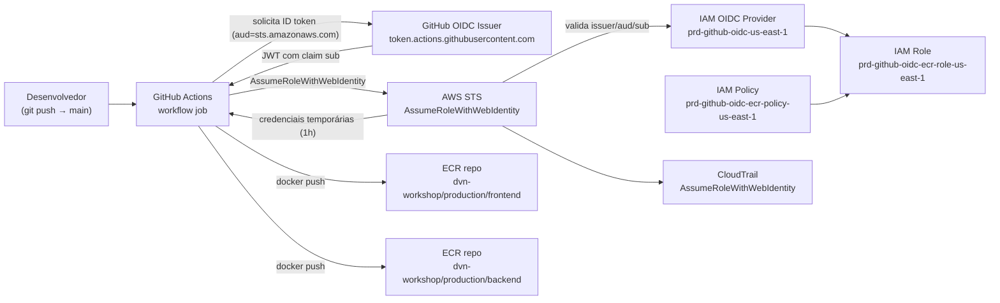

# ADR-0005: Federação OIDC GitHub Actions ↔ AWS e IAM Roles de CI (`04-github-oidc-stack-ai`)

- **Status:** Approved
- **Data:** 2026-09-22
- **Autor:** Planner Agent
- **Supersedes:** N/A
- **Ambiente:** `prd` (ambiente único do repositório — herdado do ADR-0001 Revisão 5, ADR-0002, ADR-0003 e ADR-0004; não existe `dev`/`hml`)
- **Região AWS:** `us-east-1` (região padrão do projeto)
- **Histórico de revisões:**
  - `2026-09-22` — Versão inicial.
  - `2026-09-22` — **Revisão 1 (pergunta em aberto da Premissa 1 fechada: o repositório é PÚBLICO durante o laboratório):** a Premissa 1 da versão inicial registrava um HTTP 404 na leitura pública de `https://github.com/leopoldocardoso/workshop-devops-na-nuvem` e concluía "ou o repositório é privado, ou ainda não foi criado", deixando o ponto como **pergunta em aberto**. O solicitante decidiu, em 2026-09-22, tornar o repositório **público durante a execução do laboratório**, voltando a privado depois que todos os recursos forem destruídos — motivação declarada: **redução de complexidade operacional do lab**, não postura de segurança nem mudança de classificação de dados. Esta revisão apenas **fecha a lacuna documental e requalifica a leitura de um controle já existente**:
    - **Premissa 1 reescrita:** o repositório existe e é público durante a janela do laboratório; a pergunta em aberto é encerrada.
    - **A trust policy NÃO muda.** As Seções 4/D2 e 8 já restringem o `sub` a `repo:leopoldocardoso/workshop-devops-na-nuvem:ref:refs/heads/main`, nos dois formatos (clássico e imutável). Nenhum documento de policy, nenhuma condição, nenhuma decisão (D1, D2, D3) foi alterada por esta revisão — e nada foi "reforçado".
    - **O que muda é o *status* desse controle, não seu conteúdo:** com o repositório privado, a restrição por branch era essencialmente **higiene** (só quem já tinha acesso de escrita poderia tentar). Com o repositório público, **qualquer pessoa pode forkar e abrir PR**, então a mesma cláusula passa a ser um **controle de fronteira** entre contribuição externa e o registry de `prd`. Consequência prática registrada: **alargar essa condição `sub` em uma edição futura passa a ter consequência materialmente maior** do que tinha quando este ADR foi escrito. Registrado em D2/Opção A, na Seção 8 (nota após o trecho da policy) e na Seção 11 (justificativa do risco "trust policy escrita com escopo largo demais", que **permanece** classificado como impacto **Alto**, agora com superfície de ataque real e não hipotética).
    - **Nenhum outro ADR foi editado.** O ADR-0006 (Revisão 3) e o ADR-0007 (Revisão 2) já absorveram a mudança de visibilidade em seus próprios escopos.

---

## 1. Contexto e Problema

O repositório provisiona hoje quatro stacks Terraform (`00-bootstrap`, `01-networking`, `02-eks`, `03-ecr`) e publica as imagens das duas aplicações (`dvn-workshop-apps/frontend/youtube-live-app/` e `dvn-workshop-apps/backend/YoutubeLiveApp/`) nos repositórios ECR criados pelo ADR-0004 — mas o `docker build`/`docker push` é feito **manualmente**, da estação do operador, usando as credenciais AWS de longa duração do perfil local. Não existe `.github/` no repositório: nenhuma automação de CI/CD.

O solicitante pediu uma esteira em GitHub Actions que, a cada commit, construa e publique as imagens no ECR e atualize a versão da imagem no `kustomization.yaml` de cada app, para que o ArgoCD (a ser instalado, ADR-0006) faça o deploy. O primeiro problema a resolver — e pré-requisito de todos os demais — é **como o GitHub Actions autentica na AWS**. O pedido é explícito: "a autenticação será feita através de roles" e "crie também um OIDC provider para o GitHub".

Hoje não existe nenhum principal IAM de CI na conta: o ADR-0004 §14 registra explicitamente "IAM Role/usuário de CI dedicado para push" como Non-goal, adiando a decisão. Este ADR fecha essa lacuna. Ele cobre **exclusivamente** a fundação de identidade (OIDC provider + IAM Role(s) + políticas de menor privilégio para ECR) em uma nova stack Terraform `04-github-oidc-stack-ai`; os workflows que consomem essa role são objeto do ADR-0007, e o ArgoCD do ADR-0006.

## 2. Drivers de Decisão

**Requisitos funcionais (explícitos do solicitante)**
- Criar um OIDC identity provider do GitHub na conta AWS.
- Autenticação do GitHub Actions na AWS via **IAM Role assumida** (nunca chave de acesso estática).
- A role precisa de permissão para interagir com o ECR (login, push e leitura) nos dois repositórios do ADR-0004.

**Requisitos funcionais derivados (decisão do arquiteto)**
- A trust policy deve restringir `sub` ao repositório `leopoldocardoso/workshop-devops-na-nuvem` — um OIDC provider sem restrição de `sub` permitiria que **qualquer** repositório do GitHub assumisse a role (a própria IAM rejeita `sub` puramente curinga; validado na doc "Create a role for OpenID Connect federation").
- Granularidade adicional por **branch** (`main`), para que um workflow disparado de um fork/branch arbitrário não consiga publicar em `prd`.
- Permissões de ECR escopadas por ARN de repositório, exceto `ecr:GetAuthorizationToken`, que não suporta escopo de recurso (`Resource: "*"`, validado na doc "IAM permissions for pushing an image to an Amazon ECR private repository").

**Requisitos não funcionais**
- Sem SLA/RTO/RPO formal (mesma lacuna registrada nos ADRs 0001–0004).
- Zero credencial de longa duração armazenada em GitHub Secrets — é o motivo técnico de existir desta stack.

**Restrições**
- Ambiente único `prd`; convenções vinculantes de `.claude/rules/terraform-naming-conventions.md`.
- Recursos nativos `hashicorp/aws` apenas (padrão mantido em `00-`–`03-`).
- Sem framework de compliance informado (LGPD/PCI/HIPAA/SOC2).
- Orçamento: esta stack custa USD 0,00 em recursos AWS (IAM/OIDC não têm cobrança).
- **Repositório público durante a janela do laboratório** (Premissa 1, Revisão 1): qualquer pessoa pode forkar e abrir PR, o que torna a restrição por branch da trust policy um controle de fronteira, e não apenas higiene.

**Objetivos estratégicos**
- Eliminar o `docker push` manual como caminho de produção.
- Deixar a fundação de identidade pronta para futuros jobs de CI (ex.: `terraform plan` em PR), sem já conceder essas permissões agora.

## 3. Premissas (Assumptions)

1. **Repositório GitHub:** `leopoldocardoso/workshop-devops-na-nuvem`, branch default `main` (confirmado pelo `git status` local). **O repositório existe e é PÚBLICO durante a execução do laboratório** (decisão do solicitante em 2026-09-22, Revisão 1), voltando a privado depois que todos os recursos forem destruídos; a motivação declarada é **redução de complexidade operacional do lab**, não postura de segurança. *(Isto encerra a pergunta em aberto da versão inicial, que registrava HTTP 404 na leitura pública em 2026-09-22 e não sabia dizer se o repositório era privado ou inexistente.)* **Impacto nesta stack:** nenhum no código — a trust policy é escrita por nome e nunca exigiu acesso de leitura ao repositório. O impacto é de **leitura do controle**: com o repositório público, qualquer pessoa pode abrir PR, e a restrição do `sub` a `ref:refs/heads/main` deixa de ser higiene e passa a ser a fronteira que impede uma contribuição externa de obter credencial AWS (ver D2/Opção A, Seção 8 e Seção 11). Do lado do ADR-0006, a visibilidade pública é o que dispensa credencial para o ArgoCD (D6/Opção D daquele ADR, Revisão 3) — decisão fora do escopo desta stack.
2. **Formato do claim `sub`:** o GitHub alterou o `sub` para o formato **imutável** (`repo:<owner>@<ORG_ID>/<repo>@<REPO_ID>:ref:refs/heads/<branch>`) para repositórios criados a partir de **15/07/2026**, mantendo o formato clássico (`repo:<owner>/<repo>:ref:refs/heads/<branch>`) para os anteriores que não optaram pela mudança (validado na doc GitHub "Configuring OpenID Connect in Amazon Web Services", consultada em 2026-09-22). Como não é possível determinar daqui a data de criação do repositório, a trust policy desta ADR aceita **os dois formatos**, como duas entradas literais/`StringLike` distintas da mesma condição `sub` (semântica OR), nunca um curinga que amplie o escopo para outros owners. Ver Seção 8.
3. **Condition keys disponíveis:** validado na doc AWS "IAM and AWS STS condition context keys" (2026-09-22) que, para o mapeamento OIDC default usado pelo GitHub Actions, as únicas chaves disponíveis são `aud`, `sub`, `amr`, `email` e `oaud`. **Não** é possível condicionar por `repository_owner`/`repository_id` — toda a restrição precisa caber no `sub` e no `aud`.
4. **Audience:** `sts.amazonaws.com` (valor default usado pela action oficial `aws-actions/configure-aws-credentials`).
5. **Thumbprint:** `thumbprint_list` é **opcional** no `aws_iam_openid_connect_provider` e, especificamente para o GitHub, a AWS valida o certificado pela própria biblioteca de CAs raiz confiáveis, ignorando thumbprints configurados (validado via `terraform` MCP, doc do recurso no provider `hashicorp/aws` `6.66.0`, 2026-09-22). Portanto **não** se fixa thumbprint, e não se introduz o provider `hashicorp/tls` na stack.
6. **Unicidade do OIDC provider:** só pode existir **um** `aws_iam_openid_connect_provider` por URL de issuer na conta. Assume-se que `token.actions.githubusercontent.com` ainda **não** existe nesta conta (`659942169599`) — o passo 0 da Seção 13.1 obriga a verificação; se existir, a stack deve importá-lo, não recriá-lo.
7. **Conta AWS:** `659942169599` (deduzida das URIs de ECR já usadas no repositório, ex.: `dvn-workshop-kubernetes/frontend/kustomization.yaml`). A stack não hardcoda a conta — usa `data.aws_caller_identity.current`. Com o repositório público, esse account ID (e o ARN `arn:aws:iam::659942169599:user/atlantis`, também já commitado) passam a ser legíveis por qualquer pessoa: são metadados de reconhecimento, não credenciais, e a exposição foi aceita conscientemente pelo solicitante (análise no ADR-0006 §1/§11).
8. **Escopo de permissão:** esta role serve **somente** ao pipeline de build/push de imagem (ADR-0007). Ela **não** recebe permissão de `terraform apply`, nem de EKS, nem de S3 do backend. Um eventual job de IaC em CI é Non-goal (Seção 14).
9. **Repositórios ECR alvo:** `dvn-workshop/production/frontend` e `dvn-workshop/production/backend` (ADR-0004), consumidos por `data.aws_ecr_repository` filtrando pelo nome, não recriados aqui — esta stack **não altera** `03-ecr-stack-ai`.
10. **Tags `Owner`/`CostCenter`:** herdadas do padrão já materializado em `02-`/`03-` (`Owner = "Leopoldo Peixoto Cardoso"`, `CostCenter = "workshop-devops-na-nuvem"`), confirmadas por leitura de `02-eks-stack-ai/locals.tf`.
11. **`project_name = "github-oidc"`** para esta stack, paralelo a `"eks"`/`"ecr"` das anteriores.

## 4. Opções Consideradas

### D1 — Mecanismo de autenticação do GitHub Actions na AWS

#### Opção A — OIDC (`sts:AssumeRoleWithWebIdentity`) com IAM Role dedicada *(ESCOLHIDA)*
- **Descrição:** `aws_iam_openid_connect_provider` para `https://token.actions.githubusercontent.com` + `aws_iam_role` com trust policy condicionada a `aud` e `sub`; o workflow usa `aws-actions/configure-aws-credentials` com `permissions: id-token: write`.
- **Prós:** credenciais de curta duração emitidas por execução, sem segredo persistido no GitHub; revogação imediata alterando a trust policy; rastreável no CloudTrail por `sub` (branch/repo aparece no `userIdentity`); é a recomendação explícita da AWS e do GitHub.
- **Contras:** trust policy é a única barreira — um erro no `sub` abre a conta para terceiros; depende de uma feature do GitHub (token OIDC) cujo formato de `sub` mudou em 2026 (Premissa 2).
- **Custo estimado:** USD 0,00.

#### Opção B — IAM User com access key estática em GitHub Secrets
- **Descrição:** criar um `aws_iam_user` + `aws_iam_access_key`, gravar `AWS_ACCESS_KEY_ID`/`AWS_SECRET_ACCESS_KEY` como secrets do repositório.
- **Prós:** trivial de configurar; funciona em qualquer runner/ferramenta, inclusive fora do GitHub.
- **Contras:** credencial de longa duração, que vaza por log/fork/print acidental e não expira; rotação vira processo manual; o Terraform passaria a gravar a secret key no `.tfstate`. Contraria o pedido explícito do solicitante ("autenticação será feita através de roles"). **Descartada sem ambiguidade.**
- **Custo estimado:** USD 0,00 (mas risco alto).

#### Opção C — OIDC + role única "faz-tudo" compartilhada com futuros jobs de IaC
- **Descrição:** uma role com permissões de ECR **e** de Terraform (S3 backend, EKS, EC2, IAM), reutilizada por qualquer workflow.
- **Prós:** uma única role a gerenciar; nenhum ajuste quando novos workflows surgirem.
- **Contras:** viola menor privilégio de forma grosseira — um workflow de build de imagem passaria a poder destruir a VPC; explosão de raio de qualquer comprometimento do runner. Descartada.
- **Custo estimado:** USD 0,00.

**Decisão:** Opção A.

---

### D2 — Granularidade da condição `sub` na trust policy

> **Decisão NÃO reaberta na Revisão 1.** A condição permanece exatamente a mesma (repositório + branch `main`, nos dois formatos de `sub`). O que a Revisão 1 acrescenta é o registro de que, com o repositório **público** (Premissa 1), essa cláusula deixou de ser higiene e passou a ser **controle de fronteira** — logo, alargá-la no futuro tem consequência maior do que tinha quando este ADR foi escrito.

#### Opção A — Restrição por repositório **e branch `main`** *(ESCOLHIDA)*
- **Descrição:** `sub` limitado a `repo:leopoldocardoso/workshop-devops-na-nuvem:ref:refs/heads/main` (e o equivalente imutável, Premissa 2).
- **Prós:** um PR de fork, um branch de feature ou um workflow em outro repositório não conseguem obter credenciais de push em `prd`; casa exatamente com o gatilho do ADR-0007 (push em `main`); não depende de configuração extra na UI do GitHub. **Com o repositório público (Premissa 1), este pró deixa de ser teórico:** qualquer pessoa pode forkar e abrir PR, e esta condição é a barreira que não depende de nenhuma configuração do GitHub para segurar essa tentativa — é a única das três camadas de defesa descritas no ADR-0007 §8 que vive inteiramente dentro do IaC e da IAM.
- **Contras:** builds de validação em PR (se desejados no futuro) não conseguirão push no ECR — precisarão de uma segunda role/condição, criada em revisão futura deste ADR. **Essa revisão futura deve ser tratada como mudança de segurança**, não de conveniência (ver Seção 11).
- **Custo estimado:** USD 0,00.

#### Opção B — Restrição por GitHub Environment (`repo:...:environment:prd`)
- **Descrição:** `sub` limitado a um Environment chamado `prd`, com protection rules (required reviewers, deployment branches) configuradas na UI do GitHub.
- **Prós:** adiciona uma aprovação humana antes de qualquer uso da credencial AWS; é a recomendação da própria AWS/GitHub para produção.
- **Contras:** metade do controle vive fora do Terraform (UI do GitHub), então o IaC deixa de ser a fonte única de verdade; exige `environment:` em todo job que assume a role; introduz aprovação manual em um fluxo cujo objetivo declarado é ser automático a cada commit.
- **Custo estimado:** USD 0,00.

#### Opção C — Restrição apenas por repositório (`repo:leopoldocardoso/workshop-devops-na-nuvem:*`)
- **Descrição:** `StringLike` cobrindo qualquer ref do repositório.
- **Prós:** flexível; qualquer branch/tag/PR do repositório funciona sem alterar IaC.
- **Contras:** qualquer pessoa com permissão de push em **qualquer** branch do repositório passa a poder publicar imagens em `prd` — inclusive via um workflow adicionado no próprio branch. Escopo largo demais para uma role de produção.
- **Custo estimado:** USD 0,00.

**Decisão:** Opção A. Opção B fica registrada como evolução natural quando/se o repositório passar a exigir aprovação humana de deploy (o `environment:` pode ser somado à condição `sub` sem recriar o provider). Opção C descartada por escopo excessivo — e, com o repositório público, essa rejeição fica ainda mais firme.

---

### D3 — Quantidade de IAM Roles

#### Opção A — Uma role de CI para ECR (`prd-github-oidc-ecr-role-us-east-1`) *(ESCOLHIDA)*
- **Descrição:** uma única role assumível pelo GitHub Actions, com uma customer managed policy de push/pull nos dois repositórios ECR.
- **Prós:** mínimo necessário para o escopo desta esteira; um único ponto de auditoria; os dois workflows (frontend/backend) são idênticos em necessidade de permissão.
- **Contras:** frontend e backend compartilham credencial — um comprometimento do job do frontend consegue publicar no repositório do backend.
- **Custo estimado:** USD 0,00.

#### Opção B — Uma role por aplicação (frontend/backend)
- **Descrição:** duas roles, cada uma com acesso a um único repositório ECR.
- **Prós:** isolamento real entre as duas esteiras; menor raio de explosão.
- **Contras:** dobra os objetos IAM e a superfície de manutenção para um ganho pequeno neste contexto — os dois workflows rodam do mesmo repositório, com o mesmo `sub`, no mesmo runner, e portanto são mutuamente comprometíveis de qualquer forma; a trust policy não distingue um job do outro.
- **Custo estimado:** USD 0,00.

**Decisão:** Opção A — a barreira de isolamento entre frontend e backend não existiria de fato, já que ambos os jobs compartilham a mesma identidade OIDC (`sub` idêntico). Reavaliar se um dia os apps viverem em repositórios distintos.

## 5. Decisão

Criar a stack **`04-github-oidc-stack-ai`** contendo:

1. Um `aws_iam_openid_connect_provider` para `https://token.actions.githubusercontent.com`, `client_id_list = ["sts.amazonaws.com"]`, **sem** `thumbprint_list` (Premissa 5).
2. Uma `aws_iam_role` (`prd-github-oidc-ecr-role-us-east-1`) com trust policy `sts:AssumeRoleWithWebIdentity` condicionada a `aud = sts.amazonaws.com` e a `sub` restrito ao repositório **e** ao branch `main`, aceitando os dois formatos de `sub` (clássico e imutável).
3. Uma `aws_iam_policy` customer managed de menor privilégio para ECR: `ecr:GetAuthorizationToken` em `Resource: "*"` (única ação que não suporta escopo de recurso) e as ações de push/pull escopadas aos ARNs dos dois repositórios de `03-ecr-stack-ai`, obtidos via `data.aws_ecr_repository`.
4. `max_session_duration` de 3600 s (default) — builds de container das duas apps ficam confortavelmente abaixo disso.

Atende os drivers: elimina credencial estática (D1/A), mantém menor privilégio por repositório e branch (D2/A, D3/A) e não altera nenhuma stack existente.

## 6. Arquitetura Proposta

### 6.1 Diagrama



> Diagrama editável equivalente, com fluxo "vivo" (setas animadas), em `docs/diagramas/ADR-0005-github-oidc-iam-roles-ci.drawio`.

### 6.2 Recursos AWS

| Recurso | Tipo | Nome lógico | Região | Observações |
|---|---|---|---|---|
| IAM OIDC Provider | `aws_iam_openid_connect_provider` | `prd-github-oidc-us-east-1` (tag `Name`; o identificador real é a URL do issuer) | global (IAM) | `url = https://token.actions.githubusercontent.com`, `client_id_list = ["sts.amazonaws.com"]`, sem `thumbprint_list` (Premissa 5). Único por conta. |
| IAM Role de CI | `aws_iam_role` | `prd-github-oidc-ecr-role-us-east-1` | global (IAM) | Trust policy com `sts:AssumeRoleWithWebIdentity`, condições em `aud` + `sub` (D2). `max_session_duration = 3600`. |
| IAM Policy de ECR | `aws_iam_policy` | `prd-github-oidc-ecr-policy-us-east-1` | global (IAM) | Customer managed, menor privilégio; anexada via `aws_iam_role_policy_attachment`. |
| Attachment | `aws_iam_role_policy_attachment` | — | global (IAM) | Liga a policy acima à role. |
| ECR repo frontend (existente) | `data.aws_ecr_repository` | `dvn-workshop/production/frontend` | `us-east-1` | Somente leitura — criado por `03-ecr-stack-ai` (ADR-0004). |
| ECR repo backend (existente) | `data.aws_ecr_repository` | `dvn-workshop/production/backend` | `us-east-1` | Somente leitura — criado por `03-ecr-stack-ai` (ADR-0004). |
| Identidade da conta | `data.aws_caller_identity` | `current` | `us-east-1` | Evita hardcode do account ID. |
| GitHub OIDC Issuer (externo) | — | `token.actions.githubusercontent.com` | fora da AWS | Emissor do JWT; não é recurso Terraform. |
| CloudTrail (existente/ausente) | — | — | `us-east-1` | Ver Seção 8: o repositório não provisiona trilha própria; a trilha de eventos de gestão default da conta registra `AssumeRoleWithWebIdentity`. |

**Ações IAM da policy (validadas nas docs AWS "IAM permissions for pushing an image to an Amazon ECR private repository" e "Amazon ECR Push task", 2026-09-22):**

| Sid | Ações | Resource |
|---|---|---|
| `EcrAuthToken` | `ecr:GetAuthorizationToken` | `*` (a ação não suporta escopo de recurso) |
| `EcrPushPull` | `ecr:BatchCheckLayerAvailability`, `ecr:InitiateLayerUpload`, `ecr:UploadLayerPart`, `ecr:CompleteLayerUpload`, `ecr:PutImage`, `ecr:BatchGetImage`, `ecr:GetDownloadUrlForLayer`, `ecr:DescribeImages`, `ecr:DescribeRepositories`, `ecr:ListImages` | ARNs dos 2 repositórios de `03-` |

`ecr:BatchGetImage`/`ecr:GetDownloadUrlForLayer` são necessários para o cache de camadas do build; `ecr:DescribeImages`/`ecr:ListImages` para a verificação de existência de tag exigida pelo ADR-0007/0008. Nenhuma ação destrutiva (`ecr:BatchDeleteImage`, `ecr:DeleteRepository`, `ecr:PutLifecyclePolicy`, `ecr:SetRepositoryPolicy`) é concedida.

### 6.3 Módulos Terraform Recomendados

Nenhum módulo de terceiros. A stack usa exclusivamente recursos nativos do provider `hashicorp/aws`, mantendo o padrão de `00-`–`03-` (ADR-0003 §4, ADR-0004 §6.3).

| Provider | Versão (pinned) | Finalidade |
|---|---|---|
| `hashicorp/aws` | `~> 6.0` (última publicada validada via `terraform` MCP em 2026-09-22: `6.66.0`) | `aws_iam_openid_connect_provider`, `aws_iam_role`, `aws_iam_policy`, `aws_iam_role_policy_attachment`, data sources de ECR/caller identity. |

> Existe o módulo comunitário `terraform-aws-modules/iam` (submódulo `iam-github-oidc-provider`/`iam-github-oidc-role`), que encapsula exatamente este padrão. **Descartado** pela mesma razão documentada no ADR-0003 §4: o repositório mantém a restrição a recursos nativos, e aqui o volume de código é pequeno (4 recursos) enquanto a auditabilidade linha a linha da trust policy é justamente o ponto mais sensível desta stack.

## 7. Avaliação Well-Architected

| Pilar | Como a decisão endereça |
|---|---|
| Operational Excellence | Identidade de CI declarada em Terraform, versionada e revisável em PR; nenhuma criação manual de usuário/chave no console; a role é o ponto único a ajustar quando novos workflows surgirem. |
| Security | Remove por completo credenciais de longa duração do fluxo de deploy; credenciais temporárias de 1 h; trust policy restrita a repositório + branch; policy ECR escopada por ARN, sem ações destrutivas; `sub` nunca curinga puro (a própria IAM rejeitaria). **Com o repositório público durante o laboratório** (Premissa 1), a restrição por branch deixa de ser higiene e passa a ser controle de fronteira contra contribuição externa — é a camada de defesa que não depende de nenhuma configuração da UI do GitHub (as outras duas camadas estão descritas no ADR-0007 §8). |
| Reliability | Nenhum recurso com estado ou ponto único de falha novo; a federação OIDC é um serviço gerenciado (STS + IAM). Falha de emissão de token degrada apenas o CI, nunca o workload em execução. |
| Performance Efficiency | `AssumeRoleWithWebIdentity` adiciona ~1 s por job; permitir `ecr:BatchGetImage`/`GetDownloadUrlForLayer` habilita cache de camadas no build, reduzindo tempo de pipeline. |
| Cost Optimization | IAM, OIDC provider e STS não têm custo. O custo marginal desta ADR é zero; o custo indireto (minutos de runner, storage ECR) é tratado nos ADRs 0007/0008 — lembrando que, com o repositório público, os minutos de runner **padrão** não têm cota nem cobrança (ADR-0007 Premissa 8). |
| Sustainability | Builds reprodutíveis e cacheados no ECR reduzem recomputação; nenhuma infraestrutura dedicada de CI (runner self-hosted em EC2) é provisionada, eliminando capacidade ociosa. |

## 8. Segurança

- **IAM:** uma única role (`prd-github-oidc-ecr-role-us-east-1`), assumível **apenas** via `sts:AssumeRoleWithWebIdentity` pelo OIDC provider do GitHub. Trust policy (trecho ilustrativo, **não** é código de entrega):

  ```jsonc
  {
    "Effect": "Allow",
    "Principal": { "Federated": "arn:aws:iam::<account>:oidc-provider/token.actions.githubusercontent.com" },
    "Action": "sts:AssumeRoleWithWebIdentity",
    "Condition": {
      "StringEquals": { "token.actions.githubusercontent.com:aud": "sts.amazonaws.com" },
      "StringLike": {
        "token.actions.githubusercontent.com:sub": [
          "repo:leopoldocardoso/workshop-devops-na-nuvem:ref:refs/heads/main",
          "repo:leopoldocardoso@*/workshop-devops-na-nuvem@*:ref:refs/heads/main"
        ]
      }
    }
  }
  ```

  As duas entradas cobrem, respectivamente, o formato clássico e o formato **imutável** do `sub` (Premissa 2). O `@*` aparece apenas onde o GitHub insere IDs numéricos, após o nome literal do owner/repo — nunca como curinga de owner. **Não** usar `repo:leopoldocardoso*/...`: isso casaria com owners como `leopoldocardoso-x`.

  > **Nota da Revisão 1 (nada acima mudou).** O documento de policy é **exatamente o mesmo** da versão inicial deste ADR; a Revisão 1 não alterou uma linha dele. O que mudou foi o **peso** do fragmento `:ref:refs/heads/main`: enquanto o repositório era privado, ele era **higiene** — só quem já tinha permissão de escrita poderia sequer tentar assumir a role de outra ref. Com o repositório **público durante o laboratório** (Premissa 1), qualquer pessoa pode forkar e abrir PR, e esse mesmo fragmento passa a ser o **controle de fronteira** entre uma contribuição externa e o registry de `prd`. Consequência prática: **substituir essa condição por algo mais largo** (por exemplo `repo:leopoldocardoso/workshop-devops-na-nuvem:*`, a Opção C de D2, ou acrescentar `pull_request` ao `sub` para habilitar builds de validação) **deixou de ser um ajuste de conveniência e passou a ser uma mudança de segurança** — deve ser tratada em revisão própria deste ADR, com análise de quem passa a poder publicar em `prd`, e nunca como efeito colateral de outra tarefa. As demais camadas que complementam esta (gatilho apenas `push` em `main`; PRs de fork sem secrets e com `GITHUB_TOKEN` read-only, logo sem `id-token: write`) estão documentadas no ADR-0007 §8 e **não** substituem esta condição.
- **Menor privilégio:** nenhuma ação `iam:*`, `sts:*` adicional, `eks:*`, `s3:*` ou `ecr:Delete*`/`ecr:Put*Policy` é concedida. `ecr:GetAuthorizationToken` com `Resource: "*"` é uma limitação do serviço, documentada pela AWS, não uma folga de escopo.
- **Criptografia em repouso:** nada persistido por esta stack. As imagens no ECR já usam `AES256` (ADR-0004). O `.tfstate` desta stack fica no bucket de `00-bootstrap-stack-ai` (versionado, SSE, sem acesso público) e **não contém segredo** — só ARNs e documentos de policy. O `.tfstate` **não** é versionado no Git, portanto a visibilidade pública do repositório não o expõe.
- **Criptografia em trânsito:** TLS obrigatório em todas as chamadas (STS, ECR, registry v2). O JWT do GitHub trafega apenas entre runner e endpoints HTTPS.
- **Isolamento de rede:** não aplicável — a stack não cria recursos de rede. O runner é hospedado pelo GitHub (internet pública) e acessa os endpoints públicos de STS/ECR; VPC Endpoint para ECR segue Non-goal (ADR-0004 §14).
- **Gestão de segredos:** o objetivo central é **não haver segredo**. Nenhum GitHub Secret com credencial AWS deve ser criado; o único valor configurado no workflow é o ARN da role (não sensível, pode ser variável de repositório — e, com o repositório público, legível por terceiros, o que é aceito: um ARN não autentica nada por si). Se hoje existir alguma access key usada para o push manual, ela deve ser revogada após a adoção (Seção 13.1, passo 6).
- **Logging e auditoria:** cada assunção aparece no CloudTrail como `AssumeRoleWithWebIdentity`, com o `sub` (repo + branch) no `userIdentity`, permitindo rastrear qual commit publicou qual imagem. **O repositório não provisiona CloudTrail próprio em nenhuma stack** — assume-se a trilha de eventos de gestão default da conta (retenção de 90 dias no console de Event history). Criar uma trilha dedicada com destino S3 é Non-goal (Seção 14) e fica registrado como risco.
- **Backup e retenção:** não aplicável (recursos IAM são recriáveis a partir do código; rollback na Seção 12).
- **Compliance:** nenhum framework foi declarado pelo solicitante (LGPD/PCI/HIPAA/SOC 2). A decisão por credencial efêmera e menor privilégio é compatível com qualquer um deles, mas **nenhum controle específico foi desenhado**; se LGPD/PCI entrar em escopo, revisar retenção de logs de auditoria e a trilha dedicada.

## 9. Naming Convention & Tagging

- **Padrão de nomes de negócio:** `{env}-{project_name}-{service}-{region}` — `project_name = "github-oidc"`, portanto `prd-github-oidc-ecr-role-us-east-1`, `prd-github-oidc-ecr-policy-us-east-1`, `prd-github-oidc-us-east-1` (tag `Name` do provider OIDC).
- **Convenções de código Terraform:** vinculante `.claude/rules/terraform-naming-conventions.md` — arquivos `<dominio>.tf`/`<dominio>.<sub-dominio>.tf` (sugestão: `main.tf`, `oidc.tf`, `iam.ecr-role.tf`, `data.tf`, `locals.tf`, `variables.tf`, `outputs.tf`, `providers.tf`, `versions.tf`, `backend.tf`), identificadores `snake_case` e no singular, `count`/`for_each` no topo, `tags` antes de `depends_on`/`lifecycle`, variáveis agrupadas em `object(...)` por domínio (sugestão: `variable "github_oidc"` com `{ url, audience, repository_owner, repository_name, allowed_branch }`, mais `variable "ecr"` com `{ frontend_repository_name, backend_repository_name }`), **nenhuma `variable` com `default`** (valores em `terraform.tfvars`), outputs no padrão `{name}_{type}_{attribute}` com `description`.
- **Ambiente:** sem `variable "environment"`; `local.environment = "prd"` fixo em `locals.tf`, como em `00-`–`03-`.
- **Tags obrigatórias** (via `default_tags` no provider **e** `merge(local.common_tags, { Name = ... })` em cada recurso, mesmo padrão de `02-`/`03-`):
  - `Environment = "prd"`
  - `Owner = "Leopoldo Peixoto Cardoso"`
  - `CostCenter = "workshop-devops-na-nuvem"`
  - `Project = var.project_name` (`github-oidc`)
  - `ManagedBy = "terraform"`
  - `DataClassification = "confidential"` (a role concede escrita em um registry de produção)
  - `StackName = "04-github-oidc-stack-ai"`

## 10. Custo Estimado

| Item | Modelo de pricing | Estimativa mensal (USD) |
|---|---|---|
| IAM OIDC Provider | sem cobrança | 0,00 |
| IAM Role / Policy / Attachment | sem cobrança | 0,00 |
| Chamadas `sts:AssumeRoleWithWebIdentity` | sem cobrança | 0,00 |
| Eventos de gestão no CloudTrail (primeira cópia) | sem cobrança | 0,00 |
| **Total estimado** | | **~ USD 0,00** |

> Esta stack não provisiona recurso cobrável. Os custos reais da esteira aparecem nos ADR-0006 (capacidade de nós para o ArgoCD) e ADR-0007/0008 (minutos de runner e crescimento de storage no ECR). Validar com `infracost scan` na raiz do repositório antes do apply — espera-se diff de custo zero.

## 11. Riscos e Mitigações

| Risco | Probabilidade | Impacto | Mitigação |
|---|---|---|---|
| `sub` real do token não casar com a trust policy (formato imutável vs. clássico, Premissa 2) → `Not authorized to perform AssumeRoleWithWebIdentity` | Alta | Baixo (falha barulhenta no primeiro run) | Trust policy já aceita os dois formatos; passo 4 da Seção 13.1 obriga inspecionar o `sub` real (job de debug imprimindo os claims, ou CloudTrail do primeiro erro) e ajustar a condição antes de declarar pronto. |
| OIDC provider já existir na conta → `EntityAlreadyExists` no apply | Média | Baixo | Passo 0 da Seção 13.1: `aws iam list-open-id-connect-providers`; se existir, `terraform import` em vez de criar. |
| **Trust policy escrita com escopo largo demais (ex.: `repo:...:*`, ou inclusão de `pull_request` no `sub`) em uma edição futura** | Média | **Alto** *(inalterado na Revisão 1; o que mudou é a superfície, não a classificação)* | **Requalificação da Revisão 1:** com o repositório **público durante o laboratório** (Premissa 1), este risco deixa de ser hipotético — não é mais necessário ter permissão de escrita no repositório para tentar explorá-lo: **qualquer pessoa pode forkar e abrir PR**, de modo que um `sub` alargado entregaria credencial de push no registry de `prd` a um terceiro anônimo. O impacto permanece **Alto** (era o teto da escala), mas a probabilidade de uma exploração **efetiva** caso o erro ocorra sobe de "quase nula" para "real". Mitigações: revisão obrigatória de PR para qualquer mudança em `iam.ecr-role.tf`; `sub` **sempre** com branch explícito (nunca `*` na posição da ref); tratar qualquer alargamento como **mudança de segurança em revisão própria deste ADR** (nota na Seção 8), nunca como efeito colateral de outra tarefa; Seção 13.3 inclui verificação por asserção negativa (assumir de outro branch deve falhar), que deve ser re-executada após qualquer edição da trust policy. |
| Comprometimento de um workflow/ação de terceiro no pipeline consegue usar a credencial durante o job | Baixa | Alto | Permissões limitadas a push/pull em 2 repositórios ECR (sem delete, sem outros serviços); ADR-0007 fixa actions por SHA/versão maior confiável; sessão de 1 h. |
| Ausência de trilha CloudTrail dedicada → perda do rastro de auditoria após 90 dias | Média | Médio | Registrado como Non-goal/risco aceito; recomendação de ADR futuro para trilha dedicada com destino S3. |
| Tag de imagem publicada por um branch não-`main` (se a condição for afrouxada) chegar ao ArgoCD | Baixa | Alto | Condição de branch em `main`; ADR-0008 mantém o write-back restrito a `main`. |
| Repositório GitHub renomeado ou transferido de owner | Baixa | Médio (CI para de autenticar) | `sub` é montado a partir de variáveis (`repository_owner`/`repository_name`) em `terraform.tfvars`; rename exige 1 linha + apply. Com o `sub` imutável, o rename **não** quebra (IDs são estáveis) — mais um motivo para manter as duas entradas. |

## 12. Estratégia de Rollback

1. **Falha no apply:** a stack é composta apenas por objetos IAM idempotentes e sem dependentes. `terraform destroy` desta stack (via `.claude/skills/terraform-destroy/destroy.sh`, com `--allow-remote-apply --auto-approve` e autorização explícita do operador em sessão) remove role/policy/provider sem afetar nenhuma outra stack.
2. **Falha após o apply (CI não autentica):** o caminho manual anterior continua disponível — a skill `docker-ecr-push` com o perfil local do operador segue funcionando; não há indisponibilidade de aplicação, apenas do pipeline.
3. **Revogação de emergência (credencial suspeita de abuso):** anexar uma `Deny *` inline na role ou remover o `aws_iam_role_policy_attachment` e aplicar — efeito imediato para novas sessões; sessões já emitidas expiram em até 1 h. Alternativa mais drástica: deletar o OIDC provider, o que invalida **todas** as assunções via GitHub na conta.
4. **Ponto de não retorno:** nenhum. Nenhum dado é criado/destruído por esta stack; toda mudança é reversível por `apply` do código anterior.
5. **Ordem inversa de destruição:** esta stack pode ser destruída independentemente de `00-`–`03-`; apenas os workflows do ADR-0007 deixam de funcionar.

## 13. Handoff para DevOps Engineer Agent

### 13.1 Ordem de Implementação (respeitando dependências)

**Dependências entre ADRs da esteira (ordem global):**

```
ADR-0005 (esta)  →  ADR-0007 (workflows build/push)  →  ADR-0008 (write-back + governança)
        ↘  ADR-0006 (ArgoCD no cluster)  ↗
```

- ADR-0005 é **pré-requisito** de ADR-0007 (sem role, nenhum workflow autentica).
- ADR-0006 é independente de ADR-0005 e pode ser implementado em paralelo, mas é **pré-requisito** de ADR-0008 (sem ArgoCD, o write-back não vira deploy).
- ADR-0008 exige ADR-0006 **e** ADR-0007 já aplicados.

**Passos desta stack:**

0. **Pré-checagem (bloqueante):** confirmar que `03-ecr-stack-ai` está aplicado e que os dois repositórios ECR existem (`aws ecr describe-repositories --region us-east-1`); confirmar se já existe OIDC provider para `token.actions.githubusercontent.com` (`aws iam list-open-id-connect-providers`). Se existir, planejar `import` em vez de create.
1. Criar o diretório `04-github-oidc-stack-ai/` com a estrutura de arquivos da Seção 9, incluindo `main.tf` (índice), `versions.tf` (`hashicorp/aws ~> 6.0`), `providers.tf` (com `default_tags`), `backend.tf` parcial (backend S3, `use_lockfile = true`, `encrypt = true`) e `backend.hcl.example` (`key = 04-github-oidc-stack-ai/prd/terraform.tfstate`, `region = us-east-1`) — **nascendo direto no backend S3**, sem fase de `override.tf`, como fez `03-`.
2. Declarar `data.aws_ecr_repository` (frontend/backend) e `data.aws_caller_identity.current`.
3. Implementar `aws_iam_openid_connect_provider`, `aws_iam_role` (trust policy via `data.aws_iam_policy_document`), `aws_iam_policy` e o attachment. **A condição `sub` é escrita com o branch explícito (`ref:refs/heads/main`), nos dois formatos — nunca com `*` na posição da ref** (Seção 8, nota da Revisão 1).
4. `terraform init -backend-config=backend.hcl` + `fmt` + `validate` + **`plan` revisado por par** (obrigatório em `prd`) e só então `apply` — via `.claude/skills/terraform-deploy/deploy.sh --allow-remote-apply 04-github-oidc-stack-ai`, com autorização explícita do operador na sessão.
5. Validar a assunção real com um workflow mínimo (`workflow_dispatch`, apenas `configure-aws-credentials` + `aws sts get-caller-identity`) **antes** de implementar o ADR-0007; se falhar por `sub`, corrigir a condição conforme o claim real — **corrigir o formato do `sub`, jamais alargar o escopo para `*` "para destravar"**.
6. Após a primeira publicação bem-sucedida pelo CI (ADR-0007), revogar/remover qualquer access key estática que estivesse sendo usada para push manual no ECR (verificar com `aws iam list-access-keys`). **Ação destrutiva — exige confirmação explícita do operador em sessão.**

### 13.2 Variáveis de Input Esperadas

Todas sem `default` (regra do projeto); valores em `04-github-oidc-stack-ai/terraform.tfvars` (gitignored, gerado de `terraform.tfvars.example`).

| Variável | Tipo | Default | Descrição |
|---|---|---|---|
| `aws_region` | `string` | — | Região do provider. Valor: `us-east-1`. |
| `project_name` | `string` | — | Nome lógico da stack. Valor: `github-oidc`. |
| `github_oidc` | `object({ url = string, audience = string, repository_owner = string, repository_name = string, allowed_branch = string })` | — | `url = "https://token.actions.githubusercontent.com"`, `audience = "sts.amazonaws.com"`, `repository_owner = "leopoldocardoso"`, `repository_name = "workshop-devops-na-nuvem"`, `allowed_branch = "main"`. Com `validation` rejeitando `repository_owner`/`repository_name` vazios ou contendo `*`. |
| `ecr` | `object({ frontend_repository_name = string, backend_repository_name = string })` | — | `dvn-workshop/production/frontend` e `dvn-workshop/production/backend` (nomes de `03-`, usados nos data sources). |
| `tags` | `map(string)` | — | Tags adicionais mescladas em `local.common_tags`. |

### 13.3 Critérios de Aceitação (Definition of Done)

- [ ] Todos os recursos provisionados via Terraform (sem cliques no console).
- [ ] Nenhuma `variable` declara `default`; valores em `terraform.tfvars`; `main.tf` existe; `terraform fmt -check` limpo.
- [ ] Tags obrigatórias (Seção 9) aplicadas em 100% dos recursos que suportam tags.
- [ ] `aws_iam_openid_connect_provider` criado (ou importado) com `client_id_list = ["sts.amazonaws.com"]` e **sem** `thumbprint_list`.
- [ ] Trust policy contém condição `StringEquals` em `aud` **e** condição em `sub` restrita a repositório + branch `main`, nos dois formatos; **nenhum** `sub` genérico (`*`, `repo:owner/*`).
- [ ] Policy de ECR sem `ecr:*`, sem `Resource: "*"` exceto em `ecr:GetAuthorizationToken`, e sem nenhuma ação de delete.
- [ ] Um job de teste (`workflow_dispatch`) assume a role e `aws sts get-caller-identity` retorna o ARN da role assumida.
- [ ] Asserção negativa: um job disparado de um branch diferente de `main` **falha** ao assumir a role (validar em branch descartável). **Re-executar este teste após qualquer edição futura da trust policy** — é a evidência de que o controle de fronteira da Seção 8 continua em pé.
- [ ] Outputs `github_oidc_provider_arn` e `github_oidc_ecr_role_arn` expostos com `description`.
- [ ] `docs/deployments/04-github-oidc-stack-ai.md` gerado pelo driver de deploy.
- [ ] README da stack criado, descrevendo comandos, validação e rollback (padrão de `01-`–`03-`).

### 13.4 Testes de Validação Pós-Deploy

- **Teste 1 (identidade):** workflow `workflow_dispatch` em `main` com `permissions: { id-token: write, contents: read }` → `aws sts get-caller-identity` retorna `arn:aws:sts::659942169599:assumed-role/prd-github-oidc-ecr-role-us-east-1/...`.
- **Teste 2 (login ECR):** `aws ecr get-login-password --region us-east-1 | docker login ...` no runner → sucesso.
- **Teste 3 (push permitido):** push de uma imagem de teste com tag descartável em `dvn-workshop/production/frontend` → sucesso (a imagem será expirada pela lifecycle policy de `03-`).
- **Teste 4 (negativa de escopo):** tentar `aws ecr delete-repository --repository-name dvn-workshop/production/frontend` com a credencial do runner → **AccessDenied esperado**.
- **Teste 5 (negativa de branch):** mesmo workflow em branch `test/oidc-negativo` → falha de `AssumeRoleWithWebIdentity`. Este é o teste que comprova, na prática, o controle de fronteira descrito na Seção 8 — com o repositório público, ele deixa de ser formalidade.
- **Teste 6 (auditoria):** evento `AssumeRoleWithWebIdentity` visível no CloudTrail Event history com o `sub` do repositório/branch.

## 14. Non-goals / Fora do Escopo

- Workflows do GitHub Actions (arquivos `.github/workflows/*.yml`) — ADR-0007.
- Atualização do `kustomization.yaml` e commit de volta pelo CI — ADR-0008.
- Instalação/configuração do ArgoCD — ADR-0006.
- **Mudança de visibilidade do repositório** (tornar público, mantê-lo público durante o lab, revertê-lo a privado) e o tratamento da exposição de metadados já commitados — decisão do solicitante, registrada e analisada no ADR-0006 (§1, §11). Esta ADR apenas consome o fato (Premissa 1).
- **Alargamento da condição `sub`** para habilitar builds de validação em PR — exigiria uma segunda role/condição e é, com o repositório público, uma mudança de segurança; revisão própria deste ADR (Seção 8, nota da Revisão 1).
- Permissões de CI para `terraform plan/apply` (S3 backend, DynamoDB/lockfile, EKS, EC2, IAM) — exigiria uma segunda role, com trust e policy próprias; ADR futuro.
- Permissão de CI para `kubectl`/`aws eks` (a esteira é GitOps: quem aplica no cluster é o ArgoCD, não o runner).
- GitHub Environments com protection rules e aprovação manual (D2/Opção B) — evolução futura.
- Trilha CloudTrail dedicada, GuardDuty, Security Hub, AWS Config.
- VPC Endpoint para ECR, repository policy (`aws_ecr_repository_policy`), replicação cross-region — permanecem Non-goals do ADR-0004 §14.
- Qualquer alteração em `00-`, `01-`, `02-` ou `03-` e em seus ADRs.
- Runners self-hosted (EC2/EKS) e ARC (Actions Runner Controller).

## 15. Referências

- [AWS Well-Architected Framework](https://aws.amazon.com/architecture/well-architected/)
- [IAM — Create a role for OpenID Connect federation (console) / Configuring a role for GitHub OIDC identity provider](https://docs.aws.amazon.com/IAM/latest/UserGuide/id_roles_create_for-idp_oidc.html)
- [IAM and AWS STS condition context keys (mapeamento default de claims OIDC: `aud`, `sub`, `amr`, `email`, `oaud`)](https://docs.aws.amazon.com/IAM/latest/UserGuide/reference_policies_iam-condition-keys.html)
- [Amazon ECR — IAM permissions for pushing an image to a private repository](https://docs.aws.amazon.com/AmazonECR/latest/userguide/image-push-iam.html)
- [AWS Security Blog — Use IAM roles to connect GitHub Actions to actions in AWS](https://aws.amazon.com/blogs/security/use-iam-roles-to-connect-github-actions-to-actions-in-aws/)
- [GitHub Docs — Configuring OpenID Connect in Amazon Web Services (formato do claim `sub`, incl. mudança imutável de 15/07/2026)](https://docs.github.com/actions/deployment/security-hardening-your-deployments/configuring-openid-connect-in-amazon-web-services)
- [Terraform Registry — `aws_iam_openid_connect_provider` (provider `hashicorp/aws` 6.66.0)](https://registry.terraform.io/providers/hashicorp/aws/latest/docs/resources/iam_openid_connect_provider)
- ADR-0004 — `docs/adr/ADR-0004-ecr-stack.md` (repositórios ECR alvo; §14 registra a role de CI como Non-goal, fechado aqui)
- ADR-0003 — `docs/adr/ADR-0003-eks-stack.md` (padrão de recursos nativos, convenções da stack)
- ADR-0006 — `docs/adr/ADR-0006-argocd-gitops-eks.md` (Revisão 3: decisão de visibilidade pública do repositório e sua análise de exposição — origem da Premissa 1 desta Revisão 1)
- ADR-0007 — `docs/adr/ADR-0007-github-actions-build-push-ecr.md` §8 (as outras duas camadas de defesa contra PR de fork, que complementam — e não substituem — a condição `sub` desta trust policy)
- `.claude/rules/terraform-naming-conventions.md` (regra vinculante de estrutura/nomenclatura)
