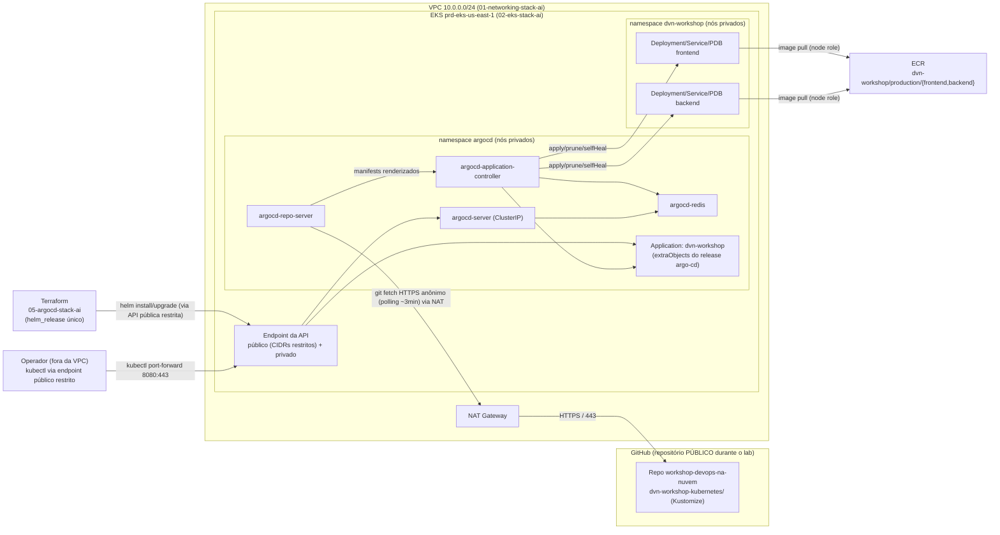

# ADR-0006: ArgoCD no cluster EKS e Application GitOps do repositório (`05-argocd-stack-ai`)

- **Status:** Approved
- **Data:** 2026-09-22
- **Autor:** Planner Agent
- **Supersedes:** N/A (não supersede o ADR-0003 — ver Seção 1, "Relação com o ADR-0003")
- **Ambiente:** `prd` (ambiente único do repositório)
- **Região AWS:** `us-east-1` (região padrão do projeto; o cluster alvo `prd-eks-us-east-1` já vive nesta região)
- **Histórico de revisões:**
  - `2026-09-22` — Versão inicial.
  - `2026-09-22` — **Revisão 1 (correção de precisão técnica sobre a topologia de rede):** a versão inicial descrevia as restrições do cluster de forma ambígua ("os nós estão em sub-redes privadas"), o que podia ser lido como "o cluster é privado / inacessível de fora da VPC". **Não é o caso:** `02-eks-stack-ai/eks.tf` declara `endpoint_public_access = true` **e** `endpoint_private_access = true`, com `public_access_cidrs` restrito por variável (ADR-0003, decisão D2/Opção A) — o **endpoint da API do cluster é público, restrito por CIDR**, e é por isso que `kubectl` funciona da estação do operador. O que vive em sub-rede privada são os **worker nodes** (o node group usa `data.aws_subnets.private`). Nenhuma decisão arquitetural mudou por conta disso — ao contrário, o acesso público restrito à API é **pré-requisito** da decisão D4/Opção A (`kubectl port-forward` a partir da máquina local) e de o provider `helm` autenticar de fora da VPC. Trechos ajustados: Seção 1, Premissa 1, Seção 4/D4 (Opções A e B), Seção 8 e Seção 11.
  - `2026-09-22` — **Revisão 2 (visibilidade do repositório confirmada: PRIVADO):** a Premissa 2 da versão inicial registrava a visibilidade do repositório Git como indeterminada (HTTP 404 na leitura pública) e deixava a decisão de credencial em aberto. **O solicitante confirmou que o repositório `leopoldocardoso/workshop-devops-na-nuvem` é/será privado.** Esta revisão fecha a lacuna: nova decisão **D6** (SSH deploy key read-only, escolhida frente a fine-grained PAT), `repoURL` da `Application` alterado para o formato SSH, novo recurso na Seção 6.2 (Secret de credencial), Seção 8 reescrita no item de credencial de repositório, novos riscos na Seção 11 (chave sem expiração, egress SSH, dívida de gestão de segredo), novos passos e critérios nas Seções 13.1/13.2/13.3/13.4, e Non-goal explícito de External Secrets/Secrets Manager (Seção 14). Nenhuma outra decisão (D1–D5) foi reaberta.
  - `2026-09-22` — **Revisão 3 (repositório passa a ser PÚBLICO durante o laboratório; credencial deixa de existir):** o solicitante decidiu, em 2026-09-22, tornar o repositório `leopoldocardoso/workshop-devops-na-nuvem` **público durante a execução do laboratório**, voltando a privado depois que todos os recursos forem destruídos. A motivação declarada é **redução de complexidade operacional do lab** — não é uma postura de segurança nem uma mudança de classificação de dados. Consequências registradas nesta revisão:
    - **D6 substituída:** a decisão passa a ser **"sem credencial"** — clone anônimo via HTTPS público (`repoURL = https://github.com/leopoldocardoso/workshop-devops-na-nuvem.git`). As Opções A (SSH deploy key read-only), B (fine-grained PAT) e C (GitHub App) permanecem **documentadas como consideradas e agora preteridas**, com o motivo. A decisão é **condicionada à visibilidade pública**: fechar o repositório invalida a premissa e leva a `Application` a `ComparisonError` — esse é o gatilho explícito para reabrir D6 na Opção A.
    - **D2 substituída:** a `Application` passa a ser declarada via **`extraObjects` dentro do release `argo-cd`** (antiga Opção C), e não mais pelo chart `argocd-apps 2.0.5` (antiga Opção A, agora preterida). Motivo: com credencial fora do caminho, sobra apenas um objeto a declarar — um único `helm_release`, uma única versão de chart a fixar, sem `depends_on` e sem um segundo chart a acompanhar. O contra já registrado ("mudar a Application força upgrade do release inteiro do ArgoCD") permanece documentado e é **aceito**, dado que há uma única `Application` e nenhum SLA sobre o ArgoCD.
    - **Premissas 2, 16 e 17 reescritas:** visibilidade pública; egress SSH/22 e ConfigMap de known hosts deixam de ser necessários — o caminho de saída dos nós passa a ser **HTTPS/443** pelo NAT Gateway.
    - **Seção 6 ajustada:** removidos o Secret de credencial e o segundo `helm_release`; diagrama e tabela de recursos atualizados.
    - **Seção 8 reescrita** no item de credencial de repositório; **Seção 11** perdeu os três riscos ligados à deploy key (chave sem expiração, egress SSH, dívida de gestão de segredo) e ganhou três riscos novos: exposição permanente de metadados já commitados, regeneração de `docs/deployments/` pelo driver durante a janela pública, e abertura a PRs de qualquer pessoa (que torna relevante a restrição da claim `sub` do role OIDC do ADR-0005 — registrada aqui como **recomendação e risco**, sem editar aquele ADR).
    - **Seções 13.1/13.2/13.3/13.4 ajustadas:** removidos passos/critérios de geração e cadastro da deploy key e de criação do Secret; incluídos o passo de **tornar o repositório público** como pré-requisito e a **conferência do conteúdo de `docs/deployments/`** antes do commit.
    - **Seção 14 ajustada:** External Secrets/Secrets Manager deixa de ser justificado pela credencial (permanece Non-goal por outros motivos) e reverter o repositório a privado é declarado operação fora do escopo desta ADR.
    - **Nenhuma outra decisão (D1, D3, D4, D5) foi reaberta.** Nenhum outro ADR foi editado.
  - `2026-09-23` — **Revisão 4 (correção de uma chave de `values` que não existe no chart + novo atributo de variável + registro da implantação real):** a stack `05-argocd-stack-ai` foi implementada e aplicada em produção em 2026-09-22/23. Esta revisão corrige **um erro factual do ADR sobre o chart** e registra o resultado medido. **Nenhuma decisão (D1–D6) foi reaberta; `Status` inalterado (`Approved`).**
    - **Correção — `applicationSet.enabled` NÃO existe no chart `argo-cd` 10.9.2** (Premissa 13, D3/Opção A, Seção 5, tabela 6.2, Seção 7 e critério da §13.3). O ADR prescrevia desabilitar o ApplicationSet com `applicationSet.enabled = false`; essa chave **não existe** no `values.yaml` da versão fixada, e `templates/argocd-applicationset/deployment.yaml` **não tem condicional de habilitação** — o controller é parte fixa do chart. **Implementado:** `applicationSet.replicas = 0` quando a variável `argocd.applicationset_enabled` é `false`. **Verificado em produção:** o Deployment existe com `replicas=0` e **nenhum pod sobe** — o namespace `argocd` roda **5 pods** (`application-controller`, `redis`, `repo-server`, `server`) mais o Job `redis-secret-init`. **A intenção do ADR — economizar pods num cluster de 2× `t3.medium` — é integralmente cumprida;** o que muda é o mecanismo, não o resultado.
    - **Novo atributo `argocd_application.enabled` (Seção 13.2).** A §13.2 não previa como expressar o passo 3 da §13.1 ("aplicar o release **sem** o bloco `extraObjects` da `Application` ainda"). Foi adicionado o atributo booleano `enabled` ao objeto `argocd_application`, o que torna o **rollout em 3 etapas** da §13.1 executável mexendo **apenas em `terraform.tfvars`**, sem editar código `.tf` entre as etapas. Registrado na §13.2 e na §9.
    - **Resultado da implantação registrado** em nova subseção ao final da Seção 13.4: rollout em 3 etapas executado (com um timeout transitório do Helm na etapa 3, absorvido pelo `atomic = true`), adoção dos workloads sem recriação e D6/Opção D validada em produção.
    - **Nenhum outro ADR foi editado por esta revisão** (ADR-0007 Revisão 3 e ADR-0008 Revisão 2 foram escritos no mesmo ciclo, cada um em seu próprio arquivo). **Nenhum `Status` foi alterado.** O diagrama `.drawio` não mudou: nenhum componente do desenho foi afetado (o ApplicationSet nunca figurou nele).

---

## 1. Contexto e Problema

Hoje o deploy das aplicações no cluster `prd-eks-us-east-1` é **push-based e manual**: o operador roda `kubectl apply -k dvn-workshop-kubernetes/` da sua estação, com autorização explícita em sessão. Isso significa que (a) o estado real do cluster não é verificável contra o Git sem inspeção manual, (b) qualquer alteração feita direto com `kubectl` fica como drift silencioso, e (c) a esteira pedida pelo solicitante — "o ArgoCD identifica as mudanças no arquivo kustomization e faz o deployment" — não tem como existir.

O solicitante pediu explicitamente que o ArgoCD seja instalado no cluster e configurado com uma `Application` apontando para este repositório (`leopoldocardoso/workshop-devops-na-nuvem`, **público durante o laboratório** — ver Revisão 3 e Premissa 2), de modo que o commit gerado pelo pipeline (ADR-0008) alterando a tag da imagem em `dvn-workshop-kubernetes/<app>/kustomization.yaml` seja detectado e sincronizado automaticamente.

**Topologia de rede relevante (precisão importa aqui):**

- O **endpoint da API do cluster é público e privado ao mesmo tempo**, com a lista de CIDRs públicos restrita (`endpoint_public_access = true`, `endpoint_private_access = true`, `public_access_cidrs = var.eks_cluster.endpoint_public_access_cidrs`, confirmado por leitura de `02-eks-stack-ai/eks.tf`; decisão D2/Opção A do ADR-0003). **Consequência: `kubectl` e o provider `helm` funcionam a partir da estação do operador, fora da VPC** — não há necessidade de bastion/VPN para operar o cluster.
- Os **worker nodes**, por outro lado, ficam em **sub-redes privadas** de `01-networking-stack-ai` (o node group consome `data.aws_subnets.private`), com saída para a internet via NAT Gateway único. É por esse caminho que o `argocd-repo-server` alcança o GitHub (HTTPS/443 — Premissa 16).
- O cluster **não tem AWS Load Balancer Controller nem Ingress** (ADR-0003 §14) e as sub-redes públicas de `01-` **não** possuem as tags `kubernetes.io/role/elb`/`internal-elb` (ADR-0003 Premissa 10).

A restrição que torna esta decisão não-trivial é, portanto, a **ausência de qualquer mecanismo de exposição L7/L4 gerenciado** (sem controller, sem tags de descoberta) — e não a inacessibilidade do cluster. Um `Service` do tipo `LoadBalancer` ficaria `<pending>` indefinidamente. Ou seja: existe caminho administrativo para operar o ArgoCD (o endpoint público restrito da API), mas **não** existe caminho pronto para publicar a UI dele em uma URL — e essa lacuna precisa ser resolvida explicitamente, não ignorada (Seção 4, D4).

**Visibilidade do repositório (mudança da Revisão 3).** A Revisão 2 desta ADR partia do repositório privado e, por isso, precisava resolver um segundo problema: o ArgoCD exigiria uma **credencial de leitura**, num cluster sem External Secrets Operator e sem Secrets Manager CSI Driver — ou seja, sem mecanismo automatizado de materializar segredo. **Esse problema deixa de existir na Revisão 3:** o solicitante decidiu tornar o repositório **público durante o laboratório**, voltando a privado depois que todos os recursos forem destruídos, com a motivação declarada de **reduzir complexidade operacional** (não é postura de segurança). Um repositório público é clonável anonimamente por HTTPS, logo o ArgoCD **não precisa de credencial alguma** — nenhum Secret, nenhuma deploy key, nenhum passo manual. Tratado na decisão **D6**, que passa a ser "sem credencial" e é **condicionada à visibilidade pública**: no instante em que o repositório voltar a ser privado, a `Application` vai a `ComparisonError` e D6 deve ser reaberta na Opção A (deploy key SSH read-only), que permanece documentada.

**Estado da implementação (Revisão 4).** A stack está aplicada, o ArgoCD roda no cluster e a `Application` `dvn-workshop` sincroniza a partir do repositório público. O único ponto do ADR que não sobreviveu ao contato com o chart real foi a **chave de `values` usada para desligar o ApplicationSet** (`applicationSet.enabled`, inexistente na versão 10.9.2) — corrigido nesta revisão sem alterar nenhuma decisão: o objetivo de não gastar pods com o ApplicationSet é cumprido por `applicationSet.replicas = 0`.

**O que passa a ser público (auditado nesta sessão).** O histórico Git foi auditado e **nenhum** `.tfstate`, `.tfvars`, `backend.hcl`, `.pem`, `.key` ou chave privada jamais foi adicionado em nenhum commit — não há segredo a vazar. O que **é** exposto são metadados de infraestrutura já commitados: o **account ID `659942169599`**, o ARN `arn:aws:iam::659942169599:user/atlantis` e o **endpoint do cluster** `https://B5F5B691F6CA0254AEA5DB33C5B7189A.yl4.us-east-1.eks.amazonaws.com`, presentes em `README.md`, `03-ecr-stack-ai/backend.hcl.example` e em `docs/deployments/`. Nenhum desses itens é, por si, credencial; todos são, porém, insumo de reconhecimento para um atacante, e a exposição é **irreversível** (Seção 11). Soma-se a isso o fato de que o driver `terraform-deploy` **sobrescreve `docs/deployments/<stack>.md` a cada apply** com `terraform output -json`, `terraform state list` e a identidade AWS — ou seja, um apply feito durante a janela pública publica automaticamente os outputs da stack aplicada (Seção 11 e passo de conferência em 13.1).

**Relação com o ADR-0003 (mudança de decisão):** a Seção 14 do ADR-0003 lista "ArgoCD" como Non-goal explícito daquela stack. Este ADR **não revoga nem edita** o ADR-0003: aquele documento continua correto no que decidiu — `02-eks-stack-ai` não instala ArgoCD. O que muda é o escopo do repositório: o ArgoCD passa a existir, em uma **stack separada** (`05-argocd-stack-ai`), sem alterar uma linha de `02-eks-stack-ai`. Trata-se de "um Non-goal do ADR-0003 endereçado por um ADR posterior", padrão já usado entre ADR-0001 (§14, compute como Non-goal) e ADR-0003. Qualquer atualização de `Status`/texto do ADR-0003 é decisão humana explícita e **não** é feita por este ADR.

**Relação com o ADR-0005 (impacto apenas relatado, sem edição).** Um repositório público aceita **pull request de qualquer pessoa**. Isso não afeta nenhuma decisão desta ADR, mas torna materialmente relevante a restrição da claim `sub` do role OIDC definido no ADR-0005 a `ref:refs/heads/main` (em vez de qualquer `ref`/`pull_request`), para que um PR de terceiro não consiga assumir o role de CI. **Isto é registrado aqui como recomendação e como risco (Seção 11); o ADR-0005 não foi lido-para-edição nem alterado por esta revisão** — qualquer ajuste lá é decisão humana explícita, em seu próprio ciclo. *(Revisão 4, nota factual: a stack `04-github-oidc-stack-ai` foi aplicada e a trust policy efetivamente criada **já** restringe o `sub` a `ref:refs/heads/main` nos dois formatos — a recomendação estava, de fato, contemplada no ADR-0005. Registro de leitura, não de edição.)*

## 2. Drivers de Decisão

**Requisitos funcionais (explícitos do solicitante)**
- ArgoCD instalado no cluster de `02-eks-stack-ai`.
- Uma `Application` configurada para este repositório, observando os manifests Kustomize de `dvn-workshop-kubernetes/`.
- Detecção automática da mudança de tag no `kustomization.yaml` e deploy consequente.
- **Mínima complexidade operacional de laboratório** — driver declarado pelo solicitante ao optar por tornar o repositório público durante o lab (Revisão 3).

**Requisitos funcionais derivados (decisão do arquiteto)**
- Sync automático com `prune` e `selfHeal` — sem isso, "identificar a mudança e fazer o deployment" exigiria clique manual, esvaziando o propósito da esteira.
- **Zero segredos no cluster, no Git e no `.tfstate`** — atendido, na Revisão 3, pela ausência total de credencial de repositório (D6).
- Adoção dos objetos já existentes no cluster (`dvn-workshop` namespace, Deployments/Services/PDBs aplicados manualmente) sem recriá-los.
- Acesso administrativo à UI/CLI do ArgoCD para operar rollback, reaproveitando o acesso à API do cluster que o operador já tem, **sem publicar a UI na internet**.
- Instalação declarativa em Terraform, coerente com o restante do repositório (nenhum `helm install` manual).
- **Footprint mínimo de pods** — componentes sem uso nesta esteira não devem consumir capacidade dos 2 nós (D3). O *mecanismo* de desligar cada componente é detalhe de implementação do chart; o requisito é "não subir o pod".

**Requisitos não funcionais**
- Sem SLA/RTO/RPO formal declarado. O ArgoCD é uma ferramenta de *control plane* de entrega: sua indisponibilidade não derruba as aplicações em execução, apenas congela novos deploys (RTO tolerante).
- Reconciliação em até ~3 min após o commit (default do ArgoCD) é aceitável para este workshop.

**Restrições**
- **Repositório Git público durante a janela do laboratório** (decisão do solicitante, 2026-09-22) — clone anônimo possível, mas todo conteúdo commitado torna-se permanentemente exposto (Seção 11).
- Cluster sem Ingress Controller/ALB Controller e sem tags `kubernetes.io/role/elb` nas sub-redes públicas → nenhuma exposição L7/L4 gerenciada disponível (um `Service` `LoadBalancer` fica `<pending>`).
- Worker nodes em sub-redes privadas, sem bastion/VPN/SSM provisionado → nenhum host dentro da VPC de onde consumir um `NodePort` hoje.
- Node group de **2× `t3.medium`** (2 vCPU / 4 GiB cada), já hospedando 4 pods de aplicação (2 frontend + 2 backend) além dos add-ons de sistema — capacidade é restrição real.
- Ambiente único `prd`: não há cluster de teste para validar a instalação antes.
- **O chart `argo-cd` 10.9.2 não oferece flag de habilitação para todo componente** (constatado na implementação): o `applicationSet` não tem `enabled` — o desligamento efetivo é por `replicas = 0` (Premissa 13).
- Convenções vinculantes: `.claude/rules/terraform-naming-conventions.md` e `.claude/rules/kubernetes-manifests.md`.

**Objetivos estratégicos**
- Tornar o Git a fonte única de verdade do estado do cluster (GitOps pull-based), eliminando `kubectl apply` manual como caminho de produção.
- Fechar o contrato com o CI: o pipeline nunca fala com o cluster — ele só escreve no Git (ADR-0007/0008).

## 3. Premissas (Assumptions)

1. **Cluster alvo e acessibilidade:** `prd-eks-us-east-1` (Kubernetes `1.34`), vivo, com **endpoint de API público (restrito por `public_access_cidrs`) e privado simultaneamente** — confirmado por leitura de `02-eks-stack-ai/eks.tf` (ADR-0003 D2/Opção A). O operador acessa o cluster diretamente da sua máquina, sem bastion/VPN, e tem acesso administrativo via Access Entry de criador (`bootstrap_cluster_creator_admin_permissions = true`, ADR-0003 Premissa 15). **A lista de CIDRs permitidos precisa conter o IP de saída de quem roda o Terraform desta stack** — se o IP do operador mudar (rede/ISP), tanto `kubectl` quanto o `terraform apply` desta stack falham por timeout, e a correção é em `02-`, fora do escopo desta ADR.
2. **Visibilidade do repositório Git: PÚBLICO durante o laboratório** (decisão do solicitante em 2026-09-22, Revisão 3). O repositório `leopoldocardoso/workshop-devops-na-nuvem` é tornado público antes da implementação desta stack e volta a privado depois que todos os recursos forem destruídos; a motivação declarada é **redução de complexidade operacional**, não postura de segurança. Consequência arquitetural: o ArgoCD clona **anonimamente por HTTPS** e **não exige credencial alguma** (D6) — nenhum Secret de repositório, nenhuma deploy key, nenhum passo manual. **Esta premissa é a condição de validade de D6:** se o repositório for fechado enquanto a `Application` existir, o `argocd-repo-server` falha na autenticação e a `Application` vai a `ComparisonError` — reabrir D6 na Opção A (deploy key SSH read-only, documentada em D6) é o caminho de correção. **Verificado em produção (Revisão 4):** o clone anônimo funciona e não existe nenhum Secret de repositório no cluster.
3. **Webhook do GitHub não é viável:** embora o endpoint da **API do cluster** seja público, o `argocd-server` não é publicado em nenhuma URL (Service `ClusterIP`, D4/A) — o GitHub não tem para onde entregar um webhook. A detecção de mudança será por **polling** do repositório (default de 3 min do ArgoCD). Latência aceita.
4. **Versões:** chart `argo-cd` do repositório `https://argoproj.github.io/argo-helm`, versão **`10.9.2`** (última publicada, validada no Artifact Hub em 2026-09-22). O `devops-engineer` deve reconfirmar a versão publicada no momento da implementação e **fixá-la** (`version = "..."`, nunca a última implícita). **O chart `argocd-apps` deixou de ser usado na Revisão 3** (D2 passou a `extraObjects`) — não há segunda versão de chart a fixar.
5. **Providers Terraform:** `hashicorp/helm` `~> 3.0` (última publicada validada via `terraform` MCP em 2026-09-22: `3.3.0`) e, se necessário para objetos avulsos, `hashicorp/kubernetes` `~> 3.0` (`3.2.1`). **Atenção:** no provider `helm` v3 a configuração de cluster é um **atributo** (`kubernetes = { ... }`), não um bloco — validar a sintaxe exata na doc do provider antes de escrever código.
6. **Autenticação do provider ao cluster:** via `exec` com `aws eks get-token` (credencial efêmera) contra o endpoint público restrito, nunca `config_path` de kubeconfig local — o kubeconfig do operador já se provou instável neste repositório (endpoint antigo após recriação do cluster, ver `CLAUDE.md`).
7. **Pull de imagens do ECR pelo ArgoCD:** não é necessário nada novo. O ArgoCD **não** puxa imagens de aplicação — quem puxa é o kubelet dos nós, cuja IAM Role (`prd-eks-node-role-us-east-1`) já tem `AmazonEC2ContainerRegistryReadOnly` (ADR-0004, README de `03-`). As imagens do próprio ArgoCD vêm de `quay.io`, alcançadas pelos nós privados via NAT Gateway de `01-`.
8. **IRSA não é necessário:** nenhum componente do ArgoCD nesta configuração chama a API da AWS (sem `ApplicationSet` de cluster generator AWS, sem plugin de ECR/Secrets Manager). IRSA por workload permanece Non-goal (ADR-0003 §14).
9. **Alta disponibilidade do ArgoCD:** instalação **não-HA** (réplica única por componente, Redis single). Ver D3 — capacidade de 2 nós não comporta o modo HA do chart.
10. **Namespace do ArgoCD:** `argocd`, criado pelo próprio release (`create_namespace = true`), distinto do namespace de aplicação `dvn-workshop`.
11. **Estado atual dos workloads:** os objetos de `dvn-workshop-kubernetes/` já foram aplicados manualmente no cluster (commit `ba5a5d1`). O ArgoCD irá **adotar** esses objetos na primeira sync (mesmos nomes/namespace), não duplicá-los; espera-se um estado inicial `OutOfSync`/`Synced` sem recriação de pods, desde que o conteúdo do Git seja idêntico ao aplicado. Ver risco na Seção 11. **Confirmada em produção (Revisão 4):** a primeira sync reportou os **7 objetos como `configured`, nenhum `created`** — adoção sem recriação, exatamente como previsto.
12. **Senha do admin:** o chart gera o Secret `argocd-initial-admin-secret` no cluster. **Nenhuma senha é definida via Terraform** (iria para o `.tfstate`). A troca/rotação é operação manual pós-instalação (Seção 8).
13. **SSO/Dex, Notifications e ApplicationSet: desligados** — não há IdP corporativo declarado, nem canal de notificação, nem uso de `ApplicationSet` nesta esteira. Economiza pods num cluster de 2 nós.
    - **Mecanismo por componente — corrigido na Revisão 4.** `dex.enabled = false` e `notifications.enabled = false` existem no `values.yaml` do chart `10.9.2` e são usados. **`applicationSet.enabled` NÃO existe** nessa versão: não há tal chave no `values.yaml`, e `templates/argocd-applicationset/deployment.yaml` **não possui condicional de habilitação** — o controller é parte fixa do chart. O desligamento efetivo é **`applicationSet.replicas = 0`**, aplicado quando a variável `argocd.applicationset_enabled` é `false`.
    - **Resultado verificado em produção:** o Deployment do ApplicationSet existe com `replicas=0` e **nenhum pod sobe**. O namespace `argocd` roda **5 pods** — `application-controller`, `redis`, `repo-server`, `server` — mais o Job `redis-secret-init`. **O objetivo de capacidade do ADR é integralmente cumprido**; apenas o mecanismo mudou. (O ADR original estimava "~6 pods"; o número real é menor.)
14. **`project_name = "argocd"`** para esta stack.
15. **Tags `Owner`/`CostCenter`:** mesmos valores já materializados em `02-`/`03-` (`Leopoldo Peixoto Cardoso` / `workshop-devops-na-nuvem`).
16. **Egress HTTPS dos nós (Revisão 3):** assume-se que os nós privados conseguem abrir conexão de saída para `github.com` na porta **443** através do NAT Gateway (o Security Group do node group do EKS permite todo o egress por padrão, e o NAT não filtra por porta). É o **mesmo caminho já comprovadamente em uso** para puxar imagens de `quay.io`/ECR, portanto o risco residual é baixo. **Egress SSH na porta 22 deixou de ser necessário** — a Revisão 2 exigia isso por causa da deploy key; com clone anônimo por HTTPS, não há mais dependência da 22. **Confirmado em produção (Revisão 4):** o `argocd-repo-server` alcança o GitHub por HTTPS/443 sem ajuste algum de rede.
17. **Verificação de host / TLS (Revisão 3):** com HTTPS, a autenticidade do `github.com` é verificada pela **cadeia de CAs pública** já presente na imagem do `argocd-repo-server` — **não há ConfigMap `argocd-ssh-known-hosts-cm` a conferir nem chave de host SSH a manter** (exigência que existia na Revisão 2 e foi removida). Nenhuma configuração de TLS customizada (`argocd-tls-certs-cm`) é necessária para um repositório público no `github.com`.

## 4. Opções Consideradas

### D1 — Método de instalação do ArgoCD

#### Opção A — `helm_release` (chart oficial `argo-cd`) a partir de uma stack Terraform dedicada *(ESCOLHIDA)*
- **Descrição:** nova stack `05-argocd-stack-ai` com providers `aws` + `helm`, instalando o chart `argo-cd` `10.9.2` no namespace `argocd`, com `values` versionados no repositório. Viável porque o endpoint da API é alcançável da máquina/CI que roda o Terraform (Premissa 1).
- **Prós:** instalação declarativa, versionada e com diff em PR, coerente com o resto do repositório; upgrade do ArgoCD vira um bump de `version` revisável; `helm_release` já expõe `atomic`/`cleanup_on_fail`/`wait` para um rollout seguro; o chart oficial é o caminho suportado pela comunidade (inclui CRDs, RBAC e todos os componentes).
- **Contras:** introduz o provider `helm` (e a dependência de acesso ao endpoint da API no momento do `plan`/`apply`) — se o cluster estiver indisponível **ou se o IP de saída do operador não estiver em `public_access_cidrs`**, `terraform plan` falha; acopla o ciclo de vida do ArgoCD ao Terraform, e não a ele mesmo.
- **Custo estimado:** USD 0,00 de serviço AWS; consumo de capacidade dos nós existentes (ver Seção 10).

#### Opção B — `kubectl apply` do manifesto `install.yaml` oficial (não-Helm)
- **Descrição:** aplicar o manifesto estável publicado pelo projeto ArgoCD, versionado no repositório.
- **Prós:** zero providers novos no Terraform; caminho "1 comando" da documentação oficial de quick start.
- **Contras:** é ClickOps com outro nome — um `kubectl apply` manual não fica registrado em nenhum state, não tem plan/diff nem drift detection; customizar (desligar Dex, ajustar resources) exigiria fork/patch do YAML; upgrade vira "baixar outro YAML e torcer". Contraria a diretriz "sem cliques/aplicações fora de IaC" do repositório.
- **Custo estimado:** idêntico.

#### Opção C — ArgoCD gerenciando a si próprio (app-of-apps com bootstrap mínimo)
- **Descrição:** instalar uma vez (por qualquer meio) e criar uma `Application` que aponta para o próprio chart do ArgoCD, deixando-o se auto-atualizar.
- **Prós:** elegante em maturidade GitOps alta; upgrade do ArgoCD passa a ser um commit.
- **Contras:** complexidade e risco desproporcionais para 2 apps e um time de um operador — um erro de values pode derrubar o componente que faria o rollback (self-lockout); ainda exige um bootstrap inicial, que é justamente o que se quer resolver.
- **Custo estimado:** idêntico.

**Decisão:** Opção A. Opção C fica registrada como evolução futura, depois que a esteira estiver estável.

---

### D2 — Como declarar a `Application` do repositório

> **Decisão alterada na Revisão 3.** A Revisão 2 escolhia o chart `argocd-apps` (Opção A). Com D6 passando a "sem credencial", o único objeto a declarar é a própria `Application` — e um segundo chart deixou de se pagar.

#### Opção A — `helm_release` do chart `argocd-apps` (`2.0.5`) *(preterida na Revisão 3 — era a escolhida na Revisão 2)*
- **Descrição:** um segundo `helm_release`, dependente do primeiro, cuja única função é renderizar a(s) `Application` do ArgoCD a partir de `values`.
- **Prós:** declarativo em Terraform, sem tocar em `kubernetes_manifest`; o chart é mantido pelo mesmo projeto; a `Application` fica versionada e com diff legível; ordenação natural via `depends_on` (CRDs já instalados pelo release anterior); desacopla o ciclo de vida da `Application` do ciclo de vida do ArgoCD.
- **Contras:** mais um chart/versão a fixar e acompanhar; mais um `helm_release` e um `depends_on` explícito a manter corretos num ambiente sem cluster de ensaio; o objeto `Application` fica no state do Terraform (e não no Git como manifesto puro), o que confunde um pouco a fronteira "quem é GitOps, quem é IaC".
- **Motivo da preterição (Revisão 3):** o driver desta decisão é **complexidade operacional de laboratório** (o mesmo que motivou o repositório público). Manter dois charts, duas versões fixadas e uma ordenação explícita para renderizar **um único** objeto `Application` não se justifica com um operador e nenhum SLA.
- **Custo estimado:** USD 0,00.

#### Opção B — `kubernetes_manifest` (provider `hashicorp/kubernetes`) com o CRD `argoproj.io/v1alpha1/Application`
- **Descrição:** declarar a `Application` como manifesto genérico.
- **Prós:** sem chart intermediário; o YAML fica explícito no `.tf`.
- **Contras:** `kubernetes_manifest` exige que o **CRD já exista no cluster em tempo de `plan`** — em um apply do zero (cluster sem ArgoCD ainda) o plan falha, obrigando a dois applies em sequência ou a `-target`. Fragilidade conhecida e mal tolerada em `prd` sem ambiente de ensaio.
- **Custo estimado:** USD 0,00.

#### Opção C — `extraObjects` dentro do próprio release do `argo-cd` *(ESCOLHIDA na Revisão 3)*
- **Descrição:** embutir o manifesto da `Application` no `values` do chart principal (`extraObjects`), renderizado pelo mesmo release que instala o ArgoCD.
- **Prós:** **um único `helm_release`, uma única versão de chart a fixar**; sem `depends_on`; sem o chart `argocd-apps 2.0.5` a acompanhar em release notes; a ordenação CRD → `Application` é resolvida pelo próprio Helm dentro do release, eliminando a classe de erro "Application aplicada antes do CRD"; menos superfície de manutenção para um operador só.
- **Contras:** mistura instalação e conteúdo aplicado; **uma mudança na `Application` força upgrade do release do ArgoCD inteiro**, com risco de reiniciar componentes. **Contra aceito** (Revisão 3): existe **uma única** `Application`, que muda raramente (`repoURL`, `path`, `targetRevision` e `syncPolicy` são estáveis — a tag da imagem muda no Git, não aqui), e o ArgoCD não tem SLA: um restart de alguns minutos congela deploys, não derruba aplicação. Se o número de `Application`s crescer, reavaliar a Opção A.
- **Custo estimado:** USD 0,00.

**Decisão:** Opção C. Opção A fica registrada como o caminho de volta caso passem a existir múltiplas `Application`s ou caso o acoplamento "upgrade do ArgoCD ↔ mudança de Application" comece a doer.

> **Nota da Revisão 4:** o acoplamento previsto nesta opção é justamente o que torna útil o novo atributo `argocd_application.enabled` (§13.2): ligar/desligar o bloco `extraObjects` passa a ser mudança de **valor** em `terraform.tfvars`, e não de código — viabilizando o rollout em 3 etapas da §13.1 sem editar `.tf` entre as etapas.

---

### D3 — Topologia do ArgoCD (HA vs. não-HA) e footprint

#### Opção A — Instalação não-HA, com Dex/Notifications/ApplicationSet desligados *(ESCOLHIDA)*
- **Descrição:** réplica única de `argocd-server`, `argocd-repo-server`, `argocd-application-controller` e `argocd-redis`; `dex.enabled = false`, `notifications.enabled = false` e **`applicationSet.replicas = 0`**; `requests`/`limits` explícitos e modestos em todos os componentes.
  - *(Corrigido na Revisão 4: a redação original prescrevia `applicationSet.enabled = false`, **chave que não existe** no chart `argo-cd` 10.9.2 — o template do ApplicationSet não tem condicional de habilitação. O desligamento efetivo, e implementado, é `replicas = 0`; ver Premissa 13.)*
- **Prós:** cabe no node group de 2× `t3.medium` sem competir com os pods de aplicação; menor superfície de falha e de configuração; indisponibilidade do ArgoCD não afeta as aplicações rodando.
- **Contras:** um drain/upgrade de nó torna o ArgoCD indisponível por alguns minutos (sem PDB efetivo com 1 réplica); sem SSO, o acesso é pelo usuário `admin` local. **Contra específico do mecanismo (Revisão 4):** com `replicas = 0` o **objeto Deployment do ApplicationSet continua existindo** no cluster (sem pods), diferente do que um `enabled = false` faria — é ruído de inventário, sem consumo de capacidade e sem efeito funcional.
- **Custo estimado:** **5 pods adicionais** medidos em produção (`application-controller`, `redis`, `repo-server`, `server`, mais o Job `redis-secret-init`); sem custo AWS direto. *(A estimativa original do ADR era "~6 pods".)*

#### Opção B — Modo HA do chart (`redis-ha`, múltiplas réplicas)
- **Descrição:** `redis-ha.enabled=true`, réplicas ≥2 de server/repo-server/controller.
- **Prós:** ArgoCD sobrevive à perda de um nó sem interrupção; recomendado para produção com muitos clusters/apps.
- **Contras:** o modo HA sozinho pede na ordem de 10+ pods e vários GiB de RAM — não cabe em 2× `t3.medium` junto das aplicações; exigiria ampliar o node group (custo recorrente) para proteger uma ferramenta cuja indisponibilidade não derruba o workload.
- **Custo estimado:** +1 a 2 nós `t3.medium` (~USD 30–60/mês).

**Decisão:** Opção A, coerente com o porte do ambiente. Reavaliar se o número de Applications/clusters crescer.

---

### D4 — Acesso à UI/CLI do ArgoCD

> Contexto para as três opções: o **endpoint da API do cluster já é acessível da máquina do operador** (público, restrito por CIDR — Premissa 1). A pergunta aqui **não** é "como alcançar o cluster", e sim "a UI do ArgoCD deve ganhar um endereço próprio publicado, ou basta tunelar pelo acesso à API que já existe?".

#### Opção A — Service `ClusterIP` + `kubectl port-forward` sob demanda *(ESCOLHIDA)*
- **Descrição:** Service default do chart (`ClusterIP`); o operador acessa com `kubectl port-forward -n argocd svc/argocd-server 8080:443`, tunelando pelo endpoint público restrito da API do EKS — o mesmo caminho que ele já usa hoje para `kubectl apply`.
- **Prós:** **funciona direto da estação do operador, sem bastion/VPN**, porque reaproveita o acesso à API que já existe; nenhuma porta nova exposta à internet e nenhum recurso de rede novo; autenticação e autorização herdam o controle IAM/Access Entry já em vigor (quem não pode falar com a API do cluster não alcança a UI); não depende de ALB Controller/Ingress (ausentes) nem das tags `kubernetes.io/role/elb` (inexistentes); custo zero.
- **Contras:** acesso só de uma estação com `kubectl`, credencial AWS e IP dentro de `public_access_cidrs`; sem URL fixa para compartilhar com outras pessoas; nenhum webhook do GitHub consegue chegar ao `argocd-server` (daí o polling, Premissa 3).
- **Custo estimado:** USD 0,00.

#### Opção B — Service `NodePort` (padrão dos workloads deste repositório)
- **Descrição:** expor `argocd-server` como `NodePort`, alcançável de dentro da VPC.
- **Prós:** consistente com `.claude/rules/kubernetes-manifests.md`, que padroniza `NodePort` para workloads; acessível por qualquer host da VPC.
- **Contras:** os **nós** estão em sub-redes privadas e hoje **não há host dentro da VPC** (sem bastion/VPN/SSM) de onde consumir esse NodePort — a porta aberta não entrega acesso a ninguém que já não tenha acesso à API, só amplia superfície dentro da VPC; a regra citada trata de *workloads de aplicação*, e o ArgoCD é infraestrutura de cluster.
- **Custo estimado:** USD 0,00 (mas exigiria bastion/VPN para ser útil: +custo e +ADR).

#### Opção C — Service `LoadBalancer` / Ingress público com TLS
- **Descrição:** expor a UI na internet com certificado ACM e DNS.
- **Prós:** URL estável, permite webhook do GitHub (sync instantâneo) e acesso sem `kubectl`/credencial AWS.
- **Contras:** o cluster não tem AWS Load Balancer Controller (ADR-0003 §14) e as sub-redes públicas não têm as tags de descoberta de ELB (ADR-0003 Premissa 10) — um Service `LoadBalancer` ficaria `<pending>` (comportamento já documentado em `CLAUDE.md`); habilitar isso é uma decisão de arquitetura própria (instalar o controller, tagear sub-redes de `01-`, publicar um painel administrativo na internet com credencial local) que extrapola o escopo desta ADR.
- **Custo estimado:** +~USD 18–25/mês de NLB/ALB, além do trabalho de habilitar o controller.

**Decisão:** Opção A. Ela é suficiente justamente **porque** o acesso à API do cluster já é direto da máquina do operador — não há aqui uma limitação a contornar, e sim a escolha de não criar um segundo canal de exposição para um painel administrativo. Opção C fica como Non-goal explícito (Seção 14) e candidata a ADR futuro, caso sync instantâneo por webhook ou acesso multiusuário sem `kubectl` se tornem requisito.

---

### D5 — Política de sincronização da `Application`

#### Opção A — `automated` com `prune: true` e `selfHeal: true` *(ESCOLHIDA)*
- **Descrição:** sync automático; recursos removidos do Git são removidos do cluster; divergências feitas por `kubectl` são revertidas.
- **Prós:** entrega o requisito literal do solicitante (commit → deploy sem intervenção); elimina drift manual, que é justamente o problema atual; torna o Git auditável como estado real. **Em operação desde 2026-09-22/23:** a esteira do ADR-0007/0008 já produziu promoções que o ArgoCD sincronizou sem intervenção.
- **Contras:** `prune` pode deletar objetos se alguém remover arquivos do Git por engano; `selfHeal` impede hotfix manual via `kubectl` (por design) — e, como o operador **tem** acesso direto ao cluster, essa tentação existe de fato; um commit ruim vai a produção sem revisão humana adicional. **Agravante confirmado:** a branch `main` **não tem branch protection nem ruleset hoje** (confirmado pelo solicitante em 2026-09-22, ver ADR-0008 D3), então não há porta de revisão obrigatória antes do commit — a mitigação passa a ser a validação `kustomize build` feita pelo próprio pipeline antes do write-back (ADR-0008).
- **Custo estimado:** USD 0,00.

#### Opção B — Sync manual (`syncPolicy` vazia)
- **Descrição:** ArgoCD detecta `OutOfSync` e espera clique/CLI.
- **Prós:** porta de revisão humana antes de cada deploy em `prd` — o que seria uma compensação pela ausência de branch protection.
- **Contras:** contraria o pedido explícito de automação; e, com acesso à UI apenas por `port-forward`, cada deploy dependeria do operador estar na frente da máquina.
- **Custo estimado:** USD 0,00.

**Decisão:** Opção A, com `prune`/`selfHeal` habilitados. A revisão humana que normalmente moraria no PR não existe hoje (sem branch protection); o contrapeso adotado é a validação automatizada antes do commit, definida no ADR-0008, e a recomendação — não bloqueante — de habilitar branch protection em `main`. Sem `CreateNamespace=true` — o namespace `dvn-workshop` é um objeto do próprio Kustomize (`namespace.yaml`).

---

### D6 — Acesso do ArgoCD ao repositório Git

> **Decisão substituída na Revisão 3.** A Revisão 2 (repositório privado) escolhia a Opção A (SSH deploy key read-only). Com a decisão do solicitante de tornar o repositório **público durante o laboratório** (Premissa 2), a pergunta deixa de ser "qual credencial usar" e passa a ser "usar credencial ou não". As três opções de credencial permanecem documentadas abaixo, agora **preteridas**, porque são exatamente o caminho de volta se o repositório for fechado.
>
> Lembrete técnico que segue valendo para qualquer opção com credencial: o ArgoCD lê a credencial de um `Secret` no namespace `argocd` com a label `argocd.argoproj.io/secret-type: repository`, e o campo `url` desse Secret precisa **casar exatamente** com o `source.repoURL` da `Application`.

#### Opção D — **Sem credencial: clone anônimo via HTTPS público** *(ESCOLHIDA na Revisão 3; **validada em produção na Revisão 4**)*
- **Descrição:** com o repositório público, a `Application` usa `source.repoURL = https://github.com/leopoldocardoso/workshop-devops-na-nuvem.git` e o `argocd-repo-server` faz `git fetch` **anônimo** sobre HTTPS/443, pelo NAT Gateway. **Nenhum `Secret` de repositório é criado**, nenhuma chave é gerada, nenhuma configuração de credencial entra em `values`.
- **Prós:** **elimina inteiramente a classe de problema "segredo no cluster"** — nada a gerar, cadastrar, rotacionar, revogar ou vazar; **remove o único passo manual da stack**, que era a razão pela qual ela não era 100% reproduzível por `terraform apply` (dívida técnica da Revisão 2, agora quitada por construção); remove o acoplamento entre Secret e `repoURL` (classe de erro `ComparisonError` por divergência `git@`×`https://`); remove a dependência de egress SSH/22 e de manutenção de known hosts (Premissas 16/17); usa o mesmo caminho de saída HTTPS já comprovado para `quay.io`/ECR; atende diretamente o driver declarado pelo solicitante (menor complexidade operacional do lab).
- **Validação em produção (Revisão 4):** o `argocd-repo-server` **clona o repositório público por HTTPS anonimamente**, sem nenhum `Secret` de repositório no cluster — a decisão funciona exatamente como desenhada, e a stack foi aplicada sem qualquer passo manual de credencial.
- **Contras:** **é condicional à visibilidade pública** — se o repositório voltar a ser privado com a `Application` ativa, o fetch falha e a `Application` vai a `ComparisonError` (sintoma e correção documentados na Seção 11 e no README da stack); não há credencial a revogar em um incidente — o controle de acesso ao código deixa de existir enquanto o repositório for público; torna permanente a exposição de tudo que está commitado, incluindo os metadados de infraestrutura auditados na Seção 1 (riscos na Seção 11). **Nenhum desses contras é de disponibilidade do deploy**; são de exposição, e foram aceitos conscientemente pelo solicitante para a janela do laboratório.
- **Custo estimado:** USD 0,00.

#### Opção A — SSH deploy key **read-only**, específica do repositório *(preterida na Revisão 3 — era a escolhida na Revisão 2; é o caminho de volta)*
- **Descrição:** par de chaves gerado localmente pelo operador; a **pública** é cadastrada em Settings → Deploy keys do repositório, **sem** marcar "Allow write access"; a **privada** vira o campo `sshPrivateKey` do Secret no namespace `argocd`. `repoURL = git@github.com:leopoldocardoso/workshop-devops-na-nuvem.git`.
- **Prós:** escopo mínimo por construção — uma deploy key vale para **um único repositório** e, sem write access, só permite `git fetch`/`clone`; **não está atrelada a nenhuma conta de usuário**; é o mecanismo recomendado na documentação do Argo CD para repositório único; a chave privada nunca precisa existir em nenhum sistema além da estação do operador e do etcd do cluster.
- **Contras:** deploy key **não expira** — a rotação é um processo manual que ninguém lembra de fazer; exige egress SSH (porta 22) dos nós privados pelo NAT; a chave privada precisa ser guardada com cuidado pelo operador fora do Git; e, sem External Secrets/CSI Driver no cluster, o Secret precisa ser criado **manualmente** (passo fora do IaC).
- **Motivo da preterição (Revisão 3):** com o repositório público, **não há nada a autenticar**. Toda a complexidade acima passa a ser custo sem benefício.
- **Reativação:** esta é a opção a adotar **imediatamente** se o repositório voltar a ser privado enquanto a `Application` existir (ver gatilho na Premissa 2 e no risco correspondente da Seção 11).
- **Custo estimado:** USD 0,00.

#### Opção B — Fine-grained PAT com `Contents: read`, restrito a este repositório *(preterida)*
- **Descrição:** token pessoal de escopo fino, com permissão `Contents: read` apenas para `workshop-devops-na-nuvem`, gravado como `password` (com `username` qualquer) no Secret do ArgoCD. `repoURL` em HTTPS.
- **Prós:** **expira** (data de validade obrigatória), o que força rotação e limita a janela de um vazamento; usa HTTPS/443, sem depender de egress SSH; permissão declarada de forma legível na UI do GitHub.
- **Contras:** está **vinculado a uma conta de usuário** — se a conta perder acesso ao repositório, ou o token expirar sem aviso, o ArgoCD para de sincronizar silenciosamente (a `Application` fica `Unknown` e ninguém é notificado, já que Notifications está desabilitado); a expiração, que é a maior vantagem, vira o maior risco operacional num ambiente sem alertas.
- **Motivo da preterição (Revisão 3):** mesmo motivo da Opção A — repositório público não exige credencial; e, mesmo no cenário de volta ao privado, a Opção A continua preferível (desacoplada de conta pessoal, sem falha silenciosa por expiração).
- **Custo estimado:** USD 0,00.

#### Opção C — GitHub App instalado no repositório (credencial de app, `githubAppPrivateKey`) *(preterida)*
- **Descrição:** o ArgoCD suporta autenticação via GitHub App (App ID, Installation ID e chave privada no Secret).
- **Prós:** tokens de curta duração renovados automaticamente; não atrelado a pessoa; permissão granular e auditável; é o caminho mais robusto para múltiplos repositórios/organizações.
- **Contras:** três segredos a gerir em vez de um, e ainda assim uma **chave privada de longa duração** no cluster; complexidade desproporcional para **um** repositório e um operador; sobrepõe-se à decisão do ADR-0008 (que optou por não introduzir GitHub App no CI), sem ganho equivalente aqui.
- **Motivo da preterição (Revisão 3):** é a opção de maior complexidade operacional das quatro — exatamente o oposto do driver que motivou esta revisão.
- **Custo estimado:** USD 0,00.

**Decisão:** **Opção D — sem credencial, clone anônimo por HTTPS público.** O fator decisivo é o driver declarado pelo solicitante (redução de complexidade operacional do laboratório) combinado ao fato de que a decisão de visibilidade **já foi tomada por ele**: dado um repositório público, qualquer credencial seria trabalho e superfície sem função. O ganho arquitetural colateral é relevante e deve ser registrado: some-se o passo manual do Secret (a única razão pela qual `05-argocd-stack-ai` não era reproduzível por `terraform apply` puro) e a stack volta a ser 100% IaC. **Confirmado na prática (Revisão 4).**

**Condicionalidade explícita (parte da decisão, não observação).** Esta decisão **vale enquanto o repositório for público**. Fechar o repositório — inclusive o retorno planejado a privado após a destruição dos recursos — **invalida a premissa** e, se houver `Application` ativa, produz `ComparisonError` no ArgoCD. Não se trata de um bug a investigar: é o comportamento esperado e o **gatilho documentado para reabrir D6 na Opção A**. A ordem correta no encerramento do laboratório é destruir a stack `05-` (e demais recursos) **antes** de fechar o repositório; reverter a visibilidade é operação fora do escopo desta ADR (Seção 14).

## 5. Decisão

Criar a stack **`05-argocd-stack-ai`**, com providers `aws` (para descobrir o cluster) + `helm`, contendo **um único `helm_release`**:

1. `helm_release "argocd"` — chart `argo-cd` `10.9.2` do repositório `https://argoproj.github.io/argo-helm`, namespace `argocd` (`create_namespace = true`), em modo **não-HA**, com **Dex e Notifications desabilitados (`enabled = false`) e o ApplicationSet desligado por `applicationSet.replicas = 0`** *(mecanismo corrigido na Revisão 4 — `applicationSet.enabled` não existe no chart 10.9.2; ver Premissa 13 e D3/A)*, `requests`/`limits` explícitos, Service `ClusterIP`, `wait = true`, `atomic = true`, `cleanup_on_fail = true` e `timeout` ampliado (CRDs + pods do release).
2. A `Application` `dvn-workshop` é declarada **dentro do mesmo release**, via `extraObjects` no `values` (D2/Opção C) — **sem** segundo `helm_release`, **sem** o chart `argocd-apps` e **sem** `depends_on`. Formato do objeto (trecho ilustrativo para esclarecer a decisão, **não** artefato de entrega):

   ```yaml
   # values do release argo-cd — extraObjects
   apiVersion: argoproj.io/v1alpha1
   kind: Application
   metadata:
     name: dvn-workshop
     namespace: argocd
   spec:
     project: default
     source:
       repoURL: https://github.com/leopoldocardoso/workshop-devops-na-nuvem.git
       path: dvn-workshop-kubernetes
       targetRevision: main
     destination:
       server: https://kubernetes.default.svc
       namespace: dvn-workshop
     syncPolicy:
       automated:
         prune: true
         selfHeal: true
   ```

   - `source.repoURL = https://github.com/leopoldocardoso/workshop-devops-na-nuvem.git` — **HTTPS público, sem credencial** (D6/Opção D). Nenhum `Secret` de repositório é criado no namespace `argocd`.
   - `source.path = dvn-workshop-kubernetes`
   - `source.targetRevision = main`
   - `destination.server = https://kubernetes.default.svc`, `destination.namespace = dvn-workshop`
   - `syncPolicy.automated = { prune = true, selfHeal = true }`
   - A **presença** deste bloco é controlada pelo atributo `argocd_application.enabled` (Revisão 4, §13.2), o que permite aplicar o release sem a `Application` na primeira etapa do rollout (§13.1, passo 3) mexendo apenas em `terraform.tfvars`.
3. Data sources `aws_eks_cluster`/`aws_eks_cluster_auth` (ou `exec` com `aws eks get-token`) para autenticar o provider `helm` contra o **endpoint público restrito** do cluster, sem kubeconfig local.

Acesso à UI por `kubectl port-forward` (tunelando pelo acesso à API que o operador já possui); detecção de mudanças por polling (~3 min); acesso ao Git **sem credencial**, condicionado à visibilidade pública do repositório durante o laboratório (D6). **Nenhum segredo é criado, versionado ou manipulado por esta stack.** Nenhuma alteração em `00-`–`04-`.

## 6. Arquitetura Proposta

### 6.1 Diagrama



> Diagrama editável equivalente, com fluxo "vivo" (setas animadas), em `docs/diagramas/ADR-0006-argocd-gitops-eks.drawio`. *(Não alterado pela Revisão 4: o ApplicationSet nunca figurou no diagrama — ele é justamente o componente que não sobe —, e nenhum outro componente mudou.)*

### 6.2 Recursos AWS

| Recurso | Tipo | Nome lógico | Região | Observações |
|---|---|---|---|---|
| Cluster EKS (existente) | `data.aws_eks_cluster` | `prd-eks-us-east-1` | `us-east-1` | Somente leitura — criado por `02-eks-stack-ai` (ADR-0003). Fornece `endpoint`/`certificate_authority` ao provider `helm`. |
| Endpoint da API do cluster (existente) | atributo de `aws_eks_cluster.vpc_config` | `endpoint_public_access = true` (CIDRs restritos) + `endpoint_private_access = true` | `us-east-1` | Canal pelo qual Terraform/`kubectl`/`port-forward` chegam ao cluster de fora da VPC (ADR-0003 D2). Não alterado por esta ADR. |
| Token de autenticação | `data.aws_eks_cluster_auth` (ou `exec` `aws eks get-token`) | `prd-eks-us-east-1` | `us-east-1` | Credencial efêmera do provider; nunca kubeconfig local (Premissa 6). |
| Release ArgoCD (**único**) | `helm_release` | `argocd` (chart `argo-cd` `10.9.2`) | cluster | Namespace `argocd`, não-HA, `ClusterIP`, **Dex/Notifications `enabled = false` e ApplicationSet com `replicas = 0`** (Premissa 13, corrigido na Revisão 4). **Inclui a `Application` via `extraObjects`** (D2/C). |
| `Application` `dvn-workshop` | objeto `argoproj.io/v1alpha1` renderizado pelo release acima (`extraObjects`) | `dvn-workshop` (namespace `argocd`) | cluster | `repoURL` **HTTPS público sem credencial** (D6/D), `path = dvn-workshop-kubernetes`, `targetRevision = main`, `automated` + `prune` + `selfHeal`. Presença controlada por `argocd_application.enabled` (§13.2). |
| Namespace `argocd` | objeto Kubernetes (via `create_namespace`) | `argocd` | cluster | Separado do namespace de aplicação `dvn-workshop`. **5 pods em execução** após o apply (Premissa 13). |
| Namespace/workloads `dvn-workshop` (existentes) | objetos Kubernetes | `dvn-workshop` | cluster | Passam a ser **geridos** pelo ArgoCD (adoção sem recriação, Premissa 11 — confirmada); nenhum arquivo de `dvn-workshop-kubernetes/` é alterado por esta ADR. |
| NAT Gateway (existente) | — | `01-networking-stack-ai` | `us-east-1` | Caminho de saída dos **nós privados** para `github.com` (git fetch **HTTPS/443** — Premissa 16) e `quay.io` (imagens do ArgoCD). |
| IAM Role do node group (existente) | — | `prd-eks-node-role-us-east-1` | global (IAM) | Já contém `AmazonEC2ContainerRegistryReadOnly` — é ela que autoriza o pull das imagens de aplicação do ECR (Premissa 7). Não é alterada. |
| Repositórios ECR (existentes) | — | `dvn-workshop/production/{frontend,backend}` | `us-east-1` | Destino do pull do kubelet; o ArgoCD não fala com o ECR. |

> **Removidos na Revisão 3:** o `Secret` de credencial de repositório (`repo-workshop-devops-na-nuvem`), a deploy key externa cadastrada no GitHub e o segundo `helm_release` (`argocd-apps`, chart `2.0.5`). Nenhum deles deve ser criado.
>
> **Observação da Revisão 4:** o **Deployment do ApplicationSet existe no cluster com `replicas = 0`** (sem pods). Não é recurso desejado nem resíduo a limpar — é consequência de o chart `10.9.2` não oferecer flag de habilitação para esse componente (Premissa 13).

### 6.3 Módulos Terraform Recomendados

Nenhum módulo de terceiros (padrão do repositório). Chart Helm **fixado por versão**:

| Componente | Versão (pinned) | Finalidade |
|---|---|---|
| provider `hashicorp/aws` | `~> 6.0` (validado `6.66.0` em 2026-09-22) | Data sources do cluster EKS. |
| provider `hashicorp/helm` | `~> 3.0` (validado `3.3.0` em 2026-09-22) | `helm_release`. Atenção à sintaxe de atributo `kubernetes = { ... }` do v3 (Premissa 5). |
| chart `argo-cd` (repo `https://argoproj.github.io/argo-helm`) | `10.9.2` (reconfirmar na implementação) | Instalação do ArgoCD **e** renderização da `Application` via `extraObjects`. **Ler o `values.yaml` da versão fixada antes de assumir qualquer chave** — foi exatamente aqui que o ADR errou ao supor `applicationSet.enabled` (Premissa 13). |

> O chart `argocd-apps` **não é mais usado** (D2 alterada na Revisão 3). O provider `hashicorp/kubernetes` **não é necessário** nesta stack — não há Secret nem objeto avulso a gerenciar; só adicione se algum objeto não sensível vier a exigir.

## 7. Avaliação Well-Architected

| Pilar | Como a decisão endereça |
|---|---|
| Operational Excellence | Git vira fonte única de verdade; `selfHeal` elimina drift manual; instalação/upgrade do ArgoCD em Terraform com diff revisável; histórico de sync do ArgoCD dá rastreabilidade de "qual commit está rodando"; operação direta da estação do operador, sem bastion. **Ganho da Revisão 3:** com D6/D (sem credencial) e D2/C (release único), a stack passa a ser **100% reproduzível por `terraform apply`** — não resta nenhum passo manual, nenhum segundo chart e nenhum `depends_on`. **Ganho da Revisão 4:** o atributo `argocd_application.enabled` torna o rollout em 3 etapas (§13.1) executável **só por `terraform.tfvars`**, sem editar código entre as etapas — o procedimento de instalação controlada deixa de depender de edição manual de `.tf`. |
| Security | A UI não ganha nenhum endereço público novo — o acesso é tunelado pelo endpoint da API já protegido por `public_access_cidrs` + IAM/Access Entries; **nenhum segredo é criado, versionado ou armazenado** (sem credencial de repositório, D6/D — **verificado em produção**) — a classe de risco "chave privada no cluster/`.tfstate`" desaparece; ArgoCD sem privilégios AWS (sem IRSA); CI não recebe credencial de cluster — só escreve no Git (pull-based); senha inicial não trafega pelo `.tfstate`; Dex/SSO desabilitado reduz superfície; o ApplicationSet não executa nenhum pod (`replicas = 0`), então também não é superfície ativa. **Contrapartida explícita:** enquanto o repositório for público, **não há controle de acesso ao código** e os metadados já commitados (account ID, ARN, endpoint do cluster) ficam permanentemente expostos — trade-off aceito pelo solicitante para a janela do lab, com riscos e mitigações na Seção 11. |
| Reliability | ArgoCD é control plane de entrega: sua queda não derruba as aplicações; `atomic`/`cleanup_on_fail` evitam release parcial — **comprovado em produção na Revisão 4**, quando um timeout transitório do Helm na etapa 3 do rollout resultou em rollback limpo, sem resíduo, e a repetição concluiu em 1m47s; `selfHeal` restaura o estado desejado após intervenções acidentais; **sem credencial não há falha de sync por token expirado/revogado** — o único gatilho de falha de acesso ao Git é a mudança de visibilidade do repositório (Premissa 2/D6, risco explícito na Seção 11); rollback GitOps por `git revert` (Seção 12). **Contrapartida de D2/C:** mudar a `Application` força upgrade do release do ArgoCD — aceito (1 Application, sem SLA). |
| Performance Efficiency | Polling de 3 min é suficiente para o ciclo de commits deste repositório; instalação não-HA com `requests`/`limits` calibrados evita competição por CPU/memória com os pods de aplicação nos 2 nós (footprint real medido: 5 pods). |
| Cost Optimization | USD 0,00 de serviço AWS; sem Load Balancer (D4/A) e sem nós adicionais (D3/A); sem necessidade de infraestrutura de segredo (External Secrets/Secrets Manager) — agora porque **não há segredo algum**, e não apenas por adiamento; a alternativa HA + LB custaria ~USD 50–85/mês para proteger uma ferramenta não crítica em runtime. |
| Sustainability | Reaproveita capacidade ociosa dos nós existentes em vez de provisionar infraestrutura de deploy dedicada; componentes não usados (Dex, Notifications, ApplicationSet) **não executam pods** — desligados por `enabled = false` ou, no caso do ApplicationSet, por `replicas = 0` (Premissa 13) — em vez de ficarem ociosos consumindo CPU/memória; um release a menos (D2/C) significa menos objetos e menos ciclos de reconciliação. |

## 8. Segurança

- **IAM:** nenhuma IAM Role nova. O ArgoCD não chama APIs da AWS (Premissa 8). O acesso do Terraform ao cluster usa a identidade do operador (Access Entry de criador, ADR-0003 Premissa 15) com token efêmero, pelo endpoint público restrito.
- **Superfície do endpoint da API:** o endpoint é público **com `public_access_cidrs` restrito** (ADR-0003 D2/A, que proíbe explicitamente `0.0.0.0/0`). Esta ADR **não** altera essa configuração, mas depende dela: manter a lista de CIDRs enxuta e atualizada é parte do controle de acesso efetivo à UI do ArgoCD, já que o `port-forward` passa por ali. **Nota da Revisão 3:** com o repositório público, o endpoint do cluster passa a ser informação pública (está commitado em `docs/deployments/` e no `README.md`) — mais uma razão para manter `public_access_cidrs` restrito, já que ele passa a ser o único controle de rede efetivo sobre a API.
- **Acesso ao repositório Git (D6 — reescrito na Revisão 3, validado na Revisão 4):** **não há credencial.** O repositório é público durante o laboratório e o `argocd-repo-server` faz `git fetch` **anônimo sobre HTTPS/443**. Regras não negociáveis que decorrem disso:
  - **Nenhum `Secret` de repositório é criado** no namespace `argocd`; nenhuma deploy key é gerada ou cadastrada no GitHub; nenhum PAT ou GitHub App é configurado. Se algum desses artefatos existir no cluster ao final da implementação, houve desvio da decisão. **Conferido após o apply: nenhum existe.**
  - Como não há credencial, **não há rotação, revogação nem gestão de expiração** — e, simetricamente, **não há controle de acesso de leitura ao código** enquanto o repositório for público. Isso é consequência aceita da decisão de visibilidade tomada pelo solicitante, não uma lacuna a corrigir dentro desta ADR.
  - **O `repoURL` deve ser exatamente `https://github.com/leopoldocardoso/workshop-devops-na-nuvem.git`.** Usar a forma SSH (`git@github.com:...`) sem Secret faz o fetch falhar por ausência de chave.
  - **Gatilho de falha conhecido:** se o repositório voltar a ser privado com a `Application` ativa, o fetch passa a exigir autenticação e a `Application` vai a `ComparisonError`/`Unknown`. Não é defeito de configuração — é a premissa quebrada (Premissa 2). Correção: reabrir D6 na Opção A (deploy key SSH read-only). Documentar esse sintoma no README da stack.
  - **Higiene de conteúdo enquanto público:** nenhum commit pode introduzir `.tfstate`, `.tfvars`, `backend.hcl`, chave privada ou credencial — o `.gitignore` já cobre esses caminhos e o histórico foi auditado como limpo (Seção 1), mas a janela pública remove a rede de segurança que a visibilidade privada oferecia. Atenção especial a `docs/deployments/`, regenerado automaticamente a cada apply (risco na Seção 11, passo de conferência em 13.1).
- **RBAC no cluster:** o chart cria as ServiceAccounts e ClusterRoles do ArgoCD. O `application-controller` precisa, por natureza, de permissão ampla para gerenciar os objetos que sincroniza — **restringir o escopo do ArgoCD ao namespace `dvn-workshop`** (via `configs.params."application.namespaces"` / RBAC namespaced) é recomendado e deve ser validado contra o `values.yaml` do chart na implementação.
- **Acesso à UI:** `ClusterIP` + `kubectl port-forward` (D4/A) — **nenhum Service `LoadBalancer`/`NodePort` e nenhum Ingress**. Quem não consegue falar com a API do cluster (IAM + CIDR) não alcança a UI. Trocar a senha do usuário `admin` logo após a instalação e **deletar** o Secret `argocd-initial-admin-secret`. SSO fica como Non-goal.
- **Criptografia em trânsito:** git fetch via **HTTPS/TLS**, com a autenticidade do `github.com` validada pela cadeia de CAs pública embutida na imagem do `argocd-repo-server` (Premissa 17 — sem known hosts SSH a manter); comunicação com a API do cluster e `port-forward` sobre TLS; comunicação ArgoCD↔API server via TLS interno do cluster.
- **Criptografia em repouso:** o único Secret relevante no namespace `argocd` passa a ser o `argocd-initial-admin-secret` (removido após a troca de senha), em etcd com envelope encryption (CMK dedicada, ADR-0003 D3).
- **Isolamento de rede:** os pods do ArgoCD rodam nos nós das **sub-redes privadas** de `01-`; a saída para `github.com` (HTTPS/443) e `quay.io` passa pelo NAT Gateway único. Nenhum componente do ArgoCD escuta na internet. Nenhuma NetworkPolicy é criada (o cluster não tem política padrão de negação — registrado como Non-goal).
- **Gestão de segredos:** **nenhum segredo é manuseado por esta stack** — nada em Git, nada em `values`, nada no `.tfstate`, nada criado manualmente no cluster. A dívida técnica registrada na Revisão 2 (passo manual do Secret) deixa de existir.
- **Logging e auditoria:** logs dos componentes ArgoCD ficam no cluster (`kubectl logs`); o control plane logging do EKS (ADR-0003) registra as chamadas à API feitas pelo controller; o histórico de sync/rollback fica na própria UI. **Não há** agregação de logs de workload em CloudWatch (Container Insights/Fluent Bit é Non-goal). Sem credencial de repositório, não há "last used" de deploy key a auditar — o acesso de leitura ao repositório passa a ser anônimo e não rastreável por construção.
- **Backup e retenção:** o estado do ArgoCD é integralmente derivável do Git + Terraform (reinstalável por `terraform apply`, sem nenhuma etapa manual). Recomenda-se exportar a configuração (`argocd admin export`) antes de upgrades de chart.
- **Compliance:** nenhum framework declarado. O modelo pull-based (o cluster puxa do Git; nenhuma credencial de cluster no CI) é favorável a qualquer auditoria futura, mas nenhum controle específico de LGPD/PCI foi desenhado. **Nota:** a decisão de tornar o repositório público é de conveniência operacional de laboratório e não seria aceitável sob um regime de compliance formal — caso algum venha a ser declarado, a visibilidade pública deve ser reavaliada antes de qualquer outra coisa.

## 9. Naming Convention & Tagging

- **Recursos AWS:** esta stack **não cria** recursos AWS cobráveis/tagueáveis — apenas objetos Kubernetes. As tags obrigatórias do repositório seguem aplicáveis via `default_tags` do provider `aws` caso algum recurso AWS venha a ser adicionado.
- **Convenções Terraform:** vinculante `.claude/rules/terraform-naming-conventions.md` — estrutura sugerida: `main.tf` (índice), `argocd.tf` (release do ArgoCD, incluindo os `extraObjects` da `Application`), `data.tf`, `locals.tf`, `variables.tf`, `outputs.tf`, `providers.tf`, `versions.tf`, `backend.tf`. Identificadores `snake_case`/singular; variáveis agrupadas em `object(...)` (sugestão: `variable "argocd"` com `{ namespace, chart_version, server_service_type, ha_enabled, dex_enabled, notifications_enabled, applicationset_enabled }` e `variable "argocd_application"` com `{ enabled, name, repo_url, path, target_revision, destination_namespace, automated_prune, automated_self_heal }`); **nenhuma `variable` com `default`**; outputs `{name}_{type}_{attribute}` com `description`. **Nenhuma variável recebe credencial** — não existe credencial nesta stack (D6/D).
  - *(Revisão 4: `argocd_application.enabled` acrescentado ao objeto — ver §13.2. `argocd.applicationset_enabled` permanece com esse nome por ser o nome do **requisito** — "o ApplicationSet deve estar ligado?" —, mas o valor `false` é traduzido em `applicationSet.replicas = 0` no `values`, e não em `applicationSet.enabled`, chave inexistente no chart.)*
- **Ambiente:** `local.environment = "prd"` fixo, sem `variable "environment"`.
- **Objetos Kubernetes:** os manifests de aplicação seguem `.claude/rules/kubernetes-manifests.md` e **não são alterados** por esta ADR. Os objetos do ArgoCD são renderizados pelo chart e seguem as labels do próprio chart — a regra de labels do projeto aplica-se a *workloads de aplicação*, não a componentes de infraestrutura de cluster instalados por chart de terceiro.
- **Tags obrigatórias** (para o caso de recursos AWS futuros nesta stack): `Environment = prd`, `Owner = "Leopoldo Peixoto Cardoso"`, `CostCenter = "workshop-devops-na-nuvem"`, `Project = "argocd"`, `ManagedBy = "terraform"`, `DataClassification = "confidential"`, `StackName = "05-argocd-stack-ai"`.

## 10. Custo Estimado

| Item | Modelo de pricing | Estimativa mensal (USD) |
|---|---|---|
| Componentes ArgoCD (**5 pods** medidos) no node group existente | capacidade já paga (2× `t3.medium` On-Demand, ADR-0003) | 0,00 incremental |
| Egress/NAT para `git fetch` HTTPS (polling ~480 fetches/dia, payload pequeno) + pull das imagens do ArgoCD (~1 GB únicos) | NAT Gateway data processing `US$ 0,045`/GB | ~0,50 – 2,00 |
| Acesso ao repositório Git | **sem credencial** (repositório público) — sem custo e sem artefato a gerir | 0,00 |
| Load Balancer para a UI | **não provisionado** (D4/A) | 0,00 |
| Nós adicionais para modo HA | **não provisionado** (D3/A) | 0,00 |
| **Total estimado** | | **~ USD 0,50 – 2,00/mês** |

> Risco de custo relevante: se o footprint do ArgoCD provocar `Pending` por falta de CPU/memória nos 2 nós, a mitigação é um 3º nó (`t3.medium` ≈ **USD 30/mês**) — ver Seção 11. **Não ocorreu:** com 5 pods e o ApplicationSet em `replicas = 0`, não houve pod `Pending`. Validar com `infracost scan` (não captura consumo de capacidade Kubernetes, apenas recursos AWS).

## 11. Riscos e Mitigações

| Risco | Probabilidade | Impacto | Mitigação |
|---|---|---|---|
| Capacidade insuficiente nos 2× `t3.medium` → pods do ArgoCD ou de aplicação em `Pending` | Média | Alto (deploy parado / app degradada) | Instalação não-HA com Dex/Notifications desligados e ApplicationSet em `replicas = 0`, com `requests` modestos (D3/A); validar `kubectl top nodes`/`describe node` no passo 7 da Seção 13.1; se faltar, escalar o node group para 3 nós antes de prosseguir. **Resultado real:** 5 pods no namespace `argocd`, **nenhum `Pending`** — risco não materializado. |
| **Exposição permanente dos metadados já commitados** (account ID `659942169599`, ARN `arn:aws:iam::659942169599:user/atlantis`, endpoint do cluster `https://B5F5B691F6CA0254AEA5DB33C5B7189A.yl4.us-east-1.eks.amazonaws.com`, em `README.md`, `03-ecr-stack-ai/backend.hcl.example` e `docs/deployments/`) — **tornar o repositório privado depois NÃO desfaz a exposição**: clones, forks, caches de terceiros, code search e arquivadores preservam o conteúdo indefinidamente | **Alta (é certeza, não probabilidade)** | Médio (reconhecimento facilitado: enumeração de conta, alvo de `AssumeRole`/confused deputy, endpoint de API conhecido — **nenhum deles é credencial**) | Aceito conscientemente pelo solicitante como custo da simplificação do lab. Compensações: manter `public_access_cidrs` do cluster restrito (ADR-0003 D2 — é o controle de rede efetivo sobre o endpoint agora público); não commitar nada novo com metadados sensíveis durante a janela; ao encerrar o lab, destruir os recursos **antes** de fechar o repositório e tratar o account ID/endpoint como conhecidos para sempre (rotacionar credenciais do usuário `atlantis` se ele ainda existir). Não há mitigação que reverta a exposição. |
| **`docs/deployments/` regenerado pelo driver durante a janela pública** — `terraform-deploy` sobrescreve `docs/deployments/<stack>.md` a cada apply com `terraform output -json`, `terraform state list` e a identidade AWS; um apply da stack `05-` (ou de qualquer outra) publica automaticamente esses dados | **Alta** | Médio (outputs e inventário de state da stack tornam-se públicos sem revisão humana) | **Conferir o conteúdo de `docs/deployments/<stack>.md` antes de commitar** (passo explícito em 13.1); a stack `05-` não deve expor nenhum output sensível por construção (Seção 13.3 fixa a lista de outputs, nenhum deles secreto); se um output sensível aparecer, **não commitar** o arquivo e reportar ao operador antes de qualquer push. Vale para toda stack aplicada durante a janela pública, não só a `05-`. |
| **Repositório público aceita PR de qualquer pessoa** → um PR de terceiro pode tentar acionar workflows do GitHub Actions e, se o `trust policy` do role OIDC do ADR-0005 não restringir a claim `sub`, assumir o role de CI | Média | **Alto** (acesso a credenciais AWS de CI a partir de um PR não confiável) | **Recomendação (não executada por esta ADR):** garantir que a condição `token.actions.githubusercontent.com:sub` do role OIDC esteja restrita a `repo:leopoldocardoso/workshop-devops-na-nuvem:ref:refs/heads/main` — **nunca** `:*` nem `pull_request`; e que workflows sensíveis não rodem em `pull_request` de forks (`pull_request_target` é especialmente perigoso). Complementos: exigir aprovação manual para workflows de contribuidores externos (configuração padrão do GitHub para first-time contributors) e revisar todo PR externo antes de qualquer merge. **Isto é registrado como recomendação e risco; o ADR-0005 não foi alterado por esta revisão** — ajustá-lo é decisão humana explícita, em seu próprio ciclo. **Nota factual da Revisão 4:** a trust policy aplicada pela stack `04-` **já** está restrita a `ref:refs/heads/main` nos dois formatos (leitura via `iam:GetRole`), ou seja, a recomendação está atendida pelo desenho original do ADR-0005. |
| **Repositório voltar a ser privado com a `Application` ativa** → fetch anônimo passa a exigir autenticação; `Application` vai a `ComparisonError`/`Unknown` e os deploys congelam (aplicações em execução seguem rodando) | Média (é o estado final planejado do lab) | Médio | Ordem correta de encerramento: **destruir a stack `05-` antes de fechar o repositório** (Seção 12). Se for necessário manter o ArgoCD com repositório privado, **reabrir D6 na Opção A** (deploy key SSH read-only, documentada em D2/D6) — é mudança de ADR, não ajuste de configuração. Sintoma e diagnóstico documentados no README da stack. |
| Egress HTTPS (porta 443) bloqueado a partir dos nós privados para `github.com` | Baixa (mesmo caminho já usado para `quay.io`/ECR) | Médio | Premissa 16 + validação no passo 5 da Seção 13.1 (logs do `argocd-repo-server` / `argocd repo list`). **Não ocorreu** (Revisão 4). |
| IP de saída do operador/CI fora de `public_access_cidrs` (mudança de rede/ISP) → `terraform plan/apply` desta stack e `kubectl port-forward` falham por timeout | Média | Médio (operação do ArgoCD bloqueada; workloads seguem rodando) | Diagnóstico explícito no README da stack (é erro de CIDR, não de chart); correção é atualizar `endpoint_public_access_cidrs` em `02-` — **fora do escopo desta ADR**, reportar ao operador. |
| `prune: true` deletar objetos por remoção acidental de arquivos no Git | Média | Alto | `git revert` restaura em minutos; histórico de sync do ArgoCD permite rollback dirigido. **Atenção:** como `main` não tem branch protection (ADR-0008 D3), não há revisão obrigatória antes — a validação `kustomize build` do pipeline (ADR-0008) é o principal guard-rail automatizado. |
| Manifesto inválido/quebrado commitado em `main` se propaga sozinho ao cluster (`automated` + `selfHeal`, sem branch protection) | Média | Alto | Validação `kustomize build` no pipeline antes do write-back (ADR-0008 §11); `maxUnavailable: 0` mantém as réplicas antigas servindo enquanto o rollout novo falha; recomendação (não bloqueante) de habilitar branch protection em `main` — **reforçada pela abertura a PRs externos** (risco acima). |
| **Mudança na `Application` força upgrade do release inteiro do ArgoCD** (consequência aceita de D2/Opção C) | Média | Baixo | Aceito: há **uma** `Application`, que muda raramente; `atomic`/`cleanup_on_fail` protegem contra release parcial; o restart de componentes congela deploys por minutos, não derruba aplicação. Se surgirem múltiplas `Application`s, reavaliar D2 na Opção A (`argocd-apps`). |
| **Timeout transitório do Helm durante o `apply` do release** (`create: failed to create: Timeout`) | Média (ocorreu uma vez na etapa 3 do rollout) | Baixo | **Comportamento observado e tratado:** `atomic = true` promoveu **rollback limpo, sem resíduo** no cluster; a simples repetição do `apply` concluiu em **1m47s**. Registro operacional: o rollout em 3 etapas funciona e o `atomic` protege de fato — um timeout aqui é para ser repetido, não investigado como corrupção de estado. |
| Adoção dos objetos existentes gerar recriação de pods na primeira sync | Média | Médio (breve indisponibilidade; `maxUnavailable: 0` protege) | Passo 6 da Seção 13.1: criar a `Application` sem `automated`, conferir o diff na UI e só então habilitar. **Risco não materializado (Revisão 4):** a primeira sync reportou os **7 objetos como `configured`, nenhum `created`**. |
| `selfHeal` reverter um hotfix manual legítimo durante um incidente — agravado pelo fato de o operador ter acesso direto e fácil ao cluster | Média | Médio | Procedimento de incidente documentado: alterar no Git (ou desabilitar `automated` temporariamente na `Application`) em vez de `kubectl edit`. |
| `helm_release` falhar deixando release parcial | Baixa | Médio | `atomic = true` + `cleanup_on_fail = true` + `timeout` ampliado; rollback na Seção 12. **Validado na prática** (ver risco de timeout acima). |
| Provider `helm` exigir acesso ao cluster em tempo de `plan` | Média | Baixo | Stack isolada; autenticação via `exec`/`aws eks get-token` (Premissa 6). |
| **Supor chaves de `values` inexistentes no chart** (foi o caso de `applicationSet.enabled`, Premissa 13) | Média | Baixo (o erro aparece no `apply`/no comportamento, não em produção silenciosa) | **Ler o `values.yaml` e os templates da versão fixada antes de escrever qualquer chave** (já exigido no passo 3 da Seção 13.1 e reforçado na tabela 6.3). No caso concreto, o desvio foi detectado na implementação e resolvido com `replicas = 0`, preservando a intenção do ADR. |
| Upgrade de chart do ArgoCD introduzir breaking change de CRD | Baixa | Médio | Versão fixada; `argocd admin export` antes do bump; release notes revisadas no PR. |
| Sync de 3 min percebido como "pipeline travada" | Média | Baixo | Documentar a latência no README da stack. |
| Lifecycle policy do ECR (10 tags mais recentes, ADR-0004) expirar imagem ainda referenciada por commit antigo → rollback cai em `ImagePullBackOff` | Média | Alto | Documentar a janela real de rollback (ADR-0008); rollback além disso exige re-run do workflow. **Não altere `03-` por conta desta ADR.** |

## 12. Estratégia de Rollback

1. **Rollback de uma versão de aplicação (caminho normal, GitOps):** `git revert` do commit que alterou o `kustomization.yaml` → ArgoCD detecta em ~3 min e sincroniza a tag anterior. Requer que a tag anterior ainda exista no ECR (janela de 10 tags, ADR-0004). Alternativa imediata: `argocd app rollback dvn-workshop <revision>` via CLI (com `automated` temporariamente desabilitado, senão o `selfHeal` reverte o rollback).
2. **Rollback do release do ArgoCD (upgrade de chart ruim, ou mudança de `Application` malsucedida — lembrando que ambas passam pelo mesmo release, D2/C):** `terraform apply` com a versão/values anteriores (o diff é pequeno), ou `helm rollback argocd <revision> -n argocd` como medida emergencial — reconciliando depois o state do Terraform. **Caso de falha transitória** (timeout do Helm durante o `apply`): com `atomic = true` o rollback é automático e sem resíduo — a ação correta é **repetir o `apply`**.
3. **Incidente ligado à visibilidade pública:** não há credencial a revogar (D6/D). Se for necessário cortar o acesso de leitura ao repositório com urgência, tornar o repositório privado **interrompe o fetch do ArgoCD** (a `Application` vai a `ComparisonError`; as aplicações continuam rodando) — é uma ação deliberada com esse efeito colateral conhecido, não um rollback sem custo. Retomar a sincronização depois exige reabrir D6 na Opção A (deploy key). Metadados já expostos **não** são recuperáveis por essa ação (ver Seção 11).
4. **Desinstalação completa:** `terraform destroy` da stack `05-argocd-stack-ai` (via `.claude/skills/terraform-destroy/destroy.sh --allow-remote-apply --auto-approve`, com autorização explícita do operador em sessão). **Atenção:** remover a `Application` com `prune` habilitado pode, dependendo da ordem, propagar deleção dos objetos de aplicação — como a `Application` agora vive dentro do release `argo-cd` (D2/C), o `destroy` do release remove os dois de uma vez; antes de destruir, anotar a `Application` com a política de deleção adequada (ou desabilitar `automated`, ou levar `argocd_application.enabled = false` em um apply prévio) para **não** cascatear. Passo obrigatório de revisão do `plan -destroy`. Nenhum Secret manual sobra para limpar (não há).
5. **Volta ao modo manual:** com o ArgoCD removido, o caminho anterior (`kubectl apply -k dvn-workshop-kubernetes/`, direto da estação do operador) continua válido e os workloads seguem rodando durante todo o processo.
6. **Ponto de não retorno:** a **exposição pública do conteúdo do repositório** (Seção 11) — é o único elemento desta ADR que não tem rollback. Tudo o mais é reversível, desde que o item 4 seja executado com a proteção contra cascata.

## 13. Handoff para DevOps Engineer Agent

### 13.1 Ordem de Implementação (respeitando dependências)

**Posição na esteira:** ADR-0006 é independente do ADR-0005 (podem ser implementados em paralelo) e é **pré-requisito do ADR-0008** (write-back só vira deploy se o ArgoCD existir).

```
ADR-0005 ──► ADR-0007 ──┐
                        ├─► ADR-0008
ADR-0006 ───────────────┘
```

0. **Pré-checagem (bloqueante):** cluster `prd-eks-us-east-1` ativo (`aws eks describe-cluster`), node group `ACTIVE`, `aws eks update-kubeconfig --region us-east-1 --name prd-eks-us-east-1` funcionando, e `kubectl get nodes` retornando 2 nós `Ready` **a partir da máquina que vai rodar o Terraform** (confirma que o IP de saída está dentro de `public_access_cidrs`). Confirmar capacidade disponível (`kubectl describe node | grep -A5 Allocated`).
1. **Tornar o repositório público (pré-requisito bloqueante, ação do operador — não do agente):** confirmar que `leopoldocardoso/workshop-devops-na-nuvem` está com visibilidade **pública** no GitHub antes de criar a `Application`. Verificação objetiva: `git ls-remote https://github.com/leopoldocardoso/workshop-devops-na-nuvem.git` **sem credencial** deve listar as refs (ou `curl -s -o /dev/null -w '%{http_code}' https://api.github.com/repos/leopoldocardoso/workshop-devops-na-nuvem` retornar `200`, não `404`). **Se o repositório ainda estiver privado, PARAR** — a premissa 2 e a decisão D6 não se sustentam e a `Application` cairá em `ComparisonError`. Tornar o repositório público é ação manual do solicitante; o agente não altera visibilidade de repositório.
2. Criar o diretório `05-argocd-stack-ai/` com a estrutura da Seção 9, `backend.tf` parcial + `backend.hcl.example` (`key = 05-argocd-stack-ai/prd/terraform.tfstate`, `region = us-east-1`), nascendo direto no backend S3 (sem `override.tf`).
3. Declarar `versions.tf` com `hashicorp/aws ~> 6.0` e `hashicorp/helm ~> 3.0`; `providers.tf` com o provider `helm` autenticando via data sources do EKS (**validar a sintaxe `kubernetes = { ... }` do helm v3 na doc do provider antes de escrever**). Implementar **um único** `helm_release "argocd"` com o `values` da Seção 5 (chart `10.9.2`, versão reconfirmada), **sem** o bloco `extraObjects` da `Application` ainda — o que, desde a Revisão 4, se expressa por **`argocd_application.enabled = false` em `terraform.tfvars`** (ver passo 6 — primeira sync controlada). Conferir no `values.yaml` **da versão fixada** os caminhos exatos das chaves usadas (`dex.enabled`, `notifications.enabled`, **`applicationSet.replicas`** — e **não** `applicationSet.enabled`, que **não existe** no chart 10.9.2 (Premissa 13) —, `server.service.type`, `controller.resources`, `repoServer.resources`, `redis.resources`, `configs.params`, `extraObjects`) — **não presumir**, ler o chart da versão fixada. Aplicar via `.claude/skills/terraform-deploy/deploy.sh --allow-remote-apply 05-argocd-stack-ai`, após `plan` revisado por par e autorização explícita do operador.
4. **Conferir o conteúdo de `docs/deployments/05-argocd-stack-ai.md` gerado pelo driver ANTES de commitar.** O driver sobrescreve esse arquivo com `terraform output -json`, `terraform state list` e a identidade AWS, e o repositório está **público** — ler o arquivo inteiro e confirmar que não há nada além de identificadores já conhecidos (nome do cluster, namespace, versão do chart). **Se aparecer qualquer valor sensível (token, senha, ARN/ID novo não previsto), não commitar e reportar ao operador.** Mesma conferência vale para qualquer outra stack aplicada durante a janela pública.
5. **Validar a conectividade Git a partir do cluster, antes de criar a Application:** confirmar nos logs do `argocd-repo-server` (ou via `argocd repo list` após `port-forward`) que não há erro de rede para `github.com` na porta 443 (Premissa 16). Repositório público não precisa ser pré-registrado em `argocd repo add` — o registro é opcional e só existiria para credencial.
6. **Primeira sync controlada (rollout em 3 etapas):** habilitar a `Application` (`argocd_application.enabled = true`) como `extraObjects` do release (`terraform apply`), inicialmente **sem** `automated`; inspecionar o diff na UI (`kubectl port-forward -n argocd svc/argocd-server 8080:443`) contra os objetos já existentes; e só então habilitar `automated { prune, selfHeal }` em um terceiro `apply`. Todas as três etapas são mudanças de **valor** em `terraform.tfvars`. **Confirmar que `repoURL` é exatamente `https://github.com/leopoldocardoso/workshop-devops-na-nuvem.git`** (HTTPS, nunca `git@`). *(Se o `apply` falhar com timeout do Helm, `atomic = true` faz rollback limpo — repetir o `apply`; ver Seção 11.)*
7. Validar footprint: `kubectl get pods -n argocd`, `kubectl top nodes`; se houver `Pending`, escalar o node group para 3 nós **antes** de declarar concluído (alteração em `02-`: **não fazer por conta própria — reportar ao operador**). Esperado: **5 pods** e nenhum pod de ApplicationSet (Premissa 13).
8. Trocar a senha do usuário `admin` e remover o Secret `argocd-initial-admin-secret`.
9. Documentar no `README.md` da stack: `port-forward`, login, sync manual, rollback, latência de polling de ~3 min, dependência do IP de saída estar em `public_access_cidrs`, **o fato de que a `Application` depende da visibilidade PÚBLICA do repositório** (sintoma `ComparisonError` se ele for fechado, e o caminho de correção via deploy key — D6/Opção A), o uso de `argocd_application.enabled` no rollout em 3 etapas, o motivo de o Deployment do ApplicationSet existir com `replicas = 0`, e a ordem correta de encerramento do lab (destruir `05-` antes de fechar o repositório). Registrar também que a stack é 100% reproduzível por `terraform apply` — não há passo manual de segredo.

### 13.2 Variáveis de Input Esperadas

Nenhuma com `default`; valores em `05-argocd-stack-ai/terraform.tfvars` (gitignored, a partir de `terraform.tfvars.example`). **Nenhuma variável recebe credencial** — não há credencial nesta stack (D6/D).

| Variável | Tipo | Default | Descrição |
|---|---|---|---|
| `aws_region` | `string` | — | `us-east-1`. |
| `project_name` | `string` | — | `argocd`. |
| `eks` | `object({ cluster_name = string })` | — | `prd-eks-us-east-1` — cluster alvo, consumido por data source. |
| `argocd` | `object({ namespace = string, chart_version = string, server_service_type = string, ha_enabled = bool, dex_enabled = bool, notifications_enabled = bool, applicationset_enabled = bool })` | — | `namespace = "argocd"`, `chart_version = "10.9.2"`, `server_service_type = "ClusterIP"`, `ha_enabled = false`, demais `false`. `validation` rejeitando `server_service_type = "LoadBalancer"` (D4/C é Non-goal). **Sem `apps_chart_version`** — o chart `argocd-apps` deixou de ser usado (D2/C). **`applicationset_enabled = false` é traduzido para `applicationSet.replicas = 0`** no `values` — **não** para `applicationSet.enabled`, chave inexistente no chart `10.9.2` (Premissa 13, Revisão 4). |
| `argocd_application` | `object({ enabled = bool, name = string, repo_url = string, path = string, target_revision = string, destination_namespace = string, automated_prune = bool, automated_self_heal = bool })` | — | `enabled` **(atributo acrescentado na Revisão 4)**: controla se o bloco `extraObjects` da `Application` é renderizado pelo release. É o que torna o **rollout em 3 etapas** da §13.1 executável mexendo **apenas em `terraform.tfvars`** — etapa 1: `enabled = false` (release sem `Application`); etapa 2: `enabled = true` com `automated_prune`/`automated_self_heal = false`; etapa 3: os dois `true`. Demais atributos: `name = "dvn-workshop"`, `repo_url = "https://github.com/leopoldocardoso/workshop-devops-na-nuvem.git"` (**HTTPS público, sem credencial** — D6/D), `path = "dvn-workshop-kubernetes"`, `target_revision = "main"`, `destination_namespace = "dvn-workshop"`. Com `validation` exigindo prefixo `https://` (rejeitando `git@`, que exigiria Secret inexistente). |
| `tags` | `map(string)` | — | Tags adicionais (aplicáveis a recursos AWS futuros desta stack). |

> Removida na Revisão 3: a variável `argocd_repository_secret` (nome do Secret de credencial) — não há mais Secret.
>
> Acrescentado na Revisão 4: o atributo `argocd_application.enabled` (acima). Nenhuma variável foi removida.

### 13.3 Critérios de Aceitação (Definition of Done)

- [ ] **Repositório confirmado como público** antes da criação da `Application` (evidência do passo 1 da Seção 13.1 registrada no PR).
- [ ] ArgoCD instalado exclusivamente via Terraform (`helm_release`), sem `helm install`/`kubectl apply` manual — **sem exceções**: a stack é 100% reproduzível por `terraform apply` (não há passo manual de segredo).
- [ ] **Um único `helm_release`** na stack; a `Application` renderizada por `extraObjects` do release `argo-cd` (D2/C). **Nenhum** release/chart `argocd-apps` no cluster nem no código.
- [ ] Chart com versão **fixada** (`version = "..."`), nunca implícita.
- [ ] `dex` e `notifications` desabilitados (`enabled = false`); **ApplicationSet sem nenhum pod em execução** — obtido por **`applicationSet.replicas = 0`**, já que `applicationSet.enabled` **não existe** no chart `10.9.2`. Evidência: `kubectl get deploy -n argocd` mostra o Deployment do ApplicationSet com `0/0`, e `kubectl get pods -n argocd` não lista nenhum pod dele. Instalação não-HA; `requests`/`limits` definidos em todos os componentes. *(Critério corrigido na Revisão 4 — a formulação anterior exigia uma chave inexistente.)*
- [ ] `argocd-server` com Service `ClusterIP`; **nenhum** Service `LoadBalancer`/`NodePort` do ArgoCD no cluster.
- [ ] **Nenhum `Secret` de repositório** no namespace `argocd` (`kubectl get secret -n argocd -l argocd.argoproj.io/secret-type=repository` retorna vazio); **nenhuma deploy key** cadastrada no GitHub por conta desta stack; nenhum PAT/GitHub App configurado.
- [ ] **Nenhum material de credencial** em Git, em `values`, em `variables`/`terraform.tfvars` ou no `.tfstate` (verificar com `terraform show -json | grep -iE "BEGIN OPENSSH|ghp_|github_pat_"` retornando vazio).
- [ ] `source.repoURL` da `Application` é exatamente `https://github.com/leopoldocardoso/workshop-devops-na-nuvem.git` (HTTPS, nunca `git@`).
- [ ] `Application` `dvn-workshop` criada com `automated { prune: true, selfHeal: true }`; `kubectl get applications -n argocd` mostra `Synced`/`Healthy`.
- [ ] Rollout em 3 etapas executado por mudança de valor em `terraform.tfvars` (`argocd_application.enabled` e as flags de `automated`), sem edição de `.tf` entre as etapas.
- [ ] Nenhum pod em `Pending` em `argocd` ou `dvn-workshop`; `kubectl top nodes` com folga.
- [ ] Nenhuma alteração em `02-eks-stack-ai` (incl. `public_access_cidrs`), `03-ecr-stack-ai` ou `dvn-workshop-kubernetes/`.
- [ ] Senha do `admin` trocada e `argocd-initial-admin-secret` removido.
- [ ] `docs/deployments/05-argocd-stack-ai.md` gerado pelo driver de deploy **e conferido linha a linha antes do commit** (passo 4 da Seção 13.1), sem nenhum valor sensível — o repositório está público.
- [ ] `README.md` da stack criado, **incluindo a dependência explícita da visibilidade pública do repositório**, o sintoma `ComparisonError` caso ele seja fechado, o caminho de correção (D6/Opção A), a explicação do Deployment do ApplicationSet com `replicas = 0` e a ordem correta de encerramento do lab.
- [ ] Outputs expostos: `argocd_namespace_name`, `argocd_release_version`, `argocd_application_name` (com `description`). **Nenhum output sensível.**

### 13.4 Testes de Validação Pós-Deploy

- **Teste 1 (instalação):** `kubectl get pods -n argocd` → todos `Running`/`Ready`, sem `CrashLoopBackOff`.
- **Teste 2 (UI):** `kubectl port-forward -n argocd svc/argocd-server 8080:443` + login com `admin` → UI acessível. **Asserção negativa:** `kubectl get svc -n argocd` não retorna nenhum Service `LoadBalancer`/`NodePort`, e não existe Ingress no namespace.
- **Teste 3 (acesso anônimo ao Git):** `argocd repo list` (após `port-forward`) / logs do `argocd-repo-server` sem erro de autenticação ou de rede para `github.com`. **Asserção negativa:** `kubectl get secret -n argocd -l argocd.argoproj.io/secret-type=repository` retorna **vazio** — a sincronização funciona **sem** nenhuma credencial cadastrada.
- **Teste 4 (Application):** `kubectl get application dvn-workshop -n argocd -o jsonpath='{.status.sync.status} {.status.health.status}'` → `Synced Healthy`.
- **Teste 5 (nada sensível no state nem nos docs):** `terraform show -json` e o objeto do bucket S3 não contêm material de credencial; `docs/deployments/05-argocd-stack-ai.md` revisado e sem valores sensíveis antes do commit.
- **Teste 6 (release único):** `helm list -n argocd` retorna **exatamente um** release (`argocd`); nenhum release `argocd-apps`.
- **Teste 7 (adoção sem recriação):** `kubectl get pods -n dvn-workshop` antes e depois → mesmos nomes de pod, ou diferença explicada e aceita. Complementarmente, a primeira sync deve reportar os objetos como `configured`, **nunca** `created`.
- **Teste 8 (GitOps ponta a ponta — manual, antes do CI existir):** alterar manualmente `newTag` + `app.kubernetes.io/version` em `dvn-workshop-kubernetes/frontend/kustomization.yaml` para uma tag **já existente no ECR**, commitar em `main`, aguardar ≤ 5 min → ArgoCD sincroniza e o rollout conclui.
- **Teste 9 (`selfHeal`):** `kubectl scale deployment/frontend -n dvn-workshop --replicas=1` → ArgoCD restaura para 2 réplicas automaticamente.
- **Teste 10 (rollback):** `git revert` do commit do Teste 8 → ArgoCD volta à tag anterior sem intervenção.
- **Teste 11 (ApplicationSet sem pods, Revisão 4):** `kubectl get deploy -n argocd` mostra o Deployment do ApplicationSet com `0/0` e `kubectl get pods -n argocd` não lista nenhum pod dele — confirma que `applicationSet.replicas = 0` cumpre a intenção da Premissa 13.

#### Resultado da implantação (2026-09-22/23) — **verificado, não hipotético**

Registrado na Revisão 4:

- **`05-argocd-stack-ai` aplicado** seguindo o **rollout em 3 etapas** da §13.1 (viabilizado pelo novo `argocd_application.enabled`). A **etapa 3 falhou uma vez** com timeout transitório do Helm (`create: failed to create: Timeout`); o **`atomic = true` fez rollback limpo, sem resíduo** no cluster, e a **repetição do `apply` passou em 1m47s**. Nota operacional que vale registrar: **o rollout em 3 etapas funciona e o `atomic` protege de fato** — um timeout aqui é para ser repetido, não investigado como corrupção.
- **Footprint real:** namespace `argocd` com **5 pods** (`application-controller`, `redis`, `repo-server`, `server`) mais o Job `redis-secret-init`. O Deployment do ApplicationSet existe com `replicas=0` e **nenhum pod sobe** (Premissa 13, Teste 11). Nenhum pod `Pending`.
- **Adoção dos workloads sem recriação (Teste 7):** a primeira sync reportou os **7 objetos como `configured`, nenhum `created`** — confirmando a Premissa 11.
- **D6/Opção D validada:** o `argocd-repo-server` **clona o repositório público por HTTPS anonimamente**, sem nenhum `Secret` de repositório no cluster.
- **Esteira ponta a ponta fechada com os ADRs 0005/0007/0008:** push em `main` → os dois workflows rodaram com sucesso → imagens `sha-d7de3a4` publicadas no ECR (primeiro uso real da role OIDC do ADR-0005, que funcionou) → write-back commitado em `main` → **ArgoCD (`automated` com `prune` e `selfHeal`) sincronizando**. O objetivo declarado na Seção 1 desta ADR está atendido de ponta a ponta.
- **Nota de leitura (sem edição):** a trust policy da role de CI, lida da AWS via `iam:GetRole`, bate caractere a caractere com o §8 do ADR-0005 — `StringEquals` em `aud`, `StringLike` em `sub` com as duas entradas ancoradas em `ref:refs/heads/main`. Isso endereça, de fato, a recomendação registrada na Seção 11; **o ADR-0005 não foi alterado**.

## 14. Non-goals / Fora do Escopo

- **Reverter a visibilidade do repositório para privado** (ação planejada pelo solicitante após a destruição de todos os recursos) — **operação fora do escopo desta ADR**. Esta ADR apenas documenta a consequência técnica: com `Application` ativa, fechar o repositório a leva a `ComparisonError` (Premissa 2, D6, Seção 11). A ordem recomendada é destruir a stack `05-` antes de fechar o repositório; se a intenção for manter o ArgoCD com repositório privado, isso exige **reabrir D6 na Opção A** em uma revisão própria, não um ajuste de configuração.
- **Remover do cluster o Deployment do ApplicationSet** (que existe com `replicas = 0`) — não há caminho suportado no chart `10.9.2` para não renderizá-lo, e o objeto sem pods não consome capacidade. Suprimi-lo exigiria pós-processamento do release (patch/`kubectl delete`), o que reintroduziria drift fora do IaC. Reavaliar se uma versão futura do chart passar a oferecer `applicationSet.enabled`.
- **External Secrets Operator / AWS Secrets Manager / Secrets Manager CSI Driver** — deixou de ter relação com a credencial de repositório (que não existe mais, D6/D). Permanece Non-goal por si: exigiria IRSA (Non-goal do ADR-0003 §14) e um componente a mais no cluster, sem nenhum segredo a gerir hoje nesta stack. Só voltaria a ser relevante se D6 fosse reaberta na Opção A/B/C ou se alguma aplicação passasse a consumir segredos.
- Geração, cadastro ou rotação de deploy key / PAT / GitHub App — inexistentes nesta arquitetura.
- Qualquer alteração em `02-eks-stack-ai` — incl. escalar o node group, mexer em `endpoint_public_access_cidrs`, adicionar add-ons `aws_eks_addon` ou tags `kubernetes.io/role/elb` nas sub-redes de `01-`.
- **Qualquer alteração no ADR-0005** — a recomendação sobre restringir a claim `sub` do role OIDC a `ref:refs/heads/main` (decorrente da abertura a PRs externos) está registrada aqui como recomendação e risco (Seções 1 e 11), e foi **constatada como já atendida** pela implementação daquele ADR; implementar qualquer ajuste ou atualizar aquele documento é decisão humana explícita, em ciclo próprio.
- AWS Load Balancer Controller, Ingress, exposição pública da UI do ArgoCD, certificado ACM, DNS (Route 53) — permanecem Non-goals (ADR-0003 §14); a UI é acessada por `port-forward` sobre o endpoint da API.
- Bastion host / VPN / SSM Session Manager (desnecessários: a API do cluster já é acessível da estação do operador).
- Webhook do GitHub para sync instantâneo (depende de publicar o `argocd-server` em uma URL). **Nota:** repositório público não muda isso — o obstáculo é a ausência de URL para o `argocd-server`, não a visibilidade do repositório.
- SSO/Dex, RBAC multiusuário, ArgoCD Notifications, ApplicationSet, app-of-apps.
- ArgoCD Image Updater (avaliado e descartado no ADR-0008 — a atualização de tag é feita pelo CI).
- Gerenciar múltiplos clusters a partir deste ArgoCD.
- Backup/restore automatizado da configuração do ArgoCD, NetworkPolicies, Container Insights/observabilidade de workload.
- Configuração de branch protection em `main` (hoje inexistente) — recomendada e agora mais relevante (PRs externos), porém tratada no ADR-0008 e não bloqueante.
- Limpeza retroativa do histórico Git (reescrita de commits para remover account ID/endpoint) — não recomendada e sem efeito útil, dado que a exposição é irreversível após a janela pública (Seção 11).
- Os workflows do GitHub Actions (ADR-0007) e o write-back de versão (ADR-0008).
- Alteração de qualquer arquivo em `dvn-workshop-kubernetes/` ou dos ADRs 0001–0005, 0007 e 0008.

## 15. Referências

- [AWS Well-Architected Framework](https://aws.amazon.com/architecture/well-architected/)
- [Amazon EKS — Cluster endpoint access control (público/privado e `publicAccessCidrs`)](https://docs.aws.amazon.com/eks/latest/userguide/cluster-endpoint.html)
- [Argo CD — Private Repositories (referência do mecanismo de credencial; **não usado** na Revisão 3, mantido para o caminho de volta D6/Opção A)](https://argo-cd.readthedocs.io/en/stable/user-guide/private-repositories/)
- [Argo CD — Declarative Setup (declaração de `Application` e de repositórios)](https://argo-cd.readthedocs.io/en/stable/operator-manual/declarative-setup/)
- [Argo CD — Application Specification Reference](https://argo-cd.readthedocs.io/en/latest/user-guide/application-specification/)
- [GitHub Docs — Setting repository visibility (consequências de tornar um repositório público/privado)](https://docs.github.com/en/repositories/managing-your-repositorys-settings-and-features/managing-repository-settings/setting-repository-visibility)
- [GitHub Docs — Managing deploy keys (caminho de volta D6/Opção A)](https://docs.github.com/en/authentication/connecting-to-github-with-ssh/managing-deploy-keys)
- [GitHub Docs — Security hardening for GitHub Actions / OIDC `sub` claim (base da recomendação da Seção 11 sobre o role do ADR-0005)](https://docs.github.com/en/actions/deployment/security-hardening-your-deployments/about-security-hardening-with-openid-connect)
- [Artifact Hub — chart `argo-cd` (argoproj/argo), versão 10.9.2](https://artifacthub.io/packages/helm/argo/argo-cd) — o `values.yaml` desta versão **não** possui `applicationSet.enabled`, e `templates/argocd-applicationset/deployment.yaml` não tem condicional de habilitação (base da correção da Premissa 13, Revisão 4).
- [Terraform Registry — `helm_release` (provider `hashicorp/helm` 3.3.0)](https://registry.terraform.io/providers/hashicorp/helm/latest/docs/resources/release)
- [Amazon EKS — Deploy applications with Argo CD](https://docs.aws.amazon.com/eks/latest/userguide/argocd-create-application.html)
- ADR-0003 — `docs/adr/ADR-0003-eks-stack.md` (cluster alvo; D2 = endpoint público restrito + privado; §14 lista ArgoCD como Non-goal daquela stack — endereçado aqui, sem editá-lo)
- ADR-0004 — `docs/adr/ADR-0004-ecr-stack.md` (repositórios e lifecycle policy que limitam a janela de rollback)
- ADR-0005 — `docs/adr/ADR-0005-github-oidc-iam-roles-ci.md` (role OIDC do CI; **recomendação** de restringir a claim `sub` a `ref:refs/heads/main` registrada na Seção 11 e constatada como já atendida pela implementação — aquele ADR **não** foi alterado por esta revisão)
- ADR-0007 — `docs/adr/ADR-0007-github-actions-build-push-ecr.md` (Revisão 3: build/push das imagens que este ArgoCD acaba implantando)
- ADR-0008 — `docs/adr/ADR-0008-write-back-kustomization-governanca-main.md` (Revisão 2: mecanismo de write-back, ausência de branch protection em `main` e validação compensatória no pipeline)
- `.claude/rules/kubernetes-manifests.md` e `.claude/rules/terraform-naming-conventions.md` (regras vinculantes)
</content>
