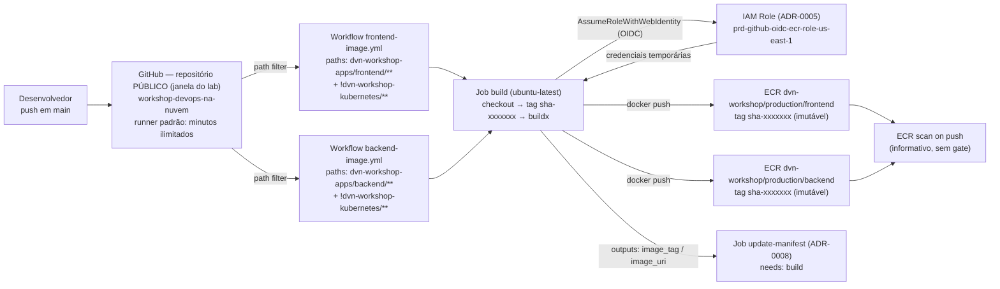

# ADR-0007: Workflows GitHub Actions de build e push das imagens para o ECR

- **Status:** Approved
- **Data:** 2026-09-22
- **Autor:** Planner Agent
- **Supersedes:** N/A
- **Ambiente:** `prd` (ambiente único do repositório)
- **Região AWS:** `us-east-1` (região dos repositórios ECR de `03-ecr-stack-ai`)
- **Histórico de revisões:**
  - `2026-09-22` — Versão inicial.
  - `2026-09-22` — **Revisão 1 (visibilidade do repositório confirmada: PRIVADO):** a Premissa 8 registrava a visibilidade como indeterminada e, por consequência, deixava o custo de minutos de runner em duas hipóteses. O solicitante confirmou que o repositório `leopoldocardoso/workshop-devops-na-nuvem` é/será **privado**. Consequência direta: os minutos de runner GitHub-hosted **consomem a cota da conta** (não são ilimitados como em repositório público). Trechos ajustados: Premissa 8, Seção 10 (Custo), novo risco de esgotamento de cota na Seção 11 e critério de monitoramento na Seção 13.3. Nenhuma decisão (D1–D4) foi reaberta — o desenho dos workflows não muda com a visibilidade.
  - `2026-09-22` — **Revisão 2 (repositório passa a ser PÚBLICO durante o laboratório):** o solicitante decidiu, em 2026-09-22, tornar o repositório `leopoldocardoso/workshop-devops-na-nuvem` **público durante a execução do laboratório**, voltando a privado depois que todos os recursos forem destruídos. A motivação declarada é **redução de complexidade operacional do lab** — não é postura de segurança nem mudança de classificação de dados. Esta revisão **inverte** as conclusões de custo da Revisão 1 e **corrige um erro factual de segurança**. Consequências registradas:
    - **Premissa 8 reescrita:** visibilidade **PÚBLICA**; segundo a documentação oficial de billing do GitHub, o uso de runners GitHub-hosted **padrão** é **gratuito (ilimitado) em repositórios públicos** — a cota de 2.000 min/mês do plano Free vale **apenas** para repositórios privados. Os minutos deste pipeline deixam, portanto, de consumir cota enquanto o repositório for público.
    - **Seção 10 (Custo) inteiramente refeita:** removidas a linha de cota de 2.000 min/mês, a estimativa "~200 min ≈ 10% da cota" e a linha de excedente; registrada a condicionalidade (fechar o repositório reintroduz a cota e reativa aquele raciocínio).
    - **Seção 11:** removido o risco "esgotamento da cota de minutos do GitHub Actions"; **adicionado** o risco novo "repositório público aceita PR de qualquer pessoa", com a mitigação da Seção 8; ajustada a justificativa do risco de cache (deixa de citar cota).
    - **Seção 8 (PRs de fork) corrigida — este é o ponto materialmente relevante para segurança.** A Revisão 1 afirmava "Em repositório privado, forks externos não existem por padrão", o que **é falso com o repositório público**: qualquer pessoa pode forkar e abrir PR. A defesa continua válida, mas passa a se apoiar explicitamente em três fatos documentados: (a) o gatilho é **apenas** `push` em `main`; (b) a trust policy do ADR-0005 restringe o `sub` a `ref:refs/heads/main`; (c) por padrão do GitHub, workflows disparados por `pull_request` vindos de **fork** não recebem secrets e operam com `GITHUB_TOKEN` **read-only** — logo sem `id-token: write`, portanto sem token OIDC utilizável para assumir a role.
    - **Ajustes de texto em D2 e D3 (decisões NÃO reabertas):** path filters (D2/A) e cache `type=gha` (D3/A) continuam corretos, mas perdem o argumento "economiza cota" e passam a ser justificados por **tempo de feedback** e pela **janela de retenção de 10 tags do ECR** (ADR-0004). D1 e D4 intocados.
    - **Trechos menores atualizados:** diagrama Mermaid (nó `gh`), tabela 6.2 (linha do runner), Seção 7 (Security e Cost Optimization), Seção 2 (drivers/restrições), Seção 13.1 (passos 7 e 8), Seção 13.3, Seção 13.4 (Teste 8), Seção 14 e Seção 15 (referências de billing).
    - **Nenhum outro ADR foi editado por esta revisão.** O ADR-0006 já absorveu a mudança em sua Revisão 3 (D6 = sem credencial, clone anônimo HTTPS público); este ADR apenas passa a citá-lo corretamente.
  - `2026-09-23` — **Revisão 3 (correção factual do filtro de caminho + registro da implantação real):** os workflows foram implementados e executados em produção em 2026-09-22/23. Esta revisão corrige **um erro técnico do próprio ADR** e converte os testes de aceitação de hipótese em fato verificado. **Nenhuma decisão (D1–D4) foi reaberta; o `Status` permanece `Approved`.**
    - **Correção — `paths` e `paths-ignore` são mutuamente exclusivos (Seção 5, item 1).** A Seção 5 prescrevia `on.push.paths` restrito ao diretório da app **e**, simultaneamente, `paths-ignore: dvn-workshop-kubernetes/**`. Isso é **impossível**: a documentação do GitHub é explícita — *"You cannot use both the `paths` and `paths-ignore` filters for the same event in a workflow"* — e indica o caminho correto: *"If you want to both include and exclude path patterns for a single event, use the `paths` filter prefixed with the `!` character"*. **Implementado:** o padrão negado vive **dentro** de `paths` (`- '!dvn-workshop-kubernetes/**'`), ao lado dos padrões positivos. **Sem impacto funcional** — a allow-list de `paths` já excluía aquele diretório por construção; o padrão negado permanece apenas como defesa em profundidade explícita (mesma função pretendida pelo ADR original). O ADR-0008 §13.1 passo 2 carregava o mesmo erro e foi corrigido na Revisão 2 daquele documento.
    - **Nota sobre majors das actions (Premissa 5 / Seção 6.3):** o ADR foi seguido **à risca** — `actions/checkout` (major v5/v6), `aws-actions/configure-aws-credentials@v4`, `aws-actions/amazon-ecr-login@v2`, `docker/setup-buildx-action@v3`, `docker/build-push-action@v6`, cada um pinado pelo **SHA do patch mais recente dentro do major nomeado**. Registrado nesta revisão: já existem majors mais novos publicados (`checkout` v7, `configure-aws-credentials` v6, `setup-buildx-action` v4, `build-push-action` v7). **Atualizar majors é decisão futura própria** (Seção 14), não um desvio da implementação.
    - **Resultado da implantação registrado (nova subseção ao final da Seção 13.4):** `04-github-oidc-stack-ai` aplicado, primeira assunção real da role OIDC bem-sucedida, imagens `sha-d7de3a4` publicadas nos dois repositórios ECR e esteira executada ponta a ponta até a sincronização do ArgoCD.
    - **Nenhum outro ADR foi editado por esta revisão** (ADR-0006 Revisão 4 e ADR-0008 Revisão 2 foram escritos no mesmo ciclo, cada um em seu próprio arquivo). **Nenhum `Status` foi alterado.**

---

## 1. Contexto e Problema

As imagens das duas aplicações (`dvn-workshop-apps/frontend/youtube-live-app/`, Next.js; `dvn-workshop-apps/backend/YoutubeLiveApp/`, .NET 8) são hoje construídas e publicadas **manualmente**, pela skill `docker-ecr-push`, a partir da estação do operador. O repositório não possui diretório `.github/` — nenhuma automação existe.

Isso produz três problemas concretos: (a) a imagem publicada não tem vínculo verificável com um commit — depende de o operador lembrar qual código estava na árvore de trabalho; (b) o build depende do Docker/arquitetura da máquina local (os Dockerfiles são `linux/amd64`, o que exige atenção em estações ARM); (c) o passo humano entre "código mergeado" e "imagem publicada" é o ponto exato onde a esteira quebra na prática.

O solicitante pediu que, a cada commit, a pipeline faça `docker build` e `docker push` das duas aplicações para o ECR. Este ADR decide **como** os workflows são estruturados, **qual** é o esquema de tag da imagem e **como** eles autenticam — consumindo a IAM Role criada no ADR-0005. A atualização do `kustomization.yaml` e o commit de volta ao repositório são objeto do **ADR-0008**, deliberadamente separados: são uma decisão de governança de Git, não de build.

**Visibilidade do repositório (mudança da Revisão 2).** O repositório é **público durante a janela do laboratório** (decisão do solicitante, 2026-09-22; motivação: reduzir complexidade operacional do lab). Isso muda duas coisas neste ADR e **nenhuma decisão de desenho**: (1) o custo de minutos de runner deixa de existir enquanto durar a janela (Premissa 8 e Seção 10); (2) a superfície de contribuição externa passa a ser real — qualquer pessoa pode forkar e abrir PR —, o que torna a Seção 8 (PRs de fork) o trecho que precisa estar tecnicamente correto, e não uma nota de conforto.

**Estado da implementação (Revisão 3).** Os dois workflows existem, rodaram em `main` e publicaram imagens reais no ECR em 2026-09-22/23. O que esta revisão registra não é um plano: é o resultado medido, incluindo a correção do único trecho do ADR que se mostrou tecnicamente impossível de implementar como escrito (o par `paths` + `paths-ignore`, Seção 5).

## 2. Drivers de Decisão

**Requisitos funcionais (explícitos do solicitante)**
- Disparo automático por commits.
- `docker build` e `docker push` das duas imagens, de dentro do pipeline.
- Autenticação por role assumida (sem chave estática) — implementada no ADR-0005.

**Requisitos funcionais derivados (decisão do arquiteto)**
- Cada app é construída apenas quando **seu próprio código** muda (path filters) — construir e publicar o backend porque alguém alterou o frontend gera tags e storage inúteis, alonga o tempo de feedback do pipeline e, com a lifecycle policy de 10 tags do ADR-0004, **encurta artificialmente a janela de rollback**. Este último é o driver dominante: minutos de runner não são mais um custo (Premissa 8), mas a janela de 10 tags continua sendo um recurso escasso.
- A tag precisa ser **única, imutável e rastreável ao commit** — o repositório proíbe `latest` (`.claude/rules/kubernetes-manifests.md` §8) e o ECR está com `IMMUTABLE_WITH_EXCLUSION` (ADR-0004): republicar a mesma tag **falha**.
- O push ao ECR precisa acontecer **antes** de qualquer commit que aponte a tag nos manifests (contrato com o ADR-0008), senão o ArgoCD sincroniza uma tag inexistente e, com `maxUnavailable: 0`, o rollout trava em `ImagePullBackOff` de forma silenciosa (as réplicas antigas continuam servindo).

**Requisitos não funcionais**
- Tempo de pipeline aceitável para o ciclo de trabalho do workshop (meta prática: ≤ 10 min por app), com cache de build — driver de **tempo de feedback**, não de custo (Premissa 8).
- Nenhum requisito de SLA/throughput formal declarado.

**Restrições**
- Repositórios ECR e suas políticas são contrato fixo do ADR-0004 (não alterar): `IMMUTABLE_WITH_EXCLUSION` com exclusão `latest*`, `scan_on_push`, retenção de 10 tags + expurgo de untagged em 7 dias.
- Dockerfiles existentes são multi-stage, non-root, `linux/amd64`, com `HEALTHCHECK` — **não** são reescritos por este ADR.
- Ambiente único `prd`: o que entra em `main` vai para produção.
- Runners hospedados pelo GitHub (sem infraestrutura de CI própria). Enquanto o repositório for **público**, o uso de runners GitHub-hosted **padrão** não consome cota (Premissa 8).
- **Repositório público durante o laboratório:** qualquer pessoa pode forkar e abrir PR. O desenho precisa garantir — e documentar — que uma contribuição externa não alcança a credencial AWS nem publica imagem (Seção 8).
- **Sintaxe de filtro de caminho do GitHub Actions (restrição descoberta na implementação, Revisão 3):** `paths` e `paths-ignore` **não podem coexistir para o mesmo evento**; inclusão e exclusão simultâneas exigem padrão negado (`!`) dentro de `paths`, e pelo menos um padrão positivo precisa existir junto.

**Objetivos estratégicos**
- Tornar "commit em `main`" o único gatilho de publicação de imagem, aposentando o push manual.
- Manter rastreabilidade commit ↔ imagem ↔ deploy ponta a ponta.

## 3. Premissas (Assumptions)

1. **Gatilho:** `push` na branch `main` (branch default, confirmada no `git status`). PRs não publicam imagem — coerente com a trust policy do ADR-0005 (D2/A), que só autoriza `refs/heads/main`.
2. **Role de CI:** `prd-github-oidc-ecr-role-us-east-1` (ADR-0005) já aplicada e testada. O ARN é configurado como **variável de repositório** (`vars.AWS_ROLE_ARN`) — não é segredo. Com o repositório público, essa variável passa a ser **legível por qualquer pessoa**; isso é aceitável (um ARN não autentica nada por si), e a barreira continua sendo a condição `sub` da trust policy.
3. **Conta/registry:** `659942169599.dkr.ecr.us-east-1.amazonaws.com` (deduzido de `dvn-workshop-kubernetes/frontend/kustomization.yaml`). O workflow obtém o registry do output do `aws-actions/amazon-ecr-login`, sem hardcode. O account ID já está commitado e, com o repositório público, é informação exposta (auditoria da Seção 1 do ADR-0006).
4. **Runner:** `ubuntu-latest` (x86_64), hospedado pelo GitHub — casa com o alvo `linux/amd64` dos Dockerfiles, sem emulação QEMU. É um runner **padrão** (não "larger runner"), o que é condição para a gratuidade em repositório público (Premissa 8).
5. **Versões de actions:** majors válidos na data (validado por busca dirigida em 2026-09-22): `actions/checkout` (v5/v6 publicados), `aws-actions/configure-aws-credentials@v4`, `aws-actions/amazon-ecr-login@v2`, `docker/setup-buildx-action@v3`, `docker/build-push-action@v6`. O `devops-engineer` deve **reconfirmar o major publicado** no momento da implementação e **fixar cada action de terceiro pelo SHA do commit** (segurança de supply chain).
   - **Estado real (Revisão 3):** implementado **exatamente** nesses majors, cada action pinada pelo **SHA do patch mais recente dentro do major nomeado** — a premissa foi cumprida à risca. Registro de contexto, **não** de desvio: desde então há majors mais novos publicados (`actions/checkout` **v7**, `aws-actions/configure-aws-credentials` **v6**, `docker/setup-buildx-action` **v4**, `docker/build-push-action` **v7**). Subir de major não é correção de bug nem dívida aberta por este ADR: é mudança de supply chain com release notes próprias, que deve ser avaliada em seu próprio ciclo (Seção 14, Non-goals).
6. **Cache de build:** usa o cache do GitHub Actions (`cache-from/cache-to: type=gha`). **Não** usar cache de registry (`type=registry`, que grava uma tag `buildcache` mutável): isso colidiria com `IMMUTABLE_WITH_EXCLUSION` do ADR-0004, cujo filtro de exclusão cobre apenas `latest*`.
7. **Re-execução do mesmo commit:** um `re-run` do workflow tentaria publicar a mesma tag e receberia `ImageTagAlreadyExistsException` (tag imutável). O workflow trata isso como **sucesso idempotente**, checando a existência da tag (`aws ecr describe-images`) antes do push e pulando a publicação — permissão já prevista no ADR-0005.
8. **Visibilidade do repositório: PÚBLICO durante o laboratório** (decisão do solicitante em 2026-09-22, Revisão 2). O repositório é tornado público antes da execução do lab e volta a privado depois que todos os recursos forem destruídos. Consequências para esta ADR:
   - **Minutos de runner deixam de consumir cota.** A documentação oficial de billing do GitHub é explícita: *"GitHub Actions usage is free for self-hosted runners and for public repositories that use standard GitHub-hosted runners"*. A cota de **2.000 min/mês** do plano Free aplica-se **somente a repositórios privados**. Como este pipeline usa `ubuntu-latest` (runner **padrão**), o consumo de minutos é **ilimitado e sem custo** enquanto o repositório for público. Ver Seção 10.
   - **Condicionalidade:** fechar o repositório (inclusive o retorno planejado a privado ao final do lab) **reintroduz a cota de 2.000 min/mês** e reativa integralmente o raciocínio de custo/capacidade da Revisão 1. Isso é um gatilho de revisão da Seção 10, não um bug.
   - **Contribuição externa passa a ser possível:** qualquer pessoa pode forkar e abrir PR. Tratado na Seção 8 (defesa) e na Seção 11 (risco).
   - **Do lado do ArgoCD**, a visibilidade pública é o que permite o clone anônimo por HTTPS **sem credencial** (ADR-0006, D6/Opção D, Revisão 3) — decisão fora do escopo desta ADR, apenas citada. **Verificado em produção** (ADR-0006 Revisão 4): o `argocd-repo-server` clona anonimamente, sem nenhum Secret de repositório no cluster.
9. **Escopo:** este ADR **não** escreve no repositório Git nem fala com o cluster. Ele termina quando a imagem está no ECR e a tag é exportada como output do job.
10. **Testes automatizados de aplicação:** não existem suítes de teste declaradas nas duas apps; nenhum job de teste é planejado aqui (Non-goal).
11. **Scan de vulnerabilidade:** `scan_on_push` do ECR (ADR-0004) roda automaticamente após o push. **Não** há gate que bloqueie o deploy por findings — decisão consciente, registrada como Non-goal/risco.
12. **Filtro de caminho com inclusão e exclusão simultâneas (Revisão 3):** o GitHub **proíbe** `paths` e `paths-ignore` no mesmo evento; a forma suportada de excluir um subdiretório dentro de uma allow-list é o padrão negado (`!`) **dentro** de `paths`, desde que haja pelo menos um padrão positivo. É o que está implementado (Seção 5, item 1).

## 4. Opções Consideradas

### D1 — Esquema de tag da imagem

#### Opção A — `sha-<short-sha>` (7 caracteres do commit SHA) *(ESCOLHIDA)*
- **Descrição:** a tag é derivada do commit que disparou o build, ex.: `sha-d5514aa`. Prefixo textual evita que a tag seja interpretada como número/hash solto e a distingue de tags semânticas futuras.
- **Prós:** única por commit (respeita a imutabilidade do ECR sem colisão); rastreabilidade direta imagem ↔ commit ↔ PR, que é exatamente o que falta hoje; determinística (um re-run gera a mesma tag, permitindo o tratamento idempotente da Premissa 7); não depende de intervenção humana a cada release, viabilizando o "toda vez que commits são feitos" do pedido.
- **Contras:** não comunica versão de produto (não dá para saber se `sha-d5514aa` é maior que `sha-6e8921f`); a label `app.kubernetes.io/version` (exigida pela regra de manifests) passa a carregar um SHA em vez de um semver — legível, mas menos expressivo; diverge das tags `v1.0` hoje em uso, que ficarão convivendo com o novo esquema até expirarem pela lifecycle policy.
- **Custo estimado:** 1 tag nova por commit e por app → com a retenção de 10 tags do ADR-0004, a janela de rollback passa a ser "os 10 últimos commits daquela app".

#### Opção B — SemVer manual (`v1.2`, padrão atual do repositório)
- **Descrição:** o desenvolvedor decide e informa a versão (input de `workflow_dispatch` ou git tag `v*`).
- **Prós:** versão legível e significativa; casa com o que já está em `kustomization.yaml` (`v1.0`); rollback conversável ("volte para a v1.3").
- **Contras:** exige ação humana a cada publicação — contraria o requisito explícito de disparo por commit; risco real de colisão de tag (dois merges com a mesma versão → push rejeitado pela imutabilidade); a versão deixa de ser derivável do estado do repositório.
- **Custo estimado:** igual.

#### Opção C — `v<run_number>` (número incremental da execução) ou timestamp
- **Descrição:** `v42`, ou `20260922-1530`.
- **Prós:** monotônico e legível; sempre único.
- **Contras:** não identifica o commit (o vínculo depende de consultar o histórico do Actions, que tem retenção própria); `run_number` reinicia se o workflow for renomeado/recriado, quebrando a monotonicidade; um re-run gera tag nova para o mesmo código, poluindo a janela de 10 tags.
- **Custo estimado:** igual.

#### Opção D — `latest`
- **Descrição:** tag móvel apontando para o último build.
- **Contras:** **proibida** pela regra `.claude/rules/kubernetes-manifests.md` §8 (é a única tag mutável pelo filtro de exclusão do ECR e impede rollback determinístico) e incompatível com GitOps (o Git deixaria de descrever o que está rodando). **Descartada sem ambiguidade.**

**Decisão:** Opção A (`sha-<short-sha>`). Opção B fica registrada como evolução: se o repositório adotar releases versionados, um segundo workflow disparado por git tag `v*` pode publicar uma tag semântica **adicional** apontando para o mesmo build — sem substituir a tag de commit, que continua sendo a âncora de rastreabilidade.

> **Confirmado em produção (Revisão 3):** as imagens `sha-d7de3a4` foram publicadas nos dois repositórios ECR a partir do commit de mesmo SHA — o vínculo commit ↔ imagem ↔ deploy funcionou exatamente como desenhado.

---

### D2 — Estrutura dos workflows

> **Decisão não reaberta na Revisão 2.** A escolha continua sendo a Opção A; o que mudou foi a **justificativa**: o argumento "economiza cota de minutos" caiu (repositório público, Premissa 8) e seu lugar foi ocupado por **tempo de feedback** e pela **preservação da janela de 10 tags do ECR** (ADR-0004), que é o recurso realmente escasso.
>
> **Decisão também não reaberta na Revisão 3.** O que mudou foi a **sintaxe** do filtro, não a estratégia: a exclusão de `dvn-workshop-kubernetes/**` passa a ser um padrão negado dentro de `paths`, porque `paths` + `paths-ignore` no mesmo evento é proibido pelo GitHub (Premissa 12, Seção 5).

#### Opção A — Um workflow por aplicação, com `on.push.paths` nativo *(ESCOLHIDA)*
- **Descrição:** `.github/workflows/frontend-image.yml` e `.github/workflows/backend-image.yml`, cada um com `paths:` cobrindo o diretório da sua app e o próprio arquivo de workflow, mais o padrão negado `!dvn-workshop-kubernetes/**` (Revisão 3).
- **Prós:** filtro de caminho nativo do GitHub (sem action de terceiro); falha de uma app não bloqueia a outra; `concurrency` independente por app; logs e histórico separados, mais fáceis de ler; cada workflow é pequeno e legível; **não queima a janela de 10 tags do ECR com imagens idênticas ao build anterior** e mantém o tempo de feedback baixo.
- **Contras:** duplicação estrutural entre os dois arquivos (mesma sequência de steps); mudanças transversais exigem editar dois arquivos.
- **Custo estimado:** dois jobs concorrentes quando ambas as apps mudam no mesmo commit — sem impacto de custo (runners padrão em repositório público, Premissa 8).

#### Opção B — Um único workflow com `strategy.matrix` + filtro de caminho por action (`dorny/paths-filter`)
- **Descrição:** um arquivo, uma matriz `[frontend, backend]`, com um job prévio detectando quais apps mudaram.
- **Prós:** zero duplicação; mudança transversal em um só lugar; matriz escala bem se surgir uma terceira app.
- **Contras:** introduz dependência de action de terceiro no caminho crítico (superfície de supply chain); a lógica de "o que mudou" vira código condicional, mais difícil de auditar que `paths:` declarativo; um erro na matriz afeta as duas apps ao mesmo tempo.
- **Custo estimado:** igual.

#### Opção C — Workflow único que sempre constrói as duas apps
- **Descrição:** sem filtros; todo commit em `main` gera duas imagens.
- **Prós:** simplicidade máxima; sempre há uma imagem por commit para cada app.
- **Contras:** **queima a janela de retenção de 10 tags do ECR com imagens idênticas ao build anterior** — encurtando pela metade a janela real de rollback, que é o contra decisivo; dobra o tempo de ocupação do pipeline; produz deploys (ADR-0008) sem mudança funcional, poluindo o histórico do ArgoCD. (O argumento "dobra o consumo da cota de minutos", usado na Revisão 1, **deixou de valer** — ver Premissa 8 — mas não era o contra dominante.)
- **Custo estimado:** ~2× crescimento de storage no ECR e metade da janela de rollback por app.

**Decisão:** Opção A.

---

### D3 — Ferramenta de build/push

> **Decisão não reaberta na Revisão 2.** O cache continua sendo a escolha certa; a justificativa "tempo de build economizado é cota economizada" foi substituída por **tempo de feedback** (Premissa 8).

#### Opção A — `docker/setup-buildx-action` + `docker/build-push-action` com cache `type=gha` *(ESCOLHIDA)*
- **Descrição:** BuildKit via Buildx, com cache de camadas no cache do GitHub Actions, `platforms: linux/amd64`, `provenance: false` (evita anexar attestations que o ECR trata como artefatos/tags extras).
- **Prós:** cache entre execuções reduz significativamente o build (`npm ci` do Next.js e `dotnet restore` do .NET são os passos caros), encurtando o ciclo commit → imagem publicada — que é o requisito não funcional declarado (≤ 10 min por app); ações oficiais e amplamente auditadas; push e build em um único step.
- **Contras:** mais um par de actions no pipeline; o cache `gha` tem limite de 10 GB por repositório e evicção por LRU — o ganho degrada se muitas branches competirem pelo cache.
- **Custo estimado:** USD 0,00 adicional (cache incluído na cota de armazenamento do repositório).

#### Opção B — `docker build`/`docker push` puros, em `run:` de shell
- **Descrição:** replicar a lógica da skill `docker-ecr-push` diretamente no workflow.
- **Prós:** nenhuma action de terceiro; comportamento idêntico ao caminho manual já validado localmente; máxima transparência.
- **Contras:** sem cache entre execuções (todo build do zero, minutos e minutos a mais por run — piorando diretamente o tempo de feedback); reimplementação manual de tagging, retry e detecção de erro.
- **Custo estimado:** mais tempo de pipeline por execução; sem custo financeiro adicional enquanto o repositório for público.

**Decisão:** Opção A, mantendo os Dockerfiles intactos (o build continua sendo exatamente o mesmo artefato que a skill local produz).

---

### D4 — Como o ADR-0008 recebe a tag publicada

#### Opção A — Job de build expõe `outputs.image_tag` e `outputs.image_uri`, consumidos por um job dependente no mesmo workflow *(ESCOLHIDA)*
- **Prós:** ordem garantida por `needs:` — o job de write-back só roda se o push ao ECR tiver sucesso, que é exatamente o contrato de ordem exigido (Seção 2); sem estado externo; a tag não precisa ser recalculada.
- **Contras:** acopla os dois ADRs no mesmo arquivo de workflow — a fronteira entre ADR-0007 e ADR-0008 fica documental, não física.
- **Custo estimado:** USD 0,00.

#### Opção B — Workflow separado, disparado por `workflow_run`
- **Prós:** separação física entre build e write-back.
- **Contras:** `workflow_run` complica a passagem de dados (exige artefatos ou nova derivação do SHA), adiciona latência e um modo de falha novo (workflow disparado para um SHA que não é mais o HEAD).
- **Custo estimado:** USD 0,00.

**Decisão:** Opção A. O ADR-0008 define **o conteúdo e a governança** do job de write-back; este ADR define que ele existe como job dependente (`needs: build`) e recebe a tag por output.

## 5. Decisão

Criar dois workflows em `.github/workflows/` — `frontend-image.yml` e `backend-image.yml` — estruturalmente idênticos, cada um com:

1. **Gatilho:** `on.push.branches: [main]` e `on.push.paths` restrito ao diretório da app (`dvn-workshop-apps/frontend/**` ou `dvn-workshop-apps/backend/**`) mais o próprio arquivo de workflow. A exclusão de `dvn-workshop-kubernetes/**` (defesa em profundidade contra loop, embora o `GITHUB_TOKEN` já não dispare workflows — ADR-0008) é expressa como **padrão negado dentro do próprio `paths`** (`- '!dvn-workshop-kubernetes/**'`) — **nunca** como `paths-ignore`. *(Corrigido na Revisão 3: o GitHub proíbe `paths` e `paths-ignore` para o mesmo evento — "You cannot use both the `paths` and `paths-ignore` filters for the same event in a workflow" — e a forma suportada de combinar inclusão com exclusão é o prefixo `!` dentro de `paths`, com pelo menos um padrão positivo presente. Funcionalmente equivalente: a allow-list já excluía aquele diretório por construção.)* `workflow_dispatch` para execução manual de emergência. **Nenhum gatilho `pull_request`/`pull_request_target`** — ponto de segurança reforçado com o repositório público (Seção 8).
2. **`concurrency`:** grupo por app (`image-<app>-main`) com `cancel-in-progress: false` — cancelar um build no meio deixaria uma tag prometida e não publicada.
3. **`permissions` (nível do workflow):** `contents: read`, `id-token: write`. O `contents: write` necessário ao write-back é declarado **apenas** no job do ADR-0008, nunca no job de build.
4. **Job `build`** (`runs-on: ubuntu-latest`):
   - `actions/checkout` (fetch-depth mínimo suficiente).
   - Cálculo da tag: `sha-${GITHUB_SHA::7}` → `outputs.image_tag`.
   - `aws-actions/configure-aws-credentials` com `role-to-assume: ${{ vars.AWS_ROLE_ARN }}`, `aws-region: us-east-1` (nenhum secret de credencial).
   - `aws-actions/amazon-ecr-login` → output `registry`.
   - **Checagem de idempotência:** `aws ecr describe-images --repository-name <repo> --image-ids imageTag=<tag>`; se já existir, pula o build/push e segue com a mesma tag (Premissa 7).
   - `docker/setup-buildx-action` + `docker/build-push-action` com `context` no diretório da app, `file` no Dockerfile existente, `platforms: linux/amd64`, `push: true`, `tags: <registry>/<repo>:<tag>`, `cache-from/cache-to: type=gha`, `provenance: false`.
   - Verificação pós-push (`aws ecr describe-images` confirmando a tag) — falha o job se ausente.
   - `outputs`: `image_tag`, `image_uri`.
5. **Job `update-manifest`** (`needs: build`) — **definido no ADR-0008**; referenciado aqui apenas como dependência que garante a ordem "ECR primeiro, Git depois".

Todas as actions de terceiro fixadas por SHA de commit (dentro dos majors da Premissa 5); nenhuma credencial estática; nenhum acesso ao cluster a partir do runner.

## 6. Arquitetura Proposta

### 6.1 Diagrama



> Diagrama editável equivalente, com fluxo "vivo" (setas animadas), em `docs/diagramas/ADR-0007-github-actions-build-push-ecr.drawio`. *(Não alterado pela Revisão 3: o diagrama nomeia os padrões positivos de `paths`, que continuam corretos, e não cita `paths-ignore` — nenhum componente do desenho mudou.)*

### 6.2 Recursos AWS

| Recurso | Tipo | Nome lógico | Região | Observações |
|---|---|---|---|---|
| IAM Role de CI (existente) | `aws_iam_role` (ADR-0005) | `prd-github-oidc-ecr-role-us-east-1` | global (IAM) | Assumida via OIDC; **não** é criada por este ADR. A condição `sub` restrita a `ref:refs/heads/main` é a barreira que impede um PR de fork de assumi-la (Seção 8). **Aplicada e exercitada em produção** (Revisão 3, Seção 13.4). |
| IAM OIDC Provider (existente) | `aws_iam_openid_connect_provider` (ADR-0005) | `token.actions.githubusercontent.com` | global (IAM) | Idem. **Criado do zero pelo apply de `04-github-oidc-stack-ai`** — não existia antes na conta (Revisão 3). |
| ECR repo frontend (existente) | `aws_ecr_repository` (ADR-0004) | `dvn-workshop/production/frontend` | `us-east-1` | Destino do push; `IMMUTABLE_WITH_EXCLUSION`, `scan_on_push`, lifecycle de 10 tags. Não alterado. |
| ECR repo backend (existente) | `aws_ecr_repository` (ADR-0004) | `dvn-workshop/production/backend` | `us-east-1` | Idem. |
| ECR image scanning | recurso do serviço | — | `us-east-1` | Resultado consultável por `aws ecr describe-image-scan-findings`; **não** bloqueia o pipeline (Premissa 11). |
| GitHub Actions runner (externo) | — | `ubuntu-latest` (runner **padrão**) | fora da AWS | Hospedado pelo GitHub; sem infraestrutura AWS de CI. **Minutos ilimitados e sem custo** enquanto o repositório for público (Premissa 8); fechar o repositório reintroduz a cota de 2.000 min/mês do plano Free. |
| Cache de build (externo) | — | GitHub Actions Cache (`type=gha`) | fora da AWS | Não usa ECR como cache (Premissa 6). |

**Nenhum recurso AWS novo é criado por este ADR** — ele consome o que os ADRs 0004 e 0005 provisionam. Não há stack Terraform associada.

### 6.3 Módulos Terraform Recomendados

Não aplicável: este ADR não provisiona infraestrutura. A infraestrutura consumida está nos ADR-0004 (`03-ecr-stack-ai`) e ADR-0005 (`04-github-oidc-stack-ai`).

| Componente (GitHub Actions) | Versão | Finalidade |
|---|---|---|
| `actions/checkout` | major publicado na implementação (v5/v6 em 2026-09), pinado por SHA | Checkout do código. |
| `aws-actions/configure-aws-credentials` | `v4` (pinado por SHA) | `AssumeRoleWithWebIdentity` com o ARN do ADR-0005. |
| `aws-actions/amazon-ecr-login` | `v2` (pinado por SHA) | Login do Docker no registry privado. |
| `docker/setup-buildx-action` | `v3` (pinado por SHA) | Builder BuildKit. |
| `docker/build-push-action` | `v6` (pinado por SHA) | Build + push com cache `type=gha`. |

> **Nota da Revisão 3 (majors):** a tabela acima descreve o que foi **de fato implementado** — o patch mais recente de cada major, pinado por SHA. Majors mais novos já existem (`checkout` v7, `configure-aws-credentials` v6, `setup-buildx-action` v4, `build-push-action` v7) e **não** foram adotados: o ADR nomeava estes majors e foi seguido à risca. Atualizá-los é decisão futura, com release notes a revisar (Seção 14).

## 7. Avaliação Well-Architected

| Pilar | Como a decisão endereça |
|---|---|
| Operational Excellence | Publicação de imagem deixa de depender da estação do operador; toda imagem tem histórico de execução, logs e vínculo com um commit; re-run é idempotente; path filters evitam builds sem propósito. **Verificado em produção (Revisão 3):** a esteira rodou ponta a ponta a partir de um push em `main`, sem intervenção manual. |
| Security | Credenciais efêmeras via OIDC (ADR-0005), sem secret estático; `permissions` do `GITHUB_TOKEN` mínimas no job de build (`contents: read`); actions de terceiro pinadas por SHA; scan on push do ECR gera visibilidade de vulnerabilidades (sem gate, risco declarado). **Com o repositório público** (Premissa 8), a superfície de contribuição externa é real: a defesa é a combinação de gatilho restrito a `push` em `main`, condição `sub = ref:refs/heads/main` na trust policy do ADR-0005 e o padrão do GitHub de não entregar secrets nem token de escrita a workflows de PR vindos de fork (Seção 8). A trust policy efetivamente aplicada na conta foi **lida da AWS e conferida contra o §8 do ADR-0005** (Revisão 3). Em contrapartida, o código-fonte, o account ID e demais metadados já commitados passam a ser públicos — exposição aceita conscientemente pelo solicitante para a janela do lab e detalhada no ADR-0006 §1/§11. |
| Reliability | Tag imutável e determinística elimina "imagem trocada sob os pés"; verificação explícita pós-push antes de qualquer promoção; `cancel-in-progress: false` evita build interrompido no meio; falha de uma app não impede a outra. |
| Performance Efficiency | Cache `type=gha` corta os passos caros (`npm ci`, `dotnet restore`); runner x86_64 casa com `linux/amd64` sem emulação; builds só quando a app muda. |
| Cost Optimization | Sem infraestrutura de CI própria (nenhum runner self-hosted em EC2). Enquanto o repositório for público, os minutos de runner **padrão** não têm custo nem cota (Premissa 8), de modo que a otimização de custo desta esteira se concentra no lado AWS: nenhuma tag de cache extra ocupando a janela de retenção do ECR e path filters/idempotência evitando storage redundante. Se o repositório voltar a privado, path filters + cache + skip idempotente voltam a ser, também, economia direta de cota. |
| Sustainability | Builds evitados por path filter e por idempotência de re-run reduzem computação redundante; cache reduz download/recompilação de dependências. |

## 8. Segurança

- **IAM:** o pipeline usa exclusivamente a role do ADR-0005 (push/pull escopado a 2 repositórios ECR, sem ações destrutivas, sem outros serviços). Nada novo é concedido aqui. **Verificação da Revisão 3:** a trust policy lida da conta (`iam:GetRole`) bate **caractere a caractere** com o §8 do ADR-0005 — `StringEquals` em `aud` e `StringLike` em `sub` com as duas entradas (formato clássico e formato imutável), ambas ancoradas em `ref:refs/heads/main`.
- **Permissões do `GITHUB_TOKEN`:** declaradas no topo do workflow como `contents: read` + `id-token: write`. O `contents: write` fica confinado ao job do ADR-0008. Nunca usar `permissions: write-all`.
- **Supply chain:** toda action de terceiro fixada por **SHA de commit** (não por tag móvel — uma tag `v4` pode ser reapontada). Nenhuma action fora de `actions/*`, `aws-actions/*` e `docker/*`. O pin é por SHA **dentro dos majors da Premissa 5**; a existência de majors mais novos não altera a postura de segurança (o SHA pinado é imutável), apenas indica uma atualização a ser avaliada em ciclo próprio.
- **Superfície do runner:** o job não recebe nenhum segredo além do token OIDC de vida curta; não há acesso a cluster, a state Terraform ou ao S3 de backend.
- **PRs de fork (corrigido na Revisão 2 — o repositório é PÚBLICO).** A afirmação da Revisão 1 ("em repositório privado, forks externos não existem por padrão") **não vale mais**: com o repositório público, **qualquer pessoa pode forkar e abrir um pull request**. A defesa permanece válida, mas se apoia em três fatos, todos verificáveis:
  1. **O gatilho é apenas `push` em `main`** (mais `workflow_dispatch`). Não existe `on: pull_request` nem `on: pull_request_target` em nenhum dos dois workflows — um PR, de fork ou não, simplesmente **não dispara** o pipeline de build/push. Adicionar um gatilho de PR a estes workflows é, por isso, uma mudança de segurança, não de conveniência.
  2. **A trust policy do ADR-0005 restringe o `sub` a `repo:leopoldocardoso/workshop-devops-na-nuvem:ref:refs/heads/main`** (nos dois formatos, clássico e imutável). Mesmo que um workflow fosse disparado a partir de outra ref, o `AssumeRoleWithWebIdentity` seria **rejeitado pela IAM** — não há credencial AWS a obter fora de `main`. **Confirmado por leitura da policy aplicada** (Revisão 3).
  3. **Por padrão do GitHub, um workflow disparado por `pull_request` vindo de um fork não recebe os secrets do repositório e opera com `GITHUB_TOKEN` read-only.** A documentação é explícita: *"With the exception of `GITHUB_TOKEN`, secrets are not passed to the runner when a workflow is triggered from a forked repository"*; e, para PRs de fork, *"write permissions are adjusted to read-only"* a menos que um administrador marque explicitamente **"Send write tokens to workflows from pull requests"** / **"Send secrets to workflows from pull requests"** nas configurações de Actions do repositório. Como `id-token: write` é uma permissão de **escrita**, um PR de fork **não obtém token OIDC utilizável** para assumir a role. **Consequência operacional:** essas duas opções de "Fork pull request workflows" devem permanecer **desmarcadas** durante toda a janela pública — habilitá-las anularia esta terceira camada.

  As três camadas são independentes: o gatilho (1) é a barreira primária, a trust policy (2) é a barreira que não depende de configuração do GitHub, e (3) é o padrão da plataforma. Nenhuma delas sozinha é suficiente como argumento — as três juntas são.
- **Criptografia em trânsito:** TLS em STS, ECR e registry API.
- **Criptografia em repouso:** imagens no ECR com `AES256` (ADR-0004); cache `gha` criptografado pelo GitHub.
- **Gestão de segredos:** **nenhum** segredo é criado. O ARN da role vai em *repository variable* (`vars.AWS_ROLE_ARN`), não em secret — não é informação sensível e facilita auditoria. Com o repositório público, a variável é legível por terceiros; isso é aceito (ver Premissa 2) e **não** deve ser "corrigido" movendo o ARN para secret, o que apenas dificultaria a auditoria sem agregar proteção.
- **Logging e auditoria:** logs de execução no GitHub Actions (retenção padrão 90 dias); `AssumeRoleWithWebIdentity` no CloudTrail; histórico de imagens no ECR (`describe-images` com `imagePushedAt`). **Atenção com o repositório público:** os logs de execução do Actions passam a ser legíveis por qualquer pessoa — nenhum step deve imprimir credencial, endpoint interno ou output de `terraform` no log.
- **Vulnerabilidades:** `scan_on_push` (basic scanning) roda automaticamente. **Não há gate** — uma imagem com finding `CRITICAL` é publicada e pode ser promovida. Risco aceito e registrado (Seção 11); um gate exigiria decidir política de severidade e adicionar `ecr:DescribeImageScanFindings` à role (Non-goal).
- **Compliance:** nenhum framework declarado pelo solicitante; nenhum controle específico desenhado.

## 9. Naming Convention & Tagging

- **Arquivos de workflow:** `.github/workflows/<app>-image.yml` (`frontend-image.yml`, `backend-image.yml`) — nome em kebab-case descrevendo artefato produzido, não ferramenta.
- **Jobs/steps:** identificadores em `snake_case`/kebab-case consistentes (`build`, `update-manifest`), `name:` legível em português ou inglês, mas consistente entre os dois arquivos.
- **Tag de imagem:** `sha-<7 primeiros caracteres do commit SHA>` (D1/A). Nunca `latest`, nunca tag mutável.
- **Nomes de repositório ECR:** contrato externo fixo do ADR-0004 (`dvn-workshop/production/<app>`), deliberadamente fora do padrão `{env}-{app}-{service}-{region}`.
- **Tags AWS:** não aplicável — este ADR não cria recursos AWS. As tags obrigatórias do repositório (`Environment`, `Owner`, `CostCenter`, `Project`, `ManagedBy`, `DataClassification`, `StackName`) permanecem responsabilidade das stacks Terraform (ADR-0004/0005).
- **Convenções Terraform** (`.claude/rules/terraform-naming-conventions.md`): não aplicável diretamente aqui, pois nenhum `.tf` é criado; permanece vinculante para o ADR-0005.
- **Rótulos OCI recomendados na imagem** (via `labels` do `build-push-action`): `org.opencontainers.image.revision = <sha completo>`, `org.opencontainers.image.source = <url do repo>`, `org.opencontainers.image.created = <timestamp>` — reforçam a rastreabilidade dentro do próprio artefato.

## 10. Custo Estimado

Repositório **público** durante a janela do laboratório (Premissa 8). Segundo a documentação oficial de billing do GitHub, *"GitHub Actions usage is free for self-hosted runners and for public repositories that use standard GitHub-hosted runners"* — os minutos deste pipeline (runner `ubuntu-latest`, **padrão**) são **ilimitados e sem custo**, e **não** consomem a cota de 2.000 min/mês do plano Free, que se aplica apenas a repositórios privados.

| Item | Modelo de pricing | Estimativa mensal |
|---|---|---|
| Minutos de runner GitHub-hosted (`ubuntu-latest`, runner **padrão**) | **Gratuito e ilimitado** em repositório público — sem cota e sem excedente enquanto a visibilidade for pública | USD 0,00 |
| Armazenamento do cache do Actions | 10 GB por repositório incluídos, evicção LRU | USD 0,00 |
| Storage ECR (10 tags por app, imagens ~200–400 MB) | `US$ 0,10`/GB-mês | ~0,50 – 1,00 |
| Transferência ECR ↔ internet no push | entrada sem custo | 0,00 |
| Basic scanning do ECR | sem custo (basic; enhanced/Inspector é Non-goal) | 0,00 |
| Pull das imagens pelos nós (mesma região, via NAT) | `US$ 0,045`/GB de NAT processing | ~0,10 – 0,50 |
| **Total estimado** | | **~ USD 0,60 – 1,50/mês** |

> **Condicionalidade explícita:** a gratuidade dos minutos vale **enquanto o repositório for público**. Fechar o repositório — inclusive o retorno planejado a privado após a destruição dos recursos — **reintroduz a cota de 2.000 min/mês** do plano Free e o excedente de ~US$ 0,008/min (`ubuntu` 2-core), tornando novamente relevantes path filters, cache e skip idempotente como mecanismos de economia. Esse é o gatilho para revisar esta seção.
>
> A sensibilidade de custo que **permanece** é o **storage do ECR**, limitado estruturalmente pela lifecycle policy de 10 tags do ADR-0004. Valores de billing do GitHub devem ser reconferidos na página oficial no momento da implementação — não são precificação AWS e podem mudar. Validar a parte AWS com `infracost scan` (que **não** cobre componentes usage-based como ECR storage ou NAT processing) e com o Cost Explorer após o primeiro mês.

## 11. Riscos e Mitigações

| Risco | Probabilidade | Impacto | Mitigação |
|---|---|---|---|
| Push falhar por tag já existente em re-run (`ImageTagAlreadyExistsException`, imutabilidade do ADR-0004) | Alta (em qualquer re-run) | Baixo | Checagem prévia com `aws ecr describe-images` e skip idempotente (Premissa 7); permissão já concedida no ADR-0005. |
| Lifecycle policy (10 tags) expirar imagem ainda referenciada no Git → rollback GitOps cai em `ImagePullBackOff` | Média | Alto | Documentar a janela real de rollback (10 commits por app); rollback além disso exige re-run do workflow no commit antigo (que republica a mesma tag determinística — vantagem da Opção A de D1). **Não alterar `03-ecr-stack-ai` por conta deste ADR.** |
| **Repositório público aceita pull request de qualquer pessoa** → tentativa de obter credencial AWS ou publicar imagem a partir de uma contribuição externa | Média (PR externo é plausível) | Alto (se as defesas falhassem: push em registry de `prd`) | Três camadas independentes, descritas na Seção 8: (1) **gatilho apenas `push` em `main`** — nenhum `pull_request`/`pull_request_target` nos workflows, logo um PR não dispara build; (2) **trust policy do ADR-0005 com `sub` restrito a `ref:refs/heads/main`** — `AssumeRoleWithWebIdentity` de qualquer outra ref é rejeitado pela IAM (policy conferida na conta, Revisão 3); (3) **padrão do GitHub**: workflows de PR vindos de fork não recebem secrets e usam `GITHUB_TOKEN` read-only, portanto **sem `id-token: write`** e sem token OIDC utilizável. **Ação de manutenção:** manter desmarcadas as opções "Send write tokens to workflows from pull requests" e "Send secrets to workflows from pull requests" nas configurações de Actions durante toda a janela pública; qualquer proposta futura de adicionar gatilho de PR a estes workflows deve ser tratada como mudança de segurança e passar por ADR. |
| Commit tocar as duas apps → dois workflows concorrentes gerando dois commits de write-back (ADR-0008) | Média | Médio | `concurrency` por app; o ADR-0008 define rebase/retry do write-back para resolver a corrida. |
| Imagem publicada com vulnerabilidade crítica, sem gate | Média | Médio | Scan on push ativo; revisão periódica manual dos findings; gate declarado como Non-goal a ser tratado em ADR futuro. |
| Action de terceiro comprometida (supply chain) durante o job | Baixa | Alto | Pin por SHA; conjunto mínimo de actions, todas de publishers oficiais; permissões do job restritas (`contents: read`), credencial AWS limitada a push em 2 repositórios. |
| Majors das actions ficarem para trás do publicado (hoje: `checkout` v7, `configure-aws-credentials` v6, `setup-buildx-action` v4, `build-push-action` v7) | **Alta (já ocorre)** | Baixo | O pin é por SHA, então não há exposição a tag reapontada; o risco real é ficar sem correções futuras do upstream. Tratado como **decisão própria** de atualização (Seção 14), com release notes a revisar por major — não como dívida deste ADR, que foi implementado exatamente como escrito (Premissa 5). |
| Cache `type=gha` evictado/corrompido → builds mais lentos (pior tempo de feedback) | Média | Baixo | Cache é otimização, não dependência: o build funciona sem ele. |
| Log de execução do Actions expondo dado sensível, agora legível por qualquer pessoa (repositório público) | Baixa | Médio | Nenhum step imprime credencial ou output de `terraform`; `configure-aws-credentials` mascara a credencial temporária; revisão do log das primeiras execuções (critério na Seção 13.3). |
| Retorno do repositório a privado reintroduzindo a cota de minutos sem que ninguém perceba | Média (o retorno é planejado) | Baixo | Condicionalidade declarada na Premissa 8 e na Seção 10; o retorno a privado é operação de encerramento do lab e deve vir acompanhada da releitura da Seção 10 (e, do lado do ArgoCD, da reabertura de D6 na Opção A — ADR-0006). |
| Dockerfile mudar o endpoint de health sem atualizar os manifests | Baixa | Médio | Regra `.claude/rules/kubernetes-manifests.md` §6 já vincula probe ↔ `HEALTHCHECK`; revisão de PR — lembrando que `main` **não** tem branch protection hoje (ADR-0008 D3), então a revisão depende de disciplina, não de regra. |
| Divergência entre a imagem construída no runner e a construída localmente pela skill | Baixa | Baixo | Mesmo Dockerfile, mesmo `--platform linux/amd64`, mesmo contexto; a skill local permanece válida como caminho de contingência. |

## 12. Estratégia de Rollback

1. **Falha no workflow (build/push):** nada foi promovido — o job de write-back (`needs: build`) não executa, o Git não muda e o ArgoCD continua servindo a versão anterior. Não há o que reverter; corrigir e novo commit.
2. **Imagem publicada porém ruim (build verde, app quebrada):** a reversão acontece no Git (ADR-0008/ADR-0006): `git revert` do commit de write-back faz o ArgoCD voltar à tag anterior em ~3 min. A imagem ruim permanece no ECR (imutável) até expirar pela lifecycle policy — isso é desejável para investigação.
3. **Desativar a esteira de publicação:** desabilitar o workflow em Actions → *Disable workflow* (ou `git revert` do commit que o adicionou). O caminho manual (`.claude/skills/docker-ecr-push/push.sh`) segue funcionando enquanto a role/credencial local existir.
4. **Rollback do próprio ADR:** remover `.github/workflows/*-image.yml` não deixa resíduo em AWS; as imagens já publicadas permanecem (e são consumidas normalmente pelo cluster).
5. **Ponto de não retorno:** nenhum no lado desta esteira. **Ressalva fora do escopo deste ADR:** a exposição pública do conteúdo já commitado é irreversível (tratada no ADR-0006 §11) — reverter a visibilidade do repositório não "desexpõe" o que foi lido durante a janela.

## 13. Handoff para DevOps Engineer Agent

### 13.1 Ordem de Implementação (respeitando dependências)

**Posição na esteira:**

```
ADR-0005 (OIDC/IAM) ──► ADR-0007 (ESTE: build/push) ──┐
                                                       ├─► ADR-0008 (write-back + governança)
ADR-0006 (ArgoCD) ─────────────────────────────────────┘
```

0. **Pré-checagem (bloqueante):** ADR-0005 aplicado e validado (Teste 1 daquele ADR passou); os dois repositórios ECR existem; a variável de repositório `AWS_ROLE_ARN` está configurada no GitHub; **o repositório está público** (Premissa 8) e as opções "Send write tokens to workflows from pull requests" e "Send secrets to workflows from pull requests" estão **desmarcadas** em Settings → Actions → General → Fork pull request workflows.
1. Criar `.github/workflows/frontend-image.yml` conforme a Seção 5. Reconfirmar os majors das actions e **pinar por SHA**. Conferir que **não** há gatilho `pull_request`/`pull_request_target`. **Expressar a exclusão de `dvn-workshop-kubernetes/**` como padrão negado dentro de `paths` — nunca como `paths-ignore` (Premissa 12).**
2. Validar em um commit de teste que toque **apenas** `dvn-workshop-apps/frontend/**` → workflow do frontend roda, workflow do backend **não** roda.
3. Conferir no ECR a tag `sha-<short>` publicada (`aws ecr describe-images`) e o resultado do scan.
4. Replicar para `.github/workflows/backend-image.yml` (contexto `dvn-workshop-apps/backend/YoutubeLiveApp/`, repositório `dvn-workshop/production/backend`) e repetir a validação.
5. Fazer um `re-run` de uma execução já concluída e confirmar o comportamento **idempotente** (skip do push, job verde).
6. **Não** adicionar ainda o job `update-manifest` — ele é entregue junto com o ADR-0008, após o ArgoCD (ADR-0006) estar operacional. Publicar imagem sem write-back é seguro; write-back sem ArgoCD é inerte; write-back sem imagem publicada é o cenário que trava o rollout.
7. **Revisar o log completo das primeiras execuções** procurando qualquer dado sensível impresso (credencial, endpoint, output de `terraform`) — os logs são públicos enquanto o repositório for público. *(Este passo substitui o registro de consumo de minutos da Revisão 1, que deixou de ter função: em repositório público não há cota a acompanhar.)*
8. Documentar no `README.md` do repositório (seção de CI/CD) o esquema de tag, os gatilhos, como acionar manualmente (`workflow_dispatch`) e a observação de que **o repositório é público durante o laboratório** — minutos de runner padrão sem cota, logs de Actions públicos, e a nota de que fechar o repositório reintroduz a cota de 2.000 min/mês (Seção 10) e exige reabrir D6 do ADR-0006.

### 13.2 Variáveis de Input Esperadas

Configuração no GitHub (Settings → Secrets and variables → Actions). **Nenhum secret de credencial AWS.**

| Variável | Tipo | Default | Descrição |
|---|---|---|---|
| `vars.AWS_ROLE_ARN` | repository variable (string) | — | ARN da role do ADR-0005 (`arn:aws:iam::659942169599:role/prd-github-oidc-ecr-role-us-east-1`). Legível publicamente enquanto o repositório for público — aceito (Premissa 2). |
| `env.AWS_REGION` | env do workflow (string) | `us-east-1` | Região do ECR. |
| `env.ECR_REPOSITORY` | env do workflow (string) | `dvn-workshop/production/frontend` \| `dvn-workshop/production/backend` | Nome do repositório ECR da app. |
| `env.APP_CONTEXT` | env do workflow (string) | `dvn-workshop-apps/frontend/youtube-live-app` \| `dvn-workshop-apps/backend/YoutubeLiveApp` | Contexto de build (diretório do Dockerfile). |
| `env.IMAGE_PLATFORM` | env do workflow (string) | `linux/amd64` | Plataforma alvo (igual à dos Dockerfiles atuais). |

### 13.3 Critérios de Aceitação (Definition of Done)

- [ ] Dois workflows criados em `.github/workflows/`, um por app, com `on.push.branches: [main]` e `paths:` corretos.
- [ ] **A exclusão de `dvn-workshop-kubernetes/**` expressa como padrão negado (`!`) dentro de `paths`; `paths-ignore` NÃO utilizado** (o GitHub proíbe os dois filtros no mesmo evento — Premissa 12, Seção 5). *(Critério corrigido na Revisão 3.)*
- [ ] **Nenhum** gatilho `pull_request` ou `pull_request_target` em nenhum dos dois workflows (barreira primária contra PR de fork — Seção 8).
- [ ] Opções "Send write tokens to workflows from pull requests" e "Send secrets to workflows from pull requests" confirmadas como **desmarcadas** em Settings → Actions.
- [ ] `permissions` no nível do workflow = `contents: read` + `id-token: write` (nenhum `write-all`; nenhum `contents: write` no job de build).
- [ ] Nenhum secret com credencial AWS no repositório; autenticação 100% via OIDC/role.
- [ ] Todas as actions de terceiro pinadas por SHA de commit, dentro dos majors da Premissa 5.
- [ ] Tag publicada no formato `sha-<7 chars>`; **nenhuma** tag `latest` ou mutável é criada.
- [ ] Cache configurado como `type=gha` (nenhuma tag de cache no ECR).
- [ ] Step de verificação pós-push confirma a existência da tag no ECR; o job falha se ausente.
- [ ] Re-run do mesmo commit termina verde sem tentar republicar a tag.
- [ ] Commit que altera só uma app dispara só o workflow daquela app.
- [ ] Job `update-manifest` **não** incluído nesta entrega (fica para o ADR-0008).
- [ ] **Log das primeiras execuções revisado**: nenhum dado sensível impresso (os logs são públicos enquanto o repositório for público). *(Substitui o critério de monitoramento de cota de minutos da Revisão 1 — ver Seção 10.)*
- [ ] `README.md` do repositório atualizado com a seção de CI/CD, incluindo a nota de visibilidade pública e sua condicionalidade.

### 13.4 Testes de Validação Pós-Deploy

- **Teste 1 (gatilho e filtro):** commit tocando apenas `dvn-workshop-apps/frontend/**` → apenas `frontend-image.yml` executa.
- **Teste 2 (autenticação):** step de credenciais conclui; `aws sts get-caller-identity` no log mostra a role assumida.
- **Teste 3 (publicação):** `aws ecr describe-images --repository-name dvn-workshop/production/frontend --image-ids imageTag=sha-<short>` retorna a imagem com `imagePushedAt` recente.
- **Teste 4 (imutabilidade/idempotência):** re-run da mesma execução → job verde, push pulado, nenhuma exceção de tag.
- **Teste 5 (imagem funcional):** `docker run` local da imagem publicada responde no endpoint de health correspondente (`/api/health:3000` ou `/backend/health:8080`).
- **Teste 6 (negativa de permissão):** um step temporário tentando `aws ecr delete-repository` falha com `AccessDenied` (valida o escopo do ADR-0005 no contexto real do runner).
- **Teste 7 (scan):** `aws ecr describe-image-scan-findings` retorna resultado para a tag publicada (informativo).
- **Teste 8 (negativa de PR — substitui o antigo teste de cota):** abrir um PR (de branch do próprio repositório, em branch descartável) tocando `dvn-workshop-apps/frontend/**` e confirmar que **nenhum** workflow de imagem é executado. Complementarmente, conferir em Settings → Actions que as opções de envio de secrets/write token para PRs de fork seguem desmarcadas. *(A asserção negativa de branch — assumir a role fora de `main` falha — já é coberta pelo Teste 5 do ADR-0005; não repetir aqui.)*

#### Resultado da implantação (2026-09-22/23) — **verificado, não hipotético**

Registrado na Revisão 3. Estes fatos substituem a leitura "planejado" dos testes acima:

- **`04-github-oidc-stack-ai` aplicado.** O OIDC provider `token.actions.githubusercontent.com` foi **criado** pela stack — não existia antes na conta, portanto **não houve `EntityAlreadyExists` nem necessidade de `terraform import`** (cenário previsto e que não se materializou). Criados também a role `prd-github-oidc-ecr-role-us-east-1` e a policy de menor privilégio do ADR-0005.
- **Trust policy conferida contra o ADR-0005 §8.** A policy lida da AWS via `iam:GetRole` bate **caractere a caractere** com o desenho: `StringEquals` na claim `aud` e `StringLike` na claim `sub`, com as **duas** entradas (formato clássico e formato imutável), ambas ancoradas em `ref:refs/heads/main`.
- **Primeira assunção real da role OIDC bem-sucedida.** A esteira deste ADR foi o **primeiro uso em produção** da identidade criada no ADR-0005 — o caminho `AssumeRoleWithWebIdentity` funcionou na primeira execução real, sem nenhum secret estático.
- **Esteira ponta a ponta executada:** push em `main` → os **dois** workflows executaram com sucesso → imagens **`sha-d7de3a4`** publicadas nos dois repositórios ECR → write-back commitado em `main` pelo job do ADR-0008 → ArgoCD (`automated` com `prune` e `selfHeal`) sincronizando. O ciclo completo commit → imagem → Git → cluster está fechado.
- **Aderência à Premissa 5:** as actions foram implementadas nos majors nomeados pelo ADR, pinadas por SHA do patch mais recente de cada major. Majors mais novos existem e **não** foram adotados — decisão futura própria (Seção 14).

## 14. Non-goals / Fora do Escopo

- Atualização do `kustomization.yaml` e commit de volta no repositório — **ADR-0008**.
- Instalação/configuração do ArgoCD e acesso dele ao repositório (na Revisão 3 do ADR-0006: **sem credencial**, clone anônimo por HTTPS, condicionado à visibilidade pública) — **ADR-0006**. O runner **não** executa `kubectl` nem `helm`.
- Criação do OIDC provider, role e políticas — **ADR-0005**.
- **Atualização dos majors das actions** (`actions/checkout` v5/v6 → v7, `aws-actions/configure-aws-credentials` v4 → v6, `docker/setup-buildx-action` v3 → v4, `docker/build-push-action` v6 → v7) — este ADR nomeou os majors da Premissa 5 e foi implementado exatamente neles. Subir de major é mudança de supply chain com release notes/breaking changes próprios e deve ser avaliada em seu próprio ciclo, **não** como correção de dívida deste ADR.
- **Mudança da visibilidade do repositório** (tornar público, manter público, reverter a privado) e a decisão de exposição dos metadados já commitados — é decisão do solicitante, registrada e analisada no ADR-0006 (§1, §11); este ADR apenas consome o fato.
- Configuração de branch protection/rulesets em `main` — ADR-0008 (D3).
- Testes automatizados de aplicação (unitários, integração, e2e), lint e análise estática.
- Gate de segurança por findings de scan (bloquear deploy por `CRITICAL`), assinatura de imagem (cosign/Notation), SBOM e attestations de provenance.
- Build multi-arquitetura (`linux/arm64`) e nós Graviton.
- Alterações nos Dockerfiles ou no código das aplicações.
- Runners self-hosted, ARC, VPC Endpoint para ECR, pull-through cache.
- Mudança de plano do GitHub ou compra de minutos adicionais.
- Publicação de tags semânticas (`v1.2`) — evolução registrada em D1.
- Qualquer alteração nas stacks `00-`–`05-` e nos ADRs 0001–0006 (incluindo alteração de `Status`).

## 15. Referências

- [AWS Well-Architected Framework](https://aws.amazon.com/architecture/well-architected/)
- [Amazon ECR — IAM permissions for pushing an image to a private repository](https://docs.aws.amazon.com/AmazonECR/latest/userguide/image-push-iam.html)
- [Amazon ECR — Image tag mutability](https://docs.aws.amazon.com/AmazonECR/latest/userguide/image-tag-mutability.html)
- [GitHub Docs — Configuring OpenID Connect in Amazon Web Services](https://docs.github.com/actions/deployment/security-hardening-your-deployments/configuring-openid-connect-in-amazon-web-services)
- [GitHub Docs — Workflow syntax (`on.push.paths`, `permissions`, `concurrency`, `outputs`)](https://docs.github.com/en/actions/reference/workflows-and-actions/workflow-syntax) — base da Premissa 12 e da correção da Seção 5 (Revisão 3): *"You cannot use both the `paths` and `paths-ignore` filters for the same event in a workflow"*; *"If you want to both include and exclude path patterns for a single event, use the `paths` filter prefixed with the `!` character"*; *"If you define a path with the `!` character, you must also define at least one path without the `!` character"* (consultada em 2026-09-23).
- [GitHub Docs — About billing for GitHub Actions](https://docs.github.com/en/billing/concepts/product-billing/github-actions) — fonte da Premissa 8 e da Seção 10: *"GitHub Actions usage is free for self-hosted runners and for public repositories that use standard GitHub-hosted runners"*; a cota de 2.000 min/mês do plano Free aplica-se a repositórios **privados** (consultada em 2026-09-22).
- [GitHub Docs — Using secrets in GitHub Actions](https://docs.github.com/en/actions/how-tos/write-workflows/choose-what-workflows-do/use-secrets) — *"With the exception of `GITHUB_TOKEN`, secrets are not passed to the runner when a workflow is triggered from a forked repository"* (base do item 3 da Seção 8).
- [GitHub Docs — Managing GitHub Actions settings for a repository (Fork pull request workflows: "Send write tokens…", "Send secrets…")](https://docs.github.com/en/repositories/managing-your-repositorys-settings-and-features/enabling-features-for-your-repository/managing-github-actions-settings-for-a-repository) — PRs de fork rodam com `GITHUB_TOKEN` read-only e sem secrets, salvo se essas opções forem explicitamente habilitadas.
- [`aws-actions/amazon-ecr-login`](https://github.com/aws-actions/amazon-ecr-login)
- [`aws-actions/configure-aws-credentials`](https://github.com/aws-actions/configure-aws-credentials)
- [`docker/build-push-action`](https://github.com/docker/build-push-action)
- ADR-0004 — `docs/adr/ADR-0004-ecr-stack.md` (repositórios, imutabilidade de tag, lifecycle de 10 tags)
- ADR-0005 — `docs/adr/ADR-0005-github-oidc-iam-roles-ci.md` (identidade e permissões usadas por estes workflows; condição `sub` restrita a `ref:refs/heads/main`, que é a 2ª camada de defesa da Seção 8 — trust policy conferida na conta em 2026-09-22/23)
- ADR-0006 — `docs/adr/ADR-0006-argocd-gitops-eks.md` (Revisão 4: D6 = **sem credencial**, clone anônimo por HTTPS público **verificado em produção**, condicionado à mesma visibilidade pública desta Premissa 8; §1 e §11 tratam da exposição de metadados)
- ADR-0008 — `docs/adr/ADR-0008-write-back-kustomization-governanca-main.md` (Revisão 2: mecanismo de escrita do `kustomization.yaml` e o mesmo ajuste de `paths`/`paths-ignore` no passo 2 da §13.1)
- `.claude/rules/kubernetes-manifests.md` §8 (proibição de `latest`, contrato de tag/label de versão)
</content>
</invoke>
