# ADR-0008: Write-back da versão da imagem no `kustomization.yaml` e governança da branch `main`

- **Status:** Approved
- **Data:** 2026-09-22
- **Autor:** Planner Agent
- **Supersedes:** N/A
- **Ambiente:** `prd` (ambiente único do repositório)
- **Região AWS:** `us-east-1` (contexto AWS herdado; este ADR decide majoritariamente sobre o lado Git/GitHub da esteira)
- **Histórico de revisões:**
  - `2026-09-22` — Versão inicial.
  - `2026-09-22` — **Revisão 1 (repositório passa a ser PÚBLICO durante o laboratório; correção das premissas de cota e de credencial do ArgoCD):** a versão inicial foi escrita sobre dois fatos que mudaram no mesmo dia. **(a) Visibilidade:** o solicitante decidiu, em 2026-09-22, tornar o repositório `leopoldocardoso/workshop-devops-na-nuvem` **público durante a execução do laboratório**, voltando a privado depois que todos os recursos forem destruídos — motivação declarada: **redução de complexidade operacional do lab**, não postura de segurança nem mudança de classificação de dados. **(b) Credencial do ArgoCD:** em consequência, a Revisão 3 do ADR-0006 substituiu a decisão D6 — de "SSH deploy key read-only" para **"sem credencial: clone anônimo via HTTPS público"** (Opção D), condicionada à visibilidade pública, com a Opção A (deploy key SSH read-only) mantida como caminho de volta se o repositório for fechado. Consequências registradas nesta revisão:
    - **Onze trechos que se apoiavam em "repositório privado / cota finita" ou em "ArgoCD lê via deploy key SSH" foram corrigidos:** Seção 1 (motivação do controle de loop), Premissas 2, 6 e 11, Seção 4/D1-C e D2-B (contras), tabela 6.2 (linhas da `Application` e do repositório GitHub), Seção 7 (Security e Cost Optimization), Seção 8, Seção 10, Seção 11, Seção 13.1 passo 0, Seção 14 e Seção 15.
    - **Toda citação ao D6 do ADR-0006 foi atualizada** para a decisão nova (sem credencial, HTTPS anônimo, condicionada à visibilidade pública). O argumento "o Image Updater quebraria a deploy key read-only" (D1/C) foi reescrito sem perder a conclusão: o contra que sustenta a preterição passa a ser **conceder escrita no Git a partir do cluster**, que hoje não tem credencial alguma.
    - **D1 e D2 NÃO foram reabertas.** O fato de que **eventos gerados pelo `GITHUB_TOKEN` não disparam novos workflows** continua sendo a guarda primária contra o loop de CI, e `yq` in-place continua sendo a forma de editar o arquivo.
    - **Risco de loop de CI reclassificado:** o impacto cai de **Alto** para **Médio**. Com minutos de runner ilimitados em repositório público (ADR-0007 Premissa 8/Revisão 2), não há mais cota a esgotar; o dano remanescente é **poluição do histórico de `main` e deploys em cascata no cluster**. Probabilidade e mitigações permanecem inalteradas.
    - **Nenhuma decisão foi revertida e nenhum outro ADR foi editado.** A Revisão 1 do ADR-0008 é um ajuste de premissas e de justificativas, não de desenho: o job `update-manifest` entregue é exatamente o mesmo.

---

## 1. Contexto e Problema

Com o ADR-0005 (identidade OIDC), o ADR-0006 (ArgoCD sincronizando `dvn-workshop-kubernetes/` por pull) e o ADR-0007 (imagem publicada no ECR a cada commit), falta exatamente **um** elo para a esteira pedida pelo solicitante funcionar ponta a ponta: alguém precisa escrever a nova tag no repositório Git, porque é o Git — e só ele — que o ArgoCD observa.

O pedido literal foi "mude a versão da imagem buildada no arquivo kustomization.yml e commit de dentro da pipeline". Há duas particularidades deste repositório que tornam esse passo menos trivial do que parece:

1. O arquivo se chama **`kustomization.yaml`** (não `.yml`) e, pela regra vinculante `.claude/rules/kubernetes-manifests.md` §8, ele concentra **dois** pontos que precisam mudar juntos, no mesmo commit: `images[].newTag` e o par `app.kubernetes.io/version` do transformer `labels`. Atualizar só um deixa a label de versão mentindo sobre o que está rodando — e o `deployment.yaml` **não** contém a imagem, então não há um terceiro lugar a editar.
2. Um commit feito de dentro do pipeline pode disparar o próprio pipeline de novo. Sem tratamento, isso é um laço de build infinito que **polui o histórico de `main` com commits `chore(...)` e dispara deploys em cascata no cluster** (o ArgoCD está com `automated` + `selfHeal`). *(Na versão inicial este problema era descrito também como "consumo de minutos escassos"; com o repositório público, os minutos de runner padrão são ilimitados — ADR-0007 Premissa 8 — e essa parte do argumento deixou de valer. O laço continua indesejável pelos outros dois motivos.)*

Há ainda um requisito de ordem inegociável: **o push da imagem ao ECR precisa acontecer antes do commit**. Se o Git apontar para uma tag que ainda não existe, o ArgoCD sincroniza, o novo ReplicaSet fica em `ImagePullBackOff` e — como os Deployments usam `maxUnavailable: 0` — as réplicas antigas continuam servindo, mascarando o erro (a falha aparece como "deploy que nunca termina", não como indisponibilidade).

Por fim, um dado de governança que mudou o desenho: a branch `main` **não tem branch protection nem ruleset** hoje (confirmado pelo solicitante). Isso simplifica o mecanismo de commit (push direto funciona), mas remove a única porta de revisão humana que existiria antes de um deploy automático — e o ArgoCD está com `automated` + `selfHeal` ligados (ADR-0006 D5). O contrapeso precisa vir de validação automatizada dentro do próprio pipeline. **Com o repositório público durante o laboratório, esse ponto ganha peso adicional:** qualquer pessoa pode abrir PR, e a ausência de revisão obrigatória significa que a única barreira estrutural entre uma contribuição externa e `prd` é a permissão de escrita do repositório (mais as três camadas descritas no ADR-0007 §8, que impedem um PR de fork de obter credencial AWS ou disparar build).

## 2. Drivers de Decisão

**Requisitos funcionais (explícitos do solicitante)**
- Alterar a versão da imagem no arquivo `kustomization.yaml` de dentro da pipeline.
- Commitar a alteração de dentro da pipeline, para que o ArgoCD a detecte.

**Requisitos funcionais derivados (decisão do arquiteto)**
- Alterar **os dois** pontos do arquivo (`newTag` e `app.kubernetes.io/version`) atomicamente, conforme `.claude/rules/kubernetes-manifests.md` §2/§8.
- Não disparar novo ciclo de CI com o próprio commit (prevenção de loop).
- Só commitar após confirmação de que a tag existe no ECR **e** de que o Kustomize resultante é válido.
- Resolver a corrida quando frontend e backend forem promovidos ao mesmo tempo (dois jobs escrevendo em `main`).
- Compensar, com validação automatizada, a ausência de revisão obrigatória em `main`.

**Requisitos não funcionais**
- Latência total commit-de-código → pod novo rodando: build (≤ ~10 min) + write-back (< 1 min) + polling do ArgoCD (≤ ~3 min) ⇒ **~15 min**, aceitável para o contexto.
- Rastreabilidade: dado um pod em execução, deve ser possível chegar ao commit de código que o originou.

**Restrições**
- `main` é a branch de produção e o único ambiente (`prd`), **sem branch protection/ruleset**.
- **Repositório público durante a janela do laboratório** (decisão do solicitante, 2026-09-22): commits de promoção, histórico e logs de Actions são legíveis por qualquer pessoa; qualquer pessoa pode abrir PR.
- Os manifests são gerados/validados segundo a regra vinculante de Kubernetes; o pipeline **não** pode reescrever o arquivo de forma que quebre a convenção (ex.: perder comentários que documentam a regra, reordenar chaves, remover `includeSelectors: false`).
- O `GITHUB_TOKEN` tem comportamento específico: **eventos disparados por ele não criam novas execuções de workflow** (exceto `workflow_dispatch`/`repository_dispatch`) — documentação do GitHub, validada em 2026-09-22.
- Rulesets/branch protection: o `GITHUB_TOKEN` **não** pode ser adicionado como bypass actor de "required pull request"; apenas GitHub Apps, deploy keys ou usuários específicos podem (validado por busca dirigida em 2026-09-22). Isso permanece relevante caso a proteção seja habilitada no futuro.

**Objetivos estratégicos**
- Fechar o ciclo GitOps: o Git descreve o que está em produção, sempre, sem edição manual de tag.
- Manter o CI **sem** nenhuma credencial de cluster — a promoção é um commit, não um `kubectl apply`.

## 3. Premissas (Assumptions)

1. **Arquivos alvo:** `dvn-workshop-kubernetes/frontend/kustomization.yaml` e `dvn-workshop-kubernetes/backend/kustomization.yaml` (nome com `.yaml`; o pedido do solicitante dizia `.yml`). Conteúdo atual confirmado por leitura: `images[0].newName` já aponta para o ECR (`659942169599.dkr.ecr.us-east-1.amazonaws.com/dvn-workshop/production/frontend`), `newTag: v1.0` e `labels[0].pairs["app.kubernetes.io/version"]: v1.0`, além de **comentários explicativos** nas linhas 9–13 e 22.
2. **Somente `newTag` e a label mudam.** `newName` é estável (definido no ADR-0004) e **não** é reescrito pelo pipeline. Com o repositório público, o valor de `newName` — que embute o account ID `659942169599` — passa a ser legível por qualquer pessoa; isso é exposição de metadado já commitado, aceita conscientemente pelo solicitante e analisada no ADR-0006 §1/§11, e **não** é motivo para o pipeline mascarar ou alterar o campo.
3. **Governança atual de `main`: SEM branch protection e SEM ruleset** (confirmado pelo solicitante em 2026-09-22). Consequência direta: o push direto com o `GITHUB_TOKEN` funciona sem bypass algum (D2/A, D3), e **não há revisão humana obrigatória** antes de um commit chegar a `main` — nem de código, nem de manifesto. Ver Seção 11 para o trade-off e a mitigação.
4. **Prevenção de loop pelo `GITHUB_TOKEN`:** o commit do pipeline, feito com o `GITHUB_TOKEN`, **não** dispara novo workflow (comportamento documentado pelo GitHub). Ainda assim, o ADR aplica defesa em profundidade (`paths-ignore` + `[skip ci]` na mensagem), porque a prevenção deixa de valer se um dia o token for trocado por PAT/GitHub App.
5. **Ferramenta de edição:** `yq` está disponível por padrão nos runners `ubuntu-latest` hospedados pelo GitHub. O `devops-engineer` deve **confirmar** e, se ausente, instalá-lo explicitamente em um step (não assumir). O mesmo vale para `kustomize` (necessário à validação da Seção 5) — o runner traz `kubectl`, mas a presença do binário `kustomize` deve ser confirmada, ou instalada via action oficial/`curl` pinado.
6. **Repositório público durante o laboratório** (ADR-0007 Premissa 8, Revisão 2): o job de write-back roda em runner GitHub-hosted **padrão** e, portanto, **não consome cota de minutos** — a documentação oficial de billing do GitHub é explícita em que o uso de runners padrão é gratuito em repositórios públicos, e a cota de 2.000 min/mês do plano Free vale apenas para repositórios privados. Consequência para este ADR: a prevenção de loop **continua obrigatória**, mas seu impacto deixa de ser financeiro e passa a ser **poluição de histórico + deploys em cascata** — por isso o risco correspondente foi reclassificado de **Alto** para **Médio** na Seção 11. **Condicionalidade:** se o repositório voltar a ser privado, a cota é reintroduzida e o impacto financeiro do loop volta a existir — revisar Seções 10 e 11 nesse momento.
7. **Volume:** ~1 commit de write-back por build de app; o histórico de `main` passa a intercalar commits de código e commits `chore(...)` de promoção.
8. **Identidade do commit:** `github-actions[bot] <41898282+github-actions[bot]@users.noreply.github.com>` — identidade padrão e reconhecível do bot, não a de um humano.
9. **Assinatura de commit (GPG/Sigstore):** não exigida hoje pelo repositório; Non-goal.
10. **Janela de rollback:** limitada às **10 tags mais recentes por app** retidas pela lifecycle policy do ADR-0004. Um `git revert` para além dessa janela exige re-executar o workflow no commit antigo (que republica a mesma tag determinística `sha-<short>`, por decisão do ADR-0007 D1/A).
11. **ArgoCD já instalado** (ADR-0006) com `automated { prune, selfHeal }` e lendo o repositório **publicamente, por HTTPS anônimo e sem credencial alguma** (ADR-0006 D6/Opção D, Revisão 3: `repoURL = https://github.com/leopoldocardoso/workshop-devops-na-nuvem.git`, nenhum `Secret` de repositório no namespace `argocd`) — sem ele, o commit é inerte. **Esta premissa é condicionada à visibilidade pública:** se o repositório for fechado com a `Application` ativa, o `git fetch` anônimo falha, a `Application` vai a `ComparisonError` e os commits de promoção deste ADR deixam de virar deploy — sintoma esperado, cuja correção é reabrir D6 do ADR-0006 na Opção A (deploy key SSH read-only), e **não** uma mudança neste ADR.

## 4. Opções Consideradas

### D1 — Como editar o `kustomization.yaml`

> **Decisão não reaberta na Revisão 1.** Apenas o contra da Opção C foi reescrito, porque ele citava a deploy key read-only que deixou de existir.

#### Opção A — `yq` in-place, alterando os dois campos *(ESCOLHIDA)*
- **Descrição:** dois comandos `yq -i` (ou um só), sobre `.images[0].newTag` e `.labels[0].pairs."app.kubernetes.io/version"`, seguidos de um `git diff --exit-code` de verificação.
- **Prós:** edita exatamente os dois pontos exigidos pela regra, em um arquivo só; o `yq` preserva comentários e formatação do YAML — relevante porque os comentários desse arquivo documentam a própria convenção (`includeSelectors: false — nunca no selector`); diff mínimo e revisável; funciona sem instalar Kustomize para *editar* (o Kustomize entra depois, só para *validar*).
- **Contras:** depende de caminhos YAML corretos (`images[0]`, `labels[0]`) — se alguém adicionar uma segunda entrada em `images`, o índice fixo silenciosamente edita a errada; exige validação explícita do resultado.
- **Custo estimado:** USD 0,00.

#### Opção B — `kustomize edit set image` + edição separada da label
- **Descrição:** o comando oficial recomendado pela própria regra do repositório (`.claude/rules/kubernetes-manifests.md` §8), seguido de um `sed`/`yq` para a label.
- **Prós:** é o comando canônico documentado no arquivo e na regra; entende a semântica de `images` (não depende de índice).
- **Contras:** `kustomize edit` **reserializa** o arquivo inteiro — na prática descarta os comentários existentes e pode reordenar/normalizar chaves, produzindo um diff enorme e apagando documentação de convenção; ainda assim **não** atualiza a label de versão, exigindo o segundo comando de qualquer forma.
- **Custo estimado:** USD 0,00.

#### Opção C — ArgoCD Image Updater (write-back para o Git feito pelo próprio ArgoCD)
- **Descrição:** componente do ecossistema ArgoCD que observa o registry, detecta tags novas conforme uma estratégia e escreve de volta no Git.
- **Prós:** remove o write-back do CI (o pipeline só publicaria a imagem); menos permissão de escrita no repositório concedida ao Actions.
- **Contras:** contraria o pedido explícito ("mude a versão... e commit de dentro da pipeline"); exige credencial de **escrita** no Git **dentro do cluster** — e hoje o ArgoCD **não tem credencial alguma**: o ADR-0006 D6 (Revisão 3) escolheu deliberadamente o clone **anônimo por HTTPS público**, exatamente para eliminar a classe de problema "segredo no cluster" (o cluster não tem External Secrets Operator nem Secrets Manager CSI Driver). Adotar o Image Updater significaria, portanto, **reintroduzir do zero** um segredo de escrita no cluster, que é o oposto do que aquela decisão buscou. Exigiria também permissão de leitura do ECR pelo ArgoCD (hoje desnecessária); a estratégia de detecção com tags `sha-<short>` é frágil (não são ordenáveis semanticamente); adiciona um componente a mais num cluster de 2 nós.
- **Custo estimado:** +1 pod no cluster; USD 0,00 de AWS.

**Decisão:** Opção A, com uma salvaguarda: o step deve **falhar** se `images` contiver mais de uma entrada ou se o `newName` não for o esperado, em vez de editar cegamente o índice `0`. A Opção B fica registrada como o caminho manual documentado (um humano que promova versão à mão continua usando `kustomize edit set image`, como a regra descreve).

---

### D2 — Identidade usada no commit e prevenção de loop

> **Decisão não reaberta na Revisão 1.** O fato de que **eventos gerados pelo `GITHUB_TOKEN` não criam novas execuções de workflow** continua sendo a guarda primária contra o loop, independentemente da visibilidade do repositório. O que mudou foi apenas a descrição da **consequência** de um loop (ver Premissa 6 e Seção 11).

#### Opção A — `GITHUB_TOKEN` com `contents: write` apenas no job de write-back *(ESCOLHIDA)*
- **Descrição:** o job declara `permissions: { contents: write }`; o commit é feito como `github-actions[bot]`; o push usa o token efêmero da execução, direto em `main` (possível porque não há branch protection — Premissa 3).
- **Prós:** **o loop é impedido por construção** — eventos gerados pelo `GITHUB_TOKEN` não criam novas execuções (documentado pelo GitHub); nenhum segredo adicional a criar, armazenar ou rotacionar; a permissão de escrita fica confinada a um job, em vez de valer para o workflow inteiro; o token expira ao fim do job. Em repositório público, esta última propriedade é ainda mais relevante: não há credencial de longa duração alguma para ser alvo.
- **Contras:** o `GITHUB_TOKEN` **não** poderia ser bypass actor se um dia `main` passar a exigir PR — nesse cenário futuro, o desenho precisa migrar para a Opção C; por não disparar workflows, também não dispara eventuais checks futuros sobre o commit de promoção (mais um motivo para validar **antes** do commit, e não depois).
- **Custo estimado:** USD 0,00.

#### Opção B — PAT de usuário ou token de GitHub App (`actions/create-github-app-token`)
- **Descrição:** credencial externa ao runtime do Actions, armazenada como secret.
- **Prós:** poderia figurar na lista de bypass de rulesets (se um dia houver); o push **dispara** workflows, o que permitiria rodar checks sobre o commit de promoção.
- **Contras:** justamente por disparar workflows, **reintroduz o risco de loop**, exigindo `[skip ci]`/`paths-ignore` como mecanismo primário (frágil: um esquecimento vira laço infinito, com histórico poluído e deploys em cascata — e, se o repositório voltar a privado, também esgotamento de cota); PAT é credencial de longa duração (o repositório acabou de eliminar credenciais estáticas no ADR-0005 — seria um retrocesso, e um retrocesso mais caro num repositório público, onde qualquer vazamento acidental em log é imediatamente legível). **Desnecessário hoje**, já que não há proteção a contornar.
- **Custo estimado:** USD 0,00 (mas custo de segurança/manutenção).

#### Opção C — Pipeline abre um Pull Request automático em vez de commitar em `main`
- **Descrição:** branch `promote/<app>-<tag>` + PR (opcionalmente com auto-merge).
- **Prós:** compatível com qualquer regra de proteção futura; deixa um ponto de revisão humana antes do deploy — o que compensaria a ausência de branch protection.
- **Contras:** sem auto-merge, quebra o requisito de automação ponta a ponta ("toda vez que commits são feitos"); com auto-merge, a revisão vira ficção e a complexidade permanece; exige `pull-requests: write` e trata corrida de PRs concorrentes.
- **Custo estimado:** USD 0,00.

**Decisão:** Opção A, com defesa em profundidade (`paths-ignore: dvn-workshop-kubernetes/**` nos workflows do ADR-0007 e sufixo `[skip ci]` na mensagem de commit) para que a proteção não dependa de um único mecanismo. Opção C fica registrada como o caminho a adotar **se e quando** `main` passar a exigir PR.

---

### D3 — Governança da branch `main` com um bot que escreve nela

> **Estado confirmado (Premissa 3):** `main` **não tem** branch protection nem ruleset hoje. As opções abaixo são avaliadas a partir desse fato, não de uma hipótese.

#### Opção A — Manter `main` sem exigência de PR, adicionando apenas proteções compatíveis com o bot, e compensar com validação no pipeline *(ESCOLHIDA)*
- **Descrição:** o write-back continua sendo push direto (D2/A). Recomenda-se — como melhoria, não como pré-requisito — habilitar no ruleset apenas as regras que **não** bloqueiam o `GITHUB_TOKEN`: bloquear `force push` e bloquear deleção da branch. A revisão que normalmente moraria no PR é substituída por **validação automatizada antes do commit** (`kustomize build` + verificação de diff restrito, Seção 5).
- **Prós:** entrega a automação ponta a ponta pedida, sem introduzir PAT nem PR automático; as duas proteções sugeridas eliminam os dois acidentes mais destrutivos (force push reescrevendo histórico, deleção da branch) sem nenhum atrito para o bot; a validação no pipeline pega o erro mais provável (manifesto quebrado) **antes** de ele existir em `main`.
- **Contras:** qualquer pessoa com permissão de escrita — e o próprio bot — continua podendo commitar direto em `prd` sem revisão; a validação do pipeline cobre validade estrutural do Kustomize, **não** correção semântica (uma tag válida apontando para a imagem errada passa); as proteções sugeridas são configuração de UI do GitHub, fora do IaC, portanto precisam ser documentadas para não regredirem silenciosamente.
- **Custo estimado:** USD 0,00.

#### Opção B — `main` sem proteção alguma e sem validação compensatória (estado atual puro)
- **Prós:** zero configuração; zero atrito.
- **Contras:** um `kustomization.yaml` quebrado commitado por engano é propagado ao cluster pelo ArgoCD (`automated` + `selfHeal`) sem que nada o impeça; um `git push --force` equivocado pode reescrever o histórico do que está em produção. Descartada — é o estado que a Opção A corrige com custo praticamente nulo.
- **Custo estimado:** USD 0,00.

#### Opção C — `main` com proteção total (required PR + checks) e write-back via PR automático (= D2/Opção C)
- **Prós:** governança máxima e uniforme; revisão humana real antes de cada mudança em `prd`; alinhado a como um ambiente de produção "de verdade" funcionaria.
- **Contras:** atrito operacional alto para um repositório de workshop com um operador; exige PR automático para o bot (complexidade de D2/C) ou GitHub App na lista de bypass (credencial de longa duração); contraria o espírito do pedido de automação completa.
- **Custo estimado:** USD 0,00.

**Decisão:** Opção A. A recomendação de habilitar "block force push" + "block deletion" em `main` é **explicitamente não bloqueante** — a esteira funciona sem ela. A Opção C fica registrada como o destino natural caso o repositório deixe de ser um ambiente de workshop de operador único; nesse momento, D2 migra para a Opção C junto.

---

### D4 — Ordem de operações e resolução de corrida

#### Opção A — `needs: build` + verificação da tag no ECR + validação `kustomize build` + `pull --rebase` com retry, sob `concurrency` compartilhada *(ESCOLHIDA)*
- **Descrição:** o job de write-back só roda se o build/push tiver sucesso (`needs:`); antes do commit, confirma a existência da tag via `aws ecr describe-images` **e** valida o resultado com `kustomize build`; o push usa `git pull --rebase` + retry (2–3 tentativas) para absorver um commit concorrente; todos os jobs de write-back (frontend e backend) compartilham um `concurrency.group` único (`kustomize-write-back-main`, `cancel-in-progress: false`), serializando as escritas.
- **Prós:** garante a ordem "ECR primeiro, Git depois" exigida pela Seção 1; a validação antes do commit é o guard-rail que substitui a revisão de PR inexistente (D3/A); resolve a corrida de promoção simultânea das duas apps sem perder nenhuma; `cancel-in-progress: false` impede que uma promoção seja descartada no meio.
- **Contras:** serializa (uma promoção espera a outra) — irrelevante no volume deste repositório; retry e validação adicionam alguns steps de script.
- **Custo estimado:** USD 0,00 (segundos adicionais de runner).

#### Opção B — Commit direto sem rebase/retry e sem validação
- **Prós:** script mínimo.
- **Contras:** falha com `non-fast-forward` quando duas promoções coincidem — e a promoção perdida é a de uma app que **já** teve a imagem publicada, deixando ECR e Git dessincronizados de forma silenciosa; sem validação, um arquivo quebrado vai direto para `main` e, de lá, para o cluster.
- **Custo estimado:** USD 0,00.

**Decisão:** Opção A.

## 5. Decisão

Adicionar aos dois workflows do ADR-0007 um job **`update-manifest`**, com `needs: build`, que:

1. Declara `permissions: { contents: write }` **apenas neste job** (o job de build permanece `contents: read` + `id-token: write`).
2. Usa `concurrency: { group: kustomize-write-back-main, cancel-in-progress: false }` — grupo **compartilhado** entre frontend e backend (D4/A).
3. Faz checkout de `main` com o `GITHUB_TOKEN` persistido para push.
4. Reassume a role do ADR-0005 e **verifica a existência da tag** (`aws ecr describe-images --image-ids imageTag=<tag>`); falha o job se ausente (contrato de ordem).
5. Valida a estrutura do `kustomization.yaml` alvo (exatamente uma entrada em `images`, `name`/`newName` iguais aos esperados) e **falha** se divergir.
6. Edita com `yq`, in-place, **os dois** campos: `.images[0].newTag` e `.labels[0].pairs."app.kubernetes.io/version"`, ambos para `sha-<short-sha>` (ADR-0007 D1/A).
7. **Valida o resultado antes de commitar (guard-rail que substitui a revisão de PR, D3/A):**
   - `kustomize build dvn-workshop-kubernetes/` precisa terminar com sucesso — se o arquivo ficou inválido, o job **falha e nada é commitado**;
   - confere no YAML renderizado que a imagem resultante termina em `:sha-<short-sha>` e que a label `app.kubernetes.io/version` tem o mesmo valor;
   - confirma que o diff toca **apenas** o `kustomization.yaml` da app e **apenas** essas duas linhas (`git diff --stat` + verificação); se nada mudou (promoção já aplicada, ex.: re-run), encerra com sucesso sem commitar (idempotência).
8. Commita como `github-actions[bot]` com mensagem `chore(<app>): promove imagem para sha-<short> [skip ci]` e faz push direto em `main` com `git pull --rebase` + retry.
9. Escreve um resumo (`$GITHUB_STEP_SUMMARY`) com app, tag, URI da imagem e link do commit — o registro de promoção.

Governança de `main` conforme D3/A: push direto permitido (não há proteção hoje), com a **recomendação não bloqueante** de habilitar "block force push" e "block deletion" no ruleset da branch. Nada de PAT; nada de PR automático; nada de acesso do CI ao cluster. A partir do commit, o dono do deploy é o ArgoCD (ADR-0006), que lê o repositório **por HTTPS anônimo, sem credencial** (D6/Opção D daquele ADR).

## 6. Arquitetura Proposta

### 6.1 Diagrama

```mermaid
flowchart LR
  build["Job build (ADR-0007)<br/>imagem publicada no ECR"]
  ecr["ECR<br/>tag sha-xxxxxxx (imutável)"]
  job["Job update-manifest<br/>needs: build · contents: write"]
  check["Pré-condições<br/>tag existe no ECR? + estrutura do arquivo"]
  yqs["yq -i<br/>images[0].newTag + labels[0].pairs.version"]
  validate["Validação pré-commit<br/>kustomize build + diff restrito<br/>(guard-rail: main sem branch protection)"]
  commit["Commit github-actions[bot]<br/>chore(app): promove sha-xxxxxxx [skip ci]"]
  repo["GitHub — main (PÚBLICO no lab, sem branch protection)<br/>dvn-workshop-kubernetes/&lt;app&gt;/kustomization.yaml"]
  noloop["Sem novo workflow<br/>(push via GITHUB_TOKEN)"]
  argocd["ArgoCD (ADR-0006)<br/>polling ~3 min · automated + selfHeal"]
  k8s["namespace dvn-workshop<br/>rollout maxUnavailable: 0"]

  build --> ecr
  build -->|"outputs: image_tag"| job
  job --> check
  check -->|"aws ecr describe-images"| ecr
  check --> yqs
  yqs --> validate
  validate -->|"ok"| commit
  validate -->|"falha: nada é commitado"| job
  commit -->|"git push direto (rebase + retry)"| repo
  repo --> noloop
  repo -->|"git fetch HTTPS anônimo"| argocd
  argocd -->|"sync"| k8s
  k8s -->|"image pull"| ecr
```



> Diagrama editável equivalente, com fluxo "vivo" (setas animadas), em `docs/diagramas/ADR-0008-write-back-kustomization-governanca-main.drawio`.

### 6.2 Recursos AWS

| Recurso | Tipo | Nome lógico | Região | Observações |
|---|---|---|---|---|
| ECR repo frontend (existente) | `aws_ecr_repository` (ADR-0004) | `dvn-workshop/production/frontend` | `us-east-1` | Consultado (`ecr:DescribeImages`) para confirmar a tag antes do commit. Não alterado. |
| ECR repo backend (existente) | `aws_ecr_repository` (ADR-0004) | `dvn-workshop/production/backend` | `us-east-1` | Idem. |
| IAM Role de CI (existente) | `aws_iam_role` (ADR-0005) | `prd-github-oidc-ecr-role-us-east-1` | global (IAM) | Reassumida no job de write-back apenas para a verificação de tag; `ecr:DescribeImages` já consta da policy. |
| ArgoCD Application (existente) | objeto Kubernetes (ADR-0006) | `dvn-workshop` | cluster `prd-eks-us-east-1` | Consumidor final do commit; `automated { prune, selfHeal }`; lê o repositório **por HTTPS público, anonimamente e sem credencial** (ADR-0006 D6/Opção D, Revisão 3) — não existe `Secret` de repositório no namespace `argocd`. |
| Workloads (existentes) | objetos Kubernetes | `frontend`, `backend` em `dvn-workshop` | cluster | Rollout com `maxUnavailable: 0`, conforme `.claude/rules/kubernetes-manifests.md`. |
| Repositório GitHub (externo) | — | `leopoldocardoso/workshop-devops-na-nuvem` (**público durante o laboratório**, `main` **sem** branch protection) | fora da AWS | Arquivos `dvn-workshop-kubernetes/<app>/kustomization.yaml`. Commits de promoção e logs de Actions são legíveis por qualquer pessoa. Volta a privado ao final do lab — ver condicionalidade na Premissa 11. |
| `GITHUB_TOKEN` (externo) | — | token efêmero da execução | fora da AWS | `contents: write` restrito ao job de write-back. |

**Nenhum recurso AWS novo é criado por este ADR.** Não há stack Terraform associada.

### 6.3 Módulos Terraform Recomendados

Não aplicável — este ADR não provisiona infraestrutura. Ferramentas usadas no runner:

| Ferramenta | Versão | Finalidade |
|---|---|---|
| `yq` | versão pré-instalada no runner `ubuntu-latest` (confirmar; instalar explicitamente se ausente) | Edição in-place dos dois campos do `kustomization.yaml`, preservando comentários. |
| `kustomize` | versão pré-instalada ou instalada por step pinado (confirmar — Premissa 5) | Validação `kustomize build` antes do commit (D3/A, D4/A). |
| `git` | pré-instalado | Commit e push com rebase/retry. |
| AWS CLI v2 | pré-instalada | `aws ecr describe-images` (verificação de tag). |
| `actions/checkout` | major publicado, pinado por SHA | Checkout de `main` com token persistido. |
| `aws-actions/configure-aws-credentials` | `v4`, pinado por SHA | Reassumir a role do ADR-0005 no job. |

## 7. Avaliação Well-Architected

| Pilar | Como a decisão endereça |
|---|---|
| Operational Excellence | Promoção de versão deixa de ser edição manual de YAML; o histórico do Git passa a ser o log de deploys (quem, quando, qual tag); `$GITHUB_STEP_SUMMARY` dá registro legível por execução; idempotência evita commits vazios; a validação pré-commit dá feedback rápido no lugar certo (antes de `main`). |
| Security | Permissão de escrita no repositório confinada a um job e a um token efêmero; nenhum PAT/segredo de longa duração — propriedade ainda mais valiosa com o repositório público, onde qualquer vazamento acidental em log seria imediatamente legível; o CI continua sem qualquer credencial de cluster; recomendação de bloquear force-push/deleção em `main`; prevenção de loop por construção; **o cluster não tem credencial de Git alguma** (ADR-0006 D6/Opção D: clone anônimo HTTPS), de modo que o fluxo é estritamente unidirecional — o CI escreve no Git, o cluster apenas lê. |
| Reliability | Ordem "ECR antes do Git" verificada explicitamente, evitando o `ImagePullBackOff` silencioso sob `maxUnavailable: 0`; `kustomize build` impede que um manifesto inválido chegue a `main` e, dali, ao cluster via `selfHeal`; rebase+retry e `concurrency` compartilhada eliminam perda de promoção em corrida. Dependência conhecida: a leitura anônima do repositório pelo ArgoCD é condicionada à visibilidade pública (Premissa 11). |
| Performance Efficiency | Write-back leva segundos (validação inclusa); a latência dominante é o polling do ArgoCD (~3 min), consciente e documentada; sem builds redundantes disparados pelo próprio commit. |
| Cost Optimization | Custo adicional nulo: segundos de runner por promoção, em runner GitHub-hosted **padrão**, **sem cota e sem cobrança** enquanto o repositório for público (Premissa 6); sem componentes extras no cluster (ao contrário do Image Updater, D1/C). Se o repositório voltar a privado, esses segundos voltam a consumir a cota de 2.000 min/mês — ainda assim desprezíveis frente aos minutos de build do ADR-0007. |
| Sustainability | Prevenção de loop evita a classe de desperdício computacional mais cara desta esteira (builds infinitos); commits só quando há mudança real; falha rápida na validação evita ciclos de deploy/rollback inúteis. |

## 8. Segurança

- **IAM:** nenhuma permissão AWS nova. O job de write-back reusa a role do ADR-0005 apenas para `ecr:DescribeImages` (já concedida). Não há escrita em AWS neste job.
- **Permissões do `GITHUB_TOKEN`:** `contents: write` **somente** no job `update-manifest`; o job `build` permanece `contents: read` + `id-token: write`. Nunca `write-all`; nunca `pull-requests: write` (a menos que se adote D2/C no futuro).
- **Prevenção de loop:** mecanismo primário = comportamento documentado do `GITHUB_TOKEN` (não dispara workflows); defesas secundárias = `paths-ignore: dvn-workshop-kubernetes/**` nos gatilhos do ADR-0007 e `[skip ci]` na mensagem de commit.
- **Integridade do que é escrito:** o job só pode alterar `dvn-workshop-kubernetes/<app>/kustomization.yaml`; um step de verificação falha a execução se o diff tocar qualquer outro arquivo — barreira contra um script defeituoso (ou malicioso) reescrever manifests, `.tf` ou workflows com a permissão de escrita concedida. Essa barreira é ainda mais importante porque **não há revisão de PR** para pegar o erro depois (Premissa 3).
- **Repositório público e contribuição externa:** com a visibilidade pública, qualquer pessoa pode forkar e abrir PR. Isso **não** abre caminho para este job: o write-back só roda como `needs: build` dentro de um workflow disparado por `push` em `main` (ADR-0007 §8, camada 1) e, mesmo que fosse disparado de outra ref, o `configure-aws-credentials` seria rejeitado pela condição `sub` da trust policy do ADR-0005 (camada 2); além disso, PRs de fork rodam por padrão sem secrets e com `GITHUB_TOKEN` read-only (camada 3), logo **sem `contents: write`** para commitar. A barreira que **não** existe é a de revisão: quem tem permissão de escrita no repositório commita direto em `prd`. Manter desmarcadas, durante a janela pública, as opções "Send write tokens to workflows from pull requests" e "Send secrets to workflows from pull requests".
- **Proteção de `main` (D3/A):** hoje inexistente. Recomendação **não bloqueante**: habilitar no ruleset "block force push" e "block deletion" — ambas compatíveis com o push do `GITHUB_TOKEN`. **Não** habilitar "require pull request" sem antes migrar o write-back para D2/C: o `GITHUB_TOKEN` não pode ser bypass actor dessa regra e a esteira quebraria.
- **Gestão de segredos:** nenhum segredo novo — nem no CI, nem no cluster (o ArgoCD lê o Git **sem credencial**, ADR-0006 D6/Opção D). Se um dia for necessário o caminho de GitHub App (D2/B), a chave privada vai em *secret* do repositório e deve ter escopo mínimo (`contents: write` apenas neste repositório) — decisão a ser tomada com o solicitante, não assumida aqui.
- **Auditoria:** cada promoção deixa (a) um commit pela identidade do bot, (b) uma execução de workflow com logs, (c) um evento `AssumeRoleWithWebIdentity` no CloudTrail e (d) um registro de sync no ArgoCD. A correlação entre os quatro é o SHA do commit de código, embutido na tag da imagem. Os itens (a) e (b) são públicos durante a janela do laboratório — nenhum step deve imprimir dado sensível no log.
- **Assinatura de commits:** Non-goal (Premissa 9). Consequência aceita: o commit do bot não é criptograficamente verificável; a autoria é atestada apenas pelo GitHub.
- **Compliance:** nenhum framework declarado; nenhum controle específico desenhado.

## 9. Naming Convention & Tagging

- **Mensagem de commit:** `chore(<app>): promove imagem para sha-<short> [skip ci]` — prefixo `chore`, escopo igual ao nome da app (`frontend`/`backend`), tag explícita no texto, marcador `[skip ci]` ao final. Consistente e filtrável (`git log --grep '^chore('`).
- **Autor/committer:** `github-actions[bot] <41898282+github-actions[bot]@users.noreply.github.com>`.
- **Nome do job:** `update-manifest` nos dois workflows (idêntico, para leitura cruzada).
- **Grupo de concorrência:** `kustomize-write-back-main` (compartilhado entre apps).
- **Tag da imagem e label de versão:** `sha-<7 chars>`, **o mesmo valor** em `images[0].newTag` e em `labels[0].pairs["app.kubernetes.io/version"]`, conforme `.claude/rules/kubernetes-manifests.md` §2/§8.
- **Nomes de arquivo:** `kustomization.yaml` (com `.yaml`) — o pipeline nunca cria/renomeia para `.yml`.
- **Convenções Terraform** (`.claude/rules/terraform-naming-conventions.md`): não aplicável (nenhum `.tf` neste ADR); permanece vinculante para ADR-0005/0006.
- **Tags AWS:** não aplicável (nenhum recurso AWS criado).

## 10. Custo Estimado

| Item | Modelo de pricing | Estimativa mensal |
|---|---|---|
| Minutos de runner do job `update-manifest` (~30–45 s por promoção com a validação, ~40 promoções/mês ≈ 30 min) | Runner GitHub-hosted **padrão** em **repositório público**: **gratuito e ilimitado**, sem consumo de cota (ADR-0007 Premissa 8 / Seção 10) | USD 0,00 |
| Chamadas `ecr:DescribeImages` | sem custo | 0,00 |
| Armazenamento de commits adicionais no Git | sem custo relevante | 0,00 |
| Builds evitados pela prevenção de loop | **economia não-financeira** (evita histórico poluído e deploys em cascata; sem cota a esgotar enquanto o repositório for público) | — |
| **Total estimado** | | **~ USD 0,00/mês** |

> O custo real desta decisão é indireto e já contabilizado nos ADR-0004 (storage ECR) e ADR-0007 (build). **Condicionalidade:** se o repositório voltar a ser privado (retorno planejado ao final do laboratório), os minutos deste job voltam a consumir a cota de 2.000 min/mês do plano Free — ainda assim desprezíveis (~30 min/mês, ~1,5% da cota) — e o laço de CI volta a ter, além do dano de histórico e de deploys em cascata, uma consequência **financeira**. Revisar esta seção junto com a Seção 10 do ADR-0007 nesse momento.

## 11. Riscos e Mitigações

| Risco | Probabilidade | Impacto | Mitigação |
|---|---|---|---|
| **`main` sem branch protection: um `kustomization.yaml` inválido (ou um commit equivocado) entra em `prd` sem revisão e é propagado sozinho ao cluster pelo ArgoCD (`automated` + `selfHeal`, ADR-0006 D5)** | Média | **Alto** | Guard-rail automatizado **antes** do commit: `kustomize build` + conferência da imagem/label renderizadas + diff restrito ao arquivo alvo (Seção 5, passo 7) — se falhar, nada é commitado; `maxUnavailable: 0` mantém as réplicas antigas servindo enquanto um rollout ruim não conclui; `git revert` como rollback de 1 comando (Seção 12); **recomendação não bloqueante** de habilitar "block force push" + "block deletion" em `main` (D3/A) e, no futuro, `require pull request` — este último **só** junto com a migração para D2/C. Limite conhecido: a validação cobre validade estrutural, **não** correção semântica. |
| Loop de CI (commit do pipeline dispara o pipeline) | Baixa (com D2/A) | **Médio** *(reclassificado de Alto na Revisão 1)* | **Justificativa da reclassificação:** com o repositório público, os minutos de runner padrão são ilimitados (ADR-0007 Premissa 8) — **não há cota a esgotar**, que era o componente "Alto" do impacto original. O dano remanescente é real, mas contornável: **poluição do histórico de `main`** com commits `chore(...)` em cadeia e **deploys em cascata** no cluster (cada commit vira sync do ArgoCD), sem indisponibilidade das aplicações, já que a tag promovida não muda entre iterações. Mitigações **inalteradas** — mecanismo primário: `GITHUB_TOKEN` não dispara workflows; secundários: `paths-ignore` e `[skip ci]`. Se algum dia migrar para PAT/GitHub App, **os secundários passam a ser primários** — revisar. Se o repositório voltar a privado, **reavaliar o impacto de volta para Alto** (a cota é reintroduzida). |
| Commit apontando tag inexistente no ECR → `ImagePullBackOff` silencioso sob `maxUnavailable: 0` | Baixa | Alto | `needs: build` + verificação explícita `aws ecr describe-images` antes do commit; teste de aceitação dedicado (13.4/Teste 4). |
| Corrida entre promoções simultâneas de frontend e backend | Média | Médio | `concurrency` compartilhada + `pull --rebase` com retry (D4/A). |
| `yq` editar o índice errado após alguém adicionar outra entrada em `images` | Baixa | Alto (deploy da imagem errada) | Validação estrutural antes da edição (falhar se `images` tiver ≠ 1 entrada ou `newName` inesperado); conferência da imagem no YAML renderizado por `kustomize build`; verificação de diff de duas linhas. |
| Divergência entre `newTag` e a label `app.kubernetes.io/version` | Baixa | Médio (observabilidade mente sobre a versão) | As duas edições no mesmo step e o mesmo valor; validação compara os dois campos no manifesto renderizado; teste de aceitação específico. |
| **Repositório fechado (volta a privado) com a `Application` ativa** → `git fetch` anônimo do ArgoCD falha, `Application` em `ComparisonError` e os commits de promoção deixam de virar deploy | Média (o retorno a privado é planejado) | Médio (esteira congela; aplicações em execução seguem servindo) | Comportamento **esperado e documentado**, não bug (Premissa 11 e ADR-0006 D6, condicionalidade). Ordem correta de encerramento: destruir a stack `05-argocd-stack-ai` (e demais recursos) **antes** de fechar o repositório. Se for necessário manter a esteira com o repositório privado, reabrir D6 do ADR-0006 na Opção A (deploy key SSH read-only) — decisão daquele ADR, não deste. |
| `git revert` de uma promoção antiga para além das 10 tags retidas (ADR-0004) | Média | Alto (rollback cai em `ImagePullBackOff`) | Documentar a janela real; rollback além dela = re-run do workflow no commit antigo (tag determinística é republicada). **Não alterar `03-ecr-stack-ai` por conta deste ADR.** |
| `force push` humano em `main` reescrevendo o histórico do que está em produção | Baixa | Alto | Recomendação D3/A de bloquear force push/deleção (configuração de UI, 2 cliques, sem impacto no bot) — **não bloqueante**, mas é a melhoria de maior retorno por esforço deste ADR. |
| Permissão `contents: write` abusada por step/ação comprometida | Baixa | Alto | Permissão restrita a um job, token efêmero, actions pinadas por SHA (ADR-0007), verificação de diff limitado ao arquivo alvo. PRs de fork não recebem essa permissão por padrão do GitHub (Seção 8). |
| `kustomize`/`yq` ausentes no runner | Baixa | Baixo | Steps de instalação condicional (pinados); validar na implementação (Premissa 5). |
| Histórico de `main` poluído por commits `chore(...)` | Alta | Baixo | Convenção de mensagem filtrável; commits idempotentes (nenhum commit vazio). |

## 12. Estratégia de Rollback

1. **Rollback de uma versão de aplicação (caminho normal):** `git revert` do commit `chore(<app>): promove imagem para sha-<short>` em `main` → o ArgoCD detecta em ~3 min e volta à tag anterior. Pré-requisito: a tag anterior ainda estar no ECR (janela de 10 tags). Este é o procedimento padrão de rollback da esteira — e, sem branch protection, ele é literalmente um `git push` (rápido, o que é bom em incidente, e sem revisão, o que exige atenção).
2. **Rollback imediato (sem esperar o polling):** `argocd app sync dvn-workshop` após o revert, ou `argocd app rollback` (ver ADR-0006 §12 — exige desabilitar `automated` temporariamente, senão o `selfHeal` reverte o rollback).
3. **Tag antiga já expirada no ECR:** re-executar o workflow do ADR-0007 no commit de código antigo (`workflow_dispatch` apontando o SHA) — como a tag é determinística (`sha-<short>`), a mesma tag é republicada e o `git revert` volta a funcionar.
4. **Desligar o write-back sem desligar o build:** remover/`revert` apenas o job `update-manifest` dos workflows; as imagens continuam sendo publicadas e a promoção volta a ser manual (editar o `kustomization.yaml` com `kustomize edit set image` + label, conforme a regra).
5. **Desligar toda a esteira:** desabilitar os workflows em Actions; o ArgoCD continua reconciliando o último estado commitado (nenhuma indisponibilidade).
6. **Ponto de não retorno:** nenhum. Todo efeito deste ADR é um commit no Git, reversível por outro commit. *(Ressalva fora do escopo deste ADR: a exposição pública do que foi commitado durante a janela do laboratório é irreversível — tratada no ADR-0006 §11.)*

## 13. Handoff para DevOps Engineer Agent

### 13.1 Ordem de Implementação (respeitando dependências)

**Posição na esteira — este é o último ADR a ser implementado:**

```
ADR-0005 (OIDC/IAM)  ──►  ADR-0007 (build/push ECR)  ──┐
                                                        ├──►  ADR-0008 (ESTE: write-back + governança)
ADR-0006 (ArgoCD no cluster)  ─────────────────────────┘
```

0. **Pré-checagem (bloqueante):** ADR-0005, ADR-0006 e ADR-0007 implementados e validados (testes de aceitação de cada um passando). Especificamente: existe imagem `sha-<short>` no ECR publicada pelo CI, e **o ArgoCD está `Synced/Healthy` lendo o repositório público por HTTPS anônimo, sem `Secret` de repositório no namespace `argocd`** (ADR-0006 D6/Opção D). Confirmar também que o repositório está efetivamente **público** — se estiver privado, a `Application` estará em `ComparisonError` e a esteira não fecha (Premissa 11).
1. **(Não bloqueante) Governança de `main`:** o estado confirmado é **sem** branch protection/ruleset (Premissa 3) — o push direto do passo 5 funciona sem nenhuma configuração prévia. Apresentar ao operador a recomendação D3/A (habilitar "block force push" + "block deletion") e registrar a decisão dele no `README.md`. **Não habilitar "require pull request"** sem antes migrar o write-back para D2/C — isso quebraria a esteira.
2. Ajustar os gatilhos dos workflows do ADR-0007 para incluir `paths-ignore: dvn-workshop-kubernetes/**` (defesa em profundidade).
3. Implementar o job `update-manifest` em `frontend-image.yml` conforme a Seção 5, incluindo: validação estrutural, edição `yq` dos **dois** campos, **validação `kustomize build` + conferência do manifesto renderizado**, verificação de diff restrito, idempotência, commit/push com rebase+retry, `concurrency` compartilhada e `$GITHUB_STEP_SUMMARY`.
4. Testar ponta a ponta com o frontend: commit em `dvn-workshop-apps/frontend/**` → imagem no ECR → commit de promoção em `main` → ArgoCD sincroniza → `kubectl rollout status deployment/frontend -n dvn-workshop` conclui.
5. Confirmar que o commit de promoção **não** disparou nova execução de workflow.
6. **Testar o guard-rail (negativo):** em branch descartável, injetar um `kustomization.yaml` inválido e confirmar que o job falha em `kustomize build` **sem** commitar.
7. Replicar para `backend-image.yml` e repetir os testes.
8. Testar a corrida: commit que toca as duas apps simultaneamente → duas promoções, ambas presentes em `main`, nenhuma perdida.
9. Atualizar `dvn-workshop-kubernetes/README.md` e o `README.md` raiz: a promoção de versão passa a ser automática; edição manual do `kustomization.yaml` fica reservada a rollback/contingência (e deve ser **commitada**, nunca aplicada via `kubectl`, sob pena de ser revertida pelo `selfHeal`); documentar também que `main` não tem proteção, que o repositório está **público durante o laboratório** (commits e logs de Actions legíveis por qualquer pessoa) e que fechá-lo interrompe a sincronização do ArgoCD até que D6 do ADR-0006 seja reaberta na Opção A.

### 13.2 Variáveis de Input Esperadas

| Variável | Tipo | Default | Descrição |
|---|---|---|---|
| `needs.build.outputs.image_tag` | string (output do job do ADR-0007) | — | Tag publicada (`sha-<short>`), escrita em `newTag` e na label de versão. |
| `needs.build.outputs.image_uri` | string (output) | — | URI completa; usada no resumo da execução e na validação do `newName`/manifesto renderizado. |
| `env.KUSTOMIZATION_PATH` | string | `dvn-workshop-kubernetes/frontend/kustomization.yaml` \| `.../backend/kustomization.yaml` | Arquivo alvo do write-back. |
| `env.KUSTOMIZE_ROOT` | string | `dvn-workshop-kubernetes` | Diretório usado na validação `kustomize build`. |
| `env.EXPECTED_IMAGE_NAME` | string | `frontend` \| `backend` | Valor esperado de `images[0].name` (validação estrutural). |
| `env.EXPECTED_NEW_NAME` | string | `659942169599.dkr.ecr.us-east-1.amazonaws.com/dvn-workshop/production/<app>` | Valor esperado de `images[0].newName`; o job **falha** se divergir. |
| `vars.AWS_ROLE_ARN` | repository variable | — | Role do ADR-0005 (para `ecr:DescribeImages`). |
| `env.GIT_AUTHOR_NAME` / `GIT_AUTHOR_EMAIL` | string | `github-actions[bot]` / `41898282+github-actions[bot]@users.noreply.github.com` | Identidade do commit. |

### 13.3 Critérios de Aceitação (Definition of Done)

- [ ] Job `update-manifest` presente nos dois workflows, com `needs: build`.
- [ ] `permissions: contents: write` **apenas** neste job; job de build inalterado (`contents: read`).
- [ ] `concurrency.group` **compartilhada** entre os dois workflows, `cancel-in-progress: false`.
- [ ] Verificação da existência da tag no ECR **antes** do commit; job falha se ausente.
- [ ] Validação estrutural do `kustomization.yaml` (uma entrada em `images`, `name` e `newName` esperados) antes da edição.
- [ ] **`kustomize build` executado com sucesso antes do commit**, com conferência de que a imagem renderizada e a label `app.kubernetes.io/version` batem com a tag; falha → nenhum commit.
- [ ] `newTag` **e** `app.kubernetes.io/version` atualizados com o mesmo valor, no mesmo commit.
- [ ] Comentários e formatação do `kustomization.yaml` preservados (diff de exatamente 2 linhas).
- [ ] Diff verificado como restrito ao arquivo alvo; job falha se tocar qualquer outro arquivo.
- [ ] Execução idempotente: se a tag já estiver no arquivo, nenhum commit é criado e o job termina verde.
- [ ] Commit com mensagem no padrão da Seção 9 e autoria do bot; push direto em `main` bem-sucedido.
- [ ] **Nenhum** novo workflow é disparado pelo commit de promoção (evidência no histórico de Actions).
- [ ] Nenhum PAT/segredo de longa duração introduzido; nenhum `pull-requests: write`.
- [ ] Nenhum dado sensível impresso nos logs do job (os logs são públicos durante a janela do laboratório).
- [ ] Recomendação de proteção de `main` (block force push / block deletion) apresentada ao operador e a decisão dele registrada no README — **sem** habilitar `require pull request`.
- [ ] READMEs atualizados descrevendo o novo fluxo de promoção, a janela de rollback de 10 tags, a ausência de branch protection e a visibilidade pública (com sua condicionalidade sobre o ArgoCD).

### 13.4 Testes de Validação Pós-Deploy

- **Teste 1 (ponta a ponta):** commit trivial em `dvn-workshop-apps/frontend/**` → imagem `sha-<short>` no ECR → commit `chore(frontend): promove imagem para sha-<short> [skip ci]` em `main` → ArgoCD `Synced` → `kubectl get deploy frontend -n dvn-workshop -o jsonpath='{.spec.template.spec.containers[0].image}'` termina com `:sha-<short>`.
- **Teste 2 (consistência de versão):** `yq '.images[0].newTag' ... == yq '.labels[0].pairs."app.kubernetes.io/version"' ...`; e `kubectl get deploy frontend -n dvn-workshop -o jsonpath='{.metadata.labels.app\.kubernetes\.io/version}'` igual à tag.
- **Teste 3 (sem loop):** após o commit de promoção, a aba Actions **não** registra nova execução para aquele commit.
- **Teste 4 (ordem ECR→Git, negativo):** simular em branch descartável um write-back com tag inexistente → o job **falha na verificação** e **não** commita.
- **Teste 5 (guard-rail de manifesto, negativo):** em branch descartável, quebrar o `kustomization.yaml` (ex.: chave inválida) → o job **falha em `kustomize build`** e **não** commita. Este é o teste que valida a compensação pela ausência de branch protection.
- **Teste 6 (idempotência):** re-run da execução de promoção → job verde, nenhum commit novo.
- **Teste 7 (corrida):** commit tocando as duas apps → duas promoções concluídas, ambas as tags presentes em `main`, nenhum `non-fast-forward` não tratado.
- **Teste 8 (escopo do diff, negativo):** injetar temporariamente uma edição extra fora do arquivo alvo → o job **falha** na verificação de diff.
- **Teste 9 (rollback):** `git revert` do commit de promoção → ArgoCD volta à tag anterior em ≤ 5 min e o rollout conclui.
- **Teste 10 (proteção de `main`, se habilitada):** caso o operador aceite a recomendação D3/A, confirmar que (a) `git push --force` em `main` é rejeitado e (b) o push do bot continua funcionando normalmente.

## 14. Non-goals / Fora do Escopo

- Build e push da imagem (ADR-0007), identidade/IAM (ADR-0005), instalação do ArgoCD e a forma como ele acessa o repositório (ADR-0006 D6 — na Revisão 3: **sem credencial**, clone anônimo por HTTPS público, condicionado à visibilidade pública).
- **Mudança de visibilidade do repositório** (tornar público, mantê-lo público, revertê-lo a privado ao final do laboratório) e o tratamento da exposição dos metadados já commitados — decisão do solicitante, registrada e analisada no ADR-0006 (§1, §11); este ADR apenas consome o fato e documenta a condicionalidade (Premissa 11).
- **Reabrir D6 do ADR-0006 na Opção A** (deploy key SSH read-only) caso o repositório seja fechado — é operação daquele ADR, não deste.
- ArgoCD Image Updater (avaliado e descartado em D1/C — exigiria introduzir uma credencial de **escrita** no Git dentro de um cluster que hoje não tem credencial alguma, revertendo o ganho central do ADR-0006 D6).
- Abertura automática de PR e auto-merge (D2/C) — reservado para o cenário em que `main` passe a exigir PR.
- Habilitar `require pull request` em `main` (quebraria o push do `GITHUB_TOKEN` sem a migração para D2/C).
- Validação semântica dos manifestos além de `kustomize build` (ex.: `kubeconform -strict`, políticas OPA/Kyverno, `kubectl apply --dry-run=server`) — melhoria natural, mas exigiria acesso ao cluster a partir do runner (que este ADR deliberadamente não concede) ou uma ferramenta nova no pipeline.
- Assinatura de commits (GPG/Sigstore/`gitsign`) e verificação de assinatura como regra de branch.
- Geração automática de CHANGELOG, release notes ou git tags semânticas.
- Deploy progressivo (canary/blue-green, Argo Rollouts), janelas de deploy e freeze.
- Notificações de promoção (Slack/e-mail/ArgoCD Notifications).
- Gate por resultado do scan de vulnerabilidade do ECR.
- Qualquer alteração em `dvn-workshop-kubernetes/*/deployment.yaml`, `service.yaml`, `pod-disruption-budget.yaml` ou nas stacks Terraform `00-`–`05-`.
- Qualquer edição nos ADRs 0001–0007 (incluindo alteração de `Status`).

## 15. Referências

- [AWS Well-Architected Framework](https://aws.amazon.com/architecture/well-architected/)
- [GitHub Docs — `GITHUB_TOKEN` (eventos disparados pelo token não criam novas execuções de workflow)](https://docs.github.com/en/actions/concepts/security/github_token)
- [GitHub Docs — Triggering a workflow (prevenção de execuções recursivas)](https://docs.github.com/actions/using-workflows/triggering-a-workflow)
- [GitHub Docs — Workflow syntax (`permissions`, `concurrency`, `needs`, `paths-ignore`)](https://docs.github.com/en/actions/reference/workflows-and-actions/workflow-syntax)
- [GitHub Docs — About rulesets (regras disponíveis e lista de bypass)](https://docs.github.com/en/repositories/configuring-branches-and-merges-in-your-repository/managing-rulesets/about-rulesets)
- [GitHub Docs — About billing for GitHub Actions](https://docs.github.com/en/billing/concepts/product-billing/github-actions) — base da Premissa 6 e da Seção 10: runners GitHub-hosted **padrão** são gratuitos em repositórios **públicos**; a cota de 2.000 min/mês do plano Free vale para repositórios **privados** (consultada em 2026-09-22).
- [GitHub Docs — Managing GitHub Actions settings for a repository (Fork pull request workflows)](https://docs.github.com/en/repositories/managing-your-repositorys-settings-and-features/enabling-features-for-your-repository/managing-github-actions-settings-for-a-repository) — PRs de fork rodam com `GITHUB_TOKEN` read-only e sem secrets, salvo habilitação explícita (Seção 8).
- [Kustomize — transformers `images` e `labels`](https://kubectl.docs.kubernetes.io/references/kustomize/kustomization/)
- [Argo CD — Application Specification Reference](https://argo-cd.readthedocs.io/en/latest/user-guide/application-specification/)
- `.claude/rules/kubernetes-manifests.md` §2/§8/§11 (contrato `newTag` ↔ `app.kubernetes.io/version`; proibição de `latest`; validação por `kustomize build`)
- ADR-0004 — `docs/adr/ADR-0004-ecr-stack.md` (imutabilidade de tag; lifecycle de 10 tags = janela de rollback)
- ADR-0005 — `docs/adr/ADR-0005-github-oidc-iam-roles-ci.md` (condição `sub` restrita a `ref:refs/heads/main` — camada de defesa citada na Seção 8)
- ADR-0006 — `docs/adr/ADR-0006-argocd-gitops-eks.md` (Revisão 3: sync `automated`+`selfHeal` e **D6 = sem credencial, clone anônimo por HTTPS público** — contexto direto das Premissas 6/11 e dos riscos da Seção 11)
- ADR-0007 — `docs/adr/ADR-0007-github-actions-build-push-ecr.md` (Revisão 2: repositório público, minutos ilimitados em runner padrão, defesa contra PR de fork)
